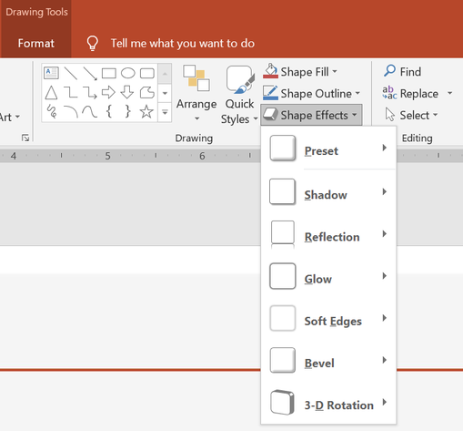

## **Introdução**

Embora os efeitos no PowerPoint possam ser usados para destacar uma forma, eles diferem de [preenchimentos](/slides/pt/php-java/shape-formatting/#gradient-fill) ou contornos. Usando os efeitos do PowerPoint, você pode criar reflexos convincentes em uma forma, espalhar o brilho de uma forma, etc.



O PowerPoint oferece seis efeitos que podem ser aplicados a formas. Você pode aplicar um ou mais efeitos a uma forma.

Algumas combinações de efeitos ficam melhores que outras. Por esse motivo, o PowerPoint fornece opções em **Predefinição**. As opções de Predefinição são combinações de dois ou mais efeitos que são conhecidos por ter boa aparência. Dessa forma, ao selecionar uma predefinição, você não precisará perder tempo testando ou combinando diferentes efeitos para encontrar uma boa combinação.

Aspose.Slides fornece propriedades e métodos na classe [EffectFormat](https://reference.aspose.com/slides/php-java/aspose.slides/effectformat/) que permitem aplicar os mesmos efeitos a formas em apresentações do PowerPoint.

## **Aplicar um efeito de sombra**

Aspose.Slides for PHP via Java oferece suporte a sombras externas e internas para formas. Você pode personalizar sua cor, direção, distância e raio de desfoque para combinar com o design da sua apresentação.

### **Aplicar uma sombra externa**

Use uma sombra externa para fazer um cartão ou painel se destacar contra o fundo do slide. A sombra se estende além das bordas da forma, criando a impressão de que a forma está elevada acima do slide. Ajuste sua cor, direção, distância e raio de desfoque para combinar com a iluminação e o estilo do seu modelo.

Este código PHP mostra como aplicar o [efeito de sombra externa](https://reference.aspose.com/slides/php-java/aspose.slides/effectformat/#getOuterShadowEffect) a um retângulo:

```php
use aspose\slides\Presentation;
use aspose\slides\SaveFormat;
use aspose\slides\ShapeType;

$presentation = new Presentation();
try {
    $slide = $presentation->getSlides()->get_Item(0);

    $shape = $slide->getShapes()->addAutoShape(ShapeType::RoundCornerRectangle, 20, 20, 200, 100);
    $shape->getEffectFormat()->enableOuterShadowEffect();
    $shadowColor = new Java("java.awt.Color", 169, 169, 169);
    $shape->getEffectFormat()->getOuterShadowEffect()->getShadowColor()->setColor($shadowColor);
    $shape->getEffectFormat()->getOuterShadowEffect()->setDistance(10);
    $shape->getEffectFormat()->getOuterShadowEffect()->setDirection(45);

    $presentation->save("shadow_effect.pptx", SaveFormat::Pptx);
} finally {
    $presentation->dispose();
}
```


### **Aplicar uma sombra interna**

Ao reproduzir o estilo visual de um modelo, use uma sombra interna para dar a um cartão ou painel uma aparência rebaixada. Uma sombra externa se estende fora da forma e faz com que ela pareça elevada, enquanto uma sombra interna sombreia o interior de suas bordas.

Chame [enableInnerShadowEffect](https://reference.aspose.com/slides/php-java/aspose.slides/effectformat/#enableInnerShadowEffect), então configure a sombra retornada por [getInnerShadowEffect](https://reference.aspose.com/slides/php-java/aspose.slides/effectformat/#getInnerShadowEffect). Valores maiores de raio de desfoque produzem bordas mais suaves.

Este exemplo PHP cria um cartão azul claro com uma sombra interna cinza escura e o salva como um arquivo PPTX. A direção da sombra é 225 graus, sua distância é 7 pontos e seu raio de desfoque é 6 pontos:

```php
use aspose\slides\FillType;
use aspose\slides\Presentation;
use aspose\slides\SaveFormat;
use aspose\slides\ShapeType;

$presentation = new Presentation();
try {
    $slide = $presentation->getSlides()->get_Item(0);

    $shape = $slide->getShapes()->addAutoShape(ShapeType::Rectangle, 20, 20, 200, 100);
    $shape->getFillFormat()->setFillType(FillType::Solid);
    $fillColor = new Java("java.awt.Color", 173, 216, 230);
    $shape->getFillFormat()->getSolidFillColor()->setColor($fillColor);
    $shape->getLineFormat()->getFillFormat()->setFillType(FillType::NoFill);

    $shape->getEffectFormat()->enableInnerShadowEffect();
    $shadow = $shape->getEffectFormat()->getInnerShadowEffect();
    $shadowColor = new Java("java.awt.Color", 105, 105, 105);
    $shadow->getShadowColor()->setColor($shadowColor);
    $shadow->setDirection(225);
    $shadow->setDistance(7);
    $shadow->setBlurRadius(6);

    $presentation->save("inner_shadow_effect.pptx", SaveFormat::Pptx);
} finally {
    $presentation->dispose();
}
```


Para remover a sombra interna, chame [disableInnerShadowEffect](https://reference.aspose.com/slides/php-java/aspose.slides/effectformat/#disableInnerShadowEffect) no formato de efeito da forma.

## **Aplicar um efeito de reflexão**

Para aplicar um efeito de reflexão no Aspose.Slides for PHP via Java, você pode adicionar uma reflexão semelhante a um espelho às formas, ajustando parâmetros como distância, transparência e tamanho. Esse efeito aprimora a estética de suas apresentações ao dar às formas uma aparência mais polida e sofisticada. É fácil de implementar com código simples, permitindo aplicação rápida em vários elementos para um design consistente.

Este código PHP mostra como aplicar o [efeito de reflexão](https://reference.aspose.com/slides/php-java/aspose.slides/effectformat/#getReflectionEffect) a uma forma:

```php
use aspose\slides\Presentation;
use aspose\slides\RectangleAlignment;
use aspose\slides\SaveFormat;
use aspose\slides\ShapeType;

$presentation = new Presentation();
try {
    $slide = $presentation->getSlides()->get_Item(0);

    $shape = $slide->getShapes()->addAutoShape(ShapeType::RoundCornerRectangle, 20, 20, 200, 100);
    $shape->getEffectFormat()->enableReflectionEffect();
    $shape->getEffectFormat()->getReflectionEffect()->setRectangleAlign(RectangleAlignment::Bottom);
    $shape->getEffectFormat()->getReflectionEffect()->setDirection(90);
    $shape->getEffectFormat()->getReflectionEffect()->setDistance(40);
    $shape->getEffectFormat()->getReflectionEffect()->setBlurRadius(2);

    $presentation->save("reflection_effect.pptx", SaveFormat::Pptx);
} finally {
    $presentation->dispose();
}
```


## **Aplicar um efeito de brilho**

Para aplicar um efeito de brilho a uma forma no Aspose.Slides for PHP via Java, você pode adicionar uma aura suave e luminosa ao redor das formas, ajustando propriedades como cor e tamanho. Esse efeito ajuda a destacar as formas e adiciona um elemento visual atraente e chamativo à sua apresentação. É fácil de implementar com código mínimo, aprimorando a aparência geral de seus slides.

Este código PHP mostra como aplicar o [efeito de brilho](https://reference.aspose.com/slides/php-java/aspose.slides/effectformat/#getGlowEffect) a uma forma:

```php
use aspose\slides\Presentation;
use aspose\slides\SaveFormat;
use aspose\slides\ShapeType;

$presentation = new Presentation();
try {
    $slide = $presentation->getSlides()->get_Item(0);

    $shape = $slide->getShapes()->addAutoShape(ShapeType::RoundCornerRectangle, 20, 20, 200, 100);
    $shape->getEffectFormat()->enableGlowEffect();
    $shape->getEffectFormat()->getGlowEffect()->getColor()->setColor(java("java.awt.Color")->MAGENTA);
    $shape->getEffectFormat()->getGlowEffect()->setRadius(15);

    $presentation->save("glow_effect.pptx", SaveFormat::Pptx);
} finally {
    $presentation->dispose();
}
```


## **Aplicar um efeito de bordas suaves**

Para aplicar um efeito de bordas suaves no Aspose.Slides for PHP via Java, você pode criar uma transição lisa e desfocada ao redor das bordas de uma forma. Esse efeito adiciona uma aparência mais sutil e refinada, perfeita para designs que precisam de um visual delicado e mais suave. Você pode ajustar facilmente parâmetros como raio para alcançar o efeito desejado em várias formas da sua apresentação.

Este código PHP mostra como aplicar o [efeito de bordas suaves](https://reference.aspose.com/slides/php-java/aspose.slides/effectformat/#getSoftEdgeEffect) a uma forma:

```php
use aspose\slides\Presentation;
use aspose\slides\SaveFormat;
use aspose\slides\ShapeType;

$presentation = new Presentation();
try {
    $slide = $presentation->getSlides()->get_Item(0);

    $shape = $slide->getShapes()->addAutoShape(ShapeType::RoundCornerRectangle, 20, 20, 200, 150);
    $shape->getEffectFormat()->enableSoftEdgeEffect();
    $shape->getEffectFormat()->getSoftEdgeEffect()->setRadius(8);

    $presentation->save("soft_edges_effect.pptx", SaveFormat::Pptx);
} finally {
    $presentation->dispose();
}
```


## **Perguntas frequentes**

**Posso aplicar vários efeitos à mesma forma?**

Sim, você pode combinar diferentes efeitos, como sombra, reflexão e brilho, em uma única forma para criar uma aparência mais dinâmica.

**Quais formas posso aplicar efeitos?**

Você pode aplicar efeitos a várias formas, incluindo autoshapes, gráficos, tabelas, imagens, objetos SmartArt, objetos OLE e muito mais.

**Posso aplicar efeitos a formas agrupadas?**

Sim, você pode aplicar efeitos a formas agrupadas. O efeito será aplicado a todo o grupo.