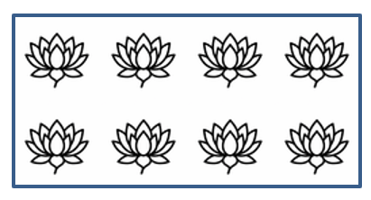

## **Introdução**

No PowerPoint, você pode adicionar formas aos slides. Como as formas são compostas por linhas, você pode formatá‑las modificando ou aplicando efeitos aos seus contornos. Além disso, pode formatar as formas especificando configurações que controlam como o interior delas é preenchido.


Aspose.Slides for PHP via Java fornece classes e métodos que permitem formatar formas usando as mesmas opções disponíveis no PowerPoint.

## **Formatar Linhas**

Usando Aspose.Slides, você pode especificar um estilo de linha personalizado para uma forma. As etapas a seguir descrevem o procedimento:

1. Crie uma instância da classe [Apresentação](https://reference.aspose.com/slides/pt/php-java/aspose.slides/presentation/).
1. Obtenha uma referência a um slide pelo seu índice.
1. Adicione uma [AutoShape](https://reference.aspose.com/slides/pt/php-java/aspose.slides/autoshape/) ao slide.
1. Defina o [estilo de linha](https://reference.aspose.com/slides/pt/php-java/aspose.slides/linestyle/) da forma.
1. Defina a espessura da linha.
1. Defina o [estilo de traço](https://reference.aspose.com/slides/pt/php-java/aspose.slides/linedashstyle/) da linha.
1. Defina a cor da linha da forma.
1. Salve a apresentação modificada como um arquivo PPTX.

```php
// Instanciar a classe Presentation que representa um arquivo de apresentação.
$presentation = new Presentation();
try {
    // Obter o primeiro slide.
    $slide = $presentation->getSlides()->get_Item(0);

    // Adicionar uma forma automática do tipo Retângulo.
    $shape = $slide->getShapes()->addAutoShape(ShapeType::Rectangle, 50, 150, 150, 75);

    // Definir a cor de preenchimento para a forma retângulo.
    $shape->getFillFormat()->setFillType(FillType::NoFill);

    // Aplicar formatação às linhas do retângulo.
    $shape->getLineFormat()->setStyle(LineStyle::ThickThin);
    $shape->getLineFormat()->setWidth(7);
    $shape->getLineFormat()->setDashStyle(LineDashStyle::Dash);

    // Definir a cor para a linha do retângulo.
    $shape->getLineFormat()->getFillFormat()->setFillType(FillType::Solid);
    $shape->getLineFormat()->getFillFormat()->getSolidFillColor()->setColor(java("java.awt.Color")->BLUE);

    // Salvar o arquivo PPTX no disco.
    $presentation->save("formatted_lines.pptx", SaveFormat::Pptx);
} finally {
    $presentation->dispose();
}
```


## **Aplicar Efeitos de Esboço às Linhas de Forma**

Um efeito de esboço faz com que a linha de uma forma pareça desenhada à mão. Use [Shape.getLineFormat](https://reference.aspose.com/slides/pt/php-java/aspose.slides/shape/) para acessar as configurações de linha, [LineFormat.getSketchFormat](https://reference.aspose.com/slides/pt/php-java/aspose.slides/lineformat/) para acessar as configurações de esboço e [SketchFormat.setSketchType](https://reference.aspose.com/slides/pt/php-java/aspose.slides/sketchformat/) para selecionar um valor da enumeração [LineSketchType](https://reference.aspose.com/slides/pt/php-java/aspose.slides/linesketchtype/).

O código PHP a seguir mostra como aplicar um efeito [LineSketchType.Curved](https://reference.aspose.com/slides/pt/php-java/aspose.slides/linesketchtype/) , ler o valor atribuído explicitamente e remover o efeito com [LineSketchType.None](https://reference.aspose.com/slides/pt/php-java/aspose.slides/linesketchtype/):

```php
$presentation = new Presentation();
try {
    $slide = $presentation->getSlides()->get_Item(0);
    $shape = $slide->getShapes()->addAutoShape(ShapeType::Rectangle, 50, 50, 200, 100);

    // Acessar o formato de linha da forma e seu formato de esboço.
    $sketchFormat = $shape->getLineFormat()->getSketchFormat();

    // Aplicar um efeito de esboço.
    $sketchFormat->setSketchType(LineSketchType::Curved);

    // Ler o efeito de esboço atribuído diretamente à forma.
    $explicitSketchType = $sketchFormat->getSketchType();
    echo "Explicit sketch type: " . $explicitSketchType . PHP_EOL;

    // Remover o efeito de esboço.
    $sketchFormat->setSketchType(LineSketchType::None);
} finally {
    $presentation->dispose();
}
```

O valor retornado por [SketchFormat.getSketchType](https://reference.aspose.com/slides/pt/php-java/aspose.slides/sketchformat/) representa a configuração atribuída diretamente à forma. Se a formatação da linha puder ser herdada de um tema, slide mestre ou slide de layout, use [LineFormat.getEffective](https://reference.aspose.com/slides/pt/php-java/aspose.slides/lineformat/), acesse o método `getSketchFormat` do objeto retornado e leia seu valor `getSketchType`. O valor efetivo reflete a formatação que é realmente aplicada após a resolução da herança:

```php
$presentation = new Presentation("presentation.pptx");
try {
    $shape = $presentation->getSlides()->get_Item(0)->getShapes()->get_Item(0);
    $lineFormat = $shape->getLineFormat();

    $explicitSketchType = $lineFormat->getSketchFormat()->getSketchType();
    $effectiveLineFormat = $lineFormat->getEffective();
    $effectiveSketchType = $effectiveLineFormat->getSketchFormat()->getSketchType();

    echo "Explicit sketch type: " . $explicitSketchType . PHP_EOL;
    echo "Effective sketch type: " . $effectiveSketchType . PHP_EOL;
} finally {
    $presentation->dispose();
}
```

## **Formatar Estilos de Junção**

Aqui estão as três opções de tipo de junção:

* Round
* Miter
* Bevel

Por padrão, quando o PowerPoint une duas linhas em um ângulo (como no canto de uma forma), ele usa a configuração **Round**. No entanto, se você estiver desenhando uma forma com ângulos agudos, pode preferir a opção **Miter**.


O código PHP a seguir demonstra como três retângulos (conforme mostrado na imagem acima) foram criados usando as configurações de tipo de junção Miter, Bevel e Round:

```php
// Instanciar a classe Presentation que representa um arquivo de apresentação.
$presentation = new Presentation();
try {
    // Obter o primeiro slide.
    $slide = $presentation->getSlides()->get_Item(0);

    // Adicionar três formas automáticas do tipo Retângulo.
    $shape1 = $slide->getShapes()->addAutoShape(ShapeType::Rectangle, 20, 20, 150, 75);
    $shape2 = $slide->getShapes()->addAutoShape(ShapeType::Rectangle, 210, 20, 150, 75);
    $shape3 = $slide->getShapes()->addAutoShape(ShapeType::Rectangle, 20, 135, 150, 75);

    // Definir a cor de preenchimento para cada forma retângulo.
    $shape1->getFillFormat()->setFillType(FillType::Solid);
    $shape1->getFillFormat()->getSolidFillColor()->setColor(java("java.awt.Color")->BLACK);
    $shape2->getFillFormat()->setFillType(FillType::Solid);
    $shape2->getFillFormat()->getSolidFillColor()->setColor(java("java.awt.Color")->BLACK);
    $shape3->getFillFormat()->setFillType(FillType::Solid);
    $shape3->getFillFormat()->getSolidFillColor()->setColor(java("java.awt.Color")->BLACK);

    // Definir a espessura da linha.
    $shape1->getLineFormat()->setWidth(15);
    $shape2->getLineFormat()->setWidth(15);
    $shape3->getLineFormat()->setWidth(15);

    // Definir a cor para a linha de cada retângulo.
    $shape1->getLineFormat()->getFillFormat()->setFillType(FillType::Solid);
    $shape1->getLineFormat()->getFillFormat()->getSolidFillColor()->setColor(java("java.awt.Color")->BLUE);
    $shape2->getLineFormat()->getFillFormat()->setFillType(FillType::Solid);
    $shape2->getLineFormat()->getFillFormat()->getSolidFillColor()->setColor(java("java.awt.Color")->BLUE);
    $shape3->getLineFormat()->getFillFormat()->setFillType(FillType::Solid);
    $shape3->getLineFormat()->getFillFormat()->getSolidFillColor()->setColor(java("java.awt.Color")->BLUE);

    // Definir o estilo de junção.
    $shape1->getLineFormat()->setJoinStyle(LineJoinStyle::Miter);
    $shape2->getLineFormat()->setJoinStyle(LineJoinStyle::Bevel);
    $shape3->getLineFormat()->setJoinStyle(LineJoinStyle::Round);

    // Adicionar texto a cada retângulo.
    $shape1->getTextFrame()->setText("Miter Join Style");
    $shape2->getTextFrame()->setText("Bevel Join Style");
    $shape3->getTextFrame()->setText("Round Join Style");

    // Salvar o arquivo PPTX no disco.
    $presentation->save("join_styles.pptx", SaveFormat::Pptx);
} finally {
    $presentation->dispose();
}
```

## **Preenchimento em Gradiente**

No PowerPoint, Gradient Fill é uma opção de formatação que permite aplicar uma mescla contínua de cores a uma forma. Por exemplo, você pode aplicar duas ou mais cores de modo que uma se dissolva gradualmente na outra.

Aqui está como aplicar um preenchimento em gradiente a uma forma usando Aspose.Slides:

1. Crie uma instância da classe [Apresentação](https://reference.aspose.com/slides/pt/php-java/aspose.slides/presentation/).
1. Obtenha uma referência a um slide pelo seu índice.
1. Adicione uma [AutoShape](https://reference.aspose.com/slides/pt/php-java/aspose.slides/autoshape/) ao slide.
1. Defina o [FillType](https://reference.aspose.com/slides/pt/php-java/aspose.slides/filltype/) da forma como `Gradient`.
1. Adicione as duas cores preferidas com posições definidas usando os métodos `add` da coleção de paradas de gradiente exposta pela classe [GradientFormat](https://reference.aspose.com/slides/pt/php-java/aspose.slides/gradientformat/).
1. Salve a apresentação modificada como um arquivo PPTX.

```php
// Instanciar a classe Presentation que representa um arquivo de apresentação.
$presentation = new Presentation();
try {
    // Obter o primeiro slide.
    $slide = $presentation->getSlides()->get_Item(0);

    // Adicionar uma forma automática do tipo Elipse.
    $shape = $slide->getShapes()->addAutoShape(ShapeType::Ellipse, 50, 50, 150, 75);

    // Aplicar formatação de gradiente à elipse.
    $shape->getFillFormat()->setFillType(FillType::Gradient);
    $shape->getFillFormat()->getGradientFormat()->setGradientShape(GradientShape::Linear);

    // Definir a direção do gradiente.
    $shape->getFillFormat()->getGradientFormat()->setGradientDirection(GradientDirection::FromCorner2);

    // Adicionar duas paradas de gradiente.
    $shape->getFillFormat()->getGradientFormat()->getGradientStops()->addPresetColor(1.0, PresetColor::Purple);
    $shape->getFillFormat()->getGradientFormat()->getGradientStops()->addPresetColor(0, PresetColor::Red);

    // Salvar o arquivo PPTX no disco.
    $presentation->save("gradient_fill.pptx", SaveFormat::Pptx);
} finally {
    $presentation->dispose();
}
```


## **Preenchimento de Padrão**

No PowerPoint, Pattern Fill é uma opção de formatação que permite aplicar um design de duas cores — como pontilhado, listras, cruzamentos ou quadriculados — a uma forma. Você pode escolher cores personalizadas para o primeiro plano e o plano de fundo do padrão.

Aspose.Slides fornece mais de 45 estilos de padrão predefinidos que você pode aplicar às formas para melhorar o apelo visual de suas apresentações. Mesmo após selecionar um padrão predefinido, você ainda pode especificar as cores exatas que ele deve usar.

Aqui está como aplicar um preenchimento de padrão a uma forma usando Aspose.Slides:

1. Crie uma instância da classe [Apresentação](https://reference.aspose.com/slides/pt/php-java/aspose.slides/presentation/).
1. Obtenha uma referência a um slide pelo seu índice.
1. Adicione uma [AutoShape](https://reference.aspose.com/slides/pt/php-java/aspose.slides/autoshape/) ao slide.
1. Defina o [FillType](https://reference.aspose.com/slides/pt/php-java/aspose.slides/filltype/) da forma como `Pattern`.
1. Escolha um estilo de padrão dentre as opções predefinidas.
1. Defina a [Cor de Fundo](https://reference.aspose.com/slides/pt/php-java/aspose.slides/patternformat/#getBackColor) do padrão.
1. Defina a [Cor de Primeiro Plano](https://reference.aspose.com/slides/pt/php-java/aspose.slides/patternformat/#getForeColor) do padrão.
1. Salve a apresentação modificada como um arquivo PPTX.

```php
    // Instanciar a classe Presentation que representa um arquivo de apresentação.
    $presentation = new Presentation();
    try {
        // Obter o primeiro slide.
        $slide = $presentation->getSlides()->get_Item(0);

        // Adicionar uma forma automática do tipo Retângulo.
        $shape = $slide->getShapes()->addAutoShape(ShapeType::Rectangle, 50, 50, 150, 75);

        // Definir o tipo de preenchimento como Padrão.
        $shape->getFillFormat()->setFillType(FillType::Pattern);

        // Definir o estilo de padrão.
        $shape->getFillFormat()->getPatternFormat()->setPatternStyle(PatternStyle::Trellis);

        // Definir as cores de fundo e primeiro plano do padrão.
        $shape->getFillFormat()->getPatternFormat()->getBackColor()->setColor(java("java.awt.Color")->LIGHT_GRAY);
        $shape->getFillFormat()->getPatternFormat()->getForeColor()->setColor(java("java.awt.Color")->YELLOW);

        // Salvar o arquivo PPTX no disco.
        $presentation->save("pattern_fill.pptx", SaveFormat::Pptx);
    } finally {
        $presentation->dispose();
    }
```


## **Preenchimento com Imagem**

No PowerPoint, Picture Fill é uma opção de formatação que permite inserir uma imagem dentro de uma forma — usando efetivamente a imagem como plano de fundo da forma.

Aqui está como usar Aspose.Slides para aplicar um preenchimento com imagem a uma forma:

1. Crie uma instância da classe [Apresentação](https://reference.aspose.com/slides/pt/php-java/aspose.slides/presentation/).
1. Obtenha uma referência a um slide pelo seu índice.
1. Adicione uma [AutoShape](https://reference.aspose.com/slides/pt/php-java/aspose.slides/autoshape/) ao slide.
1. Defina o [FillType](https://reference.aspose.com/slides/pt/php-java/aspose.slides/filltype/) da forma como `Picture`.
1. Defina o modo de preenchimento da imagem como `Tile` (ou outro modo preferido).
1. Crie um objeto [PPImage](https://reference.aspose.com/slides/pt/php-java/aspose.slides/ppimage/) a partir da imagem que deseja usar.
1. Passe a imagem para o método `SlidesPicture.setImage`.
1. Salve a apresentação modificada como um arquivo PPTX.


```php
// Instanciar a classe Presentation que representa um arquivo de apresentação.
$presentation = new Presentation();
try {
    // Obter o primeiro slide.
    $slide = $presentation->getSlides()->get_Item(0);

    // Adicionar uma forma automática do tipo Retângulo.
    $shape = $slide->getShapes()->addAutoShape(ShapeType::Rectangle, 50, 50, 255, 130);

    // Definir o tipo de preenchimento como Imagem.
    $shape->getFillFormat()->setFillType(FillType::Picture);

    // Definir o modo de preenchimento da imagem.
    $shape->getFillFormat()->getPictureFillFormat()->setPictureFillMode(PictureFillMode::Tile);

    // Carregar uma imagem e adicioná-la aos recursos da apresentação.
    $image = Images::fromFile("lotus.png");
    $picture = $presentation->getImages()->addImage($image);
    $image->dispose();

    // Definir a imagem.
    $shape->getFillFormat()->getPictureFillFormat()->getPicture()->setImage($picture);

    // Salvar o arquivo PPTX no disco.
    $presentation->save("picture_fill.pptx", SaveFormat::Pptx);
} finally {
    $presentation->dispose();
}
```



### **Imagem em Mosaico Como Textura**

Se você deseja definir uma imagem em mosaico como textura e personalizar o comportamento do mosaico, pode usar os seguintes métodos da classe [PictureFillFormat](https://reference.aspose.com/slides/pt/php-java/aspose.slides/picturefillformat/):

- [setPictureFillMode](https://reference.aspose.com/slides/pt/php-java/aspose.slides/picturefillformat/#setPictureFillMode): Define o modo de preenchimento da imagem — `Tile` ou `Stretch`.
- [setTileAlignment](https://reference.aspose.com/slides/pt/php-java/aspose.slides/picturefillformat/#setTileAlignment): Especifica o alinhamento dos mosaicos dentro da forma.
- [setTileFlip](https://reference.aspose.com/slides/pt/php-java/aspose.slides/picturefillformat/#setTileFlip): Controla se o mosaico é invertido horizontalmente, verticalmente ou ambos.
- [setTileOffsetX](https://reference.aspose.com/slides/pt/php-java/aspose.slides/picturefillformat/#setTileOffsetX): Define o deslocamento horizontal do mosaico (em pontos) a partir da origem da forma.
- [setTileOffsetY](https://reference.aspose.com/slides/pt/php-java/aspose.slides/picturefillformat/#setTileOffsetY): Define o deslocamento vertical do mosaico (em pontos) a partir da origem da forma.
- [setTileScaleX](https://reference.aspose.com/slides/pt/php-java/aspose.slides/picturefillformat/#setTileScaleX): Define a escala horizontal do mosaico como porcentagem.
- [setTileScaleY](https://reference.aspose.com/slides/pt/php-java/aspose.slides/picturefillformat/#setTileScaleY): Define a escala vertical do mosaico como porcentagem.

```php
// Instanciar a classe Presentation que representa um arquivo de apresentação.
$presentation = new Presentation();
try {
    // Obter o primeiro slide.
    $firstSlide = $presentation->getSlides()->get_Item(0);

    // Adicionar uma forma automática de retângulo.
    $shape = $firstSlide->getShapes()->addAutoShape(ShapeType::Rectangle, 50, 50, 190, 95);

    // Definir o tipo de preenchimento da forma como Imagem.
    $shape->getFillFormat()->setFillType(FillType::Picture);

    // Carregar a imagem e adicioná-la aos recursos da apresentação.
    $sourceImage = Images::fromFile("lotus.png");
    $presentationImage = $presentation->getImages()->addImage($sourceImage);
    $sourceImage->dispose();

    // Atribuir a imagem à forma.
    $pictureFillFormat = $shape->getFillFormat()->getPictureFillFormat();
    $pictureFillFormat->getPicture()->setImage($presentationImage);

    // Configurar o modo de preenchimento da imagem e as propriedades de ladrilhamento.
    $pictureFillFormat->setPictureFillMode(PictureFillMode::Tile);
    $pictureFillFormat->setTileOffsetX(-32);
    $pictureFillFormat->setTileOffsetY(-32);
    $pictureFillFormat->setTileScaleX(50);
    $pictureFillFormat->setTileScaleY(50);
    $pictureFillFormat->setTileAlignment(RectangleAlignment::BottomRight);
    $pictureFillFormat->setTileFlip(TileFlip::FlipBoth);

    // Salvar o arquivo PPTX no disco.
    $presentation->save("tile.pptx", SaveFormat::Pptx);
} finally {
    $presentation->dispose();
}
```


## **Preenchimento com Cor Sólida**

No PowerPoint, Solid Color Fill é uma opção de formatação que preenche uma forma com uma única cor uniforme. Essa cor de fundo simples é aplicada sem gradientes, texturas ou padrões.

Para aplicar um preenchimento com cor sólida a uma forma usando Aspose.Slides, siga estas etapas:

1. Crie uma instância da classe [Apresentação](https://reference.aspose.com/slides/pt/php-java/aspose.slides/presentation/).
1. Obtenha uma referência a um slide pelo seu índice.
1. Adicione uma [AutoShape](https://reference.aspose.com/slides/pt/php-java/aspose.slides/autoshape/) ao slide.
1. Defina o [FillType](https://reference.aspose.com/slides/pt/php-java/aspose.slides/filltype/) da forma como `Solid`.
1. Atribua a cor de preenchimento desejada à forma.
1. Salve a apresentação modificada como um arquivo PPTX.

```php
// Instanciar a classe Presentation que representa um arquivo de apresentação.
$presentation = new Presentation();
try {
    // Obter o primeiro slide.
    $slide = $presentation->getSlides()->get_Item(0);

    // Adicionar uma forma automática do tipo Retângulo.
    $shape = $slide->getShapes()->addAutoShape(ShapeType::Rectangle, 50, 50, 150, 75);

    // Definir o tipo de preenchimento como Solid.
    $shape->getFillFormat()->setFillType(FillType::Solid);

    // Definir a cor de preenchimento.
    $shape->getFillFormat()->getSolidFillColor()->setColor(java("java.awt.Color")->YELLOW);

    // Salvar o arquivo PPTX no disco.
    $presentation->save("solid_color_fill.pptx", SaveFormat::Pptx);
} finally {
    $presentation->dispose();
}
```


## **Definir Transparência**

No PowerPoint, ao aplicar um preenchimento de cor sólida, gradiente, imagem ou textura a formas, você também pode definir um nível de transparência para controlar a opacidade do preenchimento. Um valor de transparência mais alto torna a forma mais translúcida, permitindo que o fundo ou objetos subjacentes sejam parcialmente visíveis.

Aspose.Slides permite definir o nível de transparência ajustando o componente alfa na cor usada para o preenchimento. Veja como fazer isso:

1. Crie uma instância da classe [Apresentação](https://reference.aspose.com/slides/pt/php-java/aspose.slides/presentation/).
1. Obtenha uma referência a um slide pelo seu índice.
1. Adicione uma [AutoShape](https://reference.aspose.com/slides/pt/php-java/aspose.slides/autoshape/) ao slide.
1. Defina o [FillType](https://reference.aspose.com/slides/pt/php-java/aspose.slides/filltype/) como `Solid`.
1. Use `Color` para definir uma cor com transparência (o componente `alpha` controla a transparência).
1. Salve a apresentação.

```php
// Instanciar a classe Presentation que representa um arquivo de apresentação.
$presentation = new Presentation();
try {
    // Obter o primeiro slide.
    $slide = $presentation->getSlides()->get_Item(0);

    // Adicionar uma forma automática de retângulo sólido.
    $solidShape = $slide->getShapes()->addAutoShape(ShapeType::Rectangle, 50, 50, 150, 75);

    // Adicionar uma forma automática de retângulo transparente sobre a forma sólida.
    $transparentShape = $slide->getShapes()->addAutoShape(ShapeType::Rectangle, 80, 80, 150, 75);
    $transparentShape->getFillFormat()->setFillType(FillType::Solid);
    $transparentShape->getFillFormat()->getSolidFillColor()->setColor(new java("java.awt.Color", 255, 255, 0, 204));

    // Salvar o arquivo PPTX no disco.
    $presentation->save("shape_transparency.pptx", SaveFormat::Pptx);
} finally {
    $presentation->dispose();
}
```


## **Rotacionar Formas**

Aspose.Slides permite rotacionar formas em apresentações PowerPoint. Isso pode ser útil ao posicionar elementos visuais com necessidades específicas de alinhamento ou design.

Para rotacionar uma forma em um slide, siga estas etapas:

1. Crie uma instância da classe [Apresentação](https://reference.aspose.com/slides/pt/php-java/aspose.slides/presentation/).
1. Obtenha uma referência a um slide pelo seu índice.
1. Adicione uma [AutoShape](https://reference.aspose.com/slides/pt/php-java/aspose.slides/autoshape/) ao slide.
1. Defina a propriedade de rotação da forma para o ângulo desejado.
1. Salve a apresentação.

```php
    // Instanciar a classe Presentation que representa um arquivo de apresentação.
    $presentation = new Presentation();
    try {
        // Obter o primeiro slide.
        $slide = $presentation->getSlides()->get_Item(0);

        // Adicionar uma forma automática do tipo Retângulo.
        $shape = $slide->getShapes()->addAutoShape(ShapeType::Rectangle, 50, 50, 150, 75);

        // Rotacionar a forma em 5 graus.
        $shape->setRotation(5);

        // Salvar o arquivo PPTX no disco.
        $presentation->save("shape_rotation.pptx", SaveFormat::Pptx);
    } finally {
        $presentation->dispose();
    }
```


## **Adicionar Efeitos de Chanfro 3D**

Aspose.Slides permite aplicar efeitos de chanfro 3D a formas configurando suas propriedades [ThreeDFormat](https://reference.aspose.com/slides/pt/php-java/aspose.slides/threedformat/).

Para adicionar efeitos de chanfro 3D a uma forma, siga estas etapas:

1. Instancie a classe [Apresentação](https://reference.aspose.com/slides/pt/php-java/aspose.slides/presentation/).
1. Obtenha uma referência a um slide pelo seu índice.
1. Adicione uma [AutoShape](https://reference.aspose.com/slides/pt/php-java/aspose.slides/autoshape/) ao slide.
1. Configure o [ThreeDFormat](https://reference.aspose.com/slides/pt/php-java/aspose.slides/threedformat/) da forma para definir as configurações de chanfro.
1. Salve a apresentação.

```php
// Criar uma instância da classe Presentation.
$presentation = new Presentation();
try {
    $slide = $presentation->getSlides()->get_Item(0);

    // Adicionar uma forma ao slide.
    $shape = $slide->getShapes()->addAutoShape(ShapeType::Ellipse, 50, 50, 100, 100);
    $shape->getFillFormat()->setFillType(FillType::Solid);
    $shape->getFillFormat()->getSolidFillColor()->setColor(java("java.awt.Color")->GREEN);
    $shape->getLineFormat()->getFillFormat()->setFillType(FillType::Solid);
    $shape->getLineFormat()->getFillFormat()->getSolidFillColor()->setColor(java("java.awt.Color")->ORANGE);
    $shape->getLineFormat()->setWidth(2.0);

    // Definir as propriedades ThreeDFormat da forma.
    $shape->getThreeDFormat()->setDepth(4);
    $shape->getThreeDFormat()->getBevelTop()->setBevelType(BevelPresetType::Circle);
    $shape->getThreeDFormat()->getBevelTop()->setHeight(6);
    $shape->getThreeDFormat()->getBevelTop()->setWidth(6);
    $shape->getThreeDFormat()->getCamera()->setCameraType(CameraPresetType::OrthographicFront);
    $shape->getThreeDFormat()->getLightRig()->setLightType(LightRigPresetType::ThreePt);
    $shape->getThreeDFormat()->getLightRig()->setDirection(LightingDirection::Top);

    // Salvar a apresentação como um arquivo PPTX.
    $presentation->save("3D_bevel_effect.pptx", SaveFormat::Pptx);
} finally {
    $presentation->dispose();
}
```


## **Adicionar Efeitos de Rotação 3D**

Aspose.Slides permite aplicar efeitos de rotação 3D a formas configurando suas propriedades [ThreeDFormat](https://reference.aspose.com/slides/pt/php-java/aspose.slides/threedformat/).

Para aplicar rotação 3D a uma forma:

1. Crie uma instância da classe [Apresentação](https://reference.aspose.com/slides/pt/php-java/aspose.slides/presentation/).
1. Obtenha uma referência a um slide pelo seu índice.
1. Adicione uma [AutoShape](https://reference.aspose.com/slides/pt/php-java/aspose.slides/autoshape/) ao slide.
1. Use [setCameraType](https://reference.aspose.com/slides/pt/php-java/aspose.slides/camera/#setCameraType) e [setLightType](https://reference.aspose.com/slides/pt/php-java/aspose.slides/lightrig/#setLightType) para definir a rotação 3D.
1. Salve a apresentação.

```php
// Criar uma instância da classe Presentation.
$presentation = new Presentation();
try {
    $slide = $presentation->getSlides()->get_Item(0);

    $autoShape = $slide->getShapes()->addAutoShape(ShapeType::Rectangle, 50, 50, 150, 75);
    $autoShape->getTextFrame()->setText("Hello, Aspose!");

    $autoShape->getThreeDFormat()->setDepth(6);
    $autoShape->getThreeDFormat()->getCamera()->setRotation(40, 35, 20);
    $autoShape->getThreeDFormat()->getCamera()->setCameraType(CameraPresetType::IsometricLeftUp);
    $autoShape->getThreeDFormat()->getLightRig()->setLightType(LightRigPresetType::Balanced);

    // Salvar a apresentação como um arquivo PPTX.
    $presentation->save("3D_rotation_effect.pptx", SaveFormat::Pptx);
} finally {
    $presentation->dispose();
}
```


## **Controlar Renderização em Preto‑e‑Branco para Formas**

O método [Shape::setBlackWhiteMode](https://reference.aspose.com/slides/pt/php-java/aspose.slides/shape/#setBlackWhiteMode) especifica como uma forma individual é renderizada quando uma apresentação é visualizada ou processada em modo preto‑e‑branco. Ele não habilita a exibição em preto‑e‑branco por si só, nem altera o preenchimento, a linha ou outra formatação da forma no modo de cor normal.

Use um valor da classe [BlackWhiteMode](https://reference.aspose.com/slides/pt/php-java/aspose.slides/blackwhitemode/) para selecionar o comportamento desejado. Por exemplo, `Automatic` permite que o aplicativo de renderização escolha a conversão, `Gray` e `LightGray` usam coloração cinza, `BlackWhite` usa apenas preto e branco, `Black` e `White` forçam uma única cor, `Color` preserva a coloração normal, e `Hidden` omite a forma no modo preto‑e‑branco. `NotDefined` significa que nenhum modo de nível de forma foi atribuído.

O código PHP a seguir cria uma forma colorida e faz com que ela apareça cinza no modo de exibição preto‑e‑branco:

```php
use aspose\slides\BlackWhiteMode;
use aspose\slides\FillType;
use aspose\slides\Presentation;
use aspose\slides\SaveFormat;
use aspose\slides\ShapeType;

$presentation = new Presentation();
try {
    $slide = $presentation->getSlides()->get_Item(0);

    $shape = $slide->getShapes()->addAutoShape(ShapeType::Rectangle, 50, 50, 200, 100);
    $shape->getFillFormat()->setFillType(FillType::Solid);
    $orange = new Java("java.awt.Color", 255, 165, 0);
    $shape->getFillFormat()->getSolidFillColor()->setColor($orange);

    // Manter o preenchimento laranja no modo de cor, mas renderizar a forma com coloração cinza no modo preto-e-branco.
    $shape->setBlackWhiteMode(BlackWhiteMode::Gray);

    $presentation->save("shape_black_white_mode.pptx", SaveFormat::Pptx);
} finally {
    $presentation->dispose();
}
```

No modo de cor normal, o retângulo mantém seu preenchimento laranja. Em um fluxo de trabalho de exibição preto‑e‑branco, ele usa coloração cinza porque seu modo está definido como `Gray`. Isso permite que você preserve um slide em cores completas ao definir uma aparência distinta para impressão, visualização ou outros fluxos de trabalho que respeitam as configurações de exibição preto‑e‑branco da apresentação.

## **Redefinir Formatação**

O código Java a seguir mostra como redefinir a formatação de um slide e reverter a posição, tamanho e formatação de todas as formas com marcadores de posição no [LayoutSlide](https://reference.aspose.com/slides/pt/php-java/aspose.slides/layoutslide/) para suas configurações padrão:

```php
$presentation = new Presentation("sample.pptx");
try {
    for ($i = 0; $i < java_values($presentation->getSlides()->size()); $i++) {
        $slide = $presentation->getSlides()->get_Item($i);
        // Redefinir cada forma no slide que tem um placeholder no layout.
        $slide->reset();
    }
    $presentation->save("reset_formatting.pptx", SaveFormat::Pptx);
} finally {
    $presentation->dispose();
}
```

## **Perguntas Frequentes**

**A formatação de formas afeta o tamanho final do arquivo da apresentação?**

Apenas minimamente. Imagens e mídias incorporadas ocupam a maior parte do espaço do arquivo, enquanto parâmetros de forma como cores, efeitos e gradientes são armazenados como metadados e praticamente não adicionam tamanho extra.

**Como posso detectar formas em um slide que compartilham formatação idêntica para que eu possa agrupá‑las?**

Compare as propriedades de formatação principais de cada forma — preenchimento, linha e configurações de efeito. Se todos os valores correspondentes coincidirem, considere seus estilos como idênticos e agrupe logicamente essas formas, o que simplifica o gerenciamento de estilos posterior.

**Posso salvar um conjunto de estilos de forma personalizados em um arquivo separado para reutilização em outras apresentações?**

Sim. Armazene formas de exemplo com os estilos desejados em um conjunto de slides de modelo ou em um arquivo de modelo .POTX. Ao criar uma nova apresentação, abra o modelo, clone as formas estilizadas que precisar e reaplique sua formatação onde for necessário.