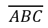

## **Visão geral**

PowerPoint armazena equações como Office Math Markup Language (OMML). Com Aspose.Slides for Python via Java, você pode criar o mesmo tipo de conteúdo matemático programaticamente: frações, radicais, funções, limites, operadores N‑ários, matrizes, arrays e blocos de matemática formatados.

No PowerPoint, os usuários normalmente adicionam equações a partir de **Inserir > Equação**:


O resultado é texto matemático editável no slide:


Aspose.Slides constrói esse texto matemático por meio de três objetos principais:

- Uma forma matemática, criada com [addMathShape](https://reference.aspose.com/slides/pt/python-java/aspose.slides/shapecollection/#addMathShape), é a forma que contém a equação.
- [MathPortion](https://reference.aspose.com/slides/pt/python-java/aspose.slides/mathportion/) armazena o conteúdo matemático dentro da moldura de texto da forma.
- [MathParagraph](https://reference.aspose.com/slides/pt/python-java/aspose.slides/mathparagraph/) contém um ou mais objetos [MathBlock](https://reference.aspose.com/slides/pt/python-java/aspose.slides/mathblock/).

A maioria dos exemplos abaixo usa [MathematicalText](https://reference.aspose.com/slides/pt/python-java/aspose.slides/mathematicaltext/) e os métodos fluent de [MathElementBase](https://reference.aspose.com/slides/pt/python-java/aspose.slides/mathelementbase/) para manter o código curto e legível.

Para cenários de exportação MathML, veja [Export Math Equations from Presentations in Python](/slides/pt/python-java/exporting-math-equations/).

## **Criar uma Equação**

Este exemplo cria uma forma matemática e adiciona o teorema de Pitágoras:


```python
import jpype
import asposeslides

if not jpype.isJVMStarted():
    jpype.startJVM()

from asposeslides.api import MathematicalText, Presentation, SaveFormat

presentation = Presentation()
try:
    slide = presentation.getSlides().get_Item(0)

    math_shape = slide.getShapes().addMathShape(20, 20, 700, 120)
    math_paragraph = math_shape.getTextFrame().getParagraphs().get_Item(0).getPortions().get_Item(0).getMathParagraph()

    a_squared = MathematicalText("a").setSuperscript("2")
    b_squared = MathematicalText("b").setSuperscript("2")
    equation = MathematicalText("c").setSuperscript("2").join("=").join(a_squared).join("+").join(b_squared)

    math_paragraph.add(equation)

    presentation.save("pythagorean-theorem.pptx", SaveFormat.Pptx)
finally:
    presentation.dispose()
```

{}
[addMathShape](https://reference.aspose.com/slides/pt/python-java/aspose.slides/shapecollection/#addMathShape) cria uma forma que já contém um parágrafo matemático. Acesse o primeiro [MathPortion](https://reference.aspose.com/slides/pt/python-java/aspose.slides/mathportion/), obtenha seu [MathParagraph](https://reference.aspose.com/slides/pt/python-java/aspose.slides/mathparagraph/), e adicione blocos matemáticos ou elementos matemáticos a ele.
{}

## **Adicionar Frações**

Use [divide](https://reference.aspose.com/slides/pt/python-java/aspose.slides/mathelementbase/#divide) para criar uma fração. Você pode escolher um estilo de fração com [MathFractionTypes](https://reference.aspose.com/slides/pt/python-java/aspose.slides/mathfractiontypes/).


```python
import jpype
import asposeslides

if not jpype.isJVMStarted():
    jpype.startJVM()

from asposeslides.api import MathBlock, MathFractionTypes, MathematicalText, Presentation, SaveFormat

presentation = Presentation()
try:
    slide = presentation.getSlides().get_Item(0)

    math_shape = slide.getShapes().addMathShape(20, 20, 700, 100)
    math_paragraph = math_shape.getTextFrame().getParagraphs().get_Item(0).getPortions().get_Item(0).getMathParagraph()

    fraction = MathematicalText("1").divide("x", MathFractionTypes.Skewed)

    math_block = MathBlock(fraction)
    math_paragraph.add(math_block)

    presentation.save("fraction.pptx", SaveFormat.Pptx)
finally:
    presentation.dispose()
```

Para uma fração empilhada, use [MathFractionTypes.Bar](https://reference.aspose.com/slides/pt/python-java/aspose.slides/mathfractiontypes/#Bar):

```python
import jpype
import asposeslides

if not jpype.isJVMStarted():
    jpype.startJVM()

from asposeslides.api import MathFractionTypes, MathematicalText

stacked_fraction = MathematicalText("x + 1").divide("y - 1", MathFractionTypes.Bar)
```

## **Adicionar Radicais**

Use [radical](https://reference.aspose.com/slides/pt/python-java/aspose.slides/mathelementbase/#radical) para criar uma raiz quadrada, raiz cúbica ou outra raiz. O elemento atual torna‑se a base, e o argumento torna‑se o grau.


```python
import jpype
import asposeslides

if not jpype.isJVMStarted():
    jpype.startJVM()

from asposeslides.api import MathBlock, MathematicalText, Presentation, SaveFormat

presentation = Presentation()
try:
    slide = presentation.getSlides().get_Item(0)

    math_shape = slide.getShapes().addMathShape(20, 20, 700, 100)
    math_paragraph = math_shape.getTextFrame().getParagraphs().get_Item(0).getPortions().get_Item(0).getMathParagraph()

    radical = MathematicalText("x").radical("n")

    math_block = MathBlock(radical)
    math_paragraph.add(math_block)

    presentation.save("radical.pptx", SaveFormat.Pptx)
finally:
    presentation.dispose()
```

## **Adicionar Funções e Limites**

Use [asArgumentOfFunction](https://reference.aspose.com/slides/pt/python-java/aspose.slides/mathelementbase/#asArgumentOfFunction) ou [function](https://reference.aspose.com/slides/pt/python-java/aspose.slides/mathelementbase/#function) para funções como `sin(x)`, `log(x)`, ou nomes de funções personalizados. Para limites, coloque `lim` em um [MathLimit](https://reference.aspose.com/slides/pt/python-java/aspose.slides/mathlimit/) ou use [setLowerLimit](https://reference.aspose.com/slides/pt/python-java/aspose.slides/mathelementbase/#setLowerLimit).


```python
import jpype
import asposeslides

if not jpype.isJVMStarted():
    jpype.startJVM()

from asposeslides.api import MathBlock, MathematicalText, Presentation, SaveFormat

presentation = Presentation()
try:
    slide = presentation.getSlides().get_Item(0)

    math_shape = slide.getShapes().addMathShape(20, 20, 700, 100)
    math_paragraph = math_shape.getTextFrame().getParagraphs().get_Item(0).getPortions().get_Item(0).getMathParagraph()

    limit = MathematicalText("lim").setLowerLimit("x\u2192\u221E").function("x")

    math_block = MathBlock(limit)
    math_paragraph.add(math_block)

    presentation.save("functions-and-limits.pptx", SaveFormat.Pptx)
finally:
    presentation.dispose()
```

Para um nome de função personalizado, torne o nome da função o elemento atual:

```python
import jpype
import asposeslides

if not jpype.isJVMStarted():
    jpype.startJVM()

from asposeslides.api import MathematicalText

custom_function = MathematicalText("f").function("x + 1")
```

## **Adicionar Operadores N‑arios e Integrais**

Use [nary](https://reference.aspose.com/slides/pt/python-java/aspose.slides/mathelementbase/#nary) para somatórios, uniões, interseções e outros operadores grandes. Use [integral](https://reference.aspose.com/slides/pt/python-java/aspose.slides/mathelementbase/#integral) para integrais. Ambos os métodos permitem definir limites inferior e superior.


```python
import jpype
import asposeslides

if not jpype.isJVMStarted():
    jpype.startJVM()

from asposeslides.api import MathBlock, MathNaryOperatorTypes, MathematicalText, Presentation, SaveFormat

presentation = Presentation()
try:
    slide = presentation.getSlides().get_Item(0)

    math_shape = slide.getShapes().addMathShape(20, 20, 700, 120)
    math_paragraph = math_shape.getTextFrame().getParagraphs().get_Item(0).getPortions().get_Item(0).getMathParagraph()

    a_power = MathematicalText("a").setSuperscript("n-k")
    summation_base = MathematicalText("x").setSuperscript("k").join(a_power)

    summation = summation_base.nary(MathNaryOperatorTypes.Summation, "k=0", "n")

    math_block = MathBlock(summation)
    math_paragraph.add(math_block)

    presentation.save("nary-operators.pptx", SaveFormat.Pptx)
finally:
    presentation.dispose()
```

Operadores N‑ários são para operadores grandes com limites opcionais. Operadores simples como `+`, `-` e `=` geralmente são adicionados como [MathematicalText](https://reference.aspose.com/slides/pt/python-java/aspose.slides/mathelementbase/) e concatenados na expressão.

Para uma integral, use [integral](https://reference.aspose.com/slides/pt/python-java/aspose.slides/mathelementbase/#integral):

```python
import jpype
import asposeslides

if not jpype.isJVMStarted():
    jpype.startJVM()

from asposeslides.api import MathIntegralTypes, MathematicalText

differential = MathematicalText("dx").toBox()
integral_base = MathematicalText("x").join(differential)
integral = integral_base.integral(MathIntegralTypes.Simple, "0", "1")
```

## **Adicionar Matrizes**

Use [MathMatrix](https://reference.aspose.com/slides/pt/python-java/aspose.slides/mathmatrix/) para linhas e colunas. Matrizes não incluem colchetes por padrão, portanto envolva a matriz quando precisar de parênteses, colchetes ou chaves.


```python
import jpype
import asposeslides

if not jpype.isJVMStarted():
    jpype.startJVM()

from asposeslides.api import MathBlock, MathMatrix, MathematicalText, Presentation, SaveFormat

presentation = Presentation()
try:
    slide = presentation.getSlides().get_Item(0)

    math_shape = slide.getShapes().addMathShape(20, 20, 700, 120)
    math_paragraph = math_shape.getTextFrame().getParagraphs().get_Item(0).getPortions().get_Item(0).getMathParagraph()

    matrix = MathMatrix(2, 3)
    cell_0_0 = MathematicalText("1")
    matrix.set_Item(0, 0, cell_0_0)
    cell_0_1 = MathematicalText("x")
    matrix.set_Item(0, 1, cell_0_1)
    cell_1_0 = MathematicalText("x")
    matrix.set_Item(1, 0, cell_1_0)
    cell_1_1 = MathematicalText("2")
    matrix.set_Item(1, 1, cell_1_1)
    cell_1_2 = MathematicalText("y")
    matrix.set_Item(1, 2, cell_1_2)

    math_block = MathBlock(matrix)
    math_paragraph.add(math_block)

    presentation.save("matrix.pptx", SaveFormat.Pptx)
finally:
    presentation.dispose()
```

## **Adicionar Arrays de Equações**

Use [toMathArray](https://reference.aspose.com/slides/pt/python-java/aspose.slides/mathelementbase/#toMathArray) quando precisar de equações alinhadas ou de uma pilha vertical de expressões.


```python
import jpype
import asposeslides

if not jpype.isJVMStarted():
    jpype.startJVM()

from asposeslides.api import MathBlock, MathematicalText, Presentation, SaveFormat

presentation = Presentation()
try:
    slide = presentation.getSlides().get_Item(0)

    math_shape = slide.getShapes().addMathShape(20, 20, 700, 140)
    math_paragraph = math_shape.getTextFrame().getParagraphs().get_Item(0).getPortions().get_Item(0).getMathParagraph()

    equation_array = MathematicalText("x").join("y").toMathArray()

    math_block = MathBlock(equation_array)
    math_paragraph.add(math_block)

    presentation.save("equation-array.pptx", SaveFormat.Pptx)
finally:
    presentation.dispose()
```

## **Adicionar Funções Trigonométricas**

Use [asArgumentOfFunction](https://reference.aspose.com/slides/pt/python-java/aspose.slides/mathelementbase/#asArgumentOfFunction) quando o argumento é o elemento atual e o nome da função é conhecido.


```python
import jpype
import asposeslides

if not jpype.isJVMStarted():
    jpype.startJVM()

from asposeslides.api import MathBlock, MathFunctionsOfOneArgument, MathematicalText, Presentation, SaveFormat

presentation = Presentation()
try:
    slide = presentation.getSlides().get_Item(0)

    math_shape = slide.getShapes().addMathShape(20, 20, 700, 100)
    math_paragraph = math_shape.getTextFrame().getParagraphs().get_Item(0).getPortions().get_Item(0).getMathParagraph()

    cosine = MathematicalText("2x").asArgumentOfFunction(MathFunctionsOfOneArgument.Cos)

    math_block = MathBlock(cosine)
    math_paragraph.add(math_block)

    presentation.save("trigonometric-function.pptx", SaveFormat.Pptx)
finally:
    presentation.dispose()
```

## **Adicionar Subscritos e Sobrescritos**

Use os auxiliares de subscrito e sobrescrito para índices e potências. Quando os índices devem aparecer no lado esquerdo da base, use [setSubSuperscriptOnTheLeft](https://reference.aspose.com/slides/pt/python-java/aspose.slides/mathelementbase/#setSubSuperscriptOnTheLeft).


```python
import jpype
import asposeslides

if not jpype.isJVMStarted():
    jpype.startJVM()

from asposeslides.api import MathBlock, MathematicalText, Presentation, SaveFormat

presentation = Presentation()
try:
    slide = presentation.getSlides().get_Item(0)

    math_shape = slide.getShapes().addMathShape(20, 20, 700, 100)
    math_paragraph = math_shape.getTextFrame().getParagraphs().get_Item(0).getPortions().get_Item(0).getMathParagraph()

    scripts = MathematicalText("Y").setSubSuperscriptOnTheLeft("1", "n")

    math_block = MathBlock(scripts)
    math_paragraph.add(math_block)

    presentation.save("subscript-superscript.pptx", SaveFormat.Pptx)
finally:
    presentation.dispose()
```

## **Adicionar Delimitadores**

Use [enclose](https://reference.aspose.com/slides/pt/python-java/aspose.slides/mathelementbase/#enclose) para colocar uma expressão dentro de delimitadores. Você também pode definir um caractere separador para expressões delimitadoras que contenham vários elementos.


```python
import jpype
import asposeslides

if not jpype.isJVMStarted():
    jpype.startJVM()

from asposeslides.api import MathBlock, MathematicalText, Presentation, SaveFormat

presentation = Presentation()
try:
    slide = presentation.getSlides().get_Item(0)

    math_shape = slide.getShapes().addMathShape(20, 20, 700, 100)
    math_paragraph = math_shape.getTextFrame().getParagraphs().get_Item(0).getPortions().get_Item(0).getMathParagraph()

    delimiter = MathematicalText("x").join("y").join("z").enclose('<', '>')
    delimiter.setSeparatorCharacter('|')

    math_block = MathBlock(delimiter)
    math_paragraph.add(math_block)

    presentation.save("delimiters.pptx", SaveFormat.Pptx)
finally:
    presentation.dispose()
```

## **Adicionar uma Caixa de Borda**

Use [toBorderBox](https://reference.aspose.com/slides/pt/python-java/aspose.slides/mathelementbase/#toBorderBox) quando a própria equação deve ser enquadrada.


```python
import jpype
import asposeslides

if not jpype.isJVMStarted():
    jpype.startJVM()

from asposeslides.api import MathBlock, MathematicalText, Presentation, SaveFormat

presentation = Presentation()
try:
    slide = presentation.getSlides().get_Item(0)

    math_shape = slide.getShapes().addMathShape(20, 20, 700, 100)
    math_paragraph = math_shape.getTextFrame().getParagraphs().get_Item(0).getPortions().get_Item(0).getMathParagraph()

    b_squared = MathematicalText("b").setSuperscript("2")
    c_squared = MathematicalText("c").setSuperscript("2")
    boxed_equation = MathematicalText("a").setSuperscript("2").join("=").join(b_squared).join("+").join(c_squared).toBorderBox()

    math_block = MathBlock(boxed_equation)
    math_paragraph.add(math_block)

    presentation.save("border-box.pptx", SaveFormat.Pptx)
finally:
    presentation.dispose()
```

## **Agrupar Termos**

Use [group](https://reference.aspose.com/slides/pt/python-java/aspose.slides/mathelementbase/#group) para colocar um caractere de agrupamento acima ou abaixo de uma expressão. Adicione um limite para rotular os termos agrupados.


```python
import jpype
import asposeslides

if not jpype.isJVMStarted():
    jpype.startJVM()

from asposeslides.api import MathBlock, MathTopBotPositions, MathematicalText, Presentation, SaveFormat

presentation = Presentation()
try:
    slide = presentation.getSlides().get_Item(0)

    math_shape = slide.getShapes().addMathShape(20, 20, 700, 120)
    math_paragraph = math_shape.getTextFrame().getParagraphs().get_Item(0).getPortions().get_Item(0).getMathParagraph()

    grouped = MathematicalText("x + y").group('\u23DF', MathTopBotPositions.Bottom, MathTopBotPositions.Top).setLowerLimit("any text")

    math_block = MathBlock(grouped)
    math_paragraph.add(math_block)

    presentation.save("grouped-terms.pptx", SaveFormat.Pptx)
finally:
    presentation.dispose()
```

## **Formatar Elementos Matemáticos**

Use auxiliares de formatação apenas onde eles esclarecem a fórmula. Por exemplo, [overbar](https://reference.aspose.com/slides/pt/python-java/aspose.slides/mathelementbase/#overbar) coloca uma barra acima de um elemento matemático.



```python
import jpype
import asposeslides

if not jpype.isJVMStarted():
    jpype.startJVM()

from asposeslides.api import MathBlock, MathematicalText, Presentation, SaveFormat

presentation = Presentation()
try:
    slide = presentation.getSlides().get_Item(0)

    math_shape = slide.getShapes().addMathShape(20, 20, 700, 100)
    math_paragraph = math_shape.getTextFrame().getParagraphs().get_Item(0).getPortions().get_Item(0).getMathParagraph()

    overbar = MathematicalText("ABC").overbar()

    math_block = MathBlock(overbar)
    math_paragraph.add(math_block)

    presentation.save("overbar.pptx", SaveFormat.Pptx)
finally:
    presentation.dispose()
```

## **Referência Rápida**

| Tarefa | API Principal |
| --- | --- |
| Criar texto matemático | [MathematicalText](https://reference.aspose.com/slides/pt/python-java/aspose.slides/mathematicaltext/) |
| Combinar elementos | [MathElementBase.join](https://reference.aspose.com/slides/pt/python-java/aspose.slides/mathelementbase/#join) |
| Criar frações | [MathElementBase.divide](https://reference.aspose.com/slides/pt/python-java/aspose.slides/mathelementbase/#divide) |
| Adicionar sobrescrito ou subscrito | [setSuperscript](https://reference.aspose.com/slides/pt/python-java/aspose.slides/mathelementbase/#setSuperscript), [setSubscript](https://reference.aspose.com/slides/pt/python-java/aspose.slides/mathelementbase/#setSubscript) |
| Adicionar funções | [function](https://reference.aspose.com/slides/pt/python-java/aspose.slides/mathelementbase/#function), [asArgumentOfFunction](https://reference.aspose.com/slides/pt/python-java/aspose.slides/mathelementbase/#asArgumentOfFunction) |
| Adicionar radicais | [MathElementBase.radical](https://reference.aspose.com/slides/pt/python-java/aspose.slides/mathelementbase/#radical) |
| Adicionar limites | [setLowerLimit](https://reference.aspose.com/slides/pt/python-java/aspose.slides/mathelementbase/#setLowerLimit), [setUpperLimit](https://reference.aspose.com/slides/pt/python-java/aspose.slides/mathelementbase/#setUpperLimit) |
| Adicionar scripts do lado esquerdo | [setSubSuperscriptOnTheLeft](https://reference.aspose.com/slides/pt/python-java/aspose.slides/mathelementbase/#setSubSuperscriptOnTheLeft) |
| Adicionar somatórios e integrais | [nary](https://reference.aspose.com/slides/pt/python-java/aspose.slides/mathelementbase/#nary), [integral](https://reference.aspose.com/slides/pt/python-java/aspose.slides/mathelementbase/#integral) |
| Adicionar matrizes | [MathMatrix](https://reference.aspose.com/slides/pt/python-java/aspose.slides/mathmatrix/) |
| Adicionar arrays de equações | [toMathArray](https://reference.aspose.com/slides/pt/python-java/aspose.slides/mathelementbase/#toMathArray) |
| Adicionar delimitadores | [enclose](https://reference.aspose.com/slides/pt/python-java/aspose.slides/mathelementbase/#enclose) |
| Adicionar barras e bordas | [overbar](https://reference.aspose.com/slides/pt/python-java/aspose.slides/mathelementbase/#overbar), [toBorderBox](https://reference.aspose.com/slides/pt/python-java/aspose.slides/mathelementbase/#toBorderBox) |
| Agrupar termos | [group](https://reference.aspose.com/slides/pt/python-java/aspose.slides/mathelementbase/#group) |

## **Perguntas Frequentes**

**Posso editar uma equação existente do PowerPoint?**

Sim. Abra a apresentação, encontre a forma que contém um [MathPortion](https://reference.aspose.com/slides/pt/python-java/aspose.slides/mathportion/), obtenha seu [MathParagraph](https://reference.aspose.com/slides/pt/python-java/aspose.slides/mathparagraph/), e atualize os blocos matemáticos nesse parágrafo.

**As equações são salvas como matemática editável do PowerPoint?**

Sim. Ao salvar em PPTX, Aspose.Slides grava a equação como conteúdo de matemática do Office editável.

**Posso exportar equações para LaTeX?**

Sim. Obtenha o [MathParagraph](https://reference.aspose.com/slides/pt/python-java/aspose.slides/mathparagraph/) da equação a partir de seu [MathPortion](https://reference.aspose.com/slides/pt/python-java/aspose.slides/mathportion/), e chame [MathParagraph.toLatex](https://reference.aspose.com/slides/pt/python-java/aspose.slides/mathparagraph/#toLatex) para exportá‑lo diretamente. Para um exemplo completo, veja [Export Math Equations from Presentations in Python](/slides/pt/python-java/exporting-math-equations/#export-math-equations-to-latex).