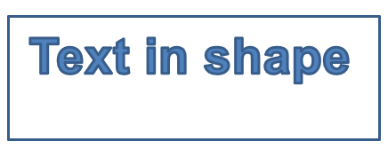

## **Visão geral**

Este artigo explica como personalizar formas de apresentação no Aspose.Slides editando a geometria da forma por meio de pontos de edição e caminhos de geometria. Ele mostra como trabalhar com [GeometryPath](https://reference.aspose.com/slides/pt/python-java/aspose.slides/geometrypath/) para modificar formas existentes, executar operações básicas de edição de caminhos, adicionar ou remover pontos e aplicar a geometria atualizada de volta a uma forma.

Ele também demonstra como criar formas personalizadas e compostas, construir formas com cantos curvos, determinar se a geometria de uma forma está fechada e converter entre [GeometryPath](https://reference.aspose.com/slides/pt/python-java/aspose.slides/geometrypath/) e [java.awt.Shape](https://docs.oracle.com/javase/7/docs/api/java/awt/Shape.html) para cenários adicionais de personalização de geometria.

## **Alterar uma forma usando pontos de edição**

Considere um quadrado. No PowerPoint, usando **pontos de edição**, você pode  

* mover o canto do quadrado para dentro ou para fora  
* especificar a curvatura de um canto ou ponto  
* adicionar novos pontos ao quadrado  
* manipular pontos no quadrado, etc.  

Essencialmente, você pode executar as tarefas descritas em qualquer forma. Usando pontos de edição, você pode mudar uma forma ou criar uma nova forma a partir de uma forma existente.  

## **Dicas de edição de formas**


Antes de começar a editar formas do PowerPoint por meio de pontos de edição, considere estes pontos sobre formas:

* Uma forma (ou seu caminho) pode ser fechada ou aberta.  
* Quando uma forma está fechada, ela não tem ponto inicial ou final. Quando está aberta, tem um início e um fim.  
* Todas as formas consistem em pelo menos 2 pontos de ancoragem ligados entre si por linhas.  
* Uma linha pode ser reta ou curvada. Os pontos de ancoragem determinam a natureza da linha.  
* Os pontos de ancoragem podem ser pontos de canto, pontos retos ou pontos suaves:  
  * Um ponto de canto é um ponto onde duas linhas retas se unem formando um ângulo.  
  * Um ponto suave é um ponto onde 2 alças existem em uma linha reta e os segmentos da linha se unem em uma curva suave. Nesse caso, todas as alças ficam separadas do ponto de ancoragem por uma distância igual.  
  * Um ponto reto é um ponto onde 2 alças existem em uma linha reta e os segmentos da linha se unem em uma curva suave. Nesse caso, as alças não precisam estar separadas do ponto de ancoragem por uma distância igual.  
* Movendo ou editando os pontos de ancoragem (o que altera o ângulo das linhas), você pode mudar a aparência de uma forma.  

Para editar formas do PowerPoint através de pontos de edição, **Aspose.Slides** fornece a classe [GeometryPath](https://reference.aspose.com/slides/pt/python-java/aspose.slides/geometrypath/).  

* Uma instância de [GeometryPath](https://reference.aspose.com/slides/pt/python-java/aspose.slides/geometrypath/) representa o caminho de geometria do objeto [GeometryShape](https://reference.aspose.com/slides/pt/python-java/aspose.slides/geometryshape/).  
* Para obter o [GeometryPath](https://reference.aspose.com/slides/pt/python-java/aspose.slides/geometrypath/) a partir da instância de [GeometryShape](https://reference.aspose.com/slides/pt/python-java/aspose.slides/geometryshape/), você pode usar o método [GeometryShape.getGeometryPaths](https://reference.aspose.com/slides/pt/python-java/aspose.slides/geometryshape/#getGeometryPaths).  
* Para definir o [GeometryPath](https://reference.aspose.com/slides/pt/python-java/aspose.slides/geometrypath/) de uma forma, você pode usar estes métodos: [GeometryShape.setGeometryPath](https://reference.aspose.com/slides/pt/python-java/aspose.slides/geometryshape/#setGeometryPath) para *formas sólidas* e [GeometryShape.setGeometryPaths](https://reference.aspose.com/slides/pt/python-java/aspose.slides/geometryshape/#setGeometryPaths) para *formas compostas*.  
* Para adicionar segmentos, você pode usar os métodos sob [GeometryPath](https://reference.aspose.com/slides/pt/python-java/aspose.slides/geometrypath/).  
* Usando os métodos [GeometryPath.setStroke](https://reference.aspose.com/slides/pt/python-java/aspose.slides/geometrypath/#setStroke) e [GeometryPath.setFillMode](https://reference.aspose.com/slides/pt/python-java/aspose.slides/geometrypath/#setFillMode), você pode definir a aparência de um caminho de geometria.  
* Usando o método [GeometryPath.getPathData](https://reference.aspose.com/slides/pt/python-java/aspose.slides/geometrypath/#getPathData), você pode recuperar o caminho de geometria de um [GeometryShape](https://reference.aspose.com/slides/pt/python-java/aspose.slides/geometryshape/) como um array de segmentos de caminho.  
* Para acessar opções adicionais de personalização de geometria de forma, você pode converter [GeometryPath](https://reference.aspose.com/slides/pt/python-java/aspose.slides/geometrypath/) para [java.awt.Shape](https://docs.oracle.com/javase/7/docs/api/java/awt/Shape.html).  
* Use os métodos [geometryPathToGraphicsPath](https://reference.aspose.com/slides/pt/python-java/aspose.slides/shapeutil/) e [graphicsPathToGeometryPath](https://reference.aspose.com/slides/pt/python-java/aspose.slides/shapeutil/) (da classe [ShapeUtil](https://reference.aspose.com/slides/pt/python-java/aspose.slides/shapeutil/)) para converter [GeometryPath](https://reference.aspose.com/slides/pt/python-java/aspose.slides/geometrypath/) em [java.awt.Shape](https://docs.oracle.com/javase/7/docs/api/java/awt/Shape.html) e vice‑versa.  

## **Operações de edição simples**

As assinaturas a seguir mostram as operações básicas de edição:

**Adicionar uma linha** ao final de um caminho:

- `geometry_path.lineTo(point)`
- `geometry_path.lineTo(x, y)`

**Adicionar uma linha** a uma posição especificada no caminho:

- `geometry_path.lineTo(point, index)`
- `geometry_path.lineTo(x, y, index)`

**Adicionar uma curva cúbica de Bézier** ao final de um caminho:

- `geometry_path.cubicBezierTo(point1, point2, point3)`
- `geometry_path.cubicBezierTo(x1, y1, x2, y2, x3, y3)`

**Adicionar uma curva cúbica de Bézier** a uma posição especificada no caminho:

- `geometry_path.cubicBezierTo(point1, point2, point3, index)`
- `geometry_path.cubicBezierTo(x1, y1, x2, y2, x3, y3, index)`

**Adicionar uma curva quadrática de Bézier** ao final de um caminho:

- `geometry_path.quadraticBezierTo(point1, point2)`
- `geometry_path.quadraticBezierTo(x1, y1, x2, y2)`

**Adicionar uma curva quadrática de Bézier** a uma posição especificada no caminho:

- `geometry_path.quadraticBezierTo(point1, point2, index)`
- `geometry_path.quadraticBezierTo(x1, y1, x2, y2, index)`

**Anexar um arco** ao caminho:

- `geometry_path.arcTo(width, height, start_angle, sweep_angle)`

**Fechar a figura atual** do caminho:

- `geometry_path.closeFigure()`

**Definir a posição para o próximo ponto**:

- `geometry_path.moveTo(point)`
- `geometry_path.moveTo(x, y)`

**Remover o segmento do caminho** em um índice dado:

- `geometry_path.removeAt(index)`


## **Adicionar pontos personalizados a uma forma**
1. Crie uma instância da classe [GeometryShape](https://reference.aspose.com/slides/pt/python-java/aspose.slides/geometryshape/) e defina o tipo [ShapeType.Rectangle](https://reference.aspose.com/slides/pt/python-java/aspose.slides/shapetype/#Rectangle).  
2. Obtenha uma instância da classe [GeometryPath](https://reference.aspose.com/slides/pt/python-java/aspose.slides/geometrypath/) a partir da forma.  
3. Adicione um novo ponto entre os dois pontos superiores do caminho.  
4. Adicione um novo ponto entre os dois pontos inferiores do caminho.  
5. Aplique o caminho à forma.  

Este código Python mostra como adicionar pontos personalizados a uma forma:

```python
import jpype
import asposeslides

if not jpype.isJVMStarted():
    jpype.startJVM()

from asposeslides.api import Presentation, ShapeType

presentation = Presentation()
try:
    shape = presentation.getSlides().get_Item(0).getShapes().addAutoShape(ShapeType.Rectangle, 100, 100, 200, 100)
    geometry_path = shape.getGeometryPaths()[0]
    geometry_path.lineTo(100, 50, 1)
    geometry_path.lineTo(100, 50, 4)
    shape.setGeometryPath(geometry_path)
finally:
    presentation.dispose()
```


## **Remover pontos de uma forma**

1. Crie uma instância da classe [GeometryShape](https://reference.aspose.com/slides/pt/python-java/aspose.slides/geometryshape/) e defina o tipo [ShapeType.Heart](https://reference.aspose.com/slides/pt/python-java/aspose.slides/shapetype/#Heart).  
2. Obtenha uma instância da classe [GeometryPath](https://reference.aspose.com/slides/pt/python-java/aspose.slides/geometrypath/) a partir da forma.  
3. Remova o segmento do caminho.  
4. Aplique o caminho à forma.  

Este código Python mostra como remover pontos de uma forma:

```python
import jpype
import asposeslides

if not jpype.isJVMStarted():
    jpype.startJVM()

from asposeslides.api import Presentation, ShapeType

presentation = Presentation()
try:
    shape = presentation.getSlides().get_Item(0).getShapes().addAutoShape(ShapeType.Heart, 100, 100, 300, 300)
    geometry_path = shape.getGeometryPaths()[0]
    geometry_path.removeAt(2)
    shape.setGeometryPath(geometry_path)
finally:
    presentation.dispose()
```


## **Criar uma forma personalizada**

1. Calcule os pontos da forma.  
2. Crie uma instância da classe [GeometryPath](https://reference.aspose.com/slides/pt/python-java/aspose.slides/geometrypath/).  
3. Preencha o caminho com os pontos.  
4. Crie uma instância da classe [GeometryShape](https://reference.aspose.com/slides/pt/python-java/aspose.slides/geometryshape/).  
5. Aplique o caminho à forma.  

Este código Python mostra como criar uma forma personalizada:

```python
import jpype
import asposeslides

if not jpype.isJVMStarted():
    jpype.startJVM()

from asposeslides.api import Presentation, ShapeType, GeometryPath

import math

points = []
outer_radius = 100
inner_radius = 50
step = 72

for angle in range(-90, 270, step):
    radians = math.radians(angle)
    x = outer_radius * math.cos(radians)
    y = outer_radius * math.sin(radians)
    points.append((x + outer_radius, y + outer_radius))

    radians = math.radians(angle + step / 2)
    x = inner_radius * math.cos(radians)
    y = inner_radius * math.sin(radians)
    points.append((x + outer_radius, y + outer_radius))

star_path = GeometryPath()
star_path.moveTo(*points[0])
for point in points[1:]:
    star_path.lineTo(*point)
star_path.closeFigure()

presentation = Presentation()
try:
    shape = presentation.getSlides().get_Item(0).getShapes().addAutoShape(ShapeType.Rectangle, 100, 100, outer_radius * 2, outer_radius * 2)
    shape.setGeometryPath(star_path)
finally:
    presentation.dispose()
```


## **Criar uma forma personalizada composta**

1. Crie uma instância da classe [GeometryShape](https://reference.aspose.com/slides/pt/python-java/aspose.slides/geometryshape/).  
2. Crie a primeira instância da classe [GeometryPath](https://reference.aspose.com/slides/pt/python-java/aspose.slides/geometrypath/).  
3. Crie a segunda instância da classe [GeometryPath](https://reference.aspose.com/slides/pt/python-java/aspose.slides/geometrypath/).  
4. Aplique os caminhos à forma.  

Este código Python mostra como criar uma forma personalizada composta:

```python
import jpype
import asposeslides

if not jpype.isJVMStarted():
    jpype.startJVM()

from asposeslides.api import Presentation, ShapeType, GeometryPath

presentation = Presentation()
try:
    shape = presentation.getSlides().get_Item(0).getShapes().addAutoShape(ShapeType.Rectangle, 100, 100, 200, 100)

    top_path = GeometryPath()
    top_path.moveTo(0, 0)
    top_path.lineTo(shape.getWidth(), 0)
    top_path.lineTo(shape.getWidth(), shape.getHeight() / 3)
    top_path.lineTo(0, shape.getHeight() / 3)
    top_path.closeFigure()

    bottom_path = GeometryPath()
    bottom_path.moveTo(0, shape.getHeight() / 3 * 2)
    bottom_path.lineTo(shape.getWidth(), shape.getHeight() / 3 * 2)
    bottom_path.lineTo(shape.getWidth(), shape.getHeight())
    bottom_path.lineTo(0, shape.getHeight())
    bottom_path.closeFigure()

    shape.setGeometryPaths([top_path, bottom_path])
finally:
    presentation.dispose()
```


## **Criar uma forma personalizada com cantos curvos**

Este código Python mostra como criar uma forma personalizada com cantos curvos (para dentro):

```python
import jpype
import asposeslides

if not jpype.isJVMStarted():
    jpype.startJVM()

from asposeslides.api import Presentation, ShapeType, GeometryPath, SaveFormat

shape_x = 20
shape_y = 20
shape_width = 300
shape_height = 200

left_top_size = 50
right_top_size = 20
right_bottom_size = 40
left_bottom_size = 10

presentation = Presentation()
try:
    shape = presentation.getSlides().get_Item(0).getShapes().addAutoShape(ShapeType.Custom, shape_x, shape_y, shape_width, shape_height)
    geometry_path = GeometryPath()
    geometry_path.moveTo(left_top_size, 0)
    geometry_path.lineTo(shape_width - right_top_size, 0)
    geometry_path.arcTo(right_top_size, right_top_size, 180, -90)
    geometry_path.lineTo(shape_width, shape_height - right_bottom_size)
    geometry_path.arcTo(right_bottom_size, right_bottom_size, -90, -90)
    geometry_path.lineTo(left_bottom_size, shape_height)
    geometry_path.arcTo(left_bottom_size, left_bottom_size, 0, -90)
    geometry_path.lineTo(0, left_top_size)
    geometry_path.arcTo(left_top_size, left_top_size, 90, -90)
    geometry_path.closeFigure()
    shape.setGeometryPath(geometry_path)
    presentation.save("output.pptx", SaveFormat.Pptx)
finally:
    presentation.dispose()
```

## **Descobrir se a geometria de uma forma está fechada**

Uma forma fechada é definida como aquela cujos lados se conectam, formando um único contorno sem lacunas. Essa forma pode ser uma estrutura geométrica simples ou um contorno personalizado complexo. O exemplo de código a seguir mostra como verificar se a geometria de uma forma está fechada:

```python
import jpype
import asposeslides

if not jpype.isJVMStarted():
    jpype.startJVM()

from asposeslides.api import PathCommandType

def is_geometry_closed(geometry_shape):
    is_closed = False
    for geometry_path in geometry_shape.getGeometryPaths():
        path_data = geometry_path.getPathData()
        if len(path_data) == 0:
            continue
        last_segment = path_data[-1]
        is_closed = last_segment.getPathCommand() == PathCommandType.Close
        if not is_closed:
            return False
    return is_closed
```

## **Converter GeometryPath para java.awt.Shape**

1. Crie uma instância da classe [GeometryShape](https://reference.aspose.com/slides/pt/python-java/aspose.slides/geometryshape/).  
2. Crie uma instância da classe [java.awt.Shape](https://docs.oracle.com/javase/7/docs/api/java/awt/Shape.html).  
3. Converta a instância de [java.awt.Shape](https://docs.oracle.com/javase/7/docs/api/java/awt/Shape.html) para a instância de [GeometryPath](https://reference.aspose.com/slides/pt/python-java/aspose.slides/geometrypath/) percorrendo seu [PathIterator](https://docs.oracle.com/javase/8/docs/api/java/awt/geom/PathIterator.html) e reproduzindo cada segmento no caminho.  
4. Aplique os caminhos à forma.  

Este código Python implementa as etapas acima para converter um caminho gráfico em um caminho de geometria:

```python
import jpype
import asposeslides

if not jpype.isJVMStarted():
    jpype.startJVM()

from asposeslides.api import Presentation, ShapeType, GeometryPath, PathFillModeType

from java.awt import Font
from java.awt.geom import PathIterator
from java.awt.image import BufferedImage

presentation = Presentation()
try:
    # Crie uma nova forma.
    shape = presentation.getSlides().get_Item(0).getShapes().addAutoShape(ShapeType.Rectangle, 100, 100, 300, 100)

    # Obtenha o caminho de geometria da forma.
    original_path = shape.getGeometryPaths()[0]
    original_path.setFillMode(PathFillModeType.None_)

    # Crie um novo caminho gráfico com texto.
    font = Font("Arial", Font.PLAIN, 40)
    text = "Text in shape"
    image = BufferedImage(100, 100, BufferedImage.TYPE_INT_ARGB)
    graphics = image.createGraphics()
    try:
        glyph_vector = font.createGlyphVector(graphics.getFontRenderContext(), text)
        graphics_path = glyph_vector.getOutline(20.0, -glyph_vector.getVisualBounds().getY() + 10)
    finally:
        graphics.dispose()

    # Converta o caminho gráfico em um caminho de geometria.
    text_path = GeometryPath()
    path_iterator = graphics_path.getPathIterator(None)
    points = jpype.JArray(jpype.JFloat)(6)
    while not path_iterator.isDone():
        segment_type = path_iterator.currentSegment(points)
        if segment_type == PathIterator.SEG_MOVETO:
            text_path.moveTo(points[0], points[1])
        elif segment_type == PathIterator.SEG_LINETO:
            text_path.lineTo(points[0], points[1])
        elif segment_type == PathIterator.SEG_QUADTO:
            text_path.quadraticBezierTo(points[0], points[1], points[2], points[3])
        elif segment_type == PathIterator.SEG_CUBICTO:
            text_path.cubicBezierTo(points[0], points[1], points[2], points[3], points[4], points[5])
        elif segment_type == PathIterator.SEG_CLOSE:
            text_path.closeFigure()
        path_iterator.next()
    text_path.setFillMode(PathFillModeType.Normal)

    # Aplique o caminho de texto junto com o caminho de geometria original.
    shape.setGeometryPaths([original_path, text_path])
finally:
    presentation.dispose()
```


## **FAQ**

**O que acontecerá com o preenchimento e o contorno após substituir a geometria?**  
O estilo permanece associado à forma; somente o contorno muda. O preenchimento e o contorno são aplicados automaticamente à nova geometria.

**Como girar corretamente uma forma personalizada junto com sua geometria?**  
Use o método [setRotation](https://reference.aspose.com/slides/pt/python-java/aspose.slides/shape/#setRotation) da forma; a geometria gira com a forma porque está vinculada ao próprio sistema de coordenadas da forma.

**Posso converter uma forma personalizada em uma imagem para “travar” o resultado?**  
Sim. Exporte a área do [slide](/slides/pt/python-java/convert-powerpoint-to-png/) necessária ou a própria [shape](/slides/pt/python-java/create-shape-thumbnails/) para um formato raster; isso simplifica o trabalho posterior com geometrias complexas.