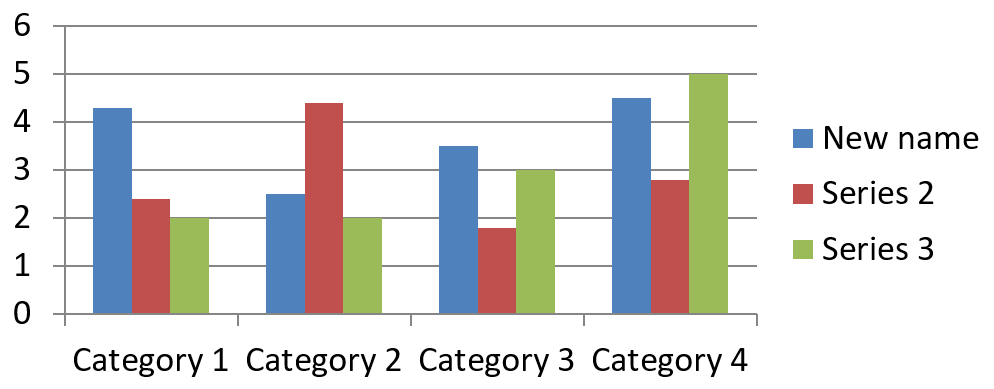

## **Visão geral**

Um gráfico armazena seus dados plotados em uma planilha de dados de gráfico. Um [ChartSeries](https://reference.aspose.com/slides/pt/python-net/aspose.slides.charts/chartseries/) representa um conjunto de valores relacionados, e cada [ChartDataPoint](https://reference.aspose.com/slides/pt/python-net/aspose.slides.charts/chartdatapoint/) da série se refere a uma ou mais células da planilha. Objetos [ChartCategory](https://reference.aspose.com/slides/pt/python-net/aspose.slides.charts/chartcategory/) fornecem os rótulos ou valores de agrupamento compartilhados pelas séries. O nome da série, as categorias e os valores dos pontos estão, portanto, conectados a objetos [ChartDataCell](https://reference.aspose.com/slides/pt/python-net/aspose.slides.charts/chartdatacell/) em vez de serem armazenados apenas como texto de exibição.

Para um gráfico de categorias típico, a planilha padrão usa a linha 0 para nomes das séries, a coluna 0 para nomes das categorias e as células restantes para os valores das séries. Os índices de planilha, linha e coluna passados para [ChartDataWorkbook.get_cell](https://reference.aspose.com/slides/pt/python-net/aspose.slides.charts/chartdataworkbook/get_cell/) são baseados em zero. Esse layout é útil quando você cria um gráfico com dados padrão, mas não assuma que todo gráfico existente o utiliza. Para uma apresentação carregada, inspecione as células referenciadas pelas séries, categorias e pontos de dados antes de alterar os valores da planilha.

As configurações do gráfico têm três escopos diferentes:

- Configurações ao nível da série, como [ChartSeries.format](https://reference.aspose.com/slides/pt/python-net/aspose.slides.charts/chartseries/format/), fornecem a aparência padrão para todos os pontos de uma série.
- Configurações de ponto de dados, como [ChartDataPoint.format](https://reference.aspose.com/slides/pt/python-net/aspose.slides.charts/chartdatapoint/format/), sobrescrevem a aparência da série para um ponto.
- Configurações de grupo aplicam‑se a séries compatíveis que pertencem ao mesmo [ChartSeriesGroup](https://reference.aspose.com/slides/pt/python-net/aspose.slides.charts/chartseriesgroup/). Acesse o grupo através de [ChartSeries.parent_series_group](https://reference.aspose.com/slides/pt/python-net/aspose.slides.charts/chartseries/parent_series_group/) quando precisar definir opções como sobreposição ou largura do espaço.

Quando nenhum preenchimento explícito de ponto ou série é definido, o estilo e o tema do gráfico determinam a aparência automática. Quando há formatação de série e de ponto, a formatação do ponto tem precedência para esse ponto.


## **Definir a sobreposição da série do gráfico**

[ChartSeries.overlap](https://reference.aspose.com/slides/pt/python-net/aspose.slides.charts/chartseries/overlap/) informa o grau de sobreposição de barras ou colunas em um gráfico 2D, de –100 a 100 porcento. É uma projeção somente leitura da configuração no grupo de séries pai. Defina [ChartSeriesGroup.overlap](https://reference.aspose.com/slides/pt/python-net/aspose.slides.charts/chartseriesgroup/overlap/) para atualizar todas as séries compatíveis nesse grupo. Essa opção se aplica a tipos de gráfico que exibem barras ou colunas agrupadas; não afeta grupos de séries não relacionados em um gráfico combinado.

O exemplo a seguir define a sobreposição para o grupo que contém a primeira série:

```py
import aspose.slides as slides
import aspose.slides.charts as charts

first_slide_index = 0
first_series_index = 0
overlap_percent = 30

with slides.Presentation() as presentation:
    slide = presentation.slides[first_slide_index]

    # O novo gráfico contém séries, categorias e valores de exemplo.
    chart = slide.shapes.add_chart(charts.ChartType.CLUSTERED_COLUMN, 20, 20, 500, 200)

    series = chart.chart_data.series[first_series_index]
    series.parent_series_group.overlap = overlap_percent

    presentation.save("series_overlap.pptx", slides.export.SaveFormat.PPTX)
```

O resultado:


## **Alterar a cor de preenchimento da série**

Use [ChartSeries.format](https://reference.aspose.com/slides/pt/python-net/aspose.slides.charts/chartseries/format/) para definir o preenchimento padrão para uma série inteira. Se um ponto já possuir um preenchimento explícito, sua configuração [ChartDataPoint.format](https://reference.aspose.com/slides/pt/python-net/aspose.slides.charts/chartdatapoint/format/) sobrescreve o preenchimento da série para esse ponto.

O exemplo a seguir aplica um preenchimento sólido azul à primeira série:

```py
import aspose.pydrawing as drawing
import aspose.slides as slides
import aspose.slides.charts as charts

first_slide_index = 0
first_series_index = 0

with slides.Presentation() as presentation:
    slide = presentation.slides[first_slide_index]

    chart = slide.shapes.add_chart(charts.ChartType.CLUSTERED_COLUMN, 20, 20, 500, 200)

    series = chart.chart_data.series[first_series_index]
    series.format.fill.fill_type = slides.FillType.SOLID
    series.format.fill.solid_fill_color.color = drawing.Color.blue

    presentation.save("series_color.pptx", slides.export.SaveFormat.PPTX)
```

O resultado:


## **Alterar o nome da série**

Um nome de série é armazenado na planilha de dados do gráfico e normalmente é exibido na legenda. Na planilha padrão criada para um gráfico de colunas agrupadas, a célula B1 está na linha 0, coluna 1 e contém o nome da primeira série. As constantes nomeadas no exemplo a seguir tornam essa estrutura explícita:

```py
import aspose.slides as slides
import aspose.slides.charts as charts

first_slide_index = 0
worksheet_index = 0
series_name_row_index = 0
first_series_column_index = 1

with slides.Presentation() as presentation:
    slide = presentation.slides[first_slide_index]

    chart = slide.shapes.add_chart(charts.ChartType.CLUSTERED_COLUMN, 20, 20, 500, 200)

    workbook = chart.chart_data.chart_data_workbook
    series_name_cell = workbook.get_cell(worksheet_index, series_name_row_index, first_series_column_index)
    series_name_cell.value = "Revenue"

    presentation.save("series_name.pptx", slides.export.SaveFormat.PPTX)
```

Você também pode atualizar a célula já referenciada por [ChartSeries.name](https://reference.aspose.com/slides/pt/python-net/aspose.slides.charts/chartseries/name/). Essa abordagem evita assumir uma linha e coluna específicas em um gráfico existente:

```py
import aspose.slides as slides
import aspose.slides.charts as charts

first_slide_index = 0
first_series_index = 0
first_name_cell_index = 0

with slides.Presentation() as presentation:
    slide = presentation.slides[first_slide_index]

    chart = slide.shapes.add_chart(charts.ChartType.CLUSTERED_COLUMN, 20, 20, 500, 200)

    series = chart.chart_data.series[first_series_index]
    series_name_cell = series.name.as_cells[first_name_cell_index]
    series_name_cell.value = "Revenue"

    presentation.save("series_name.pptx", slides.export.SaveFormat.PPTX)
```

O resultado:



## **Obter a cor automática de preenchimento da série**

[ChartSeries.get_automatic_series_color](https://reference.aspose.com/slides/pt/python-net/aspose.slides.charts/chartseries/get_automatic_series_color/) retorna a cor calculada a partir do índice da série e do estilo do gráfico. Essa é a cor usada quando o preenchimento da série não foi definido explicitamente. Chamar o método lê a cor calculada; ele não atribui um novo preenchimento.

O exemplo a seguir exibe a cor automática de cada série padrão:

```py
import aspose.slides as slides
import aspose.slides.charts as charts

first_slide_index = 0

with slides.Presentation() as presentation:
    slide = presentation.slides[first_slide_index]

    chart = slide.shapes.add_chart(charts.ChartType.CLUSTERED_COLUMN, 20, 20, 500, 200)

    series_count = len(chart.chart_data.series)
    for series_index in range(series_count):
        series = chart.chart_data.series[series_index]
        automatic_color = series.get_automatic_series_color()
        print(f"Series {series_index}: {automatic_color.name}")
```

Saída de exemplo para o estilo de gráfico padrão:

```text
Series 0: ff4f81bd
Series 1: ffc0504d
Series 2: ff9bbb59
```

As cores exatas dependem do estilo e do tema do gráfico.

## **Definir cor de preenchimento invertida para uma série de gráfico**

Para séries de barras, colunas e bolhas, [ChartSeries.invert_if_negative](https://reference.aspose.com/slides/pt/python-net/aspose.slides.charts/chartseries/invert_if_negative/) pode exibir valores negativos com um preenchimento diferente. Defina o preenchimento regular da série como sólido, habilite a inversão e atribua a cor de valor negativo através de [ChartSeries.inverted_solid_fill_color](https://reference.aspose.com/slides/pt/python-net/aspose.slides.charts/chartseries/inverted_solid_fill_color/). Números negativos permanecem inalterados na planilha; apenas sua cor de exibição muda.

O exemplo a seguir substitui os dados de gráfico padrão por uma série. A linha 0 da planilha contém o nome da série, a coluna 0 contém os nomes das categorias e a coluna 1 contém os valores:

```py
import aspose.pydrawing as drawing
import aspose.slides as slides
import aspose.slides.charts as charts

first_slide_index = 0
worksheet_index = 0
header_row_index = 0
category_column_index = 0
first_series_column_index = 1
first_data_row_index = 1

category_names = ["Category 1", "Category 2", "Category 3"]
series_values = [-20, 50, -30]

with slides.Presentation() as presentation:
    slide = presentation.slides[first_slide_index]

    chart = slide.shapes.add_chart(charts.ChartType.CLUSTERED_COLUMN, 20, 20, 500, 200)
    chart_data = chart.chart_data
    workbook = chart_data.chart_data_workbook

    chart_data.series.clear()
    chart_data.categories.clear()

    series_name_cell = workbook.get_cell(worksheet_index, header_row_index, first_series_column_index, "Series 1")
    series = chart_data.series.add(series_name_cell, chart.type)

    category_count = len(category_names)
    for category_index in range(category_count):
        data_row_index = first_data_row_index + category_index
        category_name = category_names[category_index]
        series_value = series_values[category_index]

        category_cell = workbook.get_cell(worksheet_index, data_row_index, category_column_index, category_name)
        chart_data.categories.add(category_cell)

        value_cell = workbook.get_cell(worksheet_index, data_row_index, first_series_column_index, series_value)
        series.data_points.add_data_point_for_bar_series(value_cell)

    automatic_series_color = series.get_automatic_series_color()
    series.format.fill.fill_type = slides.FillType.SOLID
    series.format.fill.solid_fill_color.color = automatic_series_color
    series.invert_if_negative = True
    series.inverted_solid_fill_color.color = drawing.Color.red

    presentation.save("inverted_solid_fill_color.pptx", slides.export.SaveFormat.PPTX)
```

O resultado:


Você pode habilitar a inversão para um ponto através de [ChartDataPoint.invert_if_negative](https://reference.aspose.com/slides/pt/python-net/aspose.slides.charts/chartdatapoint/invert_if_negative/). No exemplo a seguir, a inversão está desativada para a série e ativada apenas para o ponto selecionado. O ponto também recebe um valor negativo para que o efeito seja visível:

```py
import aspose.pydrawing as drawing
import aspose.slides as slides
import aspose.slides.charts as charts

first_slide_index = 0
first_series_index = 0
target_data_point_index = 2
negative_value = -30

with slides.Presentation() as presentation:
    slide = presentation.slides[first_slide_index]

    chart = slide.shapes.add_chart(charts.ChartType.CLUSTERED_COLUMN, 20, 20, 500, 200)

    series = chart.chart_data.series[first_series_index]
    automatic_series_color = series.get_automatic_series_color()
    series.format.fill.fill_type = slides.FillType.SOLID
    series.format.fill.solid_fill_color.color = automatic_series_color
    series.inverted_solid_fill_color.color = drawing.Color.red
    series.invert_if_negative = False

    data_point = series.data_points[target_data_point_index]
    data_point.value.as_cell.value = negative_value
    data_point.invert_if_negative = True

    presentation.save("data_point_invert_color_if_negative.pptx", slides.export.SaveFormat.PPTX)
```

## **Limpar o valor de um ponto de dados específico**

Para deixar um ponto vazio sem remover os demais, defina sua célula de suporte na planilha como `None`. Para um gráfico de colunas, o valor plotado está disponível através de [ChartDataPoint.value](https://reference.aspose.com/slides/pt/python-net/aspose.slides.charts/chartdatapoint/value/). O ponto de dados permanece na mesma posição de categoria, mas o gráfico trata seu valor como em branco de acordo com as configurações de valores em branco do gráfico.

O exemplo a seguir limpa apenas o segundo ponto da primeira série:

```py
import aspose.slides as slides
import aspose.slides.charts as charts

first_slide_index = 0
first_series_index = 0
target_data_point_index = 1

with slides.Presentation() as presentation:
    slide = presentation.slides[first_slide_index]

    chart = slide.shapes.add_chart(charts.ChartType.CLUSTERED_COLUMN, 20, 20, 500, 200)

    series = chart.chart_data.series[first_series_index]
    data_point = series.data_points[target_data_point_index]
    data_point.value.as_cell.value = None

    presentation.save("clear_data_point_value.pptx", slides.export.SaveFormat.PPTX)
```

Gráficos de dispersão utilizam células X e Y separadas, e gráficos de bolha também utilizam uma célula de tamanho. Limpe apenas a célula que representa o valor que você pretende remover. Não chame [ChartDataPointCollection.clear](https://reference.aspose.com/slides/pt/python-net/aspose.slides.charts/chartdatapointcollection/clear/) quando quiser manter os demais pontos, pois esse método remove todos os pontos da coleção.

## **Definir a largura do espaço entre séries**

A largura do espaço é a distância entre clusters adjacentes de barras ou colunas, expressa como porcentagem da largura da barra ou coluna. Assim como a sobreposição, pertence ao grupo de séries pai em vez de a uma única série. Defina [ChartSeriesGroup.gap_width](https://reference.aspose.com/slides/pt/python-net/aspose.slides.charts/chartseriesgroup/gap_width/) uma vez para o grupo. Um valor maior cria mais espaço entre os clusters; um valor menor os torna mais densos.

O exemplo a seguir altera a largura do espaço e salva apenas a apresentação final:

```py
import aspose.slides as slides
import aspose.slides.charts as charts

first_slide_index = 0
first_series_index = 0
gap_width_percent = 30

with slides.Presentation() as presentation:
    slide = presentation.slides[first_slide_index]

    chart = slide.shapes.add_chart(charts.ChartType.STACKED_COLUMN, 20, 20, 500, 200)

    series = chart.chart_data.series[first_series_index]
    series.parent_series_group.gap_width = gap_width_percent

    presentation.save("gap_width_30.pptx", slides.export.SaveFormat.PPTX)
```

O resultado:


## **FAQ**

**Quais tipos de gráfico suportam séries de dados?**

Todos os tipos de gráfico representados pela enumeração [ChartType](https://reference.aspose.com/slides/pt/python-net/aspose.slides.charts/charttype/) utilizam dados de gráfico, mas suas séries não têm todas a mesma estrutura de valores ou configurações. Por exemplo, gráficos de categorias usam categorias e valores, gráficos de dispersão usam valores X e Y, e gráficos de bolha adicionam tamanhos de bolha. Use o método de criação de ponto de dados que corresponda ao tipo da série. Opções como sobreposição e largura do espaço se aplicam apenas a grupos de barras ou colunas compatíveis.

**O que é um grupo de séries de gráfico?**

Um [ChartSeriesGroup](https://reference.aspose.com/slides/pt/python-net/aspose.slides.charts/chartseriesgroup/) contém séries compatíveis que compartilham configurações de plotagem ao nível do grupo. Um gráfico combinado pode conter mais de um grupo, de modo que alterar o grupo acessado por uma série não altera necessariamente todas as séries do gráfico.

**Um gráfico recém‑criado contém dados padrão?**

Sim. Por padrão, [ShapeCollection.add_chart](https://reference.aspose.com/slides/pt/python-net/aspose.slides/shapecollection/add_chart/) cria séries, categorias e valores de exemplo. Você pode editar essas células ou limpar tanto as coleções de séries quanto as de categorias antes de adicionar um conjunto de dados completamente personalizado. Uma sobrecarga também pode criar um gráfico sem dados padrão.

**Como os objetos do gráfico estão conectados às células da planilha?**

Nomes de série, rótulos de categoria e valores de ponto de dados referenciam células em um [ChartDataWorkbook](https://reference.aspose.com/slides/pt/python-net/aspose.slides.charts/chartdataworkbook/). Alterar uma célula referenciada atualiza o elemento correspondente do gráfico. Ao criar dados personalizados, mantenha as linhas de categorias e as linhas de valores de séries alinhadas para que cada ponto seja plotado sob a categoria pretendida.

**Como limpar um ponto em vez de toda a série?**

Defina a célula de valor relevante como `None` para manter a posição da categoria do ponto como ponto vazio. Use [ChartDataPointCollection.clear](https://reference.aspose.com/slides/pt/python-net/aspose.slides.charts/chartdatapointcollection/clear/) apenas quando pretender remover todos os pontos daquela série. Se também remover categorias, atualize todas as séries para que seus valores permaneçam alinhados com a coleção de categorias.

**Como os pontos vazios são exibidos?**

O resultado depende do tipo de gráfico e de [Chart.display_blanks_as](https://reference.aspose.com/slides/pt/python-net/aspose.slides.charts/chart/display_blanks_as/). Gráficos suportados podem exibir vazios como lacunas, como valores zero ou conectando pontos vizinhos. Escolha a configuração que corresponda ao significado dos dados ausentes em sua apresentação.

**Como os valores negativos são formatados?**

Para séries de barras, colunas e bolhas suportadas, habilite [ChartSeries.invert_if_negative](https://reference.aspose.com/slides/pt/python-net/aspose.slides.charts/chartseries/invert_if_negative/) e defina [ChartSeries.inverted_solid_fill_color](https://reference.aspose.com/slides/pt/python-net/aspose.slides.charts/chartseries/inverted_solid_fill_color/). Você pode sobrescrever o comportamento para um ponto individual com [ChartDataPoint.invert_if_negative](https://reference.aspose.com/slides/pt/python-net/aspose.slides.charts/chartdatapoint/invert_if_negative/). Essas propriedades afetam a formatação, não os valores numéricos armazenados.

**Qual formatação prevalece quando tanto a série quanto o ponto são formatados?**

A formatação explícita do ponto de dados tem precedência para esse ponto. Os demais pontos continuam usando a formatação explícita da série ou, quando a formatação da série não está definida, o estilo e tema automáticos do gráfico. Propriedades de grupo, como sobreposição e largura do espaço, controlam o layout e não são sobrescritas por formatação ao nível do ponto.

**Existe um limite para a quantidade de séries que um gráfico pode conter?**

Aspose.Slides não impõe um limite fixo separado para a contagem de séries. Na prática, restrições do arquivo de apresentação, memória disponível, tempo de renderização e legibilidade do gráfico determinam um limite útil.

**O que devo mudar quando as colunas estão muito próximas ou muito afastadas?**

Defina [ChartSeriesGroup.gap_width](https://reference.aspose.com/slides/pt/python-net/aspose.slides.charts/chartseriesgroup/gap_width/) no grupo de séries pai apropriado. Aumente o valor para ampliar o espaço entre os clusters ou diminua-o para aproximá‑los.