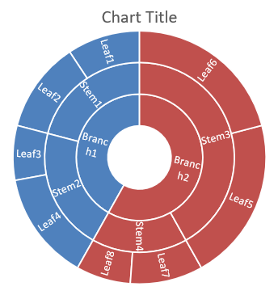

## **Visão geral**

Este artigo fornece um guia abrangente sobre como criar e personalizar gráficos usando Aspose.Slides for Python via .NET. Você aprenderá como adicionar programaticamente um gráfico a um slide, preenchê‑lo com dados e aplicar várias opções de formatação para atender aos seus requisitos de design específicos. Ao longo do artigo, exemplos de código detalhados ilustram cada etapa, desde a inicialização da apresentação e do objeto de gráfico até a configuração de séries, eixos e legendas. Seguindo este guia, você obterá uma compreensão sólida de como integrar a geração dinâmica de gráficos em suas aplicações, simplificando o processo de criação de apresentações baseadas em dados.

## **Criar um Gráfico**

Gráficos ajudam as pessoas a visualizar rapidamente dados e obter insights que podem não ser imediatamente óbvios em uma tabela ou planilha.

**Por que criar gráficos?**

Usando gráficos, você pode:

* agregar, condensar ou resumir grandes quantidades de dados em um único slide de uma apresentação;
* expor padrões e tendências nos dados;
* deduzir a direção e o impulso dos dados ao longo do tempo ou em relação a uma unidade de medida específica;
* identificar outliers, aberrações, desvios, erros e dados sem sentido;
* comunicar ou apresentar dados complexos.

No PowerPoint, você pode criar gráficos através da função *Insert*, que fornece modelos para projetar vários tipos de gráficos. Usando Aspose.Slides, você pode criar tanto gráficos regulares (baseados em tipos de gráfico populares) quanto gráficos personalizados.

{} 
Use a enumeração [ChartType](https://reference.aspose.com/slides/pt/python-net/aspose.slides.charts/charttype/) no namespace [Aspose.Slides.Charts](https://reference.aspose.com/slides/pt/python-net/aspose.slides.charts/). Os valores desta enumeração correspondem a diferentes tipos de gráfico.
{} 

### **Criar Gráficos de Colunas Agrupadas**

Esta seção explica como criar gráficos de colunas agrupadas usando Aspose.Slides for Python via .NET. Você aprenderá a inicializar uma apresentação, adicionar um gráfico e personalizar seus elementos, como título, dados, séries, categorias e estilo. Siga os passos abaixo para ver como um gráfico de colunas agrupadas padrão é gerado:

1. Crie uma instância da classe [Presentation](https://reference.aspose.com/slides/pt/python-net/aspose.slides/presentation/).
1. Obtenha uma referência a um slide usando seu índice.
1. Adicione um gráfico com alguns dados e especifique o tipo `ChartType.CLUSTERED_COLUMN`.
1. Adicione um título ao gráfico.
1. Acesse a planilha de dados do gráfico.
1. Limpe todas as séries e categorias padrão.
1. Adicione novas séries e categorias.
1. Adicione novos dados ao gráfico para as séries.
1. Aplique uma cor de preenchimento às séries do gráfico.
1. Adicione rótulos às séries do gráfico.
1. Salve a apresentação modificada como um arquivo PPTX.

Este código Python demonstra como criar um gráfico de colunas agrupadas:

```py
import aspose.slides.charts as charts
import aspose.slides as slides
import aspose.pydrawing as draw

# Instanciar a classe Presentation que representa um arquivo PPTX.
with slides.Presentation() as presentation:

    # Acessar o primeiro slide.
    slide = presentation.slides[0]

    # Adicionar um gráfico de colunas agrupadas com seus dados padrão.
    chart = slide.shapes.add_chart(charts.ChartType.CLUSTERED_COLUMN, 20, 20, 500, 300)

    # Definir o título do gráfico.
    chart.chart_title.add_text_frame_for_overriding("Sample Title")
    chart.chart_title.text_frame_for_overriding.text_frame_format.center_text = slides.NullableBool.TRUE
    chart.chart_title.height = 20
    chart.has_title = True

    # Configurar a primeira série para exibir valores.
    chart.chart_data.series[0].labels.default_data_label_format.show_value = True

    # Definir o índice da planilha de dados do gráfico.
    worksheet_index = 0

    # Obter a planilha de dados do gráfico.
    workbook = chart.chart_data.chart_data_workbook

    # Excluir as séries e categorias geradas por padrão.
    chart.chart_data.series.clear()
    chart.chart_data.categories.clear()

    # Adicionar novas séries.
    chart.chart_data.series.add(workbook.get_cell(worksheet_index, 0, 1, "Series 1"), chart.type)
    chart.chart_data.series.add(workbook.get_cell(worksheet_index, 0, 2, "Series 2"), chart.type)

    # Adicionar novas categorias.
    chart.chart_data.categories.add(workbook.get_cell(worksheet_index, 1, 0, "Category 1"))
    chart.chart_data.categories.add(workbook.get_cell(worksheet_index, 2, 0, "Category 2"))
    chart.chart_data.categories.add(workbook.get_cell(worksheet_index, 3, 0, "Category 3"))

    # Obter a primeira série do gráfico.
    series = chart.chart_data.series[0]

    # Preencher os dados da série.
    series.data_points.add_data_point_for_bar_series(workbook.get_cell(worksheet_index, 1, 1, 20))
    series.data_points.add_data_point_for_bar_series(workbook.get_cell(worksheet_index, 2, 1, 50))
    series.data_points.add_data_point_for_bar_series(workbook.get_cell(worksheet_index, 3, 1, 30))

    # Definir a cor de preenchimento da série.
    series.format.fill.fill_type = slides.FillType.SOLID
    series.format.fill.solid_fill_color.color = draw.Color.red

    # Obter a segunda série do gráfico.
    series = chart.chart_data.series[1]

    # Preencher os dados da série.
    series.data_points.add_data_point_for_bar_series(workbook.get_cell(worksheet_index, 1, 2, 30))
    series.data_points.add_data_point_for_bar_series(workbook.get_cell(worksheet_index, 2, 2, 10))
    series.data_points.add_data_point_for_bar_series(workbook.get_cell(worksheet_index, 3, 2, 60))

    # Definir a cor de preenchimento da série.
    series.format.fill.fill_type = slides.FillType.SOLID
    series.format.fill.solid_fill_color.color = draw.Color.green

    # Definir o primeiro rótulo para exibir o nome da categoria.
    label = series.data_points[0].label
    label.data_label_format.show_category_name = True

    label = series.data_points[1].label
    label.data_label_format.show_series_name = True

    # Configurar a série para exibir o valor no terceiro rótulo.
    label = series.data_points[2].label
    label.data_label_format.show_value = True
    label.data_label_format.show_series_name = True
    label.data_label_format.separator = "/"
                
    # Salvar a apresentação no disco como um arquivo PPTX.
    presentation.save("ClusteredColumnChart.pptx", slides.export.SaveFormat.PPTX)
```

O resultado:


### **Criar Gráficos de Dispersão**

Gráficos de dispersão (também conhecidos como scatter plots ou gráficos x‑y) são frequentemente usados para verificar padrões ou demonstrar correlações entre duas variáveis.

Use um gráfico de dispersão quando:

* Você tem dados numéricos emparelhados.
* Você tem duas variáveis que se relacionam bem entre si.
* Você deseja determinar se as duas variáveis estão relacionadas.
* Você tem uma variável independente que possui múltiplos valores para uma variável dependente.

Este código Python mostra como criar um gráfico de dispersão com diferentes séries de marcadores:

```py
import aspose.slides.charts as charts
import aspose.slides as slides
import aspose.pydrawing as draw

# Instanciar a classe Presentation.
with slides.Presentation() as presentation:

    # Acessar o primeiro slide.
    slide = presentation.slides[0]

    # Criar o gráfico de dispersão padrão.
    chart = slide.shapes.add_chart(charts.ChartType.SCATTER_WITH_SMOOTH_LINES, 20, 20, 500, 300)

    # Definir o índice da planilha de dados do gráfico.
    worksheet_index = 0

    # Obter a planilha de dados do gráfico.
    workbook = chart.chart_data.chart_data_workbook

    # Excluir a série padrão.
    chart.chart_data.series.clear()

    # Adicionar novas séries.
    chart.chart_data.series.add(workbook.get_cell(worksheet_index, 1, 1, "Series 1"), chart.type)
    chart.chart_data.series.add(workbook.get_cell(worksheet_index, 1, 3, "Series 2"), chart.type)

    # Obter a primeira série do gráfico.
    series = chart.chart_data.series[0]

    # Adicionar um novo ponto (1:3) à série.
    series.data_points.add_data_point_for_scatter_series(workbook.get_cell(worksheet_index, 2, 1, 1), workbook.get_cell(worksheet_index, 2, 2, 3))

    # Adicionar um novo ponto (2:10).
    series.data_points.add_data_point_for_scatter_series(workbook.get_cell(worksheet_index, 3, 1, 2), workbook.get_cell(worksheet_index, 3, 2, 10))

    # Alterar o tipo da série.
    series.type = charts.ChartType.SCATTER_WITH_STRAIGHT_LINES_AND_MARKERS

    # Alterar o marcador da série do gráfico.
    series.marker.size = 10
    series.marker.symbol = charts.MarkerStyleType.STAR

    # Obter a segunda série do gráfico.
    series = chart.chart_data.series[1]

    # Adicionar um novo ponto (5:2) à série do gráfico.
    series.data_points.add_data_point_for_scatter_series(workbook.get_cell(worksheet_index, 2, 3, 5), workbook.get_cell(worksheet_index, 2, 4, 2))

    # Adicionar um novo ponto (3:1).
    series.data_points.add_data_point_for_scatter_series(workbook.get_cell(worksheet_index, 3, 3, 3), workbook.get_cell(worksheet_index, 3, 4, 1))

    # Adicionar um novo ponto (2:2).
    series.data_points.add_data_point_for_scatter_series(workbook.get_cell(worksheet_index, 4, 3, 2), workbook.get_cell(worksheet_index, 4, 4, 2))

    # Adicionar um novo ponto (5:1).
    series.data_points.add_data_point_for_scatter_series(workbook.get_cell(worksheet_index, 5, 3, 5), workbook.get_cell(worksheet_index, 5, 4, 1))

    # Alterar o marcador da série do gráfico.
    series.marker.size = 10
    series.marker.symbol = charts.MarkerStyleType.CIRCLE

    presentation.save("ScatterChart.pptx", slides.export.SaveFormat.PPTX)
```

O resultado:


### **Criar Gráficos de Pizza**

Gráficos de pizza são melhores para mostrar a relação parte‑para‑todo em dados, especialmente quando os dados contêm rótulos categóricos com valores numéricos. Contudo, se seus dados contiverem muitas partes ou rótulos, pode ser preferível usar um gráfico de barras.

1. Crie uma instância da classe [Presentation](https://reference.aspose.com/slides/pt/python-net/aspose.slides/presentation/).
1. Obtenha uma referência a um slide usando seu índice.
1. Adicione um gráfico com dados padrão e especifique o tipo `ChartType.PIE`.
1. Acesse a planilha de dados do gráfico ([ChartDataWorkbook](https://reference.aspose.com/slides/pt/python-net/aspose.slides.charts/chartdataworkbook/)).
1. Limpe as séries e categorias padrão.
1. Adicione novas séries e categorias.
1. Adicione novos dados ao gráfico para as séries.
1. Adicione novos pontos ao gráfico e aplique cores personalizadas aos setores da pizza.
1. Defina rótulos para as séries.
1. Ative linhas de ligação (leader lines) para os rótulos das séries.
1. Defina o ângulo de rotação para o gráfico de pizza.
1. Salve a apresentação modificada como um arquivo PPTX.

Este código Python mostra como criar um gráfico de pizza:

```py
import aspose.slides.charts as charts
import aspose.slides as slides
import aspose.pydrawing as draw

# Instanciar a classe Presentation que representa um arquivo PPTX.
with slides.Presentation() as presentation:

    # Acessar o primeiro slide.
    slide = presentation.slides[0]

    # Adicionar um gráfico com seus dados padrão.
    chart = slide.shapes.add_chart(charts.ChartType.PIE, 20, 20, 500, 300)

    # Definir o título do gráfico.
    chart.chart_title.add_text_frame_for_overriding("Sample Title")
    chart.chart_title.text_frame_for_overriding.text_frame_format.center_text = slides.NullableBool.TRUE
    chart.chart_title.height = 20
    chart.has_title = True

    # Definir a primeira série para mostrar valores.
    chart.chart_data.series[0].labels.default_data_label_format.show_value = True

    # Definir o índice da planilha de dados do gráfico.
    worksheet_index = 0

    # Obter a planilha de dados do gráfico.
    workbook = chart.chart_data.chart_data_workbook

    # Excluir as séries e categorias geradas por padrão.
    chart.chart_data.series.clear()
    chart.chart_data.categories.clear()

    # Adicionar novas categorias.
    chart.chart_data.categories.add(workbook.get_cell(0, 1, 0, "First Qtr"))
    chart.chart_data.categories.add(workbook.get_cell(0, 2, 0, "2nd Qtr"))
    chart.chart_data.categories.add(workbook.get_cell(0, 3, 0, "3rd Qtr"))

    # Adicionar nova série.
    series = chart.chart_data.series.add(workbook.get_cell(0, 0, 1, "Series 1"), chart.type)

    # Preencher os dados da série.
    series.data_points.add_data_point_for_pie_series(workbook.get_cell(worksheet_index, 1, 1, 20))
    series.data_points.add_data_point_for_pie_series(workbook.get_cell(worksheet_index, 2, 1, 50))
    series.data_points.add_data_point_for_pie_series(workbook.get_cell(worksheet_index, 3, 1, 30))

    # Definir a cor do setor.
    chart.chart_data.series_groups[0].is_color_varied = True

    point = series.data_points[0]
    point.format.fill.fill_type = slides.FillType.SOLID
    point.format.fill.solid_fill_color.color = draw.Color.cyan

    # Definir a borda do setor.
    point.format.line.fill_format.fill_type = slides.FillType.SOLID
    point.format.line.fill_format.solid_fill_color.color = draw.Color.gray
    point.format.line.width = 3.0
    point.format.line.style = slides.LineStyle.THIN_THICK
    point.format.line.dash_style = slides.LineDashStyle.DASH_DOT

    point1 = series.data_points[1]
    point1.format.fill.fill_type = slides.FillType.SOLID
    point1.format.fill.solid_fill_color.color = draw.Color.brown

    # Definir a borda do setor.
    point1.format.line.fill_format.fill_type = slides.FillType.SOLID
    point1.format.line.fill_format.solid_fill_color.color = draw.Color.blue
    point1.format.line.width = 3.0
    point1.format.line.style = slides.LineStyle.SINGLE
    point1.format.line.dash_style = slides.LineDashStyle.LARGE_DASH_DOT

    point2 = series.data_points[2]
    point2.format.fill.fill_type = slides.FillType.SOLID
    point2.format.fill.solid_fill_color.color = draw.Color.coral

    # Definir a borda do setor.
    point2.format.line.fill_format.fill_type = slides.FillType.SOLID
    point2.format.line.fill_format.solid_fill_color.color = draw.Color.red
    point2.format.line.width = 2.0
    point2.format.line.style = slides.LineStyle.THIN_THIN
    point2.format.line.dash_style = slides.LineDashStyle.LARGE_DASH_DOT_DOT

    # Criar rótulos personalizados para cada categoria na nova série.
    label1 = series.data_points[0].label

    label1.data_label_format.show_value = True

    label2 = series.data_points[1].label
    label2.data_label_format.show_value = True
    label2.data_label_format.show_legend_key = True
    label2.data_label_format.show_percentage = True

    label3 = series.data_points[2].label
    label3.data_label_format.show_series_name = True
    label3.data_label_format.show_percentage = True

    # Definir a série para mostrar linhas de ligação no gráfico.
    series.labels.default_data_label_format.show_leader_lines = True

    # Definir o ângulo de rotação para os setores do gráfico de pizza.
    chart.chart_data.series_groups[0].first_slice_angle = 180

    # Salvar a apresentação no disco como um arquivo PPTX.
    presentation.save("PieChart.pptx", slides.export.SaveFormat.PPTX)
```

O resultado:


### **Criar Gráficos de Linha**

Gráficos de linha (também conhecidos como line graphs) são ideais quando você deseja demonstrar alterações de valor ao longo do tempo. Usando um gráfico de linha, você pode comparar uma grande quantidade de dados de uma só vez, rastrear mudanças e tendências ao longo do tempo, realçar anomalias em séries de dados e muito mais.

1. Crie uma instância da classe [Presentation](https://reference.aspose.com/slides/pt/python-net/aspose.slides/presentation/).
1. Obtenha uma referência a um slide usando seu índice.
1. Adicione um gráfico com dados padrão e especifique o tipo `ChartType.LINE`.
1. Acesse a planilha de dados do gráfico ([ChartDataWorkbook](https://reference.aspose.com/slides/pt/python-net/aspose.slides.charts/chartdataworkbook/)).
1. Limpe as séries e categorias padrão.
1. Adicione novas séries e categorias.
1. Adicione novos dados ao gráfico para as séries.
1. Salve a apresentação modificada como um arquivo PPTX.

Este código Python mostra como criar um gráfico de linha:

```python
import aspose.slides as slides

with slides.Presentation() as presentation:
    line_chart = presentation.slides[0].shapes.add_chart(slides.charts.ChartType.LINE, 20, 20, 500, 300)
    
    presentation.save("LineChart.pptx", slides.export.SaveFormat.PPTX)
```

Por padrão, os pontos em um gráfico de linha são conectados por linhas contínuas retas. Se você quiser que os pontos sejam ligados por traços, pode especificar o tipo de traço desejado da seguinte forma:

```python
line_chart = pres.slides[0].shapes.add_chart(slides.charts.ChartType.LINE, 10, 50, 600, 350)

for series in line_chart.chart_data.series:
    series.format.line.dash_style = slides.charts.LineDashStyle.DASH
```

O resultado:


### **Criar Gráficos de Mapa de Árvore**

Gráficos de mapa de árvore são ideais para dados de vendas quando você deseja mostrar o tamanho relativo de categorias de dados e atrair rapidamente a atenção para itens que são grandes contribuidores dentro de cada categoria.

1. Crie uma instância da classe [Presentation](https://reference.aspose.com/slides/pt/python-net/aspose.slides/presentation/).
1. Obtenha uma referência a um slide usando seu índice.
1. Adicione um gráfico com dados padrão e especifique o tipo `ChartType.TREEMAP`.
1. Acesse a planilha de dados do gráfico ([ChartDataWorkbook](https://reference.aspose.com/slides/pt/python-net/aspose.slides.charts/chartdataworkbook/)).
1. Limpe as séries e categorias padrão.
1. Adicione novas séries e categorias.
1. Adicione novos dados ao gráfico para as séries.
1. Salve a apresentação modificada como um arquivo PPTX.

Este código Python mostra como criar um gráfico de mapa de árvore:

```py
import aspose.slides.charts as charts
import aspose.slides as slides
import aspose.pydrawing as draw

with slides.Presentation() as presentation:
    chart = presentation.slides[0].shapes.add_chart(charts.ChartType.TREEMAP, 20, 20, 500, 300)
    chart.chart_data.categories.clear()
    chart.chart_data.series.clear()

    workbook = chart.chart_data.chart_data_workbook
    workbook.clear(0)

    # Ramo 1
    leaf = chart.chart_data.categories.add(workbook.get_cell(0, "C1", "Leaf1"))
    leaf.grouping_levels.set_grouping_item(1, "Stem1")
    leaf.grouping_levels.set_grouping_item(2, "Branch1")

    chart.chart_data.categories.add(workbook.get_cell(0, "C2", "Leaf2"))

    leaf = chart.chart_data.categories.add(workbook.get_cell(0, "C3", "Leaf3"))
    leaf.grouping_levels.set_grouping_item(1, "Stem2")

    chart.chart_data.categories.add(workbook.get_cell(0, "C4", "Leaf4"))

    # Ramo 2
    leaf = chart.chart_data.categories.add(workbook.get_cell(0, "C5", "Leaf5"))
    leaf.grouping_levels.set_grouping_item(1, "Stem3")
    leaf.grouping_levels.set_grouping_item(2, "Branch2")

    chart.chart_data.categories.add(workbook.get_cell(0, "C6", "Leaf6"))

    leaf = chart.chart_data.categories.add(workbook.get_cell(0, "C7", "Leaf7"))
    leaf.grouping_levels.set_grouping_item(1, "Stem4")

    chart.chart_data.categories.add(workbook.get_cell(0, "C8", "Leaf8"))

    series = chart.chart_data.series.add(charts.ChartType.TREEMAP)
    series.labels.default_data_label_format.show_category_name = True
    series.data_points.add_data_point_for_treemap_series(workbook.get_cell(0, "D1", 4))
    series.data_points.add_data_point_for_treemap_series(workbook.get_cell(0, "D2", 5))
    series.data_points.add_data_point_for_treemap_series(workbook.get_cell(0, "D3", 3))
    series.data_points.add_data_point_for_treemap_series(workbook.get_cell(0, "D4", 6))
    series.data_points.add_data_point_for_treemap_series(workbook.get_cell(0, "D5", 9))
    series.data_points.add_data_point_for_treemap_series(workbook.get_cell(0, "D6", 9))
    series.data_points.add_data_point_for_treemap_series(workbook.get_cell(0, "D7", 4))
    series.data_points.add_data_point_for_treemap_series(workbook.get_cell(0, "D8", 3))

    series.parent_label_layout = charts.ParentLabelLayoutType.OVERLAPPING

    presentation.save("TreeMap.pptx", slides.export.SaveFormat.PPTX)
```

O resultado:


### **Criar Gráficos de Ações**

Gráficos de ações são usados para exibir dados financeiros como preços de abertura, alta, baixa e fechamento, auxiliando na análise de tendências de mercado e volatilidade. Eles oferecem insights essenciais sobre o desempenho das ações, ajudando investidores e analistas a tomar decisões informadas.

1. Crie uma instância da classe [Presentation](https://reference.aspose.com/slides/pt/python-net/aspose.slides/presentation/).
1. Obtenha uma referência a um slide usando seu índice.
1. Adicione um gráfico com dados padrão e especifique o tipo `ChartType.OPEN_HIGH_LOW_CLOSE`.
1. Acesse a planilha de dados do gráfico ([ChartDataWorkbook](https://reference.aspose.com/slides/pt/python-net/aspose.slides.charts/chartdataworkbook/)).
1. Limpe as séries e categorias padrão.
1. Adicione novas séries e categorias.
1. Adicione novos dados ao gráfico para as séries.
1. Especifique o formato HiLowLines.
1. Salve a apresentação modificada como um arquivo PPTX.

Este código Python mostra como criar um gráfico de ações:

```py
import aspose.slides.charts as charts
import aspose.slides as slides
import aspose.pydrawing as draw

with slides.Presentation() as presentation:
    chart = presentation.slides[0].shapes.add_chart(charts.ChartType.OPEN_HIGH_LOW_CLOSE, 20, 20, 500, 300, False)

    chart.chart_data.series.clear()
    chart.chart_data.categories.clear()

    workbook = chart.chart_data.chart_data_workbook

    chart.chart_data.categories.add(workbook.get_cell(0, 1, 0, "A"))
    chart.chart_data.categories.add(workbook.get_cell(0, 2, 0, "B"))
    chart.chart_data.categories.add(workbook.get_cell(0, 3, 0, "C"))

    chart.chart_data.series.add(workbook.get_cell(0, 0, 1, "Open"), chart.type)
    chart.chart_data.series.add(workbook.get_cell(0, 0, 2, "High"), chart.type)
    chart.chart_data.series.add(workbook.get_cell(0, 0, 3, "Low"), chart.type)
    chart.chart_data.series.add(workbook.get_cell(0, 0, 4, "Close"), chart.type)

    series = chart.chart_data.series[0]

    series.data_points.add_data_point_for_stock_series(workbook.get_cell(0, 1, 1, 72))
    series.data_points.add_data_point_for_stock_series(workbook.get_cell(0, 2, 1, 25))
    series.data_points.add_data_point_for_stock_series(workbook.get_cell(0, 3, 1, 38))

    series = chart.chart_data.series[1]
    series.data_points.add_data_point_for_stock_series(workbook.get_cell(0, 1, 2, 172))
    series.data_points.add_data_point_for_stock_series(workbook.get_cell(0, 2, 2, 57))
    series.data_points.add_data_point_for_stock_series(workbook.get_cell(0, 3, 2, 57))

    series = chart.chart_data.series[2]
    series.data_points.add_data_point_for_stock_series(workbook.get_cell(0, 1, 3, 12))
    series.data_points.add_data_point_for_stock_series(workbook.get_cell(0, 2, 3, 12))
    series.data_points.add_data_point_for_stock_series(workbook.get_cell(0, 3, 3, 13))

    series = chart.chart_data.series[3]
    series.data_points.add_data_point_for_stock_series(workbook.get_cell(0, 1, 4, 25))
    series.data_points.add_data_point_for_stock_series(workbook.get_cell(0, 2, 4, 38))
    series.data_points.add_data_point_for_stock_series(workbook.get_cell(0, 3, 4, 50))

    chart.chart_data.series_groups[0].up_down_bars.has_up_down_bars = True
    chart.chart_data.series_groups[0].hi_low_lines_format.line.fill_format.fill_type = slides.FillType.SOLID

    for ser in chart.chart_data.series:
        ser.format.line.fill_format.fill_type = slides.FillType.NO_FILL

    presentation.save("StockChart.pptx", slides.export.SaveFormat.PPTX)
```

O resultado:


### **Criar Gráficos de Caixa e Bigodes**

Gráficos de caixa e bigodes são usados para exibir a distribuição dos dados resumindo medidas estatísticas chave, como mediana, quartis e possíveis outliers. Eles são particularmente úteis em análises exploratórias de dados e estudos estatísticos para entender rapidamente a variabilidade dos dados e identificar anomalias.

1. Crie uma instância da classe [Presentation](https://reference.aspose.com/slides/pt/python-net/aspose.slides/presentation/).
1. Obtenha uma referência a um slide usando seu índice.
1. Adicione um gráfico com dados padrão e especifique o tipo `ChartType.BOX_AND_WHISKER`.
1. Acesse a planilha de dados do gráfico ([ChartDataWorkbook](https://reference.aspose.com/slides/pt/python-net/aspose.slides.charts/chartdataworkbook/)).
1. Limpe as séries e categorias padrão.
1. Adicione novas séries e categorias.
1. Adicione novos dados ao gráfico para as séries.
1. Salve a apresentação modificada como um arquivo PPTX.

Este código Python mostra como criar um gráfico de caixa e bigodes:

```py
import aspose.slides.charts as charts
import aspose.slides as slides
import aspose.pydrawing as draw

with slides.Presentation() as presentation:
    chart = presentation.slides[0].shapes.add_chart(charts.ChartType.BOX_AND_WHISKER, 20, 20, 500, 300)
    chart.chart_data.categories.clear()
    chart.chart_data.series.clear()

    workbook = chart.chart_data.chart_data_workbook
    workbook.clear(0)

    chart.chart_data.categories.add(workbook.get_cell(0, "A1", "Category 1"))
    chart.chart_data.categories.add(workbook.get_cell(0, "A2", "Category 1"))
    chart.chart_data.categories.add(workbook.get_cell(0, "A3", "Category 1"))
    chart.chart_data.categories.add(workbook.get_cell(0, "A4", "Category 1"))
    chart.chart_data.categories.add(workbook.get_cell(0, "A5", "Category 1"))
    chart.chart_data.categories.add(workbook.get_cell(0, "A6", "Category 1"))

    series = chart.chart_data.series.add(charts.ChartType.BOX_AND_WHISKER)

    series.quartile_method = charts.QuartileMethodType.EXCLUSIVE
    series.show_mean_line = True
    series.show_mean_markers = True
    series.show_inner_points = True
    series.show_outlier_points = True

    series.data_points.add_data_point_for_box_and_whisker_series(workbook.get_cell(0, "B1", 15))
    series.data_points.add_data_point_for_box_and_whisker_series(workbook.get_cell(0, "B2", 41))
    series.data_points.add_data_point_for_box_and_whisker_series(workbook.get_cell(0, "B3", 16))
    series.data_points.add_data_point_for_box_and_whisker_series(workbook.get_cell(0, "B4", 10))
    series.data_points.add_data_point_for_box_and_whisker_series(workbook.get_cell(0, "B5", 23))
    series.data_points.add_data_point_for_box_and_whisker_series(workbook.get_cell(0, "B6", 16))

    presentation.save("BoxAndWhiskerChart.pptx", slides.export.SaveFormat.PPTX)
```

### **Criar Gráficos de Funil**

Gráficos de funil são usados para visualizar processos que envolvem estágios sequenciais, onde o volume de dados diminui à medida que avança de uma etapa para a próxima. Eles são especialmente úteis para analisar taxas de conversão, identificar gargalos e rastrear a eficiência de processos de vendas ou marketing.

1. Crie uma instância da classe [Presentation](https://reference.aspose.com/slides/pt/python-net/aspose.slides/presentation/).
1. Obtenha uma referência a um slide usando seu índice.
1. Adicione um gráfico com dados padrão e especifique o tipo `ChartType.FUNNEL`.
1. Salve a apresentação modificada como um arquivo PPTX.

Este código Python mostra como criar um gráfico de funil:

```py
import aspose.slides.charts as charts
import aspose.slides as slides
import aspose.pydrawing as draw

with slides.Presentation() as presentation:
    chart = presentation.slides[0].shapes.add_chart(charts.ChartType.FUNNEL, 50, 50, 500, 400)
    chart.chart_data.categories.clear()
    chart.chart_data.series.clear()

    workbook = chart.chart_data.chart_data_workbook
    workbook.clear(0)

    chart.chart_data.categories.add(workbook.get_cell(0, "A1", "Category 1"))
    chart.chart_data.categories.add(workbook.get_cell(0, "A2", "Category 2"))
    chart.chart_data.categories.add(workbook.get_cell(0, "A3", "Category 3"))
    chart.chart_data.categories.add(workbook.get_cell(0, "A4", "Category 4"))
    chart.chart_data.categories.add(workbook.get_cell(0, "A5", "Category 5"))
    chart.chart_data.categories.add(workbook.get_cell(0, "A6", "Category 6"))

    series = chart.chart_data.series.add(charts.ChartType.FUNNEL)

    series.data_points.add_data_point_for_funnel_series(workbook.get_cell(0, "B1", 50))
    series.data_points.add_data_point_for_funnel_series(workbook.get_cell(0, "B2", 100))
    series.data_points.add_data_point_for_funnel_series(workbook.get_cell(0, "B3", 200))
    series.data_points.add_data_point_for_funnel_series(workbook.get_cell(0, "B4", 300))
    series.data_points.add_data_point_for_funnel_series(workbook.get_cell(0, "B5", 400))
    series.data_points.add_data_point_for_funnel_series(workbook.get_cell(0, "B6", 500))

    presentation.save("FunnelChart.pptx", slides.export.SaveFormat.PPTX)
```

O resultado:


### **Criar Gráficos de Explosão Solar**

Gráficos de explosão solar são usados para visualizar dados hierárquicos, exibindo níveis como anéis concêntricos. Eles ajudam a ilustrar relações parte‑para‑todo e são ideais para representar categorias e subcategorias aninhadas de forma clara e compacta.

1. Crie uma instância da classe [Presentation](https://reference.aspose.com/slides/pt/python-net/aspose.slides/presentation/).
1. Obtenha uma referência a um slide usando seu índice.
1. Adicione um gráfico com dados padrão e especifique o tipo `ChartType.SUNBURST`.
1. Salve a apresentação modificada como um arquivo PPTX.

Este código Python mostra como criar um gráfico de explosão solar:

```py
import aspose.slides.charts as charts
import aspose.slides as slides
import aspose.pydrawing as draw

with slides.Presentation() as presentation:
    chart = presentation.slides[0].shapes.add_chart(charts.ChartType.SUNBURST, 20, 20, 500, 300)
    chart.chart_data.categories.clear()
    chart.chart_data.series.clear()

    workbook = chart.chart_data.chart_data_workbook
    workbook.clear(0)

    # Ramo 1
    leaf = chart.chart_data.categories.add(workbook.get_cell(0, "C1", "Leaf1"))
    leaf.grouping_levels.set_grouping_item(1, "Stem1")
    leaf.grouping_levels.set_grouping_item(2, "Branch1")

    chart.chart_data.categories.add(workbook.get_cell(0, "C2", "Leaf2"))

    leaf = chart.chart_data.categories.add(workbook.get_cell(0, "C3", "Leaf3"))
    leaf.grouping_levels.set_grouping_item(1, "Stem2")

    chart.chart_data.categories.add(workbook.get_cell(0, "C4", "Leaf4"))

    # Ramo 2
    leaf = chart.chart_data.categories.add(workbook.get_cell(0, "C5", "Leaf5"))
    leaf.grouping_levels.set_grouping_item(1, "Stem3")
    leaf.grouping_levels.set_grouping_item(2, "Branch2")

    chart.chart_data.categories.add(workbook.get_cell(0, "C6", "Leaf6"))

    leaf = chart.chart_data.categories.add(workbook.get_cell(0, "C7", "Leaf7"))
    leaf.grouping_levels.set_grouping_item(1, "Stem4")

    chart.chart_data.categories.add(workbook.get_cell(0, "C8", "Leaf8"))

    series = chart.chart_data.series.add(charts.ChartType.SUNBURST)
    series.labels.default_data_label_format.show_category_name = True
    series.data_points.add_data_point_for_sunburst_series(workbook.get_cell(0, "D1", 4))
    series.data_points.add_data_point_for_sunburst_series(workbook.get_cell(0, "D2", 5))
    series.data_points.add_data_point_for_sunburst_series(workbook.get_cell(0, "D3", 3))
    series.data_points.add_data_point_for_sunburst_series(workbook.get_cell(0, "D4", 6))
    series.data_points.add_data_point_for_sunburst_series(workbook.get_cell(0, "D5", 9))
    series.data_points.add_data_point_for_sunburst_series(workbook.get_cell(0, "D6", 9))
    series.data_points.add_data_point_for_sunburst_series(workbook.get_cell(0, "D7", 4))
    series.data_points.add_data_point_for_sunburst_series(workbook.get_cell(0, "D8", 3))

    presentation.save("SunburstChart.pptx", slides.export.SaveFormat.PPTX)
```

O resultado:



### **Criar Gráficos de Histograma**

Gráficos de histograma são usados para representar a distribuição de dados numéricos agrupando valores em intervalos ou “bins”. Eles são particularmente úteis para identificar padrões de frequência, assimetria e dispersão, bem como para detectar outliers em um conjunto de dados.

1. Crie uma instância da classe [Presentation](https://reference.aspose.com/slides/pt/python-net/aspose.slides/presentation/).
1. Obtenha uma referência a um slide usando seu índice.
1. Adicione um gráfico com alguns dados e especifique o tipo `ChartType.HISTOGRAM`.
1. Acesse a planilha de dados do gráfico ([ChartDataWorkbook](https://reference.aspose.com/slides/pt/python-net/aspose.slides.charts/chartdataworkbook/)).
1. Limpe as séries e categorias padrão.
1. Adicione novas séries e categorias.
1. Salve a apresentação modificada como um arquivo PPTX.

Este código Python mostra como criar um gráfico de histograma:

```py
import aspose.slides.charts as charts
import aspose.slides as slides
import aspose.pydrawing as draw

with slides.Presentation() as presentation:
    chart = presentation.slides[0].shapes.add_chart(charts.ChartType.HISTOGRAM, 20, 20, 500, 300)
    chart.chart_data.categories.clear()
    chart.chart_data.series.clear()

    workbook = chart.chart_data.chart_data_workbook
    workbook.clear(0)

    series = chart.chart_data.series.add(charts.ChartType.HISTOGRAM)
    series.data_points.add_data_point_for_histogram_series(workbook.get_cell(0, "A1", 15))
    series.data_points.add_data_point_for_histogram_series(workbook.get_cell(0, "A2", -41))
    series.data_points.add_data_point_for_histogram_series(workbook.get_cell(0, "A3", 16))
    series.data_points.add_data_point_for_histogram_series(workbook.get_cell(0, "A4", 10))
    series.data_points.add_data_point_for_histogram_series(workbook.get_cell(0, "A5", -23))
    series.data_points.add_data_point_for_histogram_series(workbook.get_cell(0, "A6", 16))

    chart.axes.horizontal_axis.aggregation_type = charts.AxisAggregationType.AUTOMATIC

    presentation.save("HistogramChart.pptx", slides.export.SaveFormat.PPTX)
```

O resultado:


### **Criar Gráficos de Radar**

Gráficos de radar são usados para exibir dados multivariados em um formato bidimensional, permitindo a comparação fácil de várias variáveis simultaneamente. Eles são particularmente úteis para identificar padrões, pontos fortes e fracos em múltiplas métricas ou atributos de desempenho.

1. Crie uma instância da classe [Presentation](https://reference.aspose.com/slides/pt/python-net/aspose.slides/presentation/).
1. Obtenha uma referência a um slide usando seu índice.
1. Adicione um gráfico com alguns dados e especifique o tipo `ChartType.RADAR`.
1. Salve a apresentação modificada como um arquivo PPTX.

Este código Python mostra como criar um gráfico de radar:

```python
import aspose.slides as slides

with slides.Presentation() as presentation:
    presentation.slides[0].shapes.add_chart(slides.charts.ChartType.RADAR, 20, 20, 500, 300)
    presentation.save("RadarСhart.pptx", slides.export.SaveFormat.PPTX)
```

O resultado:


### **Criar Gráficos de Multicategoria**

Gráficos de multicategoria são usados para exibir dados que envolvem mais de um agrupamento categórico, permitindo comparar valores em múltiplas dimensões simultaneamente. Eles são particularmente úteis quando se precisa analisar tendências e relacionamentos dentro de conjuntos de dados complexos e multilaterais.

1. Crie uma instância da classe [Presentation](https://reference.aspose.com/slides/pt/python-net/aspose.slides/presentation/).
1. Obtenha uma referência a um slide usando seu índice.
1. Adicione um gráfico com dados padrão e especifique o tipo `ChartType.CLUSTERED_COLUMN`.
1. Acesse a planilha de dados do gráfico ([ChartDataWorkbook](https://reference.aspose.com/slides/pt/python-net/aspose.slides.charts/chartdataworkbook/)).
1. Limpe as séries e categorias padrão.
1. Adicione novas séries e categorias.
1. Adicione novos dados ao gráfico para as séries.
1. Salve a apresentação modificada como um arquivo PPTX.

Este código Python mostra como criar um gráfico de multicategoria:

```py
import aspose.slides.charts as charts
import aspose.slides as slides
import aspose.pydrawing as draw

with slides.Presentation() as presentation:
    slide = presentation.slides[0]

    chart = presentation.slides[0].shapes.add_chart(charts.ChartType.CLUSTERED_COLUMN, 20, 20, 500, 300)
    chart.chart_data.series.clear()
    chart.chart_data.categories.clear()

    workbook = chart.chart_data.chart_data_workbook
    workbook.clear(0)

    worksheet_index = 0

    category = chart.chart_data.categories.add(workbook.get_cell(0, "c2", "A"))
    category.grouping_levels.set_grouping_item(1, "Group1")
    category = chart.chart_data.categories.add(workbook.get_cell(0, "c3", "B"))

    category = chart.chart_data.categories.add(workbook.get_cell(0, "c4", "C"))
    category.grouping_levels.set_grouping_item(1, "Group2")
    category = chart.chart_data.categories.add(workbook.get_cell(0, "c5", "D"))

    category = chart.chart_data.categories.add(workbook.get_cell(0, "c6", "E"))
    category.grouping_levels.set_grouping_item(1, "Group3")
    category = chart.chart_data.categories.add(workbook.get_cell(0, "c7", "F"))

    category = chart.chart_data.categories.add(workbook.get_cell(0, "c8", "G"))
    category.grouping_levels.set_grouping_item(1, "Group4")
    category = chart.chart_data.categories.add(workbook.get_cell(0, "c9", "H"))

    # Adicionar uma série.
    series = chart.chart_data.series.add(workbook.get_cell(0, "D1", "Series 1"), charts.ChartType.CLUSTERED_COLUMN)

    series.data_points.add_data_point_for_bar_series(workbook.get_cell(worksheet_index, "D2", 10))
    series.data_points.add_data_point_for_bar_series(workbook.get_cell(worksheet_index, "D3", 20))
    series.data_points.add_data_point_for_bar_series(workbook.get_cell(worksheet_index, "D4", 30))
    series.data_points.add_data_point_for_bar_series(workbook.get_cell(worksheet_index, "D5", 40))
    series.data_points.add_data_point_for_bar_series(workbook.get_cell(worksheet_index, "D6", 50))
    series.data_points.add_data_point_for_bar_series(workbook.get_cell(worksheet_index, "D7", 60))
    series.data_points.add_data_point_for_bar_series(workbook.get_cell(worksheet_index, "D8", 70))
    series.data_points.add_data_point_for_bar_series(workbook.get_cell(worksheet_index, "D9", 80))

    # Salvar a apresentação com o gráfico.
    presentation.save("MultiCategoryChart.pptx", slides.export.SaveFormat.PPTX)
```

O resultado:


### **Criar Gráficos de Mapa**

Gráficos de mapa são usados para visualizar dados geográficos mapeando informações para locais específicos, como países, estados ou cidades. Eles são particularmente úteis para analisar tendências regionais, dados demográficos e distribuições espaciais de forma clara e visualmente atraente.

Este código Python mostra como criar um gráfico de mapa:

```python
import aspose.slides as slides

with slides.Presentation() as presentation:
    chart = presentation.slides[0].shapes.add_chart(slides.charts.ChartType.MAP, 20, 20, 500, 300)
    presentation.save("mapChart.pptx", slides.export.SaveFormat.PPTX)
```

O resultado:


### **Criar Gráficos Combinados**

Um gráfico combinado (ou combo) combina dois ou mais tipos de gráfico em um único gráfico. Este tipo de gráfico permite destacar, comparar ou examinar diferenças entre dois ou mais conjuntos de dados, ajudando a identificar relações entre eles.


O código Python a seguir demonstra como criar o gráfico combinado mostrado acima em uma apresentação PowerPoint:

```python
def create_combo_chart():
    with slides.Presentation() as presentation:
        chart = create_chart_with_first_series(presentation.slides[0])

        add_second_series_to_chart(chart)
        add_third_series_to_chart(chart)

        set_primary_axes_format(chart)
        set_secondary_axes_format(chart)

        presentation.save("combo-chart.pptx", slides.export.SaveFormat.PPTX)


def create_chart_with_first_series(slide):
    chart = slide.shapes.add_chart(charts.ChartType.CLUSTERED_COLUMN, 50, 50, 600, 400)

    # Definir o título do gráfico.
    chart.has_title = True
    chart.chart_title.add_text_frame_for_overriding("Chart Title")
    chart.chart_title.overlay = False
    title_paragraph = chart.chart_title.text_frame_for_overriding.paragraphs[0]
    title_format = title_paragraph.paragraph_format.default_portion_format

    title_format.font_bold = slides.NullableBool.FALSE
    title_format.font_height = 18

    # Definir a legenda do gráfico.
    chart.legend.position = charts.LegendPositionType.BOTTOM
    chart.legend.text_format.portion_format.font_height = 12

    # Excluir as séries e categorias geradas por padrão.
    chart.chart_data.series.clear()
    chart.chart_data.categories.clear()

    worksheet_index = 0
    workbook = chart.chart_data.chart_data_workbook

    # Adicionar novas categorias.
    chart.chart_data.categories.add(workbook.get_cell(worksheet_index, 1, 0, "Category 1"))
    chart.chart_data.categories.add(workbook.get_cell(worksheet_index, 2, 0, "Category 2"))
    chart.chart_data.categories.add(workbook.get_cell(worksheet_index, 3, 0, "Category 3"))
    chart.chart_data.categories.add(workbook.get_cell(worksheet_index, 4, 0, "Category 4"))

    # Adicionar a primeira série.
    series_name_cell = workbook.get_cell(worksheet_index, 0, 1, "Series 1")
    series = chart.chart_data.series.add(series_name_cell, chart.type)

    series.parent_series_group.overlap = -25
    series.parent_series_group.gap_width = 220

    series.data_points.add_data_point_for_bar_series(workbook.get_cell(worksheet_index, 1, 1, 4.3))
    series.data_points.add_data_point_for_bar_series(workbook.get_cell(worksheet_index, 2, 1, 2.5))
    series.data_points.add_data_point_for_bar_series(workbook.get_cell(worksheet_index, 3, 1, 3.5))
    series.data_points.add_data_point_for_bar_series(workbook.get_cell(worksheet_index, 4, 1, 4.5))

    return chart


def add_second_series_to_chart(chart):
    workbook = chart.chart_data.chart_data_workbook
    worksheet_index = 0

    series_name_cell = workbook.get_cell(worksheet_index, 0, 2, "Series 2")
    series = chart.chart_data.series.add(series_name_cell, charts.ChartType.CLUSTERED_COLUMN)

    series.parent_series_group.overlap = -25
    series.parent_series_group.gap_width = 220

    series.data_points.add_data_point_for_bar_series(workbook.get_cell(worksheet_index, 1, 2, 2.4))
    series.data_points.add_data_point_for_bar_series(workbook.get_cell(worksheet_index, 2, 2, 4.4))
    series.data_points.add_data_point_for_bar_series(workbook.get_cell(worksheet_index, 3, 2, 1.8))
    series.data_points.add_data_point_for_bar_series(workbook.get_cell(worksheet_index, 4, 2, 2.8))


def add_third_series_to_chart(chart):
    workbook = chart.chart_data.chart_data_workbook
    worksheet_index = 0

    series_name_cell = workbook.get_cell(worksheet_index, 0, 3, "Series 3")
    series = chart.chart_data.series.add(series_name_cell, charts.ChartType.LINE)

    series.data_points.add_data_point_for_line_series(workbook.get_cell(worksheet_index, 1, 3, 2.0))
    series.data_points.add_data_point_for_line_series(workbook.get_cell(worksheet_index, 2, 3, 2.0))
    series.data_points.add_data_point_for_line_series(workbook.get_cell(worksheet_index, 3, 3, 3.0))
    series.data_points.add_data_point_for_line_series(workbook.get_cell(worksheet_index, 4, 3, 5.0))

    series.plot_on_second_axis = True


def set_primary_axes_format(chart):
    # Definir o eixo horizontal.
    horizontal_axis = chart.axes.horizontal_axis
    horizontal_axis.text_format.portion_format.font_height = 12.0
    horizontal_axis.format.line.fill_format.fill_type = slides.FillType.NO_FILL

    set_axis_title(horizontal_axis, "X Axis")

    # Definir o eixo vertical.
    vertical_axis = chart.axes.vertical_axis
    vertical_axis.text_format.portion_format.font_height = 12.0
    vertical_axis.format.line.fill_format.fill_type = slides.FillType.NO_FILL

    set_axis_title(vertical_axis, "Y Axis 1")

    # Definir a cor das linhas de grade principais verticais.
    major_grid_lines_format = vertical_axis.major_grid_lines_format.line.fill_format
    major_grid_lines_format.fill_type = slides.FillType.SOLID
    major_grid_lines_format.solid_fill_color.color = draw.Color.from_argb(217, 217, 217)


def set_secondary_axes_format(chart):
    # Definir o eixo horizontal secundário.
    secondary_horizontal_axis = chart.axes.secondary_horizontal_axis
    secondary_horizontal_axis.position = charts.AxisPositionType.BOTTOM
    secondary_horizontal_axis.cross_type = charts.CrossesType.MAXIMUM
    secondary_horizontal_axis.is_visible = False
    secondary_horizontal_axis.major_grid_lines_format.line.fill_format.fill_type = slides.FillType.NO_FILL
    secondary_horizontal_axis.minor_grid_lines_format.line.fill_format.fill_type = slides.FillType.NO_FILL

    # Definir o eixo vertical secundário.
    secondary_vertical_axis = chart.axes.secondary_vertical_axis
    secondary_vertical_axis.position = charts.AxisPositionType.RIGHT
    secondary_vertical_axis.text_format.portion_format.font_height = 12.0
    secondary_vertical_axis.format.line.fill_format.fill_type = slides.FillType.NO_FILL
    secondary_vertical_axis.major_grid_lines_format.line.fill_format.fill_type = slides.FillType.NO_FILL
    secondary_vertical_axis.minor_grid_lines_format.line.fill_format.fill_type = slides.FillType.NO_FILL

    set_axis_title(secondary_vertical_axis, "Y Axis 2")


def set_axis_title(axis, axis_title):
    axis.has_title = True
    axis.title.overlay = False
    title_portion_format = axis.title.add_text_frame_for_overriding(axis_title).paragraphs[0].paragraph_format.default_portion_format
    title_portion_format.font_bold = slides.NullableBool.FALSE
    title_portion_format.font_height = 12.0
```

## **Atualizar Gráficos**

Aspose.Slides for Python via .NET permite atualizar gráficos do PowerPoint modificando dados, formatação e estilo do gráfico. Essa funcionalidade simplifica o processo de manter apresentações atualizadas com conteúdo dinâmico e garante que os gráficos reflitam com precisão os dados atuais e os padrões visuais.

1. Instancie a classe [Presentation](https://reference.aspose.com/slides/pt/python-net/aspose.slides/presentation/) que representa a apresentação contendo um gráfico.
1. Obtenha uma referência a um slide usando seu índice.
1. Percorra todas as formas para localizar o gráfico.
1. Acesse a planilha de dados do gráfico.
1. Modifique as séries de dados do gráfico alterando os valores das séries.
1. Adicione uma nova série e preencha seus dados.
1. Salve a apresentação modificada como um arquivo PPTX.

Este código Python mostra como atualizar um gráfico:

```py
import aspose.slides.charts as charts
import aspose.slides as slides
import aspose.pydrawing as draw

chart_name = "My chart"

# Instanciar a classe Presentation que representa um arquivo PPTX.
with slides.Presentation("ExistingChart.pptx") as presentation:

    # Acessar o primeiro slide.
    slide = presentation.slides[0]

    for shape in slide.shapes:
        if isinstance(shape, charts.Chart) and shape.name == chart_name:
            chart = shape

            # Definir o índice da planilha de dados do gráfico.
            worksheet_index = 0

            # Obter a planilha de dados do gráfico.
            workbook = chart.chart_data.chart_data_workbook

            # Alterar os nomes das categorias do gráfico.
            workbook.get_cell(worksheet_index, 1, 0, "Modified Category 1")
            workbook.get_cell(worksheet_index, 2, 0, "Modified Category 2")

            # Obter a primeira série do gráfico.
            series = chart.chart_data.series[0]

            # Atualizar os dados da série.
            workbook.get_cell(worksheet_index, 0, 1, "New_Series1")  # Modificando o nome da série.
            series.data_points[0].value.data = 90
            series.data_points[1].value.data = 123
            series.data_points[2].value.data = 44

            # Obter a segunda série do gráfico.
            series = chart.chart_data.series[1]

            # Atualizar os dados da série.
            workbook.get_cell(worksheet_index, 0, 2, "New_Series2")  # Modificando o nome da série.
            series.data_points[0].value.data = 23
            series.data_points[1].value.data = 67
            series.data_points[2].value.data = 99

            # Adicionar uma nova série.
            series = chart.chart_data.series.add(workbook.get_cell(worksheet_index, 0, 3, "Series 3"), chart.type)

            # Preencher os dados da série.
            series.data_points.add_data_point_for_bar_series(workbook.get_cell(worksheet_index, 1, 3, 20))
            series.data_points.add_data_point_for_bar_series(workbook.get_cell(worksheet_index, 2, 3, 50))
            series.data_points.add_data_point_for_bar_series(workbook.get_cell(worksheet_index, 3, 3, 30))

            chart.type = charts.ChartType.CLUSTERED_CYLINDER

            # Salvar a apresentação com o gráfico.
            presentation.save("ModifiedChart.pptx", slides.export.SaveFormat.PPTX)
```

## **Definir Intervalo de Dados para Gráficos**

Aspose.Slides for Python via .NET oferece a flexibilidade de definir um intervalo de dados específico de uma planilha como origem dos dados do seu gráfico. Isso significa que você pode mapear diretamente uma parte da sua planilha para o gráfico, controlando quais células contribuem para as séries e categorias do gráfico. Como resultado, você pode atualizar e sincronizar facilmente seus gráficos com as alterações de dados mais recentes na planilha, garantindo que suas apresentações PowerPoint reflitam informações atuais e precisas.

1. Instancie a classe [Presentation](https://reference.aspose.com/slides/pt/python-net/aspose.slides/presentation/) que representa a apresentação contendo um gráfico.
1. Obtenha uma referência a um slide usando seu índice.
1. Percorra todas as formas para localizar o gráfico.
1. Acesse os dados do gráfico e defina o intervalo.
1. Salve a apresentação modificada como um arquivo PPTX.

Este código Python mostra como definir o intervalo de dados para um gráfico:

```py
import aspose.slides.charts as charts
import aspose.slides as slides
import aspose.pydrawing as draw

chart_name = "My chart"

# Instanciar a classe Presentation que representa um arquivo PPTX.
with slides.Presentation("ExistingChart.pptx") as presentation:

    # Acessar o primeiro slide.
    slide = presentation.slides[0]

    for shape in slide.shapes:
        if isinstance(shape, charts.Chart) and shape.name == chart_name:
            chart = shape
            chart.chart_data.set_range("Sheet1!A1:B4")

    presentation.save("DataRange.pptx", slides.export.SaveFormat.PPTX)
```

## **Usar Marcadores Padrão em Gráficos**

Ao usar marcadores padrão em gráficos, cada série do gráfico recebe automaticamente um símbolo de marcador padrão diferente.

Este código Python mostra como definir automaticamente um marcador de série de gráfico:

```py
import aspose.slides.charts as charts
import aspose.slides as slides
import aspose.pydrawing as draw

with slides.Presentation() as presentation:
    slide = presentation.slides[0]
    chart = slide.shapes.add_chart(charts.ChartType.LINE_WITH_MARKERS, 10, 10, 400, 400)

    chart.chart_data.series.clear()
    chart.chart_data.categories.clear()

    workbook = chart.chart_data.chart_data_workbook

    series = chart.chart_data.series.add(workbook.get_cell(0, 0, 1, "Series 1"), chart.type)

    chart.chart_data.categories.add(workbook.get_cell(0, 1, 0, "C1"))
    series.data_points.add_data_point_for_line_series(workbook.get_cell(0, 1, 1, 24))

    chart.chart_data.categories.add(workbook.get_cell(0, 2, 0, "C2"))
    series.data_points.add_data_point_for_line_series(workbook.get_cell(0, 2, 1, 23))

    chart.chart_data.categories.add(workbook.get_cell(0, 3, 0, "C3"))
    series.data_points.add_data_point_for_line_series(workbook.get_cell(0, 3, 1, -10))

    chart.chart_data.categories.add(workbook.get_cell(0, 4, 0, "C4"))
    series.data_points.add_data_point_for_line_series(workbook.get_cell(0, 4, 1, None))

    series2 = chart.chart_data.series.add(workbook.get_cell(0, 0, 2, "Series 2"), chart.type)

    # Preencher os dados da série.
    series2.data_points.add_data_point_for_line_series(workbook.get_cell(0, 1, 2, 30))
    series2.data_points.add_data_point_for_line_series(workbook.get_cell(0, 2, 2, 10))
    series2.data_points.add_data_point_for_line_series(workbook.get_cell(0, 3, 2, 60))
    series2.data_points.add_data_point_for_line_series(workbook.get_cell(0, 4, 2, 40))

    chart.has_legend = True
    chart.legend.overlay = False

    presentation.save("DefaultMarkersInChart.pptx", slides.export.SaveFormat.PPTX)
```

## **FAQ**

**Quais tipos de gráfico são suportados pelo Aspose.Slides for Python via .NET?**

Aspose.Slides for Python via .NET suporta uma ampla variedade de tipos de gráfico, incluindo barra, linha, pizza, área, dispersão, histograma, radar e muitos outros. Essa flexibilidade permite escolher o tipo de gráfico mais adequado para suas necessidades de visualização de dados.

**Como adicionar um novo gráfico a um slide?**

Para adicionar um gráfico, primeiro crie uma instância da classe [Presentation](https://reference.aspose.com/slides/pt/python-net/aspose.slides/presentation/), recupere o slide desejado usando seu índice e, em seguida, chame o método para adicionar um gráfico, especificando o tipo de gráfico e os dados iniciais. Esse processo integra o gráfico diretamente na sua apresentação.

**Como posso atualizar os dados exibidos em um gráfico?**

Você pode atualizar os dados de um gráfico acessando sua planilha de dados ([ChartDataWorkbook](https://reference.aspose.com/slides/pt/python-net/aspose.slides.charts/chartdataworkbook/)), limpando quaisquer séries e categorias padrão e, então, adicionando seus dados personalizados. Isso permite atualizar programaticamente o gráfico para refletir os dados mais recentes.

**É possível personalizar a aparência do gráfico?**

Sim, Aspose.Slides for Python via .NET oferece opções extensas de personalização. Você pode modificar cores, fontes, rótulos, legendas e outros elementos de formatação para adequar a aparência do gráfico aos seus requisitos de design específicos.