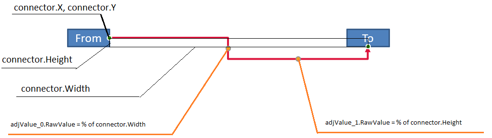

## **Visão geral**

Um conector é uma linha que pode permanecer ligada a duas formas quando qualquer forma se move. Suas extremidades se conectam a pontos de conexão, representados por pontos verdes no PowerPoint. Alguns conectores dobrados e curvos também expõem pontos de ajuste, representados por pontos laranja, que controlam a posição de segmentos individuais do conector.

Aspose.Slides representa conectores através da interface [IConnector](https://reference.aspose.com/slides/pt/python-net/aspose.slides/iconnector/). Você pode criá‑los, ligar suas extremidades a formas, escolher pontos de conexão, redirecioná‑los e modificar a geometria dos conectores que têm pontos de ajuste.

## **Tipos de Conector**

A enumeração [ShapeType](https://reference.aspose.com/slides/pt/python-net/aspose.slides/shapetype/) inclui predefinições de conectores retos, dobrados e curvos. A tabela a seguir mostra as geometrias de conectores disponíveis e o número de pontos de ajuste definidos por cada predefinição.

| Conector | Imagem | Número de pontos de ajuste |
|---|---|---|
| `ShapeType.LINE` |  | 0 |
| `ShapeType.STRAIGHT_CONNECTOR1` |  | 0 |
| `ShapeType.BENT_CONNECTOR2` |  | 0 |
| `ShapeType.BENT_CONNECTOR3` |  | 1 |
| `ShapeType.BENT_CONNECTOR4` |  | 2 |
| `ShapeType.BENT_CONNECTOR5` |  | 3 |
| `ShapeType.CURVED_CONNECTOR2` |  | 0 |
| `ShapeType.CURVED_CONNECTOR3` |  | 1 |
| `ShapeType.CURVED_CONNECTOR4` |  | 2 |
| `ShapeType.CURVED_CONNECTOR5` |  | 3 |

O número e o significado dos pontos de ajuste fazem parte da predefinição do conector selecionado. Não presuma que dois tipos diferentes de conector exponham a mesma disposição da coleção.

## **Conectar duas formas**

Use [IShapeCollection.add_connector](https://reference.aspose.com/slides/pt/python-net/aspose.slides/ishapecollection/add_connector/) para adicionar um conector e atribua suas propriedades [start_shape_connected_to](https://reference.aspose.com/slides/pt/python-net/aspose.slides/iconnector/start_shape_connected_to/) e [end_shape_connected_to](https://reference.aspose.com/slides/pt/python-net/aspose.slides/iconnector/end_shape_connected_to/). Após ambas as extremidades estarem ligadas, [IConnector.reroute](https://reference.aspose.com/slides/pt/python-net/aspose.slides/iconnector/reroute/) seleciona uma rota curta entre as formas.

O exemplo a seguir conecta uma elipse e um retângulo com um conector dobrado:

```python
import aspose.slides as slides

with slides.Presentation() as presentation:
    slide = presentation.slides[0]

    ellipse = slide.shapes.add_auto_shape(slides.ShapeType.ELLIPSE, 40, 80, 120, 80)
    rectangle = slide.shapes.add_auto_shape(slides.ShapeType.RECTANGLE, 320, 240, 140, 80)
    connector = slide.shapes.add_connector(slides.ShapeType.BENT_CONNECTOR2, 0, 0, 10, 10)

    connector.start_shape_connected_to = ellipse
    connector.end_shape_connected_to = rectangle
    connector.reroute()

    presentation.save("connected-shapes.pptx", slides.export.SaveFormat.PPTX)
```

{}
Chamar `reroute` pode alterar os valores de [start_shape_connection_site_index](https://reference.aspose.com/slides/pt/python-net/aspose.slides/iconnector/start_shape_connection_site_index/) e [end_shape_connection_site_index](https://reference.aspose.com/slides/pt/python-net/aspose.slides/iconnector/end_shape_connection_site_index/). Atribua pontos de conexão específicos após o redirecionamento se esses pontos precisarem permanecer fixos.
{}

## **Escolher um ponto de conexão**

Cada forma conectável informa seu número de pontos através de [connection_site_count](https://reference.aspose.com/slides/pt/python-net/aspose.slides/igeometryshape/connection_site_count/). Valide um índice de ponto baseado em zero antes de atribuí‑lo a uma extremidade do conector; a contagem de pontos varia conforme a geometria da forma.

Este exemplo liga o conector a um ponto específico na elipse quando esse ponto existe:

```python
import aspose.slides as slides

with slides.Presentation() as presentation:
    slide = presentation.slides[0]

    ellipse = slide.shapes.add_auto_shape(slides.ShapeType.ELLIPSE, 40, 80, 120, 80)
    rectangle = slide.shapes.add_auto_shape(slides.ShapeType.RECTANGLE, 320, 240, 140, 80)
    connector = slide.shapes.add_connector(slides.ShapeType.BENT_CONNECTOR3, 0, 0, 10, 10)

    connector.start_shape_connected_to = ellipse
    connector.end_shape_connected_to = rectangle

    preferred_site_index = 2
    if preferred_site_index < ellipse.connection_site_count:
        connector.start_shape_connection_site_index = preferred_site_index
    else:
        print(f"The ellipse has only {ellipse.connection_site_count} connection sites.")

    presentation.save("specific-connection-site.pptx", slides.export.SaveFormat.PPTX)
```

## **Ajustar um ponto do conector**

Conectores com pontos de ajuste os expõem através de [IGeometryShape.adjustments](https://reference.aspose.com/slides/pt/python-net/aspose.slides/igeometryshape/adjustments/). Inspecione cada [IAdjustValue](https://reference.aspose.com/slides/pt/python-net/aspose.slides/iadjustvalue/) e verifique seu [type](https://reference.aspose.com/slides/pt/python-net/aspose.slides/iadjustvalue/type/) antes de mudar seu [raw_value](https://reference.aspose.com/slides/pt/python-net/aspose.slides/iadjustvalue/raw_value/). Para manipulação geral de formas, consulte [Shape Manipulation](/slides/pt/python-net/shape-manipulations/).

O número, a ordem, o significado e o intervalo de valores válidos dos ajustes de conector dependem da predefinição do conector. A propriedade `type` é somente leitura, enquanto o valor do ajuste é gravável. A propriedade somente leitura [name](https://reference.aspose.com/slides/pt/python-net/aspose.slides/iadjustvalue/name/) fornece identificação adicional quando um conector contém mais de um ajuste do mesmo tipo semântico.

### **Roteiro ao redor de um obstáculo**

No layout a seguir, um conector `ShapeType.BENT_CONNECTOR5` entre duas formas passa por uma terceira forma:


Este código cria o conector obstruído:

```python
import aspose.slides as slides
import aspose.pydrawing as draw

with slides.Presentation() as presentation:
    slide = presentation.slides[0]

    slide.shapes.add_auto_shape(slides.ShapeType.RECTANGLE, 300, 150, 150, 75)
    source_shape = slide.shapes.add_auto_shape(slides.ShapeType.RECTANGLE, 500, 400, 100, 50)
    target_shape = slide.shapes.add_auto_shape(slides.ShapeType.RECTANGLE, 100, 100, 70, 30)
    connector = slide.shapes.add_connector(slides.ShapeType.BENT_CONNECTOR5, 20, 20, 400, 300)

    connector.line_format.end_arrowhead_style = slides.LineArrowheadStyle.TRIANGLE
    connector.line_format.fill_format.fill_type = slides.FillType.SOLID
    connector.line_format.fill_format.solid_fill_color.color = draw.Color.black
    connector.start_shape_connected_to = source_shape
    connector.end_shape_connected_to = target_shape
    connector.start_shape_connection_site_index = 2

    presentation.save("connector-obstruction.pptx", slides.export.SaveFormat.PPTX)
```

Mover a curva vertical altera a rota para que o conector contorne o obstáculo:


Em vez de presumir que o índice da coleção `1` represente sempre a curva vertical, este exemplo procura `ShapeAdjustmentType.CONNECTOR_BEND_POSITION_Y` e o altera somente quando o tipo semântico esperado está presente:

```python
import aspose.slides as slides
import aspose.pydrawing as draw

with slides.Presentation() as presentation:
    slide = presentation.slides[0]

    slide.shapes.add_auto_shape(slides.ShapeType.RECTANGLE, 300, 150, 150, 75)
    source_shape = slide.shapes.add_auto_shape(slides.ShapeType.RECTANGLE, 500, 400, 100, 50)
    target_shape = slide.shapes.add_auto_shape(slides.ShapeType.RECTANGLE, 100, 100, 70, 30)
    connector = slide.shapes.add_connector(slides.ShapeType.BENT_CONNECTOR5, 20, 20, 400, 300)

    connector.line_format.end_arrowhead_style = slides.LineArrowheadStyle.TRIANGLE
    connector.line_format.fill_format.fill_type = slides.FillType.SOLID
    connector.line_format.fill_format.solid_fill_color.color = draw.Color.black
    connector.start_shape_connected_to = source_shape
    connector.end_shape_connected_to = target_shape
    connector.start_shape_connection_site_index = 2

    vertical_bend = None
    for adjustment_index in range(len(connector.adjustments)):
        adjustment = connector.adjustments[adjustment_index]
        print(f"{adjustment.name}: {adjustment.type}, raw value = {adjustment.raw_value}")
        if adjustment.type == slides.ShapeAdjustmentType.CONNECTOR_BEND_POSITION_Y:
            vertical_bend = adjustment
            break

    if vertical_bend is None:
        print("The connector does not expose a vertical bend adjustment.")
    else:
        vertical_bend.raw_value = 60000
        presentation.save("connector-obstruction-fixed.pptx", slides.export.SaveFormat.PPTX)
```

Um `ShapeType.BENT_CONNECTOR5` possui dois ajustes `ShapeAdjustmentType.CONNECTOR_BEND_POSITION_X` e um ajuste `ShapeAdjustmentType.CONNECTOR_BEND_POSITION_Y`. Se o tipo que você precisa ocorrer mais de uma vez, inspecione `name` e a geometria conhecida daquela predefinição antes de selecionar um. Se um ajuste relatar [ShapeAdjustmentType.CUSTOM](https://reference.aspose.com/slides/pt/python-net/aspose.slides/shapeadjustmenttype/), trate seu significado e intervalo como específicos da predefinição e não o altere até que esse contrato seja conhecido.

## **Relacionar valores de ajuste à geometria do conector**

Para conectores dobrados, os valores de ajuste podem ser usados para estimar as posições de segmentos individuais. Esses cálculos são específicos da predefinição do conector:

- `ShapeType.BENT_CONNECTOR4` normalmente expõe um ajuste `ShapeAdjustmentType.CONNECTOR_BEND_POSITION_X` e um ajuste `ShapeAdjustmentType.CONNECTOR_BEND_POSITION_Y`.
- Para essas posições de curva, `raw_value / 100000` produz a fração da largura ou altura da moldura do conector usada nos exemplos abaixo.
- A moldura do conector pode ser rotacionada ou espelhada, portanto as coordenadas da moldura devem ser transformadas antes de serem comparadas com as coordenadas do slide.

Os exemplos a seguir utilizam `type` para identificar primeiro os ajustes. Eles não tratam índices de coleção como identificadores portáteis.

### **Conector não rotacionado**

O layout inicial contém duas formas de texto conectadas por um `ShapeType.BENT_CONNECTOR4`:



Este exemplo inspeciona o conector e obtém seus ajustes de curva horizontal e vertical:

```python
import aspose.slides as slides
import aspose.pydrawing as draw

with slides.Presentation() as presentation:
    slide = presentation.slides[0]

    source_shape = slide.shapes.add_auto_shape(slides.ShapeType.RECTANGLE, 100, 100, 60, 25)
    source_shape.text_frame.text = "From"
    target_shape = slide.shapes.add_auto_shape(slides.ShapeType.RECTANGLE, 500, 100, 60, 25)
    target_shape.text_frame.text = "To"
    connector = slide.shapes.add_connector(slides.ShapeType.BENT_CONNECTOR4, 20, 20, 400, 300)

    connector.line_format.end_arrowhead_style = slides.LineArrowheadStyle.TRIANGLE
    connector.line_format.fill_format.fill_type = slides.FillType.SOLID
    connector.line_format.fill_format.solid_fill_color.color = draw.Color.crimson
    connector.line_format.width = 3
    connector.start_shape_connected_to = source_shape
    connector.start_shape_connection_site_index = 3
    connector.end_shape_connected_to = target_shape
    connector.end_shape_connection_site_index = 2

    for adjustment_index in range(len(connector.adjustments)):
        adjustment = connector.adjustments[adjustment_index]
        print(f"{adjustment.name}: {adjustment.type}, raw value = {adjustment.raw_value}")
```

Para mudar ambas as curvas, localize cada tipo esperado e modifique os valores somente depois que ambos forem encontrados:

```python
import aspose.slides as slides

with slides.Presentation() as presentation:
    slide = presentation.slides[0]

    source_shape = slide.shapes.add_auto_shape(slides.ShapeType.RECTANGLE, 100, 100, 60, 25)
    target_shape = slide.shapes.add_auto_shape(slides.ShapeType.RECTANGLE, 500, 100, 60, 25)
    connector = slide.shapes.add_connector(slides.ShapeType.BENT_CONNECTOR4, 20, 20, 400, 300)
    connector.start_shape_connected_to = source_shape
    connector.start_shape_connection_site_index = 3
    connector.end_shape_connected_to = target_shape
    connector.end_shape_connection_site_index = 2

    horizontal_bend = None
    vertical_bend = None
    for adjustment_index in range(len(connector.adjustments)):
        adjustment = connector.adjustments[adjustment_index]
        if adjustment.type == slides.ShapeAdjustmentType.CONNECTOR_BEND_POSITION_X:
            horizontal_bend = adjustment
        elif adjustment.type == slides.ShapeAdjustmentType.CONNECTOR_BEND_POSITION_Y:
            vertical_bend = adjustment

    if horizontal_bend is None or vertical_bend is None:
        print("The connector does not expose the expected bend adjustments.")
    else:
        horizontal_bend.raw_value += 20000
        vertical_bend.raw_value += 200000
        presentation.save("connector-adjusted.pptx", slides.export.SaveFormat.PPTX)
```

O resultado é um conector cujos segmentos horizontal e vertical foram deslocados:


Depois que os tipos semânticos são conhecidos, seus valores podem ser convertidos em coordenadas da moldura do conector. Este exemplo desenha um retângulo fino sobre o segmento vertical controlado pelos dois ajustes de curva:

```python
import aspose.slides as slides

with slides.Presentation() as presentation:
    slide = presentation.slides[0]

    source_shape = slide.shapes.add_auto_shape(slides.ShapeType.RECTANGLE, 100, 100, 60, 25)
    target_shape = slide.shapes.add_auto_shape(slides.ShapeType.RECTANGLE, 500, 100, 60, 25)
    connector = slide.shapes.add_connector(slides.ShapeType.BENT_CONNECTOR4, 20, 20, 400, 300)
    connector.start_shape_connected_to = source_shape
    connector.start_shape_connection_site_index = 3
    connector.end_shape_connected_to = target_shape
    connector.end_shape_connection_site_index = 2

    horizontal_bend = None
    vertical_bend = None
    for adjustment_index in range(len(connector.adjustments)):
        adjustment = connector.adjustments[adjustment_index]
        if adjustment.type == slides.ShapeAdjustmentType.CONNECTOR_BEND_POSITION_X:
            horizontal_bend = adjustment
        elif adjustment.type == slides.ShapeAdjustmentType.CONNECTOR_BEND_POSITION_Y:
            vertical_bend = adjustment

    if horizontal_bend is None or vertical_bend is None:
        print("The connector does not expose the expected bend adjustments.")
    else:
        x = connector.x + connector.width * horizontal_bend.raw_value / 100000
        y = connector.y
        height = connector.height * vertical_bend.raw_value / 100000
        slide.shapes.add_auto_shape(slides.ShapeType.RECTANGLE, x, y, 1, height)
        presentation.save("connector-segment-guide.pptx", slides.export.SaveFormat.PPTX)
```

A forma guia marca o segmento calculado:


### **Conector rotacionado ou espelhado**

Quando a mesma geometria de conector está orientada verticalmente, seus valores de [frame](https://reference.aspose.com/slides/pt/python-net/aspose.slides/iconnector/frame/), [flip_h](https://reference.aspose.com/slides/pt/python-net/aspose.slides/ishapeframe/flip_h/) e [flip_v](https://reference.aspose.com/slides/pt/python-net/aspose.slides/ishapeframe/flip_v/) influenciam a conversão de coordenadas da moldura do conector para coordenadas do slide.

Este exemplo cria e ajusta o conector orientado verticalmente:

```python
import aspose.slides as slides
import aspose.pydrawing as draw

with slides.Presentation() as presentation:
    slide = presentation.slides[0]

    source_shape = slide.shapes.add_auto_shape(slides.ShapeType.RECTANGLE, 100, 100, 60, 25)
    source_shape.text_frame.text = "From"
    target_shape = slide.shapes.add_auto_shape(slides.ShapeType.RECTANGLE, 100, 400, 60, 25)
    target_shape.text_frame.text = "To 1"
    connector = slide.shapes.add_connector(slides.ShapeType.BENT_CONNECTOR4, 20, 20, 400, 300)

    connector.line_format.end_arrowhead_style = slides.LineArrowheadStyle.TRIANGLE
    connector.line_format.fill_format.fill_type = slides.FillType.SOLID
    connector.line_format.fill_format.solid_fill_color.color = draw.Color.medium_aquamarine
    connector.line_format.width = 3
    connector.start_shape_connected_to = source_shape
    connector.start_shape_connection_site_index = 2
    connector.end_shape_connected_to = target_shape
    connector.end_shape_connection_site_index = 3

    for adjustment_index in range(len(connector.adjustments)):
        adjustment = connector.adjustments[adjustment_index]
        if adjustment.type == slides.ShapeAdjustmentType.CONNECTOR_BEND_POSITION_X:
            adjustment.raw_value += 20000
        elif adjustment.type == slides.ShapeAdjustmentType.CONNECTOR_BEND_POSITION_Y:
            adjustment.raw_value += 200000

    presentation.save("vertical-connector-adjusted.pptx", slides.export.SaveFormat.PPTX)
```

O conector ajustado aparece verticalmente entre as formas:


Para um ângulo de rotação arbitrário `alpha`, rotacione um ponto da moldura do conector `(x, y)` ao redor do centro da moldura `(x0, y0)`:

`X = (x - x0) * cos(alpha) - (y - y0) * sin(alpha) + x0`

`Y = (x - x0) * sin(alpha) + (y - y0) * cos(alpha) + y0`

O código a seguir trata da orientação de 90 graus usada neste exemplo e desenha um guia vermelho sobre o segmento correspondente do conector:

```python
import aspose.slides as slides
import aspose.pydrawing as draw

with slides.Presentation() as presentation:
    slide = presentation.slides[0]

    source_shape = slide.shapes.add_auto_shape(slides.ShapeType.RECTANGLE, 100, 100, 60, 25)
    target_shape = slide.shapes.add_auto_shape(slides.ShapeType.RECTANGLE, 100, 400, 60, 25)
    connector = slide.shapes.add_connector(slides.ShapeType.BENT_CONNECTOR4, 20, 20, 400, 300)
    connector.start_shape_connected_to = source_shape
    connector.start_shape_connection_site_index = 2
    connector.end_shape_connected_to = target_shape
    connector.end_shape_connection_site_index = 3

    horizontal_bend = None
    vertical_bend = None
    for adjustment_index in range(len(connector.adjustments)):
        adjustment = connector.adjustments[adjustment_index]
        if adjustment.type == slides.ShapeAdjustmentType.CONNECTOR_BEND_POSITION_X:
            horizontal_bend = adjustment
        elif adjustment.type == slides.ShapeAdjustmentType.CONNECTOR_BEND_POSITION_Y:
            vertical_bend = adjustment

    if horizontal_bend is None or vertical_bend is None:
        print("The connector does not expose the expected bend adjustments.")
    else:
        horizontal_bend.raw_value += 20000
        vertical_bend.raw_value += 200000

        x = connector.x
        y = connector.y
        if connector.frame.flip_h == slides.NullableBool.TRUE:
            x += connector.width
        if connector.frame.flip_v == slides.NullableBool.TRUE:
            y += connector.height

        x += connector.width * horizontal_bend.raw_value / 100000
        rotated_x = connector.frame.center_x - y + connector.frame.center_y
        rotated_y = x - connector.frame.center_x + connector.frame.center_y
        segment_width = connector.height * vertical_bend.raw_value / 100000
        guide = slide.shapes.add_auto_shape(slides.ShapeType.RECTANGLE, rotated_x, rotated_y, segment_width, 1)
        guide.line_format.fill_format.fill_type = slides.FillType.SOLID
        guide.line_format.fill_format.solid_fill_color.color = draw.Color.red

        presentation.save("rotated-connector-segment-guide.pptx", slides.export.SaveFormat.PPTX)
```

O guia vermelho marca o segmento calculado após a transformação das coordenadas:


Essas fórmulas descrevem as predefinições usadas nos exemplos, não um modelo universal de conector. Valide os tipos de ajuste, a orientação da moldura e os intervalos de valores antes de aplicar o mesmo cálculo a uma predefinição diferente.

## **Encontrar o ângulo de direção de um conector**

A direção de um conector reto pode ser calculada a partir de sua largura e altura, com inversões horizontais e verticais aplicadas. O exemplo a seguir relata o ângulo horário a partir do eixo horizontal positivo nas coordenadas do slide:

```python
import math
import aspose.slides as slides

with slides.Presentation() as presentation:
    slide = presentation.slides[0]
    connector = slide.shapes.add_connector(slides.ShapeType.STRAIGHT_CONNECTOR1, 100, 100, 200, 100)

    flip_h = connector.frame.flip_h == slides.NullableBool.TRUE
    flip_v = connector.frame.flip_v == slides.NullableBool.TRUE
    delta_x = connector.width * (-1 if flip_h else 1)
    delta_y = connector.height * (-1 if flip_v else 1)
    angle = math.atan2(delta_y, delta_x) * 180.0 / math.pi

    if angle < 0:
        angle += 360

    print(f"Connector direction: {angle:.2f} degrees")
```

## **Perguntas frequentes**

**Como saber se um conector pode ser ligado a uma forma?**

Verifique o [connection_site_count](https://reference.aspose.com/slides/pt/python-net/aspose.slides/igeometryshape/connection_site_count/) da forma. Uma contagem positiva indica que a forma expõe pontos de conexão. Valide o índice do ponto selecionado antes de atribuí‑lo a qualquer extremidade do conector.

**Posso identificar um ajuste de conector pelo seu índice de coleção?**

Um índice só tem significado para uma predefinição de conector conhecida e sua disposição de coleção. Verifique [IAdjustValue.type](https://reference.aspose.com/slides/pt/python-net/aspose.slides/iadjustvalue/type/) antes de modificar um valor e use [IAdjustValue.name](https://reference.aspose.com/slides/pt/python-net/aspose.slides/iadjustvalue/name/) como informação adicional quando o mesmo tipo semântico aparecer mais de uma vez.

**O que acontece quando uma forma conectada é excluída?**

A extremidade correspondente do conector se desconecta. O conector permanece no slide e pode ser excluído, posicionado como uma linha livre ou ligado a outra forma.

**As ligações de conector são preservadas quando um slide é copiado?**

As ligações geralmente são preservadas quando as formas conectadas são copiadas junto com o slide. Se um conector for copiado sem uma de suas formas‑alvo, a extremidade afetada deverá ser ligada novamente.