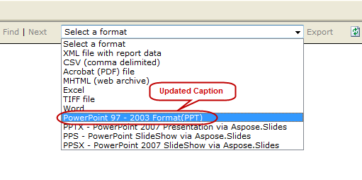

{} 
Este artigo mostra como personalizar as legendas das opções de renderização do Aspose.Slides para Reporting Services. 
{} 
## **Exemplo**
Ao instalar o Aspose.Slides para Reporting Services, 4 opções de exportação adicionais são adicionadas ao menu suspenso das opções de exportação:


## **Como modificar o texto das legendas**
As legendas padrão dessas extensões podem ser alteradas substituindo os nomes padrão. Estas etapas mostram como mudar a legenda de “ **PPT – PowerPoint** **Presentation via** **Aspose.Slides** ” para “ **PowerPoint 97 – 2003 format(PPT)** ”. 

**Etapa 1:** Localize o arquivo **rsreportserver.config** que geralmente está neste diretório: 

**Unidade raiz do SO\Program Files\Microsoft SQL Server\MSRS10.MSSQLSERVER\Reporting Services\ReportServer** 

**Etapa** **2:** Encontre estas linhas no arquivo rsreportserver.config: 

``` xml

 <Extension Name="ASPPT" Type="Aspose.Slides.ReportingServices.PptRenderer,Aspose.Slides.ReportingServices"/>


```

**Etapa** **3:** Substitua o parâmetro da extensão por isto: 

**<Extension Name="ASPPT" Type="Aspose.Slides.ReportingServices.PptRenderer,Aspose.Slides.ReportingServices">**

``` xml

         <OverrideNames>

          <Name Language="en-US">PowerPoint 97 - 2003 Format(PPT)</Name>

        </OverrideNames>

</Extension>


```

As opções de exportação agora aparecerão assim: 

