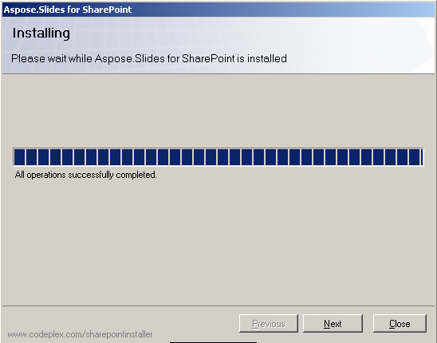

{} 

Aspose.Slides for SharePoint é baixado como o arquivo Aspose.Slides.SharePoint.zip. O arquivo contém: 

- **Aspose.Slides.SharePoint.wsp**: arquivo de solução SharePoint. Aspose.Slides for SharePoint é empacotado como uma solução SharePoint para facilitar a ativação e desativação em toda a fazenda de servidores.
- **Aspose_LicenseAgreement.rtf**: O contrato de licença do usuário final.
- **Setup.exe**: O programa de instalação.
- **Setup.exe.config**: O arquivo de configuração da instalação.

{} 
## **Processo de Instalação**
Antes de executar a instalação, o programa de instalação verifica que:

- O WSS 3.0 ou MOSS 2007 está instalado.
- O usuário tem permissão para instalar soluções SharePoint.
- O banco de dados SharePoint está online.
- O serviço de Administração WSS está iniciado.
- O serviço de Timer WSS está iniciado.

Os serviços de Administração e Timer do WSS são necessários porque algumas ações de instalação dependem de um trabalho de timer para propagação em todos os servidores da fazenda. 
### **Executando a Instalação**
Para instalar o Aspose.Slides for SharePoint: 

1. Descompacte o arquivo zip Aspose.Slides.SharePoint na unidade local do servidor MOSS 7.0 ou WSS 3.0.
2. Execute setup.exe e siga as instruções na tela.
   O programa de instalação realiza as seguintes ações: 
   1. Verifica os pré-requisitos de instalação. A instalação não continuará se alguma verificação falhar. 

      **Executando uma verificação do sistema** 

3. Exibe o Contrato de Licença do Usuário Final. Você deve aceitar o contrato para prosseguir. 

   **O EULA** 

4. Exibe a seleção de destino de implantação. Seleciona as aplicações web e coleções de sites nas quais o recurso deve ser ativado. 

   **Selecionando destinos de implantação** 

5. Implanta o recurso na fazenda de servidores. 

   **A barra de progresso da instalação** 

6. Ativa o Aspose.Slides nas coleções de sites selecionadas e configura suas aplicações web pai.
7. Exibe uma lista de aplicações web e coleções de sites nas quais o recurso foi implantado e ativado. 

   **Instalação bem-sucedida** 

