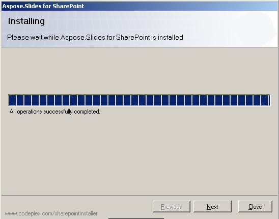

## **Conteúdo do Pacote**

Aspose.Slides for SharePoint é baixado da [página de download](https://releases.aspose.com/slides/pt/sharepoint/) como um arquivo ZIP. O arquivo contém um pacote de solução SharePoint (WSP) e um programa de instalação para cada versão suportada do SharePoint:

| Versão do SharePoint | Programa de instalação | Pacote de solução |
| :- | :- | :- |
| SharePoint 2007 | Setup2007.exe | Aspose.Slides.SharePoint2007.wsp |
| SharePoint 2010 | Setup2010.exe | Aspose.Slides.SharePoint2010.wsp |
| SharePoint Server 2013 | Setup2013.exe | Aspose.Slides.SharePoint2013.wsp |
| SharePoint Server 2016 | Setup2016.exe | Aspose.Slides.SharePoint2016.wsp |
| SharePoint Server 2019 | Setup2019.exe | Aspose.Slides.SharePoint2019.wsp |

Cada programa de instalação possui um arquivo de configuração ao lado (por exemplo, *Setup2019.exe.config*) que indica o pacote de solução que ele instala. A pasta *License* contém um link para o contrato de licença de usuário final e para os avisos de licenças de terceiros.

Aspose.Slides for SharePoint é empacotado como uma solução SharePoint, que o SharePoint implanta em toda a fazenda de servidores. Sua funcionalidade é então ativada ou desativada por coleção de sites.

## **Processo de Instalação**

Antes da instalação, o programa de instalação executa uma verificação do sistema. Ele verifica que:

- O SharePoint está instalado no servidor.
- O usuário atual tem permissão para instalar e implantar soluções SharePoint.
- O serviço de Administração do SharePoint está em execução.
- O serviço de Timer do SharePoint está em execução.
- O pacote de solução nomeado no arquivo de configuração está presente.

Os serviços de Administração e Timer são necessários porque algumas ações de instalação são executadas como trabalhos de timer que propagam a solução para todos os servidores da fazenda.

### **Executando a Instalação**

Para instalar Aspose.Slides for SharePoint:

1. Descompacte o arquivo ZIP em uma unidade local em um servidor da fazenda SharePoint.
2. Execute o programa de instalação que corresponde à sua versão do SharePoint (veja a tabela acima) e siga as instruções na tela. O programa de instalação:
   1. Executa a verificação do sistema. A instalação não continua se alguma verificação falhar.

      **Executando uma verificação do sistema**

      

   2. Exibe o contrato de licença de usuário final. Você deve aceitá‑lo para continuar.

      **O contrato de licença**

      

   3. Exibe os destinos de implantação. Selecione as aplicações web e coleções de sites para ativar a funcionalidade.

      **Selecionando destinos de implantação**

      

   4. Implanta a solução na fazenda.

      **Progresso da instalação**

      

   5. Ativa Aspose.Slides for SharePoint nas coleções de sites selecionadas.
   6. Lista as aplicações web e coleções de sites onde a solução foi implantada e ativada.

      **Instalação bem‑sucedida**

      

{}
As capturas de tela foram feitas no SharePoint 2007. Os programas de instalação para versões posteriores apresentam as mesmas telas.
{}

Se a mesma versão do Aspose.Slides for SharePoint já estiver instalada, o programa de instalação oferece repará‑la ou removê‑la. Se outra versão estiver instalada, ele oferece atualizar ou remover.

Após a instalação, um item **Convert via Aspose.Slides** aparece no menu de arquivos nas bibliotecas de documentos das coleções de sites selecionadas (no SharePoint 2007, **Convert with Aspose.Slides**). Para converter a primeira apresentação, consulte [Converting Microsoft PowerPoint Documents into Other Formats](/slides/pt/sharepoint/converting-microsoft-powerpoint-documents-into-other-formats/). O que a solução adiciona à fazenda está descrito em [Deployment and Activation](/slides/pt/sharepoint/deployment-and-activation/).

## **FAQ**

**Qual programa de instalação devo executar?**

Aquele cujo nome corresponde à sua versão do SharePoint. Por exemplo, execute *Setup2016.exe* em uma fazenda SharePoint Server 2016. Cada programa de instalação instala apenas seu próprio pacote de solução.

**Preciso de um download separado para a versão licenciada?**

Não. O mesmo pacote funciona em modo de avaliação até que você instale a solução de licença; veja [Installing Aspose.Slides for SharePoint License](/slides/pt/sharepoint/installing-aspose-slides-for-sharepoint-license/).

**Como removo o produto?**

Execute novamente o mesmo programa de instalação e selecione **Remove**; veja [Uninstalling Aspose.Slides for SharePoint](/slides/pt/sharepoint/uninstalling-aspose-slides-for-sharepoint/).