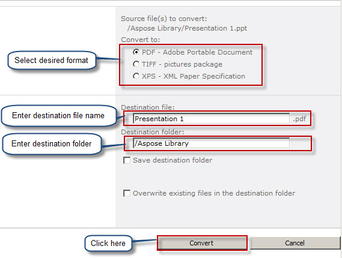

{}

Quando o Aspose.Slides for SharePoint está instalado no servidor SharePoint e ativado para uma coleção de sites, ele adiciona o item **Convert via Aspose.Slides** ao menu de documentos nas bibliotecas de documentos, conforme mostrado abaixo. No SharePoint 2007, o item se chama **Convert with Aspose.Slides**.

**Instalar o Aspose.Slides para SharePoint adiciona o item Convert via Aspose.Slides aos menus de documentos**

{}

## **Convertendo uma Apresentação**

1. Selecione uma apresentação do Microsoft PowerPoint em uma biblioteca de documentos.  
2. Abra seu menu e clique em **Convert via Aspose.Slides**.

   **O menu do arquivo Presentation 2, mostrando o item Convert via Aspose.Slides**

   

3. Selecione o formato de saída em **Convert to**. Se desejar, altere o nome do arquivo de saída e a pasta de destino.  
4. Clique em **Convert** para converter o arquivo.

   **A página de conversão permite selecionar o formato de saída, o nome do arquivo e o destino**

   

5. Quando a conversão for concluída, uma mensagem de sucesso será exibida.

   **A conversão foi bem-sucedida**

   

6. Clique em **Source Library** (para ir para a pasta de origem) ou **Destination Library** (para ir para a pasta onde o arquivo foi salvo).

   O documento convertido aparece na biblioteca de documentos.

   **O documento convertido exibido na biblioteca onde foi salvo**

   

{}

As capturas de tela foram tiradas com uma versão anterior, que oferecia apenas os formatos PDF, TIFF e XPS. A página de conversão atual oferece mais formatos de saída; veja [Multiple Format Support](/slides/pt/sharepoint/multiple-format-support/).

{}

No SharePoint 2010 e posteriores, você também pode selecionar uma ou mais apresentações na biblioteca e clicar em **Convert Slides** na guia de faixa **Aspose Tools**. Isso abre a mesma página de conversão.