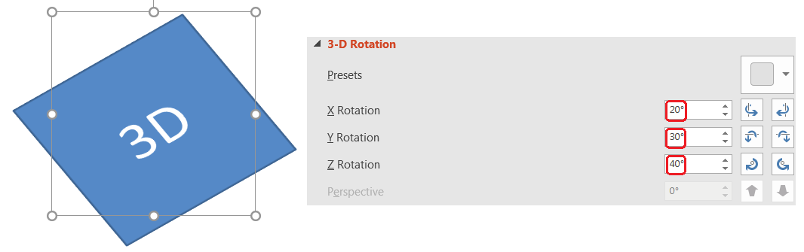
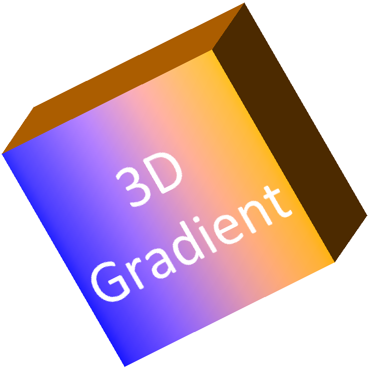
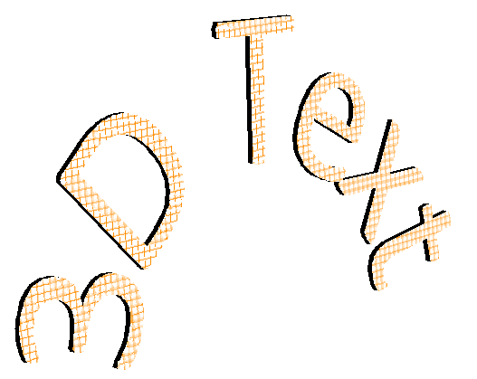

## Overview
How do you usually create a 3D PowerPoint presentation?
Microsoft PowerPoint enables to create 3D presentations in terms that we may add 3D models there, apply 3D effects on shapes, 
create 3D text, upload 3D graphics into presentation, create PowerPoint 3D animations. 

Creating 3D effects makes a big impact into improving your presentation to a 3D presentation, and may be the easiest implementation of 3D presentation. 
Since Aspose.Slides 20.9 version, a new **cross-platform 3D engine** has been added. The new 3D engine enables 
to export and rasterize shapes and text with 3D effects. In the previous versions, 
Slides shapes with 3D effects applied, had been rendered flat. But, now it’s possible to 
render shapes with a **full-fledged 3D**.
Moreover, now it’s possible to create shapes with 3D effects via Slides public API.

In Aspose.Slides API, to make 
a shape become a PowerPoint 3D shape use [IShape.ThreeDFormat](https://docs.aspose.com/slides/python-net/api-reference/aspose.slides/ishape/) property, 
which inherits the features of [IThreeDFormat](https://docs.aspose.com/slides/python-net/api-reference/aspose.slides/ithreedformat) interface:
- [BevelBottom](https://docs.aspose.com/slides/python-net/api-reference/aspose.slides/ithreedformat/) 
and [BevelTop](https://docs.aspose.com/slides/python-net/api-reference/aspose.slides/ithreedformat/): set bevel to the shape, define bevel type (e.g. Angle, Circle, SoftRound), define height and width of bevel.
- [camera](https://docs.aspose.com/slides/python-net/api-reference/aspose.slides/ithreedformat/): is used to imitate camera movements around the object. In other words, by setting came rotation, zoom and other properties - you may entertain with your 
shapes as with the 3D model in PowerPoint.
- [ContourColor](https://docs.aspose.com/slides/python-net/api-reference/aspose.slides/ithreedformat/) 
and [ContourWidth](https://docs.aspose.com/slides/python-net/api-reference/aspose.slides/ithreedformat/): set contour properties to make the shape look like 3D PowerPoint shape.
- [depth](https://docs.aspose.com/slides/python-net/api-reference/aspose.slides/ithreedformat/), 
[extrusion_color](https://docs.aspose.com/slides/python-net/api-reference/aspose.slides/ithreedformat/) 
and [extrusion_height](https://docs.aspose.com/slides/python-net/api-reference/aspose.slides/ithreedformat/): are used to make the shape three-dimension, which means to convert a 2D shape into a 3D shape, 
by setting its depth or extrusing it.
- [light_rig](https://docs.aspose.com/slides/python-net/api-reference/aspose.slides/ithreedformat/): can create a light effect on a 3D shape. The logic of this property is closed to Camera, you can set the rotation of the light 
in relation to the #D shape and choose the light type.
- [material](https://docs.aspose.com/slides/python-net/api-reference/aspose.slides/ithreedformat/): setting the type of 3D shape material can bring more alive effect into it. The property provides a set of predefined materials, like: 
Metal, Plastic, Powder, Matte, etc.  

All 3D features can be applied to both shapes and text. Let us see how to access the properties mentioned above and then look on them in details step by step:
```py 
import aspose.pydrawing as draw
import aspose.slides as slides

with slides.Presentation() as pres:
    shape = pres.slides[0].shapes.add_auto_shape(slides.ShapeType.RECTANGLE, 200, 150, 200, 200)
    shape.text_frame.text = "3D"
    shape.text_frame.paragraphs[0].paragraph_format.default_portion_format.font_height = 64
    
    shape.three_d_format.camera.camera_type = slides.CameraPresetType.ORTHOGRAPHIC_FRONT
    shape.three_d_format.camera.set_rotation(20, 30, 40)
    shape.three_d_format.light_rig.light_type = slides.light_rigPresetType.FLAT
    shape.three_d_format.light_rig.direction = slides.LightingDirection.TOP
    shape.three_d_format.material = slides.MaterialPresetType.FLAT 
    shape.three_d_format.extrusion_height = 100
    shape.three_d_format.extrusion_color.color = draw.Color.blue
    
    pres.slides[0].get_thumbnail(2, 2).save("sample_3d.png")
    pres.save("sandbox_3d.pptx", slides.export.SaveFormat.PPTX)
```

The rendered thumbnail looks like that:


## 3D Rotation
It's possible to rotate PowerPoint 3D shapes in 3D plane, which brings more interactivity. To rotate 3D shape in PowerPoint, you usually use the following menu:



In Aspose.Slides API 3D shape rotation can be managed using [camera](https://docs.aspose.com/slides/python-net/api-reference/aspose.slides/ithreedformat/) property:

```py
shape = pres.slides[0].shapes.add_auto_shape(slides.ShapeType.RECTANGLE, 200, 150, 200, 200)
shape.three_d_format.camera.set_rotation(20, 30, 40)
# ... set other 3D scene parameters
pres.slides[0].get_thumbnail(2, 2).save("sample_3d.png")
```

## 3D Depth and Extrusion
To bring the third dimension to your shape and make it a 3D shape, use [IThreeDFormat.ExtrusionHeight](https://docs.aspose.com/slides/python-net/api-reference/aspose.slides/ithreedformat/) 
and [extrusion_color.color](https://docs.aspose.com/slides/python-net/api-reference/aspose.slides/ithreedformat/) properties:

```py
shape = pres.slides[0].shapes.add_auto_shape(slides.ShapeType.RECTANGLE, 200, 150, 200, 200)
shape.three_d_format.camera.set_rotation(20, 30, 40)
shape.three_d_format.extrusion_height = 100
shape.three_d_format.extrusion_color.color = draw.Color.purple
# ... set other 3D scene parameters
pres.slides[0].get_thumbnail(2, 2).save("sample_3d.png")
```

Usually, you use Depth menu in PowerPoint to set Depth for PowerPoint 3D shape:


## 3D Gradient
Gradient can be used to fill the color of PowerPoint 3D shape. Let us create a shape with gradient fill color and apply a 3D effect on it:

```py
import aspose.pydrawing as draw
import aspose.slides as slides

with slides.Presentation() as pres:
    shape = pres.slides[0].shapes.add_auto_shape(slides.ShapeType.RECTANGLE, 200, 150, 250, 250)
    shape.text_frame.text = "3D Gradient"
    shape.text_frame.paragraphs[0].paragraph_format.default_portion_format.font_height = 64

    shape.fill_format.fill_type = slides.FillType.GRADIENT
    shape.fill_format.gradient_format.gradient_stops.add(0, draw.Color.blue)
    shape.fill_format.gradient_format.gradient_stops.add(100, draw.Color.orange)
   
    shape.three_d_format.camera.camera_type = slides.CameraPresetType.ORTHOGRAPHIC_FRONT
    shape.three_d_format.camera.set_rotation(10, 20, 30)
    shape.three_d_format.light_rig.light_type = slides.light_rigPresetType.FLAT
    shape.three_d_format.light_rig.direction = slides.LightingDirection.TOP
    shape.three_d_format.extrusion_height = 150
    shape.three_d_format.extrusion_color.color = draw.Color.dark_orange
   
    pres.slides[0].get_thumbnail(2, 2).save("sample_3d.png")
```

And here is the result:



Except a gradient fill color, its possible to fill shapes with an image:
```py
shape.fill_format.fill_type = slides.FillType.PICTURE
with open("image.png", "rb") as fs : 
    data = fs.read()

    shape.fill_format.picture_fill_format.picture.image = pres.images.add_image(data)
    shape.fill_format.picture_fill_format.picture_fill_mode = slides.PictureFillMode.STRETCH
    
    # .. setup 3D: shape.three_d_format.camera, shape.three_d_format.light_rig, shape.three_d_format.Extrusion* properties
    pres.slides[0].get_thumbnail(2, 2).save("sample_3d.png")
```


That's how it looks like:


## 3D Text (WordArt)
Aspose.Slides allows to apply 3D on text too. For creating a 3D text its possible to use WordArt transform effect:

```py
import aspose.pydrawing as draw
import aspose.slides as slides

with slides.Presentation() as pres:
    shape = pres.slides[0].shapes.add_auto_shape(slides.ShapeType.RECTANGLE, 200, 150, 250, 250)
    shape.fill_format.fill_type = slides.FillType.NO_FILL
    shape.fill_format.fill_type = slides.FillType.NO_FILL
    shape.line_format.fill_format.fill_type = slides.FillType.NO_FILL
    shape.text_frame.text = "3D text"
   
    portion = shape.text_frame.paragraphs[0].portions[0]
    portion.portion_format.fill_format.fill_type = slides.FillType.PATTERN
    portion.portion_format.fill_format.pattern_format.fore_color.color = draw.Color.dark_orange
    portion.portion_format.fill_format.pattern_format.back_color.color = draw.Color.white
    portion.portion_format.fill_format.pattern_format.pattern_style = slides.PatternStyle.LARGE_GRID
   
    shape.text_frame.paragraphs[0].paragraph_format.default_portion_format.font_height = 128
   
    textFrame = shape.text_frame
    # setup "Arch Up" WordArt transform effect
    textFrame.text_frame_format.transform = slides.TextShapeType.ARCH_UP

    textFrame.text_frame_format.three_d_format.extrusion_height = 3.5
    textFrame.text_frame_format.three_d_format.depth = 3
    textFrame.text_frame_format.three_d_format.material = slides.MaterialPresetType.PLASTIC
    textFrame.text_frame_format.three_d_format.light_rig.direction = slides.LightingDirection.TOP
    textFrame.text_frame_format.three_d_format.light_rig.light_type = slides.light_rigPresetType.BALANCED
    textFrame.text_frame_format.three_d_format.light_rig.set_rotation(0, 0, 40)

    textFrame.text_frame_format.three_d_format.camera.camera_type = slides.CameraPresetType.PERSPECTIVE_CONTRASTING_RIGHT_FACING
   
    pres.slides[0].get_thumbnail(2, 2).save("text3d.png")
    pres.save("text3d.pptx", slides.export.SaveFormat.PPTX)
```

Here is the result:




## Not Supported - Coming Soon
The following PowerPoint 3D features are not supported yet: 
- Bevel
- Material
- Contour
- Lighting

We continue to improve our 3D Engine, and these features are the subject of further implementation.

 

