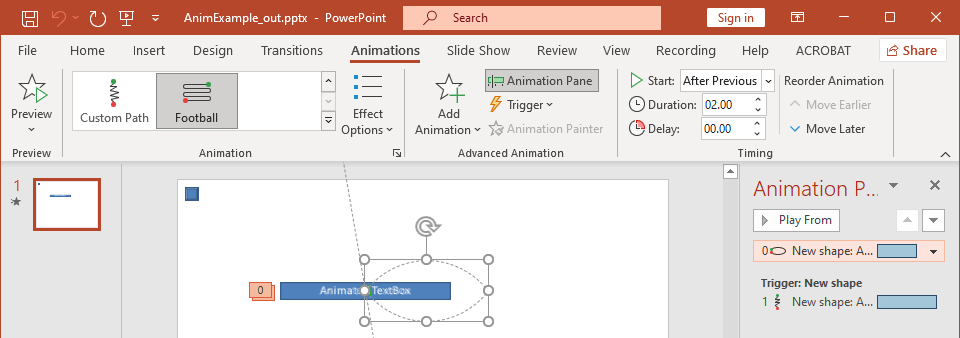

Animations are visual effects that can be applied to texts, images, shapes, or [charts](/slides/python-net/animated-charts/). They give life to presentations or its constituents. 

### **Why Use Animations in Presentations?**

Using animations, you can 

* control the flow of information
* emphasize important points
* increase interest or participation among your audience
* make content easier to read or assimilate or process
* draw your readers or viewers attention to important parts in a presentation

PowerPoint provides many options and tools for animations and animation effects across the **entrance**, **exit**, **emphasis**, and **motion paths** categories. 

### **Animations in Aspose.Slides**

* Aspose.Slides provides the classes and types you need to work with animations under the [Aspose.Slides.Animation](https://reference.aspose.com/slides/python-net/aspose.slides.animation/) namespace,
* Aspose.Slides provides over **150 animation effects** under the [EffectType](https://reference.aspose.com/slides/python-net/aspose.slides.animation/effecttype/) enumeration. These effects are essentially the same (or equivalent) effects used in PowerPoint.

## **Apply Animation to TextBox**

Aspose.Slides for Python via .NET allows you to apply animation to the text in a shape. 

1. Create an instance of the [Presentation](https://reference.aspose.com/slides/python-net/aspose.slides/presentation/) class.
2. Get a slide's reference through its index.
3. Add a `rectangle` [IAutoShape](https://reference.aspose.com/slides/python-net/aspose.slides/iautoshape/). 
4. Add text to `IAutoShape.TextFrame`.
5. Get a main sequence of effects.
6. Add an animation effect to [IAutoShape](https://reference.aspose.com/slides/python-net/aspose.slides/iautoshape/). 
7. Set the`TextAnimation.BuildType` property to the value from `BuildType` Enumeration.
8. Write the presentation to disk as a PPTX file.

This Python code shows you how to apply the `Fade` effect to AutoShape and set the text animation to the *By 1st Level Paragraphs* value:

```python
import aspose.slides as slides

# Instantiates a presentation class that represents a presentation file.
with slides.Presentation() as pres:
    sld = pres.slides[0]
    
    # Adds new AutoShape with text
    autoShape = sld.shapes.add_auto_shape(slides.ShapeType.RECTANGLE, 20, 20, 150, 100)

    textFrame = autoShape.text_frame
    textFrame.text = "First paragraph \nSecond paragraph \n Third paragraph"

    # Gets the main sequence of the slide.
    sequence = sld.timeline.main_sequence

    # Adds Fade animation effect to shape
    effect = sequence.add_effect(autoShape, slides.animation.EffectType.FADE, slides.animation.EffectSubtype.NONE, slides.animation.EffectTriggerType.ON_CLICK)

    # Animates shape text by 1st level paragraphs
    effect.text_animation.build_type = slides.animation.BuildType.BY_LEVEL_PARAGRAPHS1

    # Save the PPTX file to disk
    pres.save("AnimText_out.pptx", slides.export.SaveFormat.PPTX)
```

{} 

Besides applying animations to text, you can also apply animations to a single [Paragraph](https://reference.aspose.com/slides/python-net/aspose.slides/iparagraph/). See [**Animated Text**](/slides/python-net/animated-text/).

{} 

## **Apply Animation to PictureFrame**

1. Create an instance of the [Presentation](https://reference.aspose.com/slides/python-net/aspose.slides/presentation/) class.
2. Get a slide's reference through its index.
3. Add or get a [PictureFrame](https://reference.aspose.com/slides/python-net/aspose.slides/pictureframe/) on the slide. 
4. Get the main sequence of effects.
5. Add an animation effect to [PictureFrame](https://reference.aspose.com/slides/python-net/aspose.slides/pictureframe/).
6. Write the presentation to disk as a PPTX file.

This Python code shows you how to apply the `Fly` effect to a picture frame:

```python
import aspose.slides as slides
import aspose.pydrawing as draw


# Instantiates a presentation class that represents a presentation file.
with slides.Presentation() as pres:
    # Load Image to be added in presentaiton image collection
    img = draw.Bitmap("aspose-logo.jpg")
    image = pres.images.add_image(img)

    # Adds picture frame to slide
    picFrame = pres.slides[0].shapes.add_picture_frame(slides.ShapeType.RECTANGLE, 50, 50, 100, 100, image)

    # Gets the main sequence of the slide.
    sequence = pres.slides[0].timeline.main_sequence

    # Adds Fly from Left animation effect to picture frame
    effect = sequence.add_effect(picFrame, slides.animation.EffectType.FLY,  
        slides.animation.EffectSubtype.LEFT, 
        slides.animation.EffectTriggerType.ON_CLICK)

    # Save the PPTX file to disk
    pres.save("AnimImage_out.pptx", slides.export.SaveFormat.PPTX)
```

## **Apply Animation to Shape**

1. Create an instance of the [Presentation](https://reference.aspose.com/slides/python-net/aspose.slides/presentation/) class.
2. Get a slide's reference through its index.
3. Add a `rectangle` [IAutoShape](https://reference.aspose.com/slides/python-net/aspose.slides/iautoshape/). 
4. Add a `Bevel` [IAutoShape](https://reference.aspose.com/slides/python-net/aspose.slides/iautoshape/) (when this object is clicked, the animation gets played).
5. Create a sequence of effects on the bevel shape.
6. Create a custom `UserPath`.
7. Add commands for moving to the `UserPath`.
8. Write the presentation to disk as a PPTX file.

This Python code shows you how to apply the `PathFootball` (path football) effect to a shape:

```python
import aspose.slides.animation as anim
import aspose.slides as slides
import aspose.pydrawing as draw

# Instantiates a Prseetation class that represents a PPTX file
with slides.Presentation() as pres:
    sld = pres.slides[0]

    # Creates PathFootball effect for existing shape from scratch.
    ashp = sld.shapes.add_auto_shape(slides.ShapeType.RECTANGLE, 150, 150, 250, 25)

    ashp.add_text_frame("Animated TextBox")

    # Adds the PathFootBall animation effect.
    pres.slides[0].timeline.main_sequence.add_effect(ashp, 
        anim.EffectType.PATH_FOOTBALL,
        anim.EffectSubtype.NONE, 
        anim.EffectTriggerType.AFTER_PREVIOUS)

    # Creates some kind of "button".
    shapeTrigger = pres.slides[0].shapes.add_auto_shape(slides.ShapeType.BEVEL, 10, 10, 20, 20)

    # Creates a sequence of effects for the button.
    seqInter = pres.slides[0].timeline.interactive_sequences.add(shapeTrigger)

    # Creates a custom user path. Our object will be moved only after the button is clicked.
    fxUserPath = seqInter.add_effect(ashp, 
        anim.EffectType.PATH_USER, 
        anim.EffectSubtype.NONE, 
        anim.EffectTriggerType.ON_CLICK)

    # Adds commands for moving since created path is empty.
    motionBhv = fxUserPath.behaviors[0]

    pts = [draw.PointF(0.076, 0.59)]
    motionBhv.path.add(anim.MotionCommandPathType.LINE_TO, pts, anim.MotionPathPointsType.AUTO, True)
    pts = [draw.PointF(-0.076, -0.59)]
    motionBhv.path.add(anim.MotionCommandPathType.LINE_TO, pts, anim.MotionPathPointsType.AUTO, False)
    motionBhv.path.add(anim.MotionCommandPathType.END, None, anim.MotionPathPointsType.AUTO, False)

    # Writes the PPTX file to disk
    pres.save("AnimExample_out.pptx", slides.export.SaveFormat.PPTX)
```

## **Get the Animation Effects Applied to Shape**

You may decide to find out the all animation effects applied to a single shape. 

This Python code shows you how to get the all effects applied to a specific shape:

```python
import aspose.slides as slides

# Instantiates a presentation class that represents a presentation file.
with slides.Presentation("AnimExample_out.pptx") as pres:
    firstSlide = pres.slides[0]

    # Gets the main sequence of the slide.
    sequence = firstSlide.timeline.main_sequence

    # Gets the first shape on slide.
    shape = firstSlide.shapes[0]

    # Gets all animation effects applied to the shape.
    shapeEffects = sequence.get_effects_by_shape(shape)

    if len(shapeEffects) > 0:
        print("The shape " + shape.name + " has " + str(len(shapeEffects)) + " animation effects.")
```

## **Change Animation Effect Timing Properties**

Aspose.Slides for Python via .NET allows you to change the Timing properties of an animation effect.

This is the Animation Timing pane in Microsoft PowerPoint:



These are the correspondences between PowerPoint Timing and `Effect.Timing` properties:

- PowerPoint Timing **Start** drop-down list matches the [Effect.Timing.TriggerType](https://reference.aspose.com/slides/python-net/aspose.slides.animation/effecttriggertype/) property. 
- PowerPoint Timing **Duration** matches the `Effect.Timing.Duration` property. The duration of an animation (in seconds) is the total time it takes the animation to complete one cycle. 
- PowerPoint Timing **Delay** matches the `Effect.Timing.TriggerDelayTime` property. 

This is how you change the Effect Timing properties:

1. [Apply](#apply-animation-to-shape) or get the animation effect.
2. Set new values for the `Effect.Timing` properties you need. 
3. Save the modified PPTX file.

This Python code demonstrates the operation:

```py
import aspose.slides as slides

# Instantiates a presentation class that represents a presentation file.
with slides.Presentation("AnimExample_out.pptx") as pres:
    # Gets the main sequence of the slide.
    sequence = pres.slides[0].timeline.main_sequence

    # Gets the first effect of main sequence.
    effect = sequence[0]

    # Changes effect TriggerType to start on click
    effect.timing.trigger_type = slides.animation.EffectTriggerType.ON_CLICK

    # Changes effect Duration
    effect.timing.duration = 3

    # Changes effect TriggerDelayTime
    effect.timing.trigger_delay_time = 0.5

    # Saves the PPTX file to disk
    pres.save("AnimExample_changed.pptx", slides.export.SaveFormat.PPTX)
```