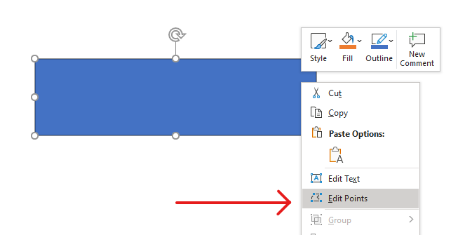
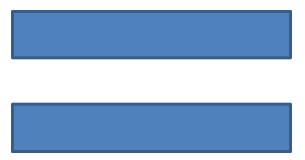

# Change a Shape Using Edit Points

Consider a square. In PowerPoint, using **edit points**, you can 

* move the square's corner in or out
* specify the curvature for a corner or point
* add new points to the square
* manipulate points on the square, etc. 

Essentially, you can perform the described tasks on any shape. Using edit points, you get to change a shape or create a new shape from an existing shape. 

## Shape Editing Tips



Before you start editing PowerPoint shapes through edit points, you might want to consider these points about shapes:

* A shape (or its path) can either be closed or open.
* When a shape is closed, it lacks a start or end point. When a shape is open, it has a beginning and end. 
* All shapes consist of at least 2 anchor points linked to each other by lines
* A line is either straight or curved. Anchor points determine the nature of the line. 
* Anchor points exist as corner points, straight points, or smooth points:
  * A corner point is a point where 2 straight lines join at an angle. 
  * A smooth point is a point where 2 handles exist in a straight line and the line's segments join in a smooth curve. In this case, all handles are separated from the anchor point by an equal distance. 
  * A straight point is a point where 2 handles exist in a straight line and that line's line segments joins in a smooth curve. In this case, the handles don't have to be separated from the anchor point by an equal distance. 
* By moving or editing anchor points (which changes the angle of lines), you can change the way a shape looks. 

To edit PowerPoint shapes through edit points, **Aspose.Slides** provides the [**GeometryPath**](https://docs.aspose.com/slides/python-net/api-reference/aspose.slides/geometrypath/) class and [**IGeometryPath**](https://docs.aspose.com/slides/python-net/api-reference/aspose.slides/igeometrypath/) interface. 

* A [GeometryPath](https://docs.aspose.com/slides/python-net/api-reference/aspose.slides/geometrypath/) instance represents a geometry path of the [IGeometryShape](https://docs.aspose.com/slides/python-net/api-reference/aspose.slides/igeometryshape/) object
* To retrieve the`GeometryPath` from the `IGeometryShape` instance, you can use the [IGeometryShape.GetGeometryPaths](https://docs.aspose.com/slides/python-net/api-reference/aspose.slides/igeometryshape/) method. 
* To set the `GeometryPath` for a shape, you can use these methods: [IGeometryShape.SetGeometryPath](https://docs.aspose.com/slides/python-net/api-reference/aspose.slides/igeometryshape/) for *solid shapes* and [IGeometryShape.SetGeometryPaths](https://docs.aspose.com/slides/python-net/api-reference/aspose.slides/igeometryshape/) for *composite shapes*.
* To add segments, you can use the methods under [IGeometryPath](https://docs.aspose.com/slides/python-net/api-reference/aspose.slides/igeometrypath/).
* Using the [IGeometryPath.Stroke](https://docs.aspose.com/slides/python-net/api-reference/aspose.slides/igeometrypath/) and [IGeometryPath.FillMode](https://docs.aspose.com/slides/python-net/api-reference/aspose.slides/igeometrypath/) properties, you can set the appearance for a geometry path.
* Using the [IGeometryPath.PathData](https://docs.aspose.com/slides/python-net/api-reference/aspose.slides/igeometrypath/properties/pathdata) property, you can retrieve the geometry path of a `GeometryShape` as an array of path segments. 
* To access additional shape geometry customization options, you can convert [GeometryPath](https://docs.aspose.com/slides/python-net/api-reference/aspose.slides/geometrypath/) to [GraphicsPath](https://docs.microsoft.com/en-us/dotnet/api/system.drawing.drawing2d?view=dotnet-plat-ext-5.0).
* Use `GeometryPathToGraphicsPath` and `GraphicsPathToGeometryPath` methods (from the [ShapeUtil](https://docs.aspose.com/slides/python-net/api-reference/aspose.slides.util/shapeutil/) class) to convert `GeometryPath` to `GraphicsPath` back and forth. 

## **Simple Editing Operations**

This python code shows you how to

**Add a line** to the end of a path:

```py
line_to(point)
line_to(x, y)
```
**Add a line** to a specified position on a path:

```py    
line_to(point, index)
line_to(x, y, index)
```
**Add a cubic Bezier curve** at the end of a path:

```py
cubic_bezier_to(point1, point2, point3)
cubic_bezier_to(x1, y1, x2, y2, x3, y3)
```
**Add a cubic Bezier curve** to the specified position on a path:

```py
cubic_bezier_to(point1, point2, point3, index)
cubic_bezier_to(x1, y1, x2, y2, x3, y3, index)
```
**Add a quadratic Bezier curve** at the end of a path:
```py
quadratic_bezier_to(point1, point2)
quadratic_bezier_to(x1, y1, x2, y2)
```
**Add quadratic Bezier curve** to a specified position on a path:

```py
quadratic_bezier_to(point1, point2, index)
quadratic_bezier_to(x1, y1, x2, y2, index)
```
**Append a given arc** to a path:
```py
arc_to(width, heigth, startAngle, sweepAngle)
```
**Close the current figure** of a path:
```py
close_figure()
```
**Set the position for the next point**:
```py
move_to(point)
move_to(x, y)
```
**Remove the path segment** at a given index:

```py
remove_at(index)
```
## Add Custom Points to Shape
1. Create an instance of the [GeometryShape](https://docs.aspose.com/slides/python-net/api-reference/aspose.slides/geometryshape/) class and set the [ShapeType.Rectangle](https://docs.aspose.com/slides/python-net/api-reference/aspose.slides/shapetype/)
2. Get an instance of the [GeometryPath](https://docs.aspose.com/slides/python-net/api-reference/aspose.slides/geometrypath/) class from the shape.
3. Add a new point between the two top points on the path.
4. Add a new point between the two bottom points on the path.
5. Apply the path to the shape.

This python code shows you how to add custom points to a shape:

```py
import aspose.slides as slides

with slides.Presentation() as pres:
    shape = pres.slides[0].shapes.add_auto_shape(slides.ShapeType.RECTANGLE, 100, 100, 200, 100)
    geometryPath = shape.get_geometry_paths()[0]

    geometryPath.line_to(100, 50, 1)
    geometryPath.line_to(100, 50, 4)
    shape.set_geometry_path(geometryPath)
```


##  Remove Points from Shape

1. Create an instance of the [GeometryShape](https://docs.aspose.com/slides/python-net/api-reference/aspose.slides/geometryshape/) class of and set the [ShapeType.Heart](https://docs.aspose.com/slides/python-net/api-reference/aspose.slides/shapetype/) type. 
2. Get an instance of the [GeometryPath](https://docs.aspose.com/slides/python-net/api-reference/aspose.slides/geometrypath/) class from the shape.
3. Remove the segment for the path.
4. Apply the path to the shape.

This python code shows you how to remove points from a shape:

```py
import aspose.slides as slides

with slides.Presentation() as pres:
	shape = pres.slides[0].shapes.add_auto_shape(slides.ShapeType.HEART, 100, 100, 300, 300)

	path = shape.get_geometry_paths()[0]
	path.remove_at(2)
	shape.set_geometry_path(path)
```


##  Create Custom Shape

1. Calculate points for the shape.
2. Create an instance of the [GeometryPath](https://docs.aspose.com/slides/python-net/api-reference/aspose.slides/geometrypath/) class. 
3. Fill the path with the points.
4. Create an instance of the [GeometryShape](https://docs.aspose.com/slides/python-net/api-reference/aspose.slides/geometryshape/) class. 
5. Apply the path to the shape.

This python code shows you how to create a custom shape:

```py
import aspose.slides as slides
import aspose.pydrawing as draw
import math

points = []

R = 100
r = 50
step = 72

for angle in range(-90, 270, step):
    radians = angle * (math.pi / 180)
    x = R * math.cos(radians)
    y = R * math.sin(radians)
    points.append(draw.PointF(x + R, y + R))

    radians = math.pi * (angle + step / 2) / 180.0
    x = r * math.cos(radians)
    y = r * math.sin(radians)
    points.append(draw.PointF(x + R, y + R))

starPath = slides.GeometryPath()
starPath.move_to(points[0])

for i in range(len(points)):
    starPath.line_to(points[i])

starPath.close_figure()

with slides.Presentation() as pres:
    shape = pres.slides[0].shapes.add_auto_shape(slides.ShapeType.RECTANGLE, 100, 100, R * 2, R * 2)
    shape.set_geometry_path(starPath)
```


## Create Composite Custom Shape

  1. Create an instance of the [GeometryShape](https://docs.aspose.com/slides/python-net/api-reference/aspose.slides/geometryshape/) class.
  2. Create a first instance of the [GeometryPath](https://docs.aspose.com/slides/python-net/api-reference/aspose.slides/geometrypath/) class.
  3. Create a second instance of the [GeometryPath](https://docs.aspose.com/slides/python-net/api-reference/aspose.slides/geometrypath/) class.
  4. Apply the paths to the shape.

This python code shows you how to create a composite custom shape:

```py
import aspose.slides as slides
import aspose.pydrawing as draw

with slides.Presentation() as pres:
    shape = pres.slides[0].shapes.add_auto_shape(slides.ShapeType.RECTANGLE, 100, 100, 200, 100)

    geometryPath0 = slides.GeometryPath()
    geometryPath0.move_to(0, 0)
    geometryPath0.line_to(shape.width, 0)
    geometryPath0.line_to(shape.width, shape.height/3)
    geometryPath0.line_to(0, shape.height / 3)
    geometryPath0.close_figure()

    geometryPath1 = slides.GeometryPath()
    geometryPath1.move_to(0, shape.height/3 * 2)
    geometryPath1.line_to(shape.width, shape.height / 3 * 2)
    geometryPath1.line_to(shape.width, shape.height)
    geometryPath1.line_to(0, shape.height)
    geometryPath1.close_figure()

    shape.set_geometry_paths([ geometryPath0, geometryPath1])
```


## **Create Custom Shape With Curved Corners**

This python code shows you how to create a custom shape with curved corners (inwards):

```python

```

## Conversion of GeometryPath to GraphicsPath (System.Drawing.Drawing2D) 

1. Create an instance of the [GeometryShape](https://docs.aspose.com/slides/python-net/api-reference/aspose.slides/geometryshape/) class.
2. Create an instance of the [GrpahicsPath](https://docs.microsoft.com/en-us/dotnet/api/system.drawing.drawing2d.graphicspath?view=dotnet-plat-ext-5.0) class  of the [System.Drawing.Drawing2D](https://docs.microsoft.com/en-us/dotnet/api/system.drawing.drawing2d?view=dotnet-plat-ext-5.0) namespace.
3. Convert the [GraphicsPath](https://docs.microsoft.com/en-us/dotnet/api/system.drawing.drawing2d.graphicspath?view=dotnet-plat-ext-5.0) instance to the  [GeometryPath](https://docs.aspose.com/slides/python-net/api-reference/aspose.slides/geometrypath/) instance using [ShapeUtil](https://docs.aspose.com/slides/python-net/api-reference/aspose.slides.util/shapeutil/).
4. Apply the paths to the shape.

This python code—an implementation of the steps above—demonstrates the **GeometryPath** to **GraphicsPath** conversion process:

```py
import aspose.slides as slides
import aspose.pydrawing as draw

with slides.Presentation() as pres:
    shape = pres.slides[0].shapes.add_auto_shape(slides.ShapeType.RECTANGLE, 100, 100, 300, 100)

    originalPath = shape.get_geometry_paths()[0]
    originalPath.fill_mode = slides.PathFillModeType.NONE

    gPath = draw.drawing2d.GraphicsPath()

    gPath.add_string("Text in shape", draw.FontFamily("Arial"), 1, 40, draw.PointF(10, 10), draw.StringFormat.generic_default)

    textPath = slides.util.ShapeUtil.graphics_path_to_geometry_path(gPath)
    textPath.fill_mode = slides.PathFillModeType.NORMAL

    shape.set_geometry_paths([originalPath, textPath])
```
