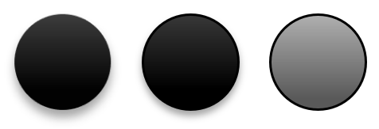
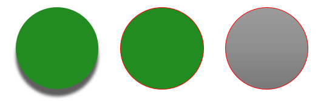

A presentation theme defines the properties of design elements. When you select a presentation theme, you are essentially choosing a specific set of visual elements and their properties.

In PowerPoint, a theme comprises colors, [fonts](/slides/python-net/powerpoint-fonts/), [background styles](/slides/python-net/presentation-background/), and effects.


## **Change Theme Color**

A PowerPoint theme uses a specific set of colors for different elements on a slide. If you don't like the colors, you change them colors by applying new colors for the theme. To allow you select a new theme color, Aspose.Slides provides values under the [SchemeColor](https://reference.aspose.com/slides/python-net/aspose.slides/schemecolor/) enumeration.

This Python code shows you how to change the accent color for a theme:

```python
import aspose.pydrawing as draw
import aspose.slides as slides

with slides.Presentation() as pres:
    shape = pres.slides[0].shapes.add_auto_shape(slides.ShapeType.RECTANGLE, 10, 10, 100, 100)
    shape.fill_format.fill_type = slides.FillType.SOLID
    shape.fill_format.solid_fill_color.scheme_color = slides.SchemeColor.ACCENT4
```

You can determine the resulting color's effective value this way:

```python
fillEffective = shape.fill_format.get_effective()
print("{0} ({1})".format(fillEffective.solid_fill_color.name, fillEffective.solid_fill_color)) # ff8064a2 (Color [A=255, R=128, G=100, B=162])
```

To further demonstrate the color change operation, we create another element and assign the accent color (from the initial operation) to it. Then we change the color in the theme:

```python
otherShape = pres.slides[0].shapes.add_auto_shape(slides.ShapeType.RECTANGLE, 10, 120, 100, 100)
otherShape.fill_format.fill_type = slides.FillType.SOLID
otherShape.fill_format.solid_fill_color.scheme_color = slides.SchemeColor.ACCENT4

pres.master_theme.color_scheme.accent4.color = draw.Color.red
```

The new color is applied automatically on both elements.

### **Set Theme Color from Additional Palette - Luminance transformation**

Using colors from the additional palette, you can apply luminance transformations to the main color. This Python code demonstrates the operation: xxx

```python

```

## **Change Theme Font**

To allow you select fonts for themes and other purposes, Aspose.Slides uses these special identifiers (similar to those used in PowerPoint):

* **+mn-lt** - Body Font Latin (Minor Latin Font)
* **+mj-lt** -Heading Font Latin (Major Latin Font)
* **+mn-ea** - Body Font East Asian (Minor East Asian Font)
* **+mj-ea** - Body Font East Asian (Major East Asian Font)

This Python code shows you how to assign the Latin font to a theme element:

```python
shape = pres.slides[0].shapes.add_auto_shape(slides.ShapeType.RECTANGLE, 10, 10, 100, 100)

paragraph = slides.Paragraph()
portion = slides.Portion("Theme text format")
paragraph.portions.add(portion)
shape.text_frame.paragraphs.add(paragraph)
portion.portion_format.latin_font = slides.FontData("+mn-lt")
```

This Python code shows you how to change the presentation theme font:

```python
pres.master_theme.font_scheme.minor.latin_font = slides.FontData("Arial")
```

The font in all text boxes will be updated.

{} 

You may want to see [PowerPoint fonts](/slides/python-net/powerpoint-fonts/).

{}

## **Change Theme Background Style**

By default, the PowerPoint app provides 12 predefined backgrounds but only 3 from those 12 backgrounds are saved in a typical presentation. 


For example, after you save a presentation in the PowerPoint app, you can run this Python code to find out the number of predefined backgrounds in the presentation:

```python
with slides.Presentation() as pres:
    numberOfBackgroundFills = len(pres.master_theme.format_scheme.background_fill_styles)
    print("Number of background fill styles for theme is {0}".format(numberOfBackgroundFills))
```

{} 

Using the `BackgroundFillStyles` property from the [FormatScheme](https://reference.aspose.com/slides/python-net/aspose.slides.theme/formatscheme/) class, you can add or access the background style in a PowerPoint theme. 

{}

This Python code shows you how to set the background for a presentation:

```python
pres.masters[0].background.style_index = 2
```

**Index guide**: 0 is used for no fill. The index starts from 1.

{} 

You may want to see [PowerPoint Background](/slides/python-net/presentation-background/).

{}

## **Change Theme Effect**

A PowerPoint theme usually contains 3 values for each style array. Those arrays are combined into these 3 effects: subtle, moderate, and intense. For example, this is the outcome when the effects are applied to a specific shape:



Using 3 properties (`FillStyles`, `LineStyles`, `EffectStyles`) from the  [FormatScheme](https://reference.aspose.com/slides/python-net/aspose.slides.theme/formatscheme/) class you can change the elements in a theme (even more flexibly than the options in PowerPoint).

This Python code shows you how to change a theme effect by altering parts of elements:

```python
with slides.Presentation("combined_with_master.pptx") as pres:
    pres.master_theme.format_scheme.line_styles[0].fill_format.solid_fill_color.color = draw.Color.red
    pres.master_theme.format_scheme.fill_styles[2].fill_type = slides.FillType.SOLID
    pres.master_theme.format_scheme.fill_styles[2].solid_fill_color.color = draw.Color.forest_green
    pres.master_theme.format_scheme.effect_styles[2].effect_format.outer_shadow_effect.distance = 10

    pres.save("Design_04_Subtle_Moderate_Intense-out.pptx", slides.export.SaveFormat.PPTX)
```

The resulting changes in fill color, fill type, shadow effect, etc:



