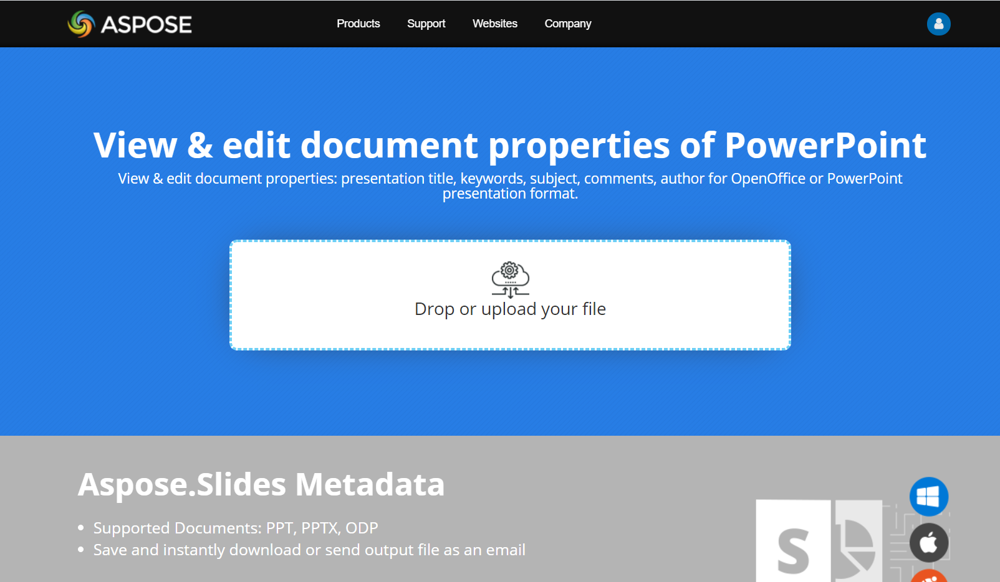

## **Live Example**
Try [**Aspose.Slides Metadata**](https://products.aspose.app/slides/metadata) online app to see how to work with document properties via Aspose.Slides API:

[](https://products.aspose.app/slides/metadata)

[](https://products.aspose.app/slides/metadata)


## **About Presentation Properties**
As we have described earlier that Aspose.Slides for Python via .NET supports two kinds of document properties, which are **Built-in** and **Custom** properties. So, developers can access both kinds of properties with the use of Aspose.Slides for Python via .NET API. Aspose.Slides for Python via .NET provides a class [IDocumentProperties](https://reference.aspose.com/slides/python-net/aspose.slides/idocumentproperties/) that represents the document properties associated with a presentation file through [Presentation.document_properties](https://reference.aspose.com/slides/python-net/aspose.slides/documentproperties/) property. Developers can use [IDocumentProperties](https://reference.aspose.com/slides/python-net/aspose.slides/idocumentproperties/) property exposed by **Presentation** object to access the document properties of the presentation files as described below:


{} 

Please note that you cannot set values against the **Application** and **Producer** fields, because Aspose Ltd. and Aspose.Slides for Python via .NET x.x.x will be displayed against these fields.

{} 


## **Manage Presentation Properties**
Microsoft PowerPoint provides a feature to add some properties to the presentation files. These document properties allow some useful information to be stored along with the documents (presentation files). There are two kinds of document properties as follows

- System Defined (Built-in) Properties
- User Defined (Custom) Properties

**Built-in** properties contain general information about the document like document title, author's name, document statistics and so on. **Custom** properties are those ones, which are defined by the users as **Name/Value** pairs, where both name and value are defined by the user. Using Aspose.Slides for Python via .NET, developers can access and modify the values of built-in properties as well as custom properties. Microsoft PowerPoint 2007 allows managing the document properties of the presentation files. All you have to do is to click the Office icon and further **Prepare | Properties | Advanced Properties** menu item of the Microsoft PowerPoint 2007. After you select **Advanced Properties** menu item, a dialog would appear allowing you to manage the document properties of the PowerPoint file. In the **Properties Dialog**, you can see that there are many tab pages like **General, Summary, Statistics, Contents and Custom**. All these tab pages allow configuring different kinds of information related to the PowerPoint files. **Custom** tab is used to manage the custom properties of the PowerPoint files.
## **Access Built-in Properties**
These properties as exposed by **IDocumentProperties** object include: **Creator(Author)**, **Description**, **Keywords** **Created** (Creation Date), **Modified** Modification Date, **Printed** Last Print Date, **LastModifiedBy**, **Keywords**, **SharedDoc** (Is shared between different producers?), **PresentationFormat**, **Subject** and **Title**
```py
import aspose.slides as slides

# Instantiate the Presentation class that represents the presentation
with slides.Presentation(path + "AccessBuiltin Properties.pptx") as pres:
    # Create a reference to object associated with Presentation
    documentProperties = pres.document_properties

    # Display the builtin properties
    print("category : " + documentProperties.category)
    print("Current Status : " + documentProperties.content_status)
    print("Creation Date : " + str(documentProperties.created_time))
    print("Author : " + documentProperties.author)
    print("Description : " + documentProperties.comments)
    print("KeyWords : " + documentProperties.keywords)
    print("Last Modified By : " + documentProperties.last_saved_by)
    print("Supervisor : " + documentProperties.manager)
    print("Modified Date : " + str(documentProperties.last_saved_time))
    print("Presentation Format : " + documentProperties.presentation_format)
    print("Last Print Date : " + str(documentProperties.last_printed))
    print("Is Shared between producers : " + str(documentProperties.shared_doc))
    print("Subject : " + documentProperties.subject)
    print("Title : " + documentProperties.title)
```
## **Modify Built-in Properties**
Modifying the built-in properties of presentation files is as easy as that of accessing them. You can simply assign a string value to any desired property and the property value would be modified. In the example given below, we have demonstrated that how we can modify the built-in document properties of the presentation file.

```py
import aspose.slides as slides

# Instantiate the Presentation class that represents the Presentation
with slides.Presentation(path + "ModifyBuiltinProperties.pptx") as presentation:
    # Create a reference to object associated with Presentation
    documentProperties = presentation.document_properties

    # Set the builtin properties
    documentProperties.author = "Aspose.Slides for .NET"
    documentProperties.title = "Modifying Presentation Properties"
    documentProperties.subject = "Aspose Subject"
    documentProperties.comments = "Aspose Description"
    documentProperties.manager = "Aspose Manager"

    # save your presentation to a file
    presentation.save("DocumentProperties_out.pptx", slides.export.SaveFormat.PPTX)
```

## **Add Custom Presentation Properties**
Aspose.Slides for Python via .NET also allows developers to add the custom the values for presentation Document properties. An example is given below that shows how to set the custom properties for a presentation.

```py
import aspose.slides as slides

# Instantiate the Presentation class
with slides.Presentation() as presentation:
    # Getting Document Properties
    documentProperties = presentation.document_properties

    # Adding Custom properties
    documentProperties.set_custom_property_value("New Custom", 12)
    documentProperties.set_custom_property_value("My Nam", "Mudassir")
    documentProperties.set_custom_property_value("Custom", 124)

    # Getting property name at particular index
    getPropertyName = documentProperties.get_custom_property_name(2)

    # Removing selected property
    documentProperties.remove_custom_property(getPropertyName)

    # Saving presentation
    presentation.save("CustomDocumentProperties_out.pptx", slides.export.SaveFormat.PPTX)
```

## **Access and Modify Custom Properties**
Aspose.Slides for Python via .NET also allows developers to access the values of custom properties. An example is given below that shows how can you access and modify all of these custom properties for a presentation.

```py
import aspose.slides as slides

# Instanciate the Presentation class that represents the PPTX
with slides.Presentation(path + "AccessModifyingProperties.pptx") as presentation:
    # Create a reference to document_properties object associated with Prsentation
    documentProperties = presentation.document_properties

    # Access and modify custom properties
    for i in range(documentProperties.count_of_custom_properties):
        # Display names and values of custom properties
        print("Custom Property Name : " + documentProperties.get_custom_property_name(i))
        print("Custom Property Value : " + documentProperties.get_custom_property_value[documentProperties.get_custom_property_name(i)])

        # Modify values of custom properties
        documentProperties.set_custom_property_value(documentProperties.get_custom_property_name(i), "New Value " + str(i + 1))
    # save your presentation to a file
    presentation.save("CustomDemoModified_out.pptx", slides.export.SaveFormat.PPTX)
```

## **Check if Presentation is Modified or Created**
Aspose.Slides for Python via .NET provides a facility to check if a presentation is modified or created. An example is given below that shows how to check if the presentation is created or modified.

```py
import aspose.slides as slides

info =slides.PresentationFactory.instance.get_presentation_info(path + "AccessModifyingProperties.pptx")
props = info.read_document_properties()

print(props.name_of_application)
print(props.app_version)
```

## **Set Proofing Language**

Aspose.Slides provides the `Language_Id` property (exposed by the [PortionFormat](https://reference.aspose.com/slides/python-net/aspose.slides/portionformat/) class) to allow you to set the proofing language for a PowerPoint document. The proofing language is the language for which spellings and grammar in the PowerPoint are checked.

This Python code shows you how to set the proofing language for a PowerPoint:

```python
import aspose.slides as slides

with slides.Presentation(path + "SetProofingLanguage.pptx") as pres:
    auto_shape = pres.slides[0].shapes[0]
    paragraph = auto_shape.text_frame.paragraphs[0]
    paragraph.portions.clear()

    new_portion = slides.Portion()
    font = slides.FontData("SimSun")
    portion_format = new_portion.portion_format
    portion_format.complex_script_font = font
    portion_format.east_asian_font = font
    portion_format.latin_font = font

    # set the Id of a proofing language
    portion_format.language_id = "zh-CN"
    new_portion.text = "1。"

    paragraph.portions.add(new_portion)
```

## **Set Default Language**

This Python code shows you how to set the default language for an entire PowerPoint presentation:

```python
import aspose.slides as slides

load_options = slides.LoadOptions()
load_options.default_text_language = "en_US"

with slides.Presentation(load_options) as pres:
    shp = pres.slides[0].shapes.add_auto_shape(slides.ShapeType.RECTANGLE, 50, 50, 150, 150)
    text_frame = shp.text_frame
    text_frame.text = "New Text"

    print(text_frame.paragraphs[0].portions[0].portion_format.language_id)
```

