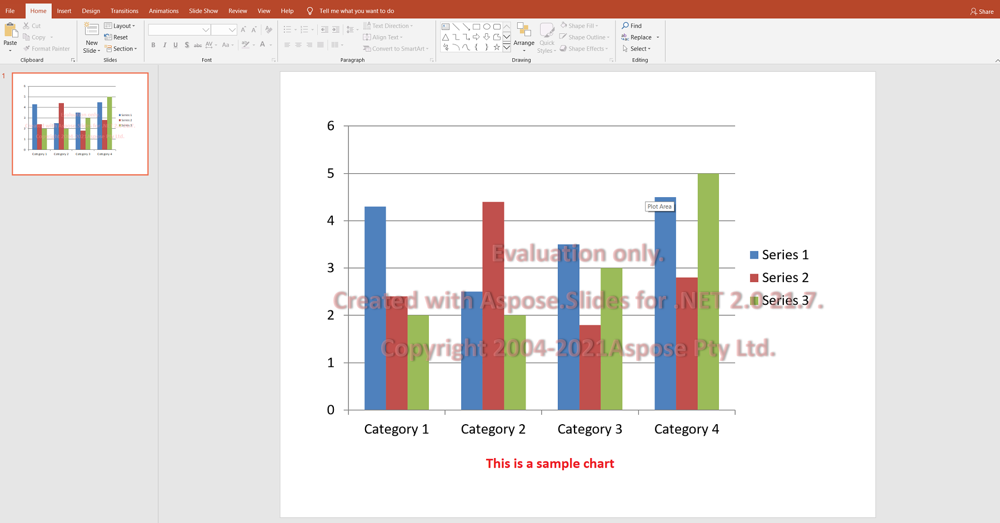

You can easily download Aspose.Slides for evaluation. The evaluation package is the same as the purchased package. The evaluation version simply becomes licensed after you add a few lines of code to apply the license. 

The evaluation version of Aspose.Slides (without a license specified) provides full product functionality, but it inserts an evaluation watermark at the top of the document on open and save. You are also limited to one slide when extracting texts from presentation slides.

{} 

If you want to test Aspose.Slides without evaluation version limitations, you can request a **30 Day Temporary License**. Please refer to [How to get a Temporary License?](https://purchase.aspose.com/temporary-license) for more information.

{}