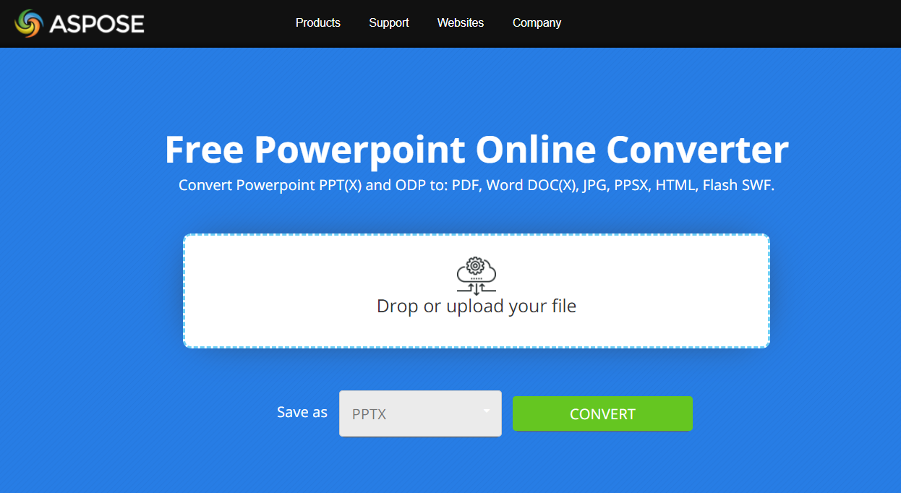

## **About PowerPoint to JPG Conversion**
With [**Aspose.Slides .NET API**](https://products.aspose.com/slides/pythonnet/) you can convert PowerPoint PPT or PPTX presentation to JPG image. It is also possible to convert PPT/PPTX to BMP, PNG or SVG. With this features it's easy to implement your own presentation viewer, create  the thumbnail for every slide. This may be useful if you want to protect presentation slides from copywriting, demonstrate presentation in read-only mode. Aspose.Slides allows to convert the whole presentation or a certain slide into image formats. 

{} 

To see how Aspose.Slides converts PowerPoint to JPG, you may want to try these free online converters: PowerPoint [PPTX to JPG](https://products.aspose.app/slides/conversion/pptx-to-jpg) and [PPT to JPG](https://products.aspose.app/slides/conversion/ppt-to-jpg). 

[](https://products.aspose.app/slides/conversion)

{} 
## **Convert PowerPoint PPT/PPTX to JPG**
Here are the steps to convert PPT/PPTX to JPG:

- Create an instance of [Presentation ](https://apireference.aspose.com/slides/pythonnet/aspose.slides/presentation)type.
- Get the slide object of [ISlide](https://apireference.aspose.com/slides/pythonnet/aspose.slides/islide) type from [Presentation.Slides](https://apireference.aspose.com/slides/pythonnet/aspose.slides/presentation/properties/slides) collection.
- Create the thumbnail of each slide and then convert it into JPG. [**ISlide.GetThumbnail(float scaleX, float scaleY)**](https://apireference.aspose.com/slides/pythonnet/aspose.slides.islide/getthumbnail/methods/6) method is used to get a thumbnail of a slide, it returns [Bitmap](https://docs.microsoft.com/en-us/dotnet/api/system.drawing.bitmap?view=netframework-4.8) object as a result. [GetThumbnail](https://apireference.aspose.com/slides/pythonnet/aspose.slides.islide/getthumbnail/methods/6) method has to be called from the needed slide of [ISlide](https://apireference.aspose.com/slides/pythonnet/aspose.slides/islide) type, the scales of the resulting thumbnail are passed into the method.
- After you get the slide thumbnail, call [**Image.Save(string filename, ImageFormat format)**](https://docs.microsoft.com/en-us/dotnet/api/system.drawing.image.save?view=netframework-4.8) method from the thumbnail object. Pass the resulting file name and the image format into it. 

{} 
**Note**: PPT/PPTX to JPG conversion differs from the conversion to other types in Aspose.Slides .NET API. For other types, you usually use [**IPresentation.SaveMethod(String, SaveFormat, ISaveOptions)** ](https://apireference.aspose.com/slides/pythonnet/aspose.slides.ipresentation/save/methods/5)method, but here you need [**Image.Save(string filename, ImageFormat format)**](https://docs.microsoft.com/en-us/dotnet/api/system.drawing.image.save?view=netframework-4.8) method.
{} 

```py
import aspose.slides as slides
import aspose.pydrawing as drawing

pres = slides.Presentation("pres.pptx")

for sld in pres.slides:
    bmp = sld.get_thumbnail(1, 1)
    bmp.save("Slide_{num}.jpg".format(num=str(sld.slide_number)), drawing.imaging.ImageFormat.jpeg)
```

## **Convert PowerPoint PPT/PPTX to JPG with Customized Dimensions**
To change the dimension of the resulting thumbnail and JPG image, you can set the *ScaleX* and *ScaleY* for it. To do that, pass *ScaleX* and *ScaleY* values into [**ISlide.GetThumbnail(float scaleX, float scaleY)**](https://apireference.aspose.com/slides/pythonnet/aspose.slides.islide/getthumbnail/methods/6) method:

```py
import aspose.slides as slides
import aspose.pydrawing as drawing

pres = slides.Presentation("pres.pptx")

desiredX = 1200
desiredY = 800
scaleX = (float)(1.0 / pres.slide_size.size.width) * desiredX
scaleY = (float)(1.0 / pres.slide_size.size.height) * desiredY

for sld in pres.slides:
    bmp = sld.get_thumbnail(scaleX, scaleY)
    bmp.save("Slide_{num}.jpg".format(num=str(sld.slide_number)), drawing.imaging.ImageFormat.jpeg)
```


## **Render Comments when saving Presentation into Image**
Aspose.Slides for Python via .NET provides a facility to render comments of presentations or slide when converting those into images.  An example is given below that shows how to render comments of presentation into an image.

```py
import aspose.slides as slides
import aspose.pydrawing as drawing

pres = slides.Presentation("pres.pptx")

bmp = drawing.Bitmap(740, 960)

opts = slides.export.RenderingOptions()
opts.notes_comments_layouting.notes_position = slides.export.NotesPositions.BOTTOM_TRUNCATED
opts.notes_comments_layouting.comments_area_color = drawing.Color.red
opts.notes_comments_layouting.comments_area_width = 200
opts.notes_comments_layouting.comments_position = slides.export.CommentsPositions.RIGHT

graphics = drawing.Graphics.from_image(bmp)
pres.slides[0].render_to_graphics(opts, graphics)
bmp.save("OutPresBitmap.png", drawing.imaging.ImageFormat.png)
```

{}

Aspose provides a [FREE Collage web app](https://products.aspose.app/slides/collage). Using this online service, you can merge [JPG to JPG](https://products.aspose.app/slides/collage/jpg) or PNG to PNG images, create [photo grids](https://products.aspose.app/slides/collage/photo-grid), and so on. 

{}

## **See also**

See other options to convert PPT/PPTX into image, like:

- [PPT/PPTX to SVG conversion](/slides/pythonnet/presentation-viewer/)


