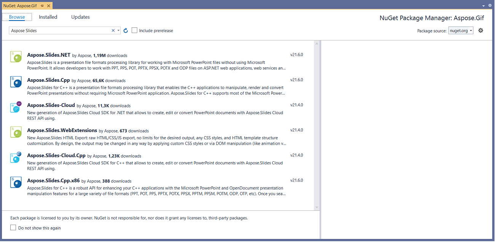
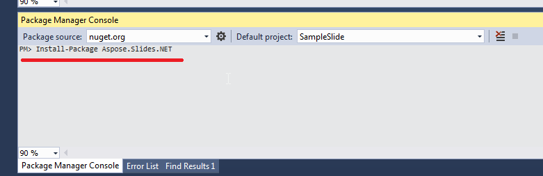
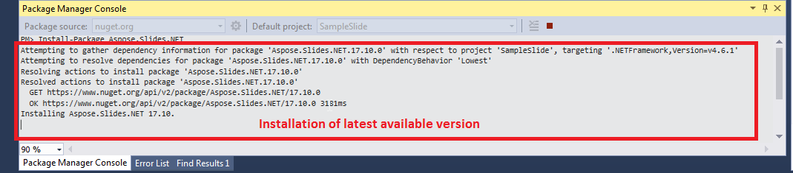
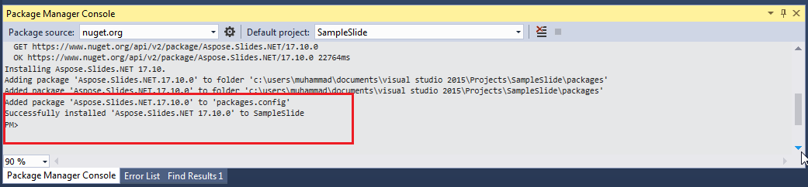
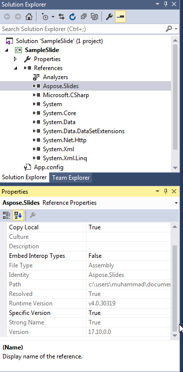
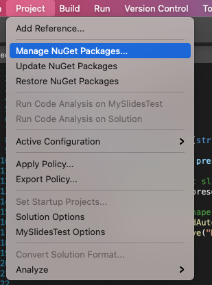

## **Windows**
NuGet provides the easiest path to downloading and installing Aspose APIs for .NET on PCs. 

### **Option One: Install or Update Aspose.Slides from the NuGet Package Manager**

1. Open Microsoft Visual Studio. 
2. Create a simple console app. Or you can open your preferred project. 
3. Go through **Tools** > **NuGet package manager**.
4. Under **Browse**, type *Aspose.Slides* into the text field. 

3. Click **Aspose.Slides.NET** and then click **Install**. 
   * If you want to update Aspose.Slides—which means you already have it installed—click **Update** instead. 

The selected API gets downloaded and referenced in your project.

### **Option 2: Install or Update Aspose.Slides Through the Package Manager Console**

To reference the [Aspose.Slides API](https://www.nuget.org/packages/Aspose.Slides.NET/) using the package manager console, do this:

1. Open your solution/project in Visual Studio.

1. Go through **Tools** > **Library Package Manager** > **Package Manager Console**. 

   The Package Manager Console opens. 

4. Type this command: `Install-Package Aspose.Slides.NET` 

5. Hit the Enter button. 

   The latest full release gets installed into your application. 

   * Alternatively, you can add the `-prerelease` suffix to the command to specify that the latest release (including hotfixes) must be installed as well.

​	The **Installing Aspose.Slides.NET** tip appears around the bottom of the window. 

Once the download reaches completion, you should see some confirmation messages. 

If you are not familiar with [Aspose EULA](https://about.aspose.com/legal/eula), then you may want to read the license referenced in the URL. 

In your application, you should see that Aspose.Slides has been successfully added and referenced. 

In the Package Manager Console, you can run the `Update-Package Aspose.Slides.NET` command to check for updates to the Aspose.Slides package. Updates (if found) get installed automatically. You can also use the `-prerelease` suffix to update the latest release.
#### **Considerations When Running on a Shared Server Environment**
We strongly recommend you run all Aspose .NET components with the **Full Trust** permission set because Aspose components sometimes need to access registry settings and files located in places other than the virtual directory—for example, when Aspose components need to read fonts. 

Furthermore, Aspose.NET components are based on the core .NET system classes—and some of these classes also require Full Trust permission for their operations in some cases.

Internet Service Providers, which host multiple applications from different companies, mostly enforce the Medium Trust security level. In .NET 2.0 case, such a security level may result in constraints that can affect Aspose.Slides' ability to perform properly:

- **RegistryPermission** is not available. This means you cannot access the registry, which is required to enumerate installed fonts when rendering documents.
- **FileIOPermission** is restricted. This means you can only access files in your application’s virtual directory hierarchy. This also potentially means fonts cannot be read during export operations. 

For the reasons above, we strongly recommend that you run Aspose.Slides on **Full Trust** permissions. If you use **Medium trust,** you might experience inconsistencies—some of the library features work when you perform some tasks while others (rendering, for example) might not work. 

## **macOS**

NuGet provides the easiest path to downloading and installing Aspose.Slides for Python via .NET on macs. 

### **Install prerequisite**

The `System.Drawing` namespace operates differently in macOS, so you have to install mono-libgdiplus. 

> In .NET 5 and previous versions, the [System.Drawing.Common](https://www.nuget.org/packages/System.Drawing.Common/) NuGet package works on Windows, Linux, and macOS. However, there are some platform differences. On Linux and macOS, the GDI+ functionality is implemented by the [libgdiplus)](https://www.mono-project.com/docs/gui/libgdiplus/) library. This library is not installed by default in most Linux distributions and doesn't support all the functionality of GDI+ on Windows and macOS. There are also platforms where libgdiplus is not available at all. To use types from the System.Drawing.Common package on Linux and macOS, you must install libgdiplus separately. For more information, see [Install .NET on Linux](https://docs.microsoft.com/en-us/dotnet/core/install/linux) or [Install .NET on macOS](https://docs.microsoft.com/en-us/dotnet/core/install/macos#libgdiplus).

To install mono-libgdiplus separately on your mac, see [this article](https://docs.microsoft.com/en-us/dotnet/core/install/macos#libgdiplus) from .NET documentation. 

### **Install Aspose.Slides**

1. Open Visual Studio. 

2. Create a simple console app. Or you can open your preferred project. 

3. Go through **Project** > **Manage NuGet Packages...**

   

4. Type *Aspose.Slides* into the text field. 

5. Click **Aspose.Slides for Python via .NET** and then click **Add Package.** 

6. Add a simple code snippet.

   * You can copy the code on [this page](https://docs.aspose.com/slides/pythonnet/create-presentation/).

7. Run the app.

8. Open your project's *folder/bin/Debug/presentation_file_name*