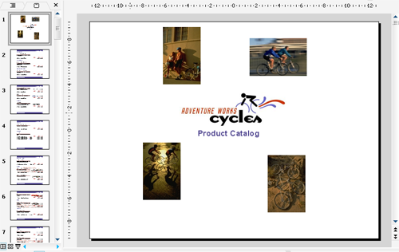

{} 

Aspose.Slides for Reporting Services fully supports all of the RDL specifications. This means two great things: 

- No need to redesign existing reports. You can export any existing RDL report as a Microsoft PowerPoint presentation and it will appear exactly according to the RDL design.
- No need to use a specific report designer. You can use any RDL report designer and the report will be exported exactly the way you designed it.

{} 

Aspose.Slides for Reporting Services supports the following RDL elements: 

- Page, headers, footers
- Textboxes
- Images
- Sub-reports
- Charts
- Lists
- Tables
- Matrices
- Styles
- Rectangles

**An example of a report with headers, footers, images, subreports, tables, textboxes and rectangles exported as a Microsoft PowerPoint (PPT) presentation.** 

For more sample reports, see the [Report Samples Gallery](/slides/reportingservices/sample-reports-gallery-html/) section. 
