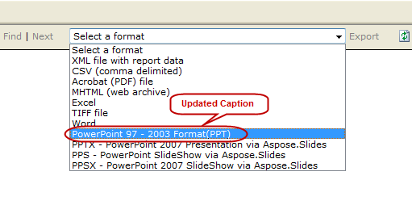

{} 

This section demonstrates how to customize Aspose.Slides for Reporting Services rendering options captions. 

{} 
#### **Example**
On installation of the Aspose.Slides for Reporting Services, four more export options are added in the drop down menu of the export options as shown by the following figure: 


#### **Steps to modify the captions text**
The default captions of these extensions can be changed by overriding the default names. The following steps explain how to update the caption “ **PPT – PowerPoint** **Presentation via** **Aspose.Slides** ” to “ **PowerPoint 97 – 2003 format(PPT)** ”. 


**Step 1:** Locate the **rsreportserver.config** file typically located in the following directory: 

**OS Root Drive\Program Files\Microsoft SQL Server\MSRS10.MSSQLSERVER\Reporting Services\ReportServer** 


**Step** **2:** Find the following lines in rsreportserver.config file: 

```

 <Extension Name="ASPPT" Type="Aspose.Slides.ReportingServices.PptRenderer,Aspose.Slides.ReportingServices"/>


```

**Step** **3:** Replace this extension parameter with the following: 

**<Extension Name="ASPPT" Type="Aspose.Slides.ReportingServices.PptRenderer,Aspose.Slides.ReportingServices">**

```

         <OverrideNames>

          <Name Language="en-US">PowerPoint 97 - 2003 Format(PPT)</Name>

        </OverrideNames>

</Extension>


```

**Step** **4:** As a result of the above actions, the export options will appear as below: 


