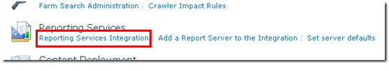
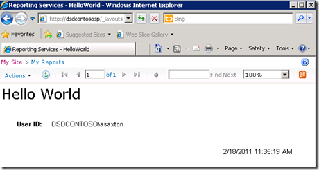

{} 

Now that SharePoint is installed and configured on the RS server and RS is setup and setup through the Reporting Services Configuration Manager, we can move onto the configuration within Central Admin. RS 2008 R2 has really simplified this process. We use to have a 3 step process that you had to perform to get this to work. Now we just have one step. 

We want to go to the Central Administrator Web site and then into General Application Settings. Towards the bottom we will see Reporting Services. 

{} 

**Figure 17**: SharePoint Configuration 

{} 

Click on " **Reporting Services Integration** . 

{} 
## **Web Service URL**
We will provide the URL for the Report Server that we found in the Reporting Services Configuration Manager. 
## **Authentication Mode**
We will also select an Authentication Mode. The following MSDN link goes through in detail what these are. 
[Security Overview for Reporting Services in SharePoint Integrated Mode](http://msdn.microsoft.com/en-us/library/bb283324.aspx) 

In short, if your site is using **Claims Authentication** , you will always be using Trusted Authentication regardless of what you choose here. If you want to pass windows credentials, you will want to choose Windows Authentication. For Trusted Authentication, we will pass the SPUser token and not rely on the Windows credential. 

You will also want to use Trusted Authentication if you have configured your Classic Mode sites for NTLM and RS is setup for NTLM. Kerberos would be needed to use Windows Authentication and to pass that through for your data source. 

**Figure 18**: Setting Reporting Services Integration credentials
## **Activate Feature**
This gives you an option of activating the Reporting Services on all Site collections, or you can choose which ones you want to activate it on. This just really means which sites will be able to use Reporting Services. 
When it is done, you should see the following figure. 

**Figure 19**: Successful Integration of Reporting Services with the SharePoint environment 

Going back to the Report Server URL as given in Figure 14, we should see something similar to the following figure. 

**Figure 20**: Successful Verification of Reporting Services with the SharePoint environment 

{} 

If your SharePoint site is configured for SSL, it won't show up in this list. It is a known issue and doesn't mean there is a problem. Your reports should still work. 

{} 

Now, we are ready to use Reporting Services in SharePoint 2010. As the previous version we have a feature (activated when we configure Reporting Services Integration) in the “Site Collection Feature”. Also the installation added 3 content types to add to our site. In Figure 21 we can see 2 of them content types added in a document library to create a custom report using the, as we can see in Figure 21 . 

**Figure 21**: Report Builder 

The “ **Reporter Builder”** is an ActiveX that we need download on the se rver, as we can see in Figure 22 . 

**Figure 22**: Download and Install Report Builder 

When download finishes run the **“Report Builder”** . Now, we are ready to design our first re port, as we can see in Figure 23 . 

**Figure 23**: Report Builder New Report Generation Wizard 

After create our report we could save it in the document library created to put the reports in our SharePoint 2010. 

The other content type must be used to create shared connection as data source and save them in a document library in SharePoint. We can create a document library, add this content type and after we can have our connections available to change the data source of the reports. 

**Figure 24**: Successful export of report to Report Server 
