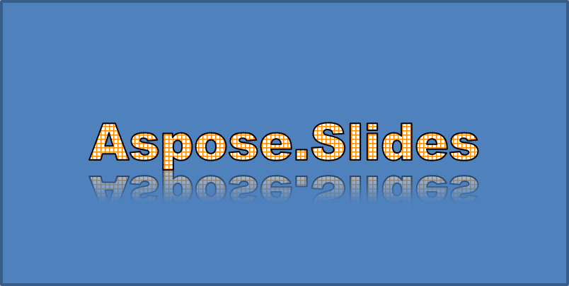

## **Обзор**

Эффекты WordArt позволяют стилизовать текст с помощью заливок, контуров, теней, отражений, свечения, трансформаций и 3D‑форматирования. В этой статье объясняется, как создавать и настраивать эти эффекты в презентациях PowerPoint с помощью Aspose.Slides для C++, без установки Microsoft Office.

## **Создать простой шаблон WordArt и применить его к тексту**

В следующих примерах создается простой стиль WordArt путем задания текста, шрифта, узорной заливки и контура.

Каждый пример создает новую презентацию и добавляет прямоугольник на первый слайд; входной файл не требуется. В первом примере задаётся текст «Aspose.Slides». Позиция и размеры фигуры измеряются в пунктах:

```cpp
#include <DOM/IAutoShape.h>
#include <DOM/IParagraph.h>
#include <DOM/IParagraphCollection.h>
#include <DOM/IPortion.h>
#include <DOM/IPortionCollection.h>
#include <DOM/IShapeCollection.h>
#include <DOM/ISlide.h>
#include <DOM/ITextFrame.h>
#include <DOM/Presentation.h>
#include <DOM/ShapeType.h>

using namespace Aspose::Slides;

auto presentation = System::MakeObject<Presentation>();
auto slide = presentation->get_Slide(0);

auto autoShape = slide->get_Shapes()->AddAutoShape(ShapeType::Rectangle, 20.0f, 20.0f, 400.0f, 200.0f);
auto textFrame = autoShape->get_TextFrame();

auto portion = textFrame->get_Paragraphs()->idx_get(0)->get_Portions()->idx_get(0);
portion->set_Text(u"Aspose.Slides");
```

Установите шрифт Arial Black размером 36 пунктов, чтобы форматирование было более заметным:

```cpp
#include <DOM/Fonts/FontData.h>
#include <DOM/IAutoShape.h>
#include <DOM/IParagraph.h>
#include <DOM/IParagraphCollection.h>
#include <DOM/IPortion.h>
#include <DOM/IPortionCollection.h>
#include <DOM/IPortionFormat.h>
#include <DOM/IShapeCollection.h>
#include <DOM/ISlide.h>
#include <DOM/ITextFrame.h>
#include <DOM/Presentation.h>
#include <DOM/ShapeType.h>

using namespace Aspose::Slides;

auto presentation = System::MakeObject<Presentation>();
auto slide = presentation->get_Slide(0);

auto autoShape = slide->get_Shapes()->AddAutoShape(ShapeType::Rectangle, 20.0f, 20.0f, 400.0f, 200.0f);
auto textFrame = autoShape->get_TextFrame();

auto portion = textFrame->get_Paragraphs()->idx_get(0)->get_Portions()->idx_get(0);
portion->set_Text(u"Aspose.Slides");

auto fontData = System::MakeObject<FontData>(u"Arial Black");
portion->get_PortionFormat()->set_LatinFont(fontData);
portion->get_PortionFormat()->set_FontHeight(36.0f);
```

Примените узор [SmallGrid](https://reference.aspose.com/slides/ru/cpp/aspose.slides/patternstyle/) с темно-оранжевым передним планом и белым фоном, затем добавьте чёрный контур текста шириной 1 пункт:

```cpp
#include <DOM/Fonts/FontData.h>
#include <DOM/FillType.h>
#include <DOM/IAutoShape.h>
#include <DOM/IColorFormat.h>
#include <DOM/IFillFormat.h>
#include <DOM/ILineFillFormat.h>
#include <DOM/ILineFormat.h>
#include <DOM/IParagraph.h>
#include <DOM/IParagraphCollection.h>
#include <DOM/IPortion.h>
#include <DOM/IPortionCollection.h>
#include <DOM/IPortionFormat.h>
#include <DOM/IShapeCollection.h>
#include <DOM/ISlide.h>
#include <DOM/ITextFrame.h>
#include <DOM/IPatternFormat.h>
#include <DOM/PatternStyle.h>
#include <DOM/Presentation.h>
#include <DOM/ShapeType.h>
#include <drawing/color.h>

using namespace Aspose::Slides;
using namespace System::Drawing;

auto presentation = System::MakeObject<Presentation>();
auto slide = presentation->get_Slide(0);

auto autoShape = slide->get_Shapes()->AddAutoShape(ShapeType::Rectangle, 20.0f, 20.0f, 400.0f, 200.0f);
auto textFrame = autoShape->get_TextFrame();

auto portion = textFrame->get_Paragraphs()->idx_get(0)->get_Portions()->idx_get(0);
portion->set_Text(u"Aspose.Slides");

auto fontData = System::MakeObject<FontData>(u"Arial Black");
portion->get_PortionFormat()->set_LatinFont(fontData);
portion->get_PortionFormat()->set_FontHeight(36.0f);

auto fillFormat = portion->get_PortionFormat()->get_FillFormat();
fillFormat->set_FillType(FillType::Pattern);
fillFormat->get_PatternFormat()->get_ForeColor()->set_Color(Color::get_DarkOrange());
fillFormat->get_PatternFormat()->get_BackColor()->set_Color(Color::get_White());
fillFormat->get_PatternFormat()->set_PatternStyle(PatternStyle::SmallGrid);

portion->get_PortionFormat()->get_LineFormat()->set_Width(1);
auto lineFillFormat = portion->get_PortionFormat()->get_LineFormat()->get_FillFormat();
lineFillFormat->set_FillType(FillType::Solid);
lineFillFormat->get_SolidFillColor()->set_Color(Color::get_Black());
```

Получившийся текст:


## **Применить другие эффекты WordArt**

В следующих примерах показано, как применять тени, отражения, свечение, трансформации и 3D‑эффекты к тексту.

### **Применить эффекты внешней тени**

Внешняя тень добавляет глубину, размещая тень за текстом. Вы можете настроить её цвет, направление, дистанцию, радиус размытия, масштаб и наклон.

Этот пример вызывает [EnableOuterShadowEffect](https://reference.aspose.com/slides/ru/cpp/aspose.slides/ieffectformat/enableoutershadoweffect/) и задаёт чёрную тень с радиусом размытия 4 пункта, направлением 230 градусов и дистанцией 30 пунктов. Значения масштаба 100 сохраняют размер тени, а горизонтальный наклон наклоняет её на 20 градусов. Альфа‑преобразование устанавливает её непрозрачность на 32%:

```cpp
#include <DOM/Fonts/FontData.h>
#include <DOM/ColorTransformOperation.h>
#include <DOM/Effects/IOuterShadow.h>
#include <DOM/IAutoShape.h>
#include <DOM/IColorFormat.h>
#include <DOM/IColorOperationCollection.h>
#include <DOM/IEffectFormat.h>
#include <DOM/IParagraph.h>
#include <DOM/IParagraphCollection.h>
#include <DOM/IPortion.h>
#include <DOM/IPortionCollection.h>
#include <DOM/IPortionFormat.h>
#include <DOM/IShapeCollection.h>
#include <DOM/ISlide.h>
#include <DOM/ITextFrame.h>
#include <DOM/Presentation.h>
#include <DOM/ShapeType.h>
#include <drawing/color.h>

using namespace Aspose::Slides;
using namespace System::Drawing;

auto presentation = System::MakeObject<Presentation>();
auto slide = presentation->get_Slide(0);

auto autoShape = slide->get_Shapes()->AddAutoShape(ShapeType::Rectangle, 20.0f, 20.0f, 400.0f, 200.0f);
auto textFrame = autoShape->get_TextFrame();

auto portion = textFrame->get_Paragraphs()->idx_get(0)->get_Portions()->idx_get(0);
portion->set_Text(u"Aspose.Slides");

auto fontData = System::MakeObject<FontData>(u"Arial Black");
portion->get_PortionFormat()->set_LatinFont(fontData);
portion->get_PortionFormat()->set_FontHeight(36.0f);

auto effectFormat = portion->get_PortionFormat()->get_EffectFormat();
effectFormat->EnableOuterShadowEffect();

auto outerShadowEffect = effectFormat->get_OuterShadowEffect();
outerShadowEffect->get_ShadowColor()->set_Color(Color::get_Black());
outerShadowEffect->set_ScaleHorizontal(100);
outerShadowEffect->set_ScaleVertical(100);
outerShadowEffect->set_BlurRadius(4);
outerShadowEffect->set_Direction(230.0f);
outerShadowEffect->set_Distance(30);
outerShadowEffect->set_SkewHorizontal(20);
outerShadowEffect->set_SkewVertical(0);
outerShadowEffect->get_ShadowColor()->get_ColorTransform()->Add(ColorTransformOperation::SetAlpha, 0.32f);
```

Получившийся текст:


{}
- Когда внешние и предустановленные тени используются вместе, применяется только внешняя тень.
- Если внешние и внутренние тени используются одновременно, итоговый эффект зависит от версии PowerPoint. Например, в PowerPoint 2013 эффект удваивается, тогда как в PowerPoint 2007 применяется только внешняя тень.
{}

### **Применить эффекты отражения**

Отражение создаёт зеркальную копию текста. Регулируйте его позицию, масштаб, размытие и непрозрачность, чтобы управлять внешним видом.

Этот пример вызывает [EnableReflectionEffect](https://reference.aspose.com/slides/ru/cpp/aspose.slides/ieffectformat/enablereflectioneffect/) и переворачивает отражение вертикально с масштабом -100 %. Он использует радиус размытия 0,5 пункта и дистанцию 4,72 пункта. Непрозрачность уменьшается от 60 % до 0,9 % между позициями 0 % и 60 % вдоль отражения:

```cpp
#include <DOM/Fonts/FontData.h>
#include <DOM/Effects/IReflection.h>
#include <DOM/IAutoShape.h>
#include <DOM/IEffectFormat.h>
#include <DOM/IParagraph.h>
#include <DOM/IParagraphCollection.h>
#include <DOM/IPortion.h>
#include <DOM/IPortionCollection.h>
#include <DOM/IPortionFormat.h>
#include <DOM/IShapeCollection.h>
#include <DOM/ISlide.h>
#include <DOM/ITextFrame.h>
#include <DOM/Presentation.h>
#include <DOM/RectangleAlignment.h>
#include <DOM/ShapeType.h>

using namespace Aspose::Slides;

auto presentation = System::MakeObject<Presentation>();
auto slide = presentation->get_Slide(0);

auto autoShape = slide->get_Shapes()->AddAutoShape(ShapeType::Rectangle, 20.0f, 20.0f, 400.0f, 200.0f);
auto textFrame = autoShape->get_TextFrame();

auto portion = textFrame->get_Paragraphs()->idx_get(0)->get_Portions()->idx_get(0);
portion->set_Text(u"Aspose.Slides");

auto fontData = System::MakeObject<FontData>(u"Arial Black");
portion->get_PortionFormat()->set_LatinFont(fontData);
portion->get_PortionFormat()->set_FontHeight(36.0f);

auto effectFormat = portion->get_PortionFormat()->get_EffectFormat();
effectFormat->EnableReflectionEffect();

auto reflectionEffect = effectFormat->get_ReflectionEffect();
reflectionEffect->set_BlurRadius(0.5);
reflectionEffect->set_Distance(4.72);
reflectionEffect->set_StartPosAlpha(0.f);
reflectionEffect->set_EndPosAlpha(60.f);
reflectionEffect->set_Direction(90.0f);
reflectionEffect->set_ScaleHorizontal(100);
reflectionEffect->set_ScaleVertical(-100);
reflectionEffect->set_StartReflectionOpacity(60.f);
reflectionEffect->set_EndReflectionOpacity(0.9f);
reflectionEffect->set_RectangleAlign(RectangleAlignment::BottomLeft);
```

Получившийся текст:



### **Применить эффекты свечения**

Свечение добавляет мягкий цветной контур вокруг текста. Регулируйте его цвет, непрозрачность и радиус, чтобы управлять эффектом.

Этот пример вызывает [EnableGlowEffect](https://reference.aspose.com/slides/ru/cpp/aspose.slides/ieffectformat/enablegloweffect/) и применяет красное свечение с непрозрачностью 54 % и радиусом 7 пунктов:

```cpp
#include <drawing/color.h>
#include <DOM/Fonts/FontData.h>
#include <DOM/ColorTransformOperation.h>
#include <DOM/Effects/IGlow.h>
#include <DOM/IAutoShape.h>
#include <DOM/IColorFormat.h>
#include <DOM/IColorOperationCollection.h>
#include <DOM/IEffectFormat.h>
#include <DOM/IParagraph.h>
#include <DOM/IParagraphCollection.h>
#include <DOM/IPortion.h>
#include <DOM/IPortionCollection.h>
#include <DOM/IPortionFormat.h>
#include <DOM/IShapeCollection.h>
#include <DOM/ISlide.h>
#include <DOM/ITextFrame.h>
#include <DOM/Presentation.h>
#include <DOM/ShapeType.h>

using namespace Aspose::Slides;
using namespace System::Drawing;

auto presentation = System::MakeObject<Presentation>();
auto slide = presentation->get_Slide(0);

auto autoShape = slide->get_Shapes()->AddAutoShape(ShapeType::Rectangle, 20.0f, 20.0f, 400.0f, 200.0f);
auto textFrame = autoShape->get_TextFrame();

auto portion = textFrame->get_Paragraphs()->idx_get(0)->get_Portions()->idx_get(0);
portion->set_Text(u"Aspose.Slides");

auto fontData = System::MakeObject<FontData>(u"Arial Black");
portion->get_PortionFormat()->set_LatinFont(fontData);
portion->get_PortionFormat()->set_FontHeight(36.0f);

auto effectFormat = portion->get_PortionFormat()->get_EffectFormat();
effectFormat->EnableGlowEffect();

auto glowEffect = effectFormat->get_GlowEffect();
glowEffect->get_Color()->set_Color(Color::get_Red());
glowEffect->get_Color()->get_ColorTransform()->Add(ColorTransformOperation::SetAlpha, 0.54f);
glowEffect->set_Radius(7);
```

Получившийся текст:


### **Применить трансформации WordArt**

Трансформации WordArt изгибают, растягивают или деформируют блок текста.

Установите [ITextFrameFormat::set_Transform](https://reference.aspose.com/slides/ru/cpp/aspose.slides/itextframeformat/set_transform/) в значение [ArchUpPour](https://reference.aspose.com/slides/ru/cpp/aspose.slides/textshapetype/), чтобы выгнуть весь текстовый фрейм вверх:

```cpp
#include <DOM/IAutoShape.h>
#include <DOM/IShapeCollection.h>
#include <DOM/ISlide.h>
#include <DOM/ITextFrame.h>
#include <DOM/ITextFrameFormat.h>
#include <DOM/Presentation.h>
#include <DOM/ShapeType.h>
#include <DOM/TextShapeType.h>

using namespace Aspose::Slides;

auto presentation = System::MakeObject<Presentation>();
auto slide = presentation->get_Slide(0);

auto autoShape = slide->get_Shapes()->AddAutoShape(ShapeType::Rectangle, 20.0f, 20.0f, 400.0f, 200.0f);

auto textFrame = autoShape->get_TextFrame();
textFrame->set_Text(u"Aspose.Slides");
textFrame->get_TextFrameFormat()->set_Transform(TextShapeType::ArchUpPour);
```

Получившийся текст:


{}
Aspose.Slides для C++ предоставляет набор предопределённых [типов трансформаций](https://reference.aspose.com/slides/ru/cpp/aspose.slides/textshapetype/).
{}

### **Применить 3D‑эффекты к фигурам и тексту**

Вы можете применять 3D‑эффекты к фигуре или её тексту. Скосы, экструзия, освещение и параметры камеры определяют итоговый внешний вид.

В следующем примере используется [IThreeDFormat](https://reference.aspose.com/slides/ru/cpp/aspose.slides/ithreedformat/) для добавления круглых скосов, оранжевой экструзии и темно‑красного контура к прямоугольнику. Размеры скосов, высота экструзии, ширина контура и глубина измеряются в пунктах. Пластиковый материал, сбалансированное освещение, повернутое на 40 градусов вокруг оси Z, и перспективная камера определяют его внешний вид:

```cpp
#include <DOM/BevelPresetType.h>
#include <DOM/CameraPresetType.h>
#include <DOM/IAutoShape.h>
#include <DOM/ICamera.h>
#include <DOM/IColorFormat.h>
#include <DOM/ILightRig.h>
#include <DOM/IShapeBevel.h>
#include <DOM/IShapeCollection.h>
#include <DOM/ISlide.h>
#include <DOM/ITextFrame.h>
#include <DOM/IThreeDFormat.h>
#include <DOM/LightRigPresetType.h>
#include <DOM/LightingDirection.h>
#include <DOM/MaterialPresetType.h>
#include <DOM/Presentation.h>
#include <DOM/ShapeType.h>
#include <drawing/color.h>

using namespace Aspose::Slides;
using namespace System::Drawing;

auto presentation = System::MakeObject<Presentation>();
auto slide = presentation->get_Slide(0);

auto autoShape = slide->get_Shapes()->AddAutoShape(ShapeType::Rectangle, 20.0f, 20.0f, 400.0f, 200.0f);
autoShape->get_TextFrame()->set_Text(u"Aspose.Slides");

auto threeDFormat = autoShape->get_ThreeDFormat();

threeDFormat->get_BevelBottom()->set_BevelType(BevelPresetType::Circle);
threeDFormat->get_BevelBottom()->set_Height(10.5);
threeDFormat->get_BevelBottom()->set_Width(10.5);

threeDFormat->get_BevelTop()->set_BevelType(BevelPresetType::Circle);
threeDFormat->get_BevelTop()->set_Height(12.5);
threeDFormat->get_BevelTop()->set_Width(11);

threeDFormat->get_ExtrusionColor()->set_Color(Color::get_Orange());
threeDFormat->set_ExtrusionHeight(6);

threeDFormat->get_ContourColor()->set_Color(Color::get_DarkRed());
threeDFormat->set_ContourWidth(1.5);

threeDFormat->set_Depth(3);

threeDFormat->set_Material(MaterialPresetType::Plastic);

threeDFormat->get_LightRig()->set_Direction(LightingDirection::Top);
threeDFormat->get_LightRig()->set_LightType(LightRigPresetType::Balanced);
threeDFormat->get_LightRig()->SetRotation(0.0f, 0.0f, 40.0f);

threeDFormat->get_Camera()->set_CameraType(CameraPresetType::PerspectiveContrastingRightFacing);
```

Получившаяся фигура:


Этот пример применяет аналогичное 3D‑форматирование к тексту через [ITextFrameFormat::get_ThreeDFormat](https://reference.aspose.com/slides/ru/cpp/aspose.slides/itextframeformat/get_threedformat/). Меньшие скосы формируют края букв, а экструзия и освещение придают тексту глубину:

```cpp
#include <DOM/BevelPresetType.h>
#include <DOM/CameraPresetType.h>
#include <DOM/IAutoShape.h>
#include <DOM/ICamera.h>
#include <DOM/IColorFormat.h>
#include <DOM/ILightRig.h>
#include <DOM/IShapeBevel.h>
#include <DOM/IShapeCollection.h>
#include <DOM/ISlide.h>
#include <DOM/ITextFrame.h>
#include <DOM/ITextFrameFormat.h>
#include <DOM/IThreeDFormat.h>
#include <DOM/LightRigPresetType.h>
#include <DOM/LightingDirection.h>
#include <DOM/MaterialPresetType.h>
#include <DOM/Presentation.h>
#include <DOM/ShapeType.h>
#include <drawing/color.h>

using namespace Aspose::Slides;
using namespace System::Drawing;

auto presentation = System::MakeObject<Presentation>();
auto slide = presentation->get_Slide(0);

auto autoShape = slide->get_Shapes()->AddAutoShape(ShapeType::Rectangle, 20.0f, 20.0f, 400.0f, 200.0f);

auto textFrame = autoShape->get_TextFrame();
textFrame->set_Text(u"Aspose.Slides");

auto threeDFormat = textFrame->get_TextFrameFormat()->get_ThreeDFormat();

threeDFormat->get_BevelBottom()->set_BevelType(BevelPresetType::Circle);
threeDFormat->get_BevelBottom()->set_Height(3.5);
threeDFormat->get_BevelBottom()->set_Width(3.5);

threeDFormat->get_BevelTop()->set_BevelType(BevelPresetType::Circle);
threeDFormat->get_BevelTop()->set_Height(4);
threeDFormat->get_BevelTop()->set_Width(4);

threeDFormat->get_ExtrusionColor()->set_Color(Color::get_Orange());
threeDFormat->set_ExtrusionHeight(6);

threeDFormat->get_ContourColor()->set_Color(Color::get_DarkRed());
threeDFormat->set_ContourWidth(1.5);

threeDFormat->set_Depth(3);

threeDFormat->set_Material(MaterialPresetType::Plastic);

threeDFormat->get_LightRig()->set_Direction(LightingDirection::Top);
threeDFormat->get_LightRig()->set_LightType(LightRigPresetType::Balanced);
threeDFormat->get_LightRig()->SetRotation(0.0f, 0.0f, 40.0f);

threeDFormat->get_Camera()->set_CameraType(CameraPresetType::PerspectiveContrastingRightFacing);
```

Получившийся текст:


{}
Применение 3D‑эффектов к тексту или их фигурам — а также взаимодействие между этими эффектами — регулируется определёнными правилами. Рассмотрим сцену, включающую как текст, так и фигуру, содержащую его. 3D‑эффект включает 3D‑представление объекта и сцену, в которой он размещён.

- Если сцена задана как для фигуры, так и для текста, приоритет имеет сцена фигуры, а сцена текста игнорируется.
- Если у фигуры нет собственной сцены, но есть 3D‑представление, используется сцена текста.
- Если у фигуры вообще нет 3D‑эффекта, она считается плоской, и 3D‑эффект применяется только к тексту.

Эти поведения связаны с методами [IThreeDFormat::get_LightRig](https://reference.aspose.com/slides/ru/cpp/aspose.slides/ithreedformat/get_lightrig/) и [IThreeDFormat::get_Camera](https://reference.aspose.com/slides/ru/cpp/aspose.slides/ithreedformat/get_camera/).
{}

Чтобы сохранить текст плоским и читаемым, одновременно сохраняя 3D‑форматирование его фигуры, см. страницу [Keep Text Flat on a 3D Shape](/slides/ru/cpp/3d-presentation/) для сравнения обоих вариантов и полного примера на C++.

## **FAQ**

**Могу ли я использовать эффекты WordArt с разными шрифтами или системами письма (например, арабский, китайский)?**

Да, Aspose.Slides для C++ поддерживает Unicode и работает со всеми основными шрифтами и системами письма. Эффекты WordArt, такие как тень, заливка и контур, могут быть применены независимо от языка, хотя доступность шрифтов и их отображение могут зависеть от системных шрифтов.

**Могу ли я применять эффекты WordArt к элементам шаблона слайдов?**

Да, вы можете применять эффекты WordArt к фигурам на мастер‑слайдах, включая заполнители заголовков, нижние колонтитулы или фоновый текст. Изменения, внесённые в макет мастера, отразятся во всех связанных слайда́х.

**Влияют ли эффекты WordArt на размер файла презентации?**

Слегка. Эффекты WordArt, такие как тени, свечение и градиентные заливки, могут незначительно увеличить размер файла из‑за добавления метаданных форматирования, но разница обычно несущественна.

**Могу ли я просмотреть результат эффектов WordArt без сохранения презентации?**

Да, вы можете рендерить слайды с WordArt в изображения (например, PNG, JPEG), используя [ISlide::GetImage](https://reference.aspose.com/slides/ru/cpp/aspose.slides/islide/getimage/), или рендерить отдельные фигуры с помощью [IShape::GetImage](https://reference.aspose.com/slides/ru/cpp/aspose.slides/ishape/getimage/). Это позволяет предварительно просмотреть результат в памяти или на экране перед сохранением или экспортом полной презентации.