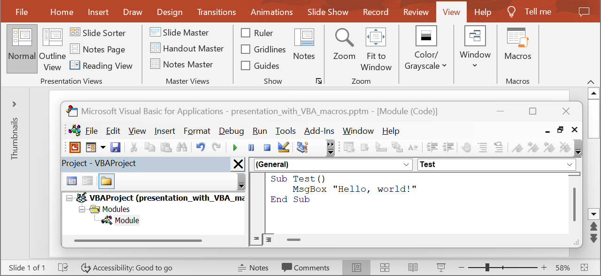

## **Обзор**

В этой статье рассматриваются ключевые возможности Aspose.Slides for .NET по работе с макросами в PowerPoint презентациях. Эта библиотека предоставляет удобные инструменты для добавления, удаления и извлечения макросов, что позволяет автоматизировать процесс создания и модификации презентаций.

С помощью Aspose.Slides for .NET можно:

- Ускорить разработку презентаций – автоматизация рутинных задач сокращает время подготовки материалов.
- Обеспечить гибкость – возможность управлять макросами позволяет адаптировать презентации под специфические задачи и сценарии.
- Интегрировать данные – простая интеграция с внешними источниками данных помогает актуализировать содержание слайдов.
- Упростить поддержку – централизованное управление макросами облегчает внесение изменений и обновление презентаций.

Далее в статье будут рассмотрены практические примеры по использованию возможностей Aspose.Slides for .NET для эффективной работы с макросами в PowerPoint.

Пространство имен [Aspose.Slides.Vba](https://reference.aspose.com/slides/net/aspose.slides.vba/) содержит классы и интерфейсы для работы с макросами и кодом VBA.

{} 

Когда вы конвертируете презентацию, содержащую макросы, в другой формат файла (PDF, HTML и т. д.), Aspose.Slides игнорирует все макросы (макросы не переносятся в результирующий файл).

Когда вы добавляете макросы в презентацию или сохраняете презентацию, содержащую макросы, Aspose.Slides просто записывает данные макросов.

Aspose.Slides **никогда** не выполняет макросы в презентации.

{}

## **Добавьте VBA макросы**

Aspose.Slides for .NET предоставляет класс [VbaProject](https://reference.aspose.com/slides/net/aspose.slides.vba/vbaproject/), который позволяет вам создавать VBA проекты и редактировать существующие модули. Вы можете использовать интерфейс [IVbaProject](https://reference.aspose.com/slides/net/aspose.slides.vba/ivbaproject/) для управления VBA, встроенным в презентацию.

Выполните следующие шаги, чтобы создать простой VBA проект в PowerPoint презентации:

1. Создайте экземпляр класса [Presentation](https://reference.aspose.com/slides/net/aspose.slides/presentation/).
1. Используйте конструктор [VbaProject](https://reference.aspose.com/slides/net/aspose.slides.vba/vbaproject/vbaproject/#constructor) для добавления нового VBA проекта.
1. Добавьте модуль в `VbaProject`.
1. Добавьте исходный код модуля.
1. Добавьте ссылки на библиотеку `stdole`.
1. Добавьте ссылки на **Microsoft Office**.
1. Свяжите ссылки с VBA проектом.
1. Сохраните презентацию.

Этот код на C# показывает, как добавить VBA макрос с нуля в презентацию:

```c#
// Создайте экземпляр класса презентации.
using (Presentation presentation = new Presentation())
{
    // Создайте новый VBA проект.
    presentation.VbaProject = new VbaProject();

    // Добавьте пустой модуль в VBA проект.
    IVbaModule module = presentation.VbaProject.Modules.AddEmptyModule("Module");
  
    // Добавьте исходный код модуля.
    module.SourceCode = 
        "Sub Test(oShape As Shape)" +
            "MsgBox \"Hello, world!\"" +
        "End Sub";

    // Создайте ссылку на библиотеку stdole.
    VbaReferenceOleTypeLib stdoleReference =
        new VbaReferenceOleTypeLib("stdole", "*\\G{00020430-0000-0000-C000-000000000046}#2.0#0#C:\\Windows\\system32\\stdole2.tlb#OLE Automation");

    // Создайте ссылку на Microsoft Office.
    VbaReferenceOleTypeLib officeReference =
        new VbaReferenceOleTypeLib("Office", "*\\G{2DF8D04C-5BFA-101B-BDE5-00AA0044DE52}#2.0#0#C:\\Program Files\\Common Files\\Microsoft Shared\\OFFICE14\\MSO.DLL#Библиотека объектов Microsoft Office 14.0");

    // Добавьте ссылки в VBA проект.
    presentation.VbaProject.References.Add(stdoleReference);
    presentation.VbaProject.References.Add(officeReference);

    // Сохраните презентацию.
    presentation.Save("presentation_with_VBA_macros.pptm", SaveFormat.Pptm);
}
```

Результат:



## **Удалите VBA макросы**

С помощью свойства [VbaProject](https://reference.aspose.com/slides/net/aspose.slides/presentation/vbaproject/) в классе [Presentation](https://reference.aspose.com/slides/net/aspose.slides/presentation/) вы можете удалить VBA макрос.

Выполните следующие шаги, чтобы удалить макрос из презентации:

1. Создайте экземпляр класса [Presentation](https://reference.aspose.com/slides/net/aspose.slides/presentation/) и загрузите презентацию, содержащую макрос.
1. Получите доступ к модулю макроса и удалите его.
1. Сохраните измененную презентацию.

Этот код на C# показывает, как удалить VBA макрос из презентации:

```c#
// Загрузите презентацию, содержащую макрос.
using (Presentation presentation = new Presentation("presentation_with_VBA_macros.pptm"))
{
    // Получите доступ к VBA модулю и удалите его. 
    presentation.VbaProject.Modules.Remove(presentation.VbaProject.Modules[0]);

    // Сохраните презентацию.
    presentation.Save("removed_VBA_macros.pptm", SaveFormat.Pptm);
}
```

{} 

Ознакомьтесь с **Aspose** [Удалителем макросов](https://products.aspose.app/slides/remove-macros) — бесплатным веб-приложением, предназначенным для удаления макросов из документов PowerPoint, Excel и Word. 

{} 

## **Извлеките VBA макросы**

С помощью свойства `Modules` в интерфейсе [IVbaProject](https://reference.aspose.com/slides/net/aspose.slides.vba/ivbaproject/) можно получить доступ ко всем модулям VBA проекта. Интерфейс [IVbaModule](https://reference.aspose.com/slides/net/aspose.slides.vba/ivbamodule/) можно использовать для извлечения свойств модуля, таких как имя и код.

Выполните следующие шаги, чтобы извлечь информацию о модулях VBA проекта:

1. Создайте экземпляр класса [Presentation](https://reference.aspose.com/slides/net/aspose.slides/presentation/) и загрузите презентацию, содержащую макрос.
2. Проверьте, содержит ли презентация проект VBA.
3. Переберите все модули, содержащиеся в проекте VBA, чтобы просмотреть макросы и их данные.

Этот код на C# показывает, как извлечь VBA макросы из презентации, содержащей макросы:

```c#
// Загрузите презентацию, содержащую макросы.
using (Presentation presentation = new Presentation("presentation_with_VBA_macros.pptm"))
{
    if (presentation.VbaProject != null) // Проверьте, содержит ли презентация проект VBA.
    {
        foreach (IVbaModule module in presentation.VbaProject.Modules)
        {
            Console.WriteLine($"Имя модуля: {module.Name}");
            Console.WriteLine("Исходный код:");
            Console.WriteLine(module.SourceCode);
        }
    }
}
```

Вывод:

```text
Имя модуля: Module
Исходный код:
Attribute VB_Name = "Module"
Sub Test()
    MsgBox "Hello, world!"
End Sub
```

## **Проверьте, защищен ли проект VBA паролем**

Используя свойство [IVbaProject.IsPasswordProtected](https://reference.aspose.com/slides/net/aspose.slides.vba/ivbaproject/ispasswordprotected/), вы можете проверить, защищены ли свойства проекта паролем.

Выполните следующие шаги, чтобы проверить, защищен ли проект VBA паролем для просмотра свойств проекта:

1. Создайте экземпляр класса [Presentation](https://reference.aspose.com/slides/net/aspose.slides/presentation/) и загрузите презентацию, содержащую макрос.
2. Проверьте, содержит ли презентация [VBA проект](https://reference.aspose.com/slides/net/aspose.slides.vba/vbaproject/).
3. Проверьте, защищен ли проект VBA паролем для просмотра свойств проекта.

Этот код на C# демонстрирует, как проверить, защищены ли свойства проекта паролем:

```c#
// Загрузите презентацию, содержащую макрос.
using (Presentation presentation = new Presentation("presentation_with_VBA_macros.pptm"))
{
    if (presentation.VbaProject == null) // Проверьте, содержит ли презентация проект VBA.
        return;

    if (presentation.VbaProject.IsPasswordProtected)
    {
        Console.WriteLine("Проект VBA '" + presentation.VbaProject.Name +
                            "' защищен паролем для просмотра свойств проекта.");
    }
}
```

## **Часто задаваемые вопросы**

**Какие операции с макросами поддерживаются?**

Aspose.Slides for .NET позволяет добавлять, удалять и извлекать макросы из презентаций, что упрощает автоматизацию обработки документов.

**Какие типы документов поддерживаются для работы с макросами?**

Aspose.Slides поддерживает работу с макросами во всех документах PowerPoint (PPTM, POTM, PPSM и PPT).

**Безопасно ли использование Aspose.Slides для работы с макросами?**

Aspose.Slides предоставляет API для добавления, удаления и извлечения макросов. Эта библиотека никогда не выполняет макросы в презентации, поэтому её использование является безопасным.

**Для чего используется удаление макросов?**

Удаление макросов помогает повысить безопасность документов, предотвратить выполнение потенциально вредоносного кода и обеспечить соответствие требованиям безопасности.
