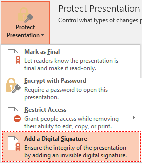

## **Обзор**

Цифровая подпись помогает получателю определить, кто подписал презентацию и изменилось ли подписанное содержимое. Здесь важны три связанных понятия безопасности:

- **цифровой сертификат** — это электронные учетные данные, связывающие идентичность с открытым ключом. Доверенный центр сертификации (CA) может выдавать сертификат, либо организация может использовать самоподписанный сертификат для внутренних процессов.
- **цифровая подпись** создаётся из содержимого презентации и закрытого ключа владельца сертификата. Затем открытый ключ сертификата используется для проверки подписи. Подпись предоставляет доказательства происхождения и целостности; она не шифрует презентацию.
- **Защита паролем** контролирует, может ли пользователь открыть или изменить презентацию. Это отдельный механизм от цифровой подписи и описан в [Презентации с защитой паролем](/nodejs-java/password-protected-presentation/).

PowerPoint предоставляет команду **Добавить цифровую подпись** в меню **File > Info > Protect Presentation**.



После открытия подписанной презентации PowerPoint может отобразить уведомление о статусе подписи.


Aspose.Slides раскрывает подписи через [Presentation.getDigitalSignatures](https://reference.aspose.com/slides/ru/nodejs-java/aspose.slides/presentation/#getDigitalSignatures--), который возвращает [DigitalSignatureCollection](https://reference.aspose.com/slides/ru/nodejs-java/aspose.slides/digitalsignaturecollection/) с объектами [DigitalSignature](https://reference.aspose.com/slides/ru/nodejs-java/aspose.slides/digitalsignature/). Презентация может содержать несколько подписей.

## **Понимание сертификатов PFX и паролей**

Файл PFX, также известный как файл PKCS#12 и обычно имеющий расширение `.pfx` или `.p12`, может содержать сертификат X.509, его закрытый ключ и цепочку сертификатов. Закрытый ключ позволяет владельцу создавать подпись. Сертификат без доступного закрытого ключа нельзя использовать для подписания презентации.

Пароль PFX защищает пакет сертификата и закрытый ключ. Это **не** пароль для открытия или редактирования презентации. Не сохраняйте файлы PFX и их пароли в системе контроля версий. В продакшене ограничьте доступ к файлу сертификата и получайте пароль из хранилища секретов или другого защищённого источника конфигурации. В примерах ниже используется переменная среды лишь для того, чтобы не встраивать пароль в код.

## **Добавление цифровой подписи к презентации**

Чтобы подписать реальную презентацию, загрузите существующий файл PPTX, создайте [DigitalSignature](https://reference.aspose.com/slides/ru/nodejs-java/aspose.slides/digitalsignature/) из сертификата PFX и его пароля, добавьте подпись в коллекцию презентации и сохраните в файл PPTX.

```javascript
const slides = require("aspose.slides.via.java");

const certificatePassword = process.env.PFX_PASSWORD;
if (!certificatePassword) {
    throw new Error("Set the PFX_PASSWORD environment variable.");
}

const presentation = new slides.Presentation("InputPresentation.pptx");
try {
    const signature = new slides.DigitalSignature("signing-certificate.pfx", certificatePassword);
    signature.setComments("Approved for release.");

    presentation.getDigitalSignatures().add(signature);
    presentation.save("InputPresentation-signed.pptx", slides.SaveFormat.Pptx);
} finally {
    presentation.dispose();
}
```

Сохранение результата под новым именем сохраняет исходный файл без подписи. Значение, установленное через [DigitalSignature.setComments](https://reference.aspose.com/slides/ru/nodejs-java/aspose.slides/digitalsignature/), описывает назначение подписи; это не средство контроля безопасности.

## **Проверка цифровых подписей**

При загрузке подписанного файла PPTX проверяйте каждый элемент, возвращаемый [Presentation.getDigitalSignatures](https://reference.aspose.com/slides/ru/nodejs-java/aspose.slides/presentation/#getDigitalSignatures--). Метод [DigitalSignature.isValid](https://reference.aspose.com/slides/ru/nodejs-java/aspose.slides/digitalsignature/) указывает, действительна ли встроенная подпись для текущего содержимого презентации.

Следующий пример также использует класс Node.js `X509Certificate` для чтения имени субъекта из каждого встроенного сертификата.

```javascript
const { X509Certificate } = require("node:crypto");
const slides = require("aspose.slides.via.java");

const presentation = new slides.Presentation("InputPresentation-signed.pptx");
try {
    const signatures = presentation.getDigitalSignatures();
    const signatureCount = signatures.size();

    if (signatureCount === 0) {
        console.log("The presentation does not contain digital signatures.");
    } else {
        let allSignaturesAreValid = true;

        for (let index = 0; index < signatureCount; index++) {
            const signature = signatures.get_Item(index);
            const signatureIsValid = signature.isValid();
            const signatureStatus = signatureIsValid ? "VALID" : "INVALID";
            const signTime = signature.getSignTime().toString();

            const certificateData = signature.getCertificate();
            const certificate = new X509Certificate(Buffer.from(certificateData));
            const signerName = certificate.subject;

            console.log(`${signerName}, ${signTime} -- ${signatureStatus}`);

            allSignaturesAreValid = allSignaturesAreValid && signatureIsValid;
        }

        if (allSignaturesAreValid) {
            console.log("All embedded signatures are valid for the current presentation.");
        } else {
            console.log("At least one embedded signature is invalid.");
        }
    }
} finally {
    presentation.dispose();
}
```

Неправильный результат обычно означает, что содержимое подписанной презентации или данные подписи изменились после подписания, либо файл повреждён. Удаление всех подписей приводит к презентации без подписи, поэтому проверка только валидности элементов недостаточна: в безопасных сценариях необходимо также убедиться, что присутствует ожидаемое количество подписей и ожидаемые идентификаторы подписантов.

Этот результат валидности не следует воспринимать как окончательное решение о доверии к сертификату. В зависимости от политики безопасности ваше приложение может также потребовать построения и проверки цепочки сертификатов X.509, проверки сроков действия и статуса отзыва, подтверждения ожидаемого субъекта или отпечатка, проверки назначения ключа и оценки доверенной метки времени. Значение [DigitalSignature.getSignTime](https://reference.aspose.com/slides/ru/nodejs-java/aspose.slides/digitalsignature/) само по себе не является доказательством от доверенного органа меток времени.

## **Удаление цифровых подписей**

Удаление подписей меняет состояние безопасности презентации. В примере ниже загружается подписанный файл PPTX, удаляются все подписи с помощью [DigitalSignatureCollection.clear](https://reference.aspose.com/slides/ru/nodejs-java/aspose.slides/digitalsignaturecollection/clear/), после чего сохраняется копия без подписи.

```javascript
const slides = require("aspose.slides.via.java");

const presentation = new slides.Presentation("InputPresentation-signed.pptx");
try {
    presentation.getDigitalSignatures().clear();
    presentation.save("InputPresentation-unsigned.pptx", slides.SaveFormat.Pptx);
} finally {
    presentation.dispose();
}
```

Чтобы удалить только одну подпись, вызовите [DigitalSignatureCollection.removeAt](https://reference.aspose.com/slides/ru/nodejs-java/aspose.slides/digitalsignaturecollection/removeat/) с её нулевым индексом. Сохраняйте в новый файл, если перезапись оригинального подписанного файла не является явной частью вашего процесса.

## **Редактирование и особенности форматов**

- Подпись не делает презентацию только для чтения. Пользователи и приложения могут по‑прежнему редактировать файл, но изменения подписанного содержимого обычно аннулируют существующую подпись.
- Выполните все необходимые правки до подписания. Если необходимо изменить презентацию, сохраните её обновлённую версию и подпишите её повторно.
- Сохраняйте окончательный результат в формате PPTX. Конверсия подписанной презентации в другой формат не переносит оригинальную подпись PPTX как действительную подпись в преобразованном файле.
- Обращайтесь с закрытым ключом сертификата как с конфиденциальной информацией. Любой, кто получит закрытый ключ и его пароль, сможет создавать подписи, которые будут выглядеть как подписи от владельца сертификата.
- Сохраняйте исходный несigned файл или другую контролируемую копию, если это требует политика удержания документов.

## **FAQ**

**Шифрует ли цифровая подпись презентацию?**

Нет. Цифровая подпись предоставляет доказательства происхождения и целостности, но содержание презентации остаётся читаемым, если не применяется отдельное шифрование. Используйте [защиту паролем](/nodejs-java/password-protected-presentation/), когда доступ к содержимому необходимо ограничить.

**Совпадает ли пароль PFX с паролем презентации?**

Нет. Пароль PFX разблокирует закрытый ключ, хранящийся в пакете сертификата. Он не контролирует, кто может открыть или отредактировать файл PPTX.

**Можно ли использовать самоподписанный сертификат?**

Технически да, если в самоподписанном сертификате есть доступный закрытый ключ. Однако получатели не будут автоматически ему доверять, если только сертификат явно не добавлен в их доверенную среду. В публичных или межорганизационных процессах обычно используют сертификат, выданный доверенным CA.

**Что делает подпись недействительной?**

Изменение подписанного содержимого презентации или данных подписи после подписания аннулирует подпись. Повреждение файла также может привести к ошибке проверки. Если удалить все подписи, презентация будет без подписи, а не с недействительной подписью.

**Означает ли действительная подпись, что следует доверять подписанту?**

Не автоматически. Целостность подписи и доверие к подписанту – отдельные решения. Политика проверки в продакшене должна также проверять цепочку сертификатов, срок действия, статус отзыва, ожидаемую личность, назначение ключа и любые требования к доверенным меткам времени.

**Что происходит, когда сертификат истекает?**

Истечение срока действия сертификата не меняет байты презентации, но влияет на оценку доверия к сертификату. Приёмлемость подписи зависит от вашей политики и от того, подтверждает ли доверенная метка времени, что подпись была выполнена, пока сертификат был действителен. Не полагайтесь только на отображаемое время подписи как на доверенную метку времени.

**Можно ли редактировать подписанную презентацию?**

Да. Подписание не блокирует файл. Редактирование подписанного содержимого обычно делает существующую подпись недействительной, поэтому завершайте правки и затем подпишите финальную версию.

**Может ли презентация содержать более одной подписи?**

Да. Добавляйте каждую подпись в коллекцию, возвращаемую [Presentation.getDigitalSignatures](https://reference.aspose.com/slides/ru/nodejs-java/aspose.slides/presentation/#getDigitalSignatures--), перед сохранением. При проверке инспектируйте каждую подпись и убедитесь, что присутствуют все требуемые подписанты.

**Какие форматы презентаций поддерживают эти операции?**

Aspose.Slides поддерживает описанные здесь операции с цифровой подписью только для PPTX. Форматы PPT и OpenDocument не поддерживаются этим API‑потоком.

**Можно ли удалить подпись, не затронув слайды?**

Да. Можно удалить одну подпись или очистить всю коллекцию, а затем сохранить презентацию. Содержимое слайдов остаётся, но сохранённый файл больше не содержит доказательства удалённой подписи.