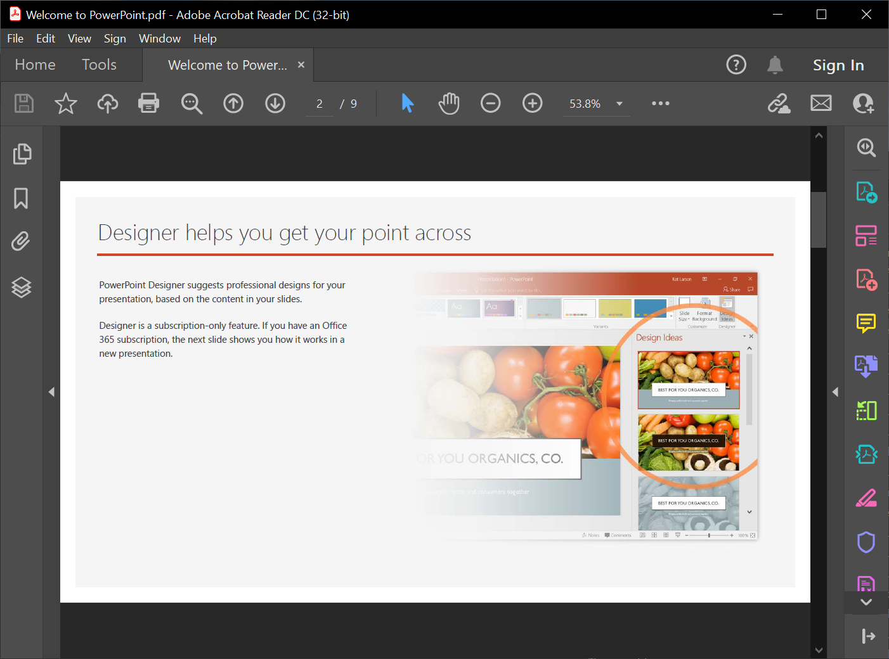

## **Введение**

Aspose.Slides for Python via Java может преобразовывать страницы PDF или содержимое HTML в слайды PowerPoint без Microsoft PowerPoint. Класс [SlideCollection](https://reference.aspose.com/slides/ru/python-java/aspose.slides/slidecollection/) предоставляет [addFromPdf](https://reference.aspose.com/slides/ru/python-java/aspose.slides/slidecollection/#addFromPdf) и [addFromHtml](https://reference.aspose.com/slides/ru/python-java/aspose.slides/slidecollection/#addFromHtml) для добавления импортированного содержимого в презентацию.

Для более точного контроля размещения HTML метод [SlideCollection.insertFromHtml](https://reference.aspose.com/slides/ru/python-java/aspose.slides/slidecollection/#insertFromHtml) может вставлять сгенерированные слайды в указанный индекс коллекции или начинать заполнять доступное пространство на существующем слайде. Длинный HTML автоматически разбивается на дополнительные слайды, источник может быть передан как строка или поток, а внешние ресурсы могут загружаться через [ExternalResourceResolver](https://reference.aspose.com/slides/ru/python-java/aspose.slides/externalresourceresolver/) с базовым URI. Возвращаемый массив [Slide](https://reference.aspose.com/slides/ru/python-java/aspose.slides/slide/) идентифицирует затронутые и новосозданные слайды.

## **Импорт из PDF**

Для преобразования PDF‑документа в презентацию PowerPoint импортируйте его содержимое в коллекцию слайдов и сохраните результат в файл PPTX.



1. Создайте новый объект [Presentation](https://reference.aspose.com/slides/ru/python-java/aspose.slides/presentation/).
2. Вызовите [addFromPdf](https://reference.aspose.com/slides/ru/python-java/aspose.slides/slidecollection/#addFromPdf) с путем к PDF‑файлу.
3. Вызовите [save](https://reference.aspose.com/slides/ru/python-java/aspose.slides/presentation/#save) с [SaveFormat.Pptx](https://reference.aspose.com/slides/ru/python-java/aspose.slides/saveformat/#Pptx), чтобы записать презентацию в файл PPTX.

Следующий пример на Python импортирует PDF‑документ и сохраняет сгенерированные слайды как презентацию PowerPoint:

```python
import jpype
import asposeslides

if not jpype.isJVMStarted():
    jpype.startJVM()

from asposeslides.api import Presentation, SaveFormat

presentation = Presentation()
try:
    presentation.getSlides().addFromPdf("document.pdf")
    presentation.save("presentation.pptx", SaveFormat.Pptx)
finally:
    presentation.dispose()
```

По умолчанию в презентацию остаётся пустой слайд, потому что импорт добавляет слайды. Чтобы оставить только импортированные страницы, очистите коллекцию слайдов с помощью [SlideCollection.clear](https://reference.aspose.com/slides/ru/python-java/aspose.slides/slidecollection/#clear) перед импортом.

Метод [addFromPdf](https://reference.aspose.com/slides/ru/python-java/aspose.slides/slidecollection/#addFromPdf) возвращает добавленные слайды, что удобно, когда нужно обрабатывать только импортированные слайды.

{}
Попробуйте бесплатное веб‑приложение [PDF to PowerPoint](https://products.aspose.app/slides/ru/import/pdf-to-powerpoint), чтобы увидеть этот процесс конвертации в действии.
{}

## **Импорт из HTML**

Aspose.Slides также может создавать слайды из HTML‑документа. Источник может быть предоставлен как HTML‑текст или поток. Ниже приведены шаги с использованием файлового потока:

1. Создайте новый объект [Presentation](https://reference.aspose.com/slides/ru/python-java/aspose.slides/presentation/).
2. Откройте HTML‑файл для чтения и передайте поток в [addFromHtml](https://reference.aspose.com/slides/ru/python-java/aspose.slides/slidecollection/#addFromHtml).
3. Вызовите [save](https://reference.aspose.com/slides/ru/python-java/aspose.slides/presentation/#save) с [SaveFormat.Pptx](https://reference.aspose.com/slides/ru/python-java/aspose.slides/saveformat/#Pptx), чтобы записать результат в файл PPTX.

Следующий пример на Python импортирует HTML‑документ и сохраняет сгенерированные слайды как презентацию PowerPoint:

```python
import jpype
import asposeslides

if not jpype.isJVMStarted():
    jpype.startJVM()

from asposeslides.api import Presentation, SaveFormat
from java.io import FileInputStream

presentation = Presentation()
try:
    html_stream = FileInputStream("page.html")
    try:
        presentation.getSlides().addFromHtml(html_stream)
    finally:
        html_stream.close()
    presentation.save("presentation.pptx", SaveFormat.Pptx)
finally:
    presentation.dispose()
```

## **Вставка HTML‑контента**

Используйте [SlideCollection.insertFromHtml](https://reference.aspose.com/slides/ru/python-java/aspose.slides/slidecollection/#insertFromHtml), когда слайды, сгенерированные из HTML, необходимо разместить в определённом месте, а не добавить в конец. Индекс начинается с нуля и указывает позицию, с которой начинается импорт.

Аргумент `useSlideWithIndexAsStart` определяет, как импортировщик использует эту позицию:

- Когда он `False`, импортировщик создаёт новые слайды в указанном индексе и сдвигает последующие слайды.
- Когда он `True`, импортировщик начинает размещать содержимое в доступном пространстве существующего слайда с этим индексом. Если HTML не помещается, Aspose.Slides автоматически разбивает его на несколько слайдов и вставляет дополнительные слайды сразу после начального.

[SlideCollection.insertFromHtml](https://reference.aspose.com/slides/ru/python-java/aspose.slides/slidecollection/#insertFromHtml) возвращает массив объектов [Slide](https://reference.aspose.com/slides/ru/python-java/aspose.slides/slide/). Когда вставка начинается на новых слайдах, каждый возвращённый элемент является новым. Когда в качестве начала используется существующий слайд, массив включает этот затронутый слайд, за которым следуют новые слайды‑переполнения. Вы можете анализировать этот массив вместо расчёта затронутого диапазона по общему количеству слайдов в презентации.

### **Вставка HTML как новых слайдов**

Следующий пример передаёт HTML как строку и вставляет сгенерированные слайды в коллекцию по индексу `1`. Передача `False` оставляет существующие слайды без изменений, кроме их сдвига для освобождения места.

```python
import jpype
import asposeslides

if not jpype.isJVMStarted():
    jpype.startJVM()

from asposeslides.api import Presentation, SaveFormat

presentation = Presentation()
try:
    layout_slide = presentation.getLayoutSlides().get_Item(0)
    presentation.getSlides().addEmptySlide(layout_slide)
    presentation.getSlides().addEmptySlide(layout_slide)

    insert_index = 1
    html = "<html><body><h1>Quarterly update</h1><p>This content is inserted before the slide that was at index 1.</p></body></html>"
    inserted_slides = presentation.getSlides().insertFromHtml(insert_index, html, False)

    for slide in inserted_slides:
        print("Inserted slide index:", presentation.getSlides().indexOf(slide))

    presentation.save("presentation-with-inserted-html.pptx", SaveFormat.Pptx)
finally:
    presentation.dispose()
```

### **Начало на существующем слайде**

Следующий пример передаёт HTML через поток. Он сохраняет форму заголовка на существующем шаблонном слайде, начинает импорт под занятым участком и позволяет длинному содержимому продолжаться на новых слайдах.

HTML также содержит относительный URL изображения. [ExternalResourceResolver](https://reference.aspose.com/slides/ru/python-java/aspose.slides/externalresourceresolver/) получает ресурс, а базовый URI подсказывает импортировщику, как разрешать `images/logo.png`. В этом примере файл ожидается по пути `html-assets/images/logo.png`.

```python
from pathlib import Path

import jpype
import asposeslides

if not jpype.isJVMStarted():
    jpype.startJVM()

from asposeslides.api import ExternalResourceResolver, Presentation, SaveFormat, ShapeType
from java.io import ByteArrayInputStream

presentation = Presentation()
try:
    template_slide = presentation.getSlides().get_Item(0)
    header = template_slide.getShapes().addAutoShape(ShapeType.Rectangle, 20, 20, 680, 60)
    header.getTextFrame().setText("Product roadmap")

    html_parts = ["<html><body><h2>Roadmap details</h2>"]
    for item_index in range(1, 61):
        html_parts.append(f"<p style='font-size:24pt'>Roadmap item {item_index}: detailed implementation notes.</p>")
    html_parts.append("</body></html>")

    html = "".join(html_parts)
    html_data = html.encode("utf-8")
    resolver = ExternalResourceResolver()
    base_directory = Path("html-assets").resolve()
    base_uri = base_directory.as_uri() + "/"

    html_stream = ByteArrayInputStream(html_data)
    try:
        affected_slides = presentation.getSlides().insertFromHtml(0, html_stream, resolver, base_uri, True)
        for slide in affected_slides:
            print("Affected slide index:", presentation.getSlides().indexOf(slide))
    finally:
        html_stream.close()

    presentation.save("presentation-with-html-overflow.pptx", SaveFormat.Pptx)
finally:
    presentation.dispose()
```

{}
Неограниченный внешнй резолвер ресурсов может читать локальные или сетевые ресурсы, указанные в HTML. Для недоверенного ввода проверяйте и очищайте URL‑адреса ресурсов в соответствии со списком разрешённых схем, каталогов и хостов перед импортом HTML.
{}

## **Часто задаваемые вопросы**

**Может ли Aspose.Slides обнаруживать таблицы при импорте PDF?**

Да. Создайте объект [PdfImportOptions](https://reference.aspose.com/slides/ru/python-java/aspose.slides/pdfimportoptions/), вызовите [setDetectTables](https://reference.aspose.com/slides/ru/python-java/aspose.slides/pdfimportoptions/#setDetectTables) со значением `True` и передайте параметры в [addFromPdf](https://reference.aspose.com/slides/ru/python-java/aspose.slides/slidecollection/#addFromPdf). Качество распознавания таблиц зависит от структуры и сложности исходного PDF.

{}
После импорта HTML вы также можете экспортировать слайды в [images](/slides/ru/python-java/convert-powerpoint-to-png/), [TIFF](/slides/ru/python-java/convert-powerpoint-to-tiff/) или [SVG](/slides/ru/python-java/render-a-slide-as-an-svg-image/).
{}