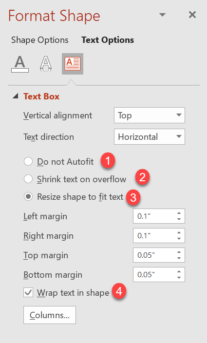

## **Введение**

По умолчанию, когда вы добавляете текстовое поле, Microsoft PowerPoint использует параметр **Resize shape to fix text** для текстового поля — он автоматически изменяет размер текстового поля, чтобы его текст всегда помещался в нём. 


* Когда текст в текстовом поле становится длиннее или больше, PowerPoint автоматически увеличивает текстовое поле — увеличивает его высоту — чтобы в нём могла помещаться больше текста. 
* Когда текст в текстовом поле становится короче или меньше, PowerPoint автоматически уменьшает текстовое поле — уменьшает его высоту — чтобы избавиться от лишнего пространства. 

В PowerPoint это 4 важных параметра или опции, контролирующие поведение автоадаптации для текстового поля: 

* **Do not Autofit**
* **Shrink text on overflow**
* **Resize shape to fit text**
* **Wrap text in shape.**



Aspose.Slides for Python via Java предоставляет аналогичные параметры — некоторые свойства класса [TextFrameFormat](https://reference.aspose.com/slides/ru/python-java/aspose.slides/textframeformat/) — которые позволяют управлять поведением автоадаптации текстовых полей в презентациях. 

## **Изменение размера фигуры под текст**

Если вы хотите, чтобы текст в коробке всегда помещался в эту коробку после изменения текста, необходимо использовать параметр **Resize shape to fix text**. Чтобы задать эту настройку, используйте метод [setAutofitType](https://reference.aspose.com/slides/ru/python-java/aspose.slides/textframeformat/#setAutofitType) (класса [TextFrameFormat](https://reference.aspose.com/slides/ru/python-java/aspose.slides/textframeformat/)) с параметром [Shape](https://reference.aspose.com/slides/ru/python-java/aspose.slides/textautofittype/#Shape).


Этот код на Python показывает, как задать, чтобы текст всегда помещался в свою коробку в презентации PowerPoint:

```python
import jpype
import asposeslides

if not jpype.isJVMStarted():
    jpype.startJVM()

from asposeslides.api import Presentation, ShapeType, Portion, FillType, TextAutofitType, SaveFormat
from java.awt import Color

presentation = Presentation()
try:
    slide = presentation.getSlides().get_Item(0)
    auto_shape = slide.getShapes().addAutoShape(ShapeType.Rectangle, 30, 30, 350, 100)

    portion = Portion("lorem ipsum...")
    portion.getPortionFormat().getFillFormat().getSolidFillColor().setColor(Color.BLACK)
    portion.getPortionFormat().getFillFormat().setFillType(FillType.Solid)
    auto_shape.getTextFrame().getParagraphs().get_Item(0).getPortions().add(portion)

    text_frame_format = auto_shape.getTextFrame().getTextFrameFormat()
    text_frame_format.setAutofitType(TextAutofitType.Shape)

    presentation.save("Output-presentation.pptx", SaveFormat.Pptx)
finally:
    presentation.dispose()
```

Если текст станет длиннее или больше, текстовое поле будет автоматически изменено (увеличится по высоте), чтобы весь текст помещался в нём. Если текст станет короче, произойдёт обратное. 

## **Не автоадаптировать**

Если вы хотите, чтобы текстовое поле или фигура сохраняли свои размеры независимо от изменений текста внутри, необходимо использовать параметр **Do not Autofit**. Чтобы задать эту настройку, используйте метод [setAutofitType](https://reference.aspose.com/slides/ru/python-java/aspose.slides/textframeformat/#setAutofitType) (класса [TextFrameFormat](https://reference.aspose.com/slides/ru/python-java/aspose.slides/textframeformat/)) с параметром [None](https://reference.aspose.com/slides/ru/python-java/aspose.slides/textautofittype/#None). 


Этот код на Python показывает, как задать, чтобы текстовое поле всегда сохраняло свои размеры в презентации PowerPoint:

```python
import jpype
import asposeslides

if not jpype.isJVMStarted():
    jpype.startJVM()

from asposeslides.api import Presentation, ShapeType, Portion, FillType, TextAutofitType, SaveFormat
from java.awt import Color

presentation = Presentation()
try:
    slide = presentation.getSlides().get_Item(0)
    auto_shape = slide.getShapes().addAutoShape(ShapeType.Rectangle, 30, 30, 350, 100)

    portion = Portion("lorem ipsum...")
    portion.getPortionFormat().getFillFormat().getSolidFillColor().setColor(Color.BLACK)
    portion.getPortionFormat().getFillFormat().setFillType(FillType.Solid)
    auto_shape.getTextFrame().getParagraphs().get_Item(0).getPortions().add(portion)

    text_frame_format = auto_shape.getTextFrame().getTextFrameFormat()
    text_frame_format.setAutofitType(TextAutofitType.None)

    presentation.save("Output-presentation.pptx", SaveFormat.Pptx)
finally:
    presentation.dispose()
```

Когда текст становится слишком длинным для своего поля, он выходит за его пределы. 

## **Уменьшать текст при переполнении**

Если текст становится слишком длинным для своего поля, через опцию **Shrink text on overflow** вы можете задать, чтобы размер и межбуквенный интервал текста уменьшались, позволяя ему поместиться в поле. Чтобы задать эту настройку, используйте метод [setAutofitType](https://reference.aspose.com/slides/ru/python-java/aspose.slides/textframeformat/#setAutofitType) (класса [TextFrameFormat](https://reference.aspose.com/slides/ru/python-java/aspose.slides/textframeformat/)) с параметром [Normal](https://reference.aspose.com/slides/ru/python-java/aspose.slides/textautofittype/#Normal).


Этот код на Python показывает, как задать, чтобы текст уменьшался при переполнении в презентации PowerPoint:

```python
import jpype
import asposeslides

if not jpype.isJVMStarted():
    jpype.startJVM()

from asposeslides.api import Presentation, ShapeType, Portion, FillType, TextAutofitType, SaveFormat
from java.awt import Color

presentation = Presentation()
try:
    slide = presentation.getSlides().get_Item(0)
    auto_shape = slide.getShapes().addAutoShape(ShapeType.Rectangle, 30, 30, 350, 100)

    portion = Portion("lorem ipsum...")
    portion.getPortionFormat().getFillFormat().getSolidFillColor().setColor(Color.BLACK)
    portion.getPortionFormat().getFillFormat().setFillType(FillType.Solid)
    auto_shape.getTextFrame().getParagraphs().get_Item(0).getPortions().add(portion)

    text_frame_format = auto_shape.getTextFrame().getTextFrameFormat()
    text_frame_format.setAutofitType(TextAutofitType.Normal)

    presentation.save("Output-presentation.pptx", SaveFormat.Pptx)
finally:
    presentation.dispose()
```

{}
При использовании опции **Shrink text on overflow** настройка применяется только тогда, когда текст становится слишком длинным для своего поля. 
{}

## **Обтекание текста**

Если вы хотите, чтобы текст в фигуре автоматически переносился внутри этой фигуры, когда текст выходит за её границу по ширине, необходимо использовать параметр **Wrap text in shape**. Чтобы задать эту настройку, используйте метод [setWrapText](https://reference.aspose.com/slides/ru/python-java/aspose.slides/textframeformat/#setWrapText) (класса [TextFrameFormat](https://reference.aspose.com/slides/ru/python-java/aspose.slides/textframeformat/)) с параметром [NullableBool.True](https://reference.aspose.com/slides/ru/python-java/aspose.slides/nullablebool/#True). 

Этот код на Python показывает, как использовать настройку Wrap Text в презентации PowerPoint:

```python
import jpype
import asposeslides

if not jpype.isJVMStarted():
    jpype.startJVM()

from asposeslides.api import Presentation, ShapeType, Portion, FillType, NullableBool, SaveFormat
from java.awt import Color

presentation = Presentation()
try:
    slide = presentation.getSlides().get_Item(0)
    auto_shape = slide.getShapes().addAutoShape(ShapeType.Rectangle, 30, 30, 350, 100)

    portion = Portion("lorem ipsum...")
    portion.getPortionFormat().getFillFormat().getSolidFillColor().setColor(Color.BLACK)
    portion.getPortionFormat().getFillFormat().setFillType(FillType.Solid)
    auto_shape.getTextFrame().getParagraphs().get_Item(0).getPortions().add(portion)

    text_frame_format = auto_shape.getTextFrame().getTextFrameFormat()
    text_frame_format.setWrapText(NullableBool.True)

    presentation.save("Output-presentation.pptx", SaveFormat.Pptx)
finally:
    presentation.dispose()
```

{} 
Если вы используете метод [setWrapText](https://reference.aspose.com/slides/ru/python-java/aspose.slides/textframeformat/#setWrapText) с параметром [NullableBool.False](https://reference.aspose.com/slides/ru/python-java/aspose.slides/nullablebool/#False) для фигуры, когда текст внутри фигуры становится длиннее её ширины, текст будет вытягиваться за границы фигуры в одну строку. 
{}

## **Часто задаваемые вопросы**

**Влияют ли внутренние отступы текстовой рамки на AutoFit?**

Да. Отступы (внутренние поля) уменьшают доступную площадь для текста, поэтому AutoFit срабатывает раньше — уменьшает шрифт или размер фигуры быстрее. Проверьте и настройте отступы перед настройкой AutoFit. 

**Как AutoFit взаимодействует с ручными и мягкими разрывами строк?**

Принудительные разрывы остаются на месте, а AutoFit подгоняет размер шрифта и интервал вокруг них. Удаление лишних разрывов часто уменьшает степень, с которой AutoFit вынужден уменьшать текст. 

**Влияет ли изменение шрифта темы или замена шрифта на результаты AutoFit?**

Да. Замена шрифта на другой с другими метриками глифов меняет ширину/высоту текста, что может изменить конечный размер шрифта и перенос строк. После любой смены шрифта или подстановки следует пересмотреть слайды.