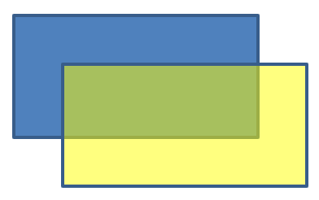

## **Введение**

В PowerPoint можно добавлять фигуры на слайды. Поскольку фигуры состоят из линий, их можно форматировать, изменяя или применяя эффекты к контуру. Кроме того, можно задавать параметры заливки, определяющие, как будет заполнено внутреннее пространство фигур.


Aspose.Slides for Python via Java предоставляет классы и методы, позволяющие форматировать фигуры с использованием тех же параметров, что доступны в PowerPoint.

## **Форматирование линий**

С помощью Aspose.Slides можно задать пользовательский стиль линии для фигуры. Ниже перечислены шаги процедуры:

1. Создайте экземпляр класса [Presentation](https://reference.aspose.com/slides/ru/python-java/aspose.slides/presentation/).
1. Получите ссылку на слайд по его индексу.
1. Добавьте [AutoShape](https://reference.aspose.com/slides/ru/python-java/aspose.slides/autoshape/) на слайд.
1. Установите [line style](https://reference.aspose.com/slides/ru/python-java/aspose.slides/linestyle/) фигуры.
1. Задайте толщину линии.
1. Установите [dash style](https://reference.aspose.com/slides/ru/python-java/aspose.slides/linedashstyle/) линии.
1. Установите цвет линии для фигуры.
1. Сохраните измененную презентацию в файл PPTX.

Ниже приведён код, демонстрирующий, как отформатировать прямоугольник [AutoShape](https://reference.aspose.com/slides/ru/python-java/aspose.slides/autoshape/):

```python
import jpype
import asposeslides

if not jpype.isJVMStarted():
    jpype.startJVM()

from asposeslides.api import FillType, LineDashStyle, LineStyle, Presentation, SaveFormat, ShapeType
from java.awt import Color

# Создайте экземпляр класса Presentation, представляющего файл презентации.
presentation = Presentation()
try:
    # Получить первый слайд.
    slide = presentation.getSlides().get_Item(0)

    # Добавить автофигуру типа Rectangle.
    shape = slide.getShapes().addAutoShape(ShapeType.Rectangle, 50, 150, 150, 75)

    # Установить цвет заливки для прямоугольника.
    shape.getFillFormat().setFillType(FillType.NoFill)

    # Применить форматирование к линиям прямоугольника.
    shape.getLineFormat().setStyle(LineStyle.ThickThin)
    shape.getLineFormat().setWidth(7)
    shape.getLineFormat().setDashStyle(LineDashStyle.Dash)

    # Установить цвет линии прямоугольника.
    shape.getLineFormat().getFillFormat().setFillType(FillType.Solid)
    shape.getLineFormat().getFillFormat().getSolidFillColor().setColor(Color.BLUE)

    # Сохранить файл PPTX на диск.
    presentation.save("formatted_lines.pptx", SaveFormat.Pptx)
finally:
    presentation.dispose()
```

Результат:


## **Применение эффектов «скетч» к линиям фигур**

Эффект «скетч» делает линию фигуры выглядящей нарисованной от руки. Используйте [Shape.getLineFormat](https://reference.aspose.com/slides/ru/python-java/aspose.slides/shape/#getLineFormat) для доступа к параметрам линии, [LineFormat.getSketchFormat](https://reference.aspose.com/slides/ru/python-java/aspose.slides/lineformat/#getSketchFormat) для доступа к настройкам скетча и [SketchFormat.setSketchType](https://reference.aspose.com/slides/ru/python-java/aspose.slides/sketchformat/#setSketchType) для выбора значения из перечисления [LineSketchType](https://reference.aspose.com/slides/ru/python-java/aspose.slides/linesketchtype/).

Ниже показан Python‑код, который применяет эффект [LineSketchType.Curved](https://reference.aspose.com/slides/ru/python-java/aspose.slides/linesketchtype/#Curved), считывает явно заданное значение и удаляет эффект с помощью [LineSketchType.None_](https://reference.aspose.com/slides/ru/python-java/aspose.slides/linesketchtype/#None):

```python
import jpime
import asposeslides

if not jpype.isJVMStarted():
    jpime.startJVM()

from asposeslides.api import LineSketchType, Presentation, ShapeType

presentation = Presentation()
try:
    slide = presentation.getSlides().get_Item(0)
    shape = slide.getShapes().addAutoShape(ShapeType.Rectangle, 50, 50, 200, 100)

    #     Получить формат линии фигуры и её скетч‑формат.
    sketch_format = shape.getLineFormat().getSketchFormat()

    #     Применить эффект скетч.
    sketch_format.setSketchType(LineSketchType.Curved)

    #     Прочитать эффект скетч, назначенный непосредственно фигуре.
    explicit_sketch_type = sketch_format.getSketchType()
    print(f"Explicit sketch type: {explicit_sketch_type}")

    #     Удалить эффект скетч.
    sketch_format.setSketchType(LineSketchType.None_)
finally:
    presentation.dispose()
```

Значение, возвращаемое [SketchFormat.getSketchType](https://reference.aspose.com/slides/ru/python-java/aspose.slides/sketchformat/#getSketchType), представляет настройку, непосредственно присвоенную фигуре. Если форматирование линии может наследоваться от темы, мастер‑слайда или макета, используйте [LineFormat.getEffective](https://reference.aspose.com/slides/ru/python-java/aspose.slides/lineformat/#getEffective), доступ к `LineFormatEffectiveData.getSketchFormat` и чтение `SketchFormatEffectiveData.getSketchType`. Эффективное значение отражает фактическое форматирование после разрешения наследования:

```python
import jpype
import asposeslides

if not jpype.isJVMStarted():
    jpype.startJVM()

from asposeslides.api import Presentation

presentation = Presentation("presentation.pptx")
try:
    shape = presentation.getSlides().get_Item(0).getShapes().get_Item(0)
    line_format = shape.getLineFormat()

    explicit_sketch_type = line_format.getSketchFormat().getSketchType()
    effective_line_format = line_format.getEffective()
    effective_sketch_type = effective_line_format.getSketchFormat().getSketchType()

    print(f"Explicit sketch type: {explicit_sketch_type}")
    print(f"Effective sketch type: {effective_sketch_type}")
finally:
    presentation.dispose()
```

## **Форматирование стилей соединений**

Существует три варианта типа соединения:

* Round
* Miter
* Bevel

По умолчанию, когда PowerPoint соединяет две линии под углом (например, в углу фигуры), используется настройка **Round**. Однако при рисовании фигур с острыми углами может быть предпочтительнее вариант **Miter**.


Ниже приведён Python‑код, демонстрирующий, как три прямоугольника (как показано на изображении выше) были созданы с использованием настроек соединений Miter, Bevel и Round:

```python
import jpype
import asposeslides

if not jpype.isJVMStarted():
    jpype.startJVM()

from asposeslides.api import FillType, LineJoinStyle, Presentation, SaveFormat, ShapeType
from java.awt import Color

# Создайте экземпляр класса Presentation, представляющего файл презентации.
presentation = Presentation()
try:
    # Получить первый слайд.
    slide = presentation.getSlides().get_Item(0)

    # Добавить три автофигуры типа Rectangle.
    miter_shape = slide.getShapes().addAutoShape(ShapeType.Rectangle, 20, 20, 150, 75)
    bevel_shape = slide.getShapes().addAutoShape(ShapeType.Rectangle, 210, 20, 150, 75)
    round_shape = slide.getShapes().addAutoShape(ShapeType.Rectangle, 20, 135, 150, 75)

    # Установить цвет заливки для каждой прямоугольной фигуры.
    miter_shape.getFillFormat().setFillType(FillType.Solid)
    miter_shape.getFillFormat().getSolidFillColor().setColor(Color.BLACK)
    bevel_shape.getFillFormat().setFillType(FillType.Solid)
    bevel_shape.getFillFormat().getSolidFillColor().setColor(Color.BLACK)
    round_shape.getFillFormat().setFillType(FillType.Solid)
    round_shape.getFillFormat().getSolidFillColor().setColor(Color.BLACK)

    # Установить толщину линии.
    miter_shape.getLineFormat().setWidth(15)
    bevel_shape.getLineFormat().setWidth(15)
    round_shape.getLineFormat().setWidth(15)

    # Установить цвет линии для каждого прямоугольника.
    miter_shape.getLineFormat().getFillFormat().setFillType(FillType.Solid)
    miter_shape.getLineFormat().getFillFormat().getSolidFillColor().setColor(Color.BLUE)
    bevel_shape.getLineFormat().getFillFormat().setFillType(FillType.Solid)
    bevel_shape.getLineFormat().getFillFormat().getSolidFillColor().setColor(Color.BLUE)
    round_shape.getLineFormat().getFillFormat().setFillType(FillType.Solid)
    round_shape.getLineFormat().getFillFormat().getSolidFillColor().setColor(Color.BLUE)

    # Установить стиль соединения.
    miter_shape.getLineFormat().setJoinStyle(LineJoinStyle.Miter)
    bevel_shape.getLineFormat().setJoinStyle(LineJoinStyle.Bevel)
    round_shape.getLineFormat().setJoinStyle(LineJoinStyle.Round)

    # Добавить текст к каждому прямоугольнику.
    miter_shape.getTextFrame().setText("Miter Join Style")
    bevel_shape.getTextFrame().setText("Bevel Join Style")
    round_shape.getTextFrame().setText("Round Join Style")

    # Сохранить файл PPTX на диск.
    presentation.save("join_styles.pptx", SaveFormat.Pptx)
finally:
    presentation.dispose()
```

## **Градиентная заливка**

В PowerPoint градиентная заливка — это параметр форматирования, позволяющий применить к фигуре плавный переход цветов. Например, можно задать два и более цветов так, чтобы один постепенно переходил в другой.

Как применить градиентную заливку к фигуре с помощью Aspose.Slides:

1. Создайте экземпляр класса [Presentation](https://reference.aspose.com/slides/ru/python-java/aspose.slides/presentation/).
1. Получите ссылку на слайд по его индексу.
1. Добавьте [AutoShape](https://reference.aspose.com/slides/ru/python-java/aspose.slides/autoshape/) на слайд.
1. Установите у фигуры [FillType](https://reference.aspose.com/slides/ru/python-java/aspose.slides/filltype/) в значение `Gradient`.
1. Добавьте два предпочтительных цвета с определёнными позициями, используя метод [addPresetColor](https://reference.aspose.com/slides/ru/python-java/aspose.slides/gradientstopcollection/#addPresetColor) коллекции градиентных остановок, предоставленной классом [GradientFormat](https://reference.aspose.com/slides/ru/python-java/aspose.slides/gradientformat/).
1. Сохраните изменённую презентацию в файл PPTX.

Ниже показан Python‑код, демонстрирующий, как применить градиентную заливку к эллипсу:

```python
import jpype
import asposeslides

if not jpype.isJVMStarted():
    jpype.startJVM()

from asposeslides.api import FillType, GradientDirection, GradientShape, Presentation, PresetColor, SaveFormat, ShapeType
from java.awt import Color

# Создайте экземпляр класса Presentation, представляющего файл презентации.
presentation = Presentation()
try:
    # Получить первый слайд.
    slide = presentation.getSlides().get_Item(0)

    # Добавить автофигуру типа Ellipse.
    shape = slide.getShapes().addAutoShape(ShapeType.Ellipse, 50, 50, 150, 75)

    # Применить градиентное форматирование к эллипсу.
    shape.getFillFormat().setFillType(FillType.Gradient)
    shape.getFillFormat().getGradientFormat().setGradientShape(GradientShape.Linear)

    # Установить направление градиента.
    shape.getFillFormat().getGradientFormat().setGradientDirection(GradientDirection.FromCorner2)

    # Добавить две градиентные остановки.
    shape.getFillFormat().getGradientFormat().getGradientStops().addPresetColor(1.0, PresetColor.Purple)
    shape.getFillFormat().getGradientFormat().getGradientStops().addPresetColor(0.0, PresetColor.Red)

    # Сохранить файл PPTX на диск.
    presentation.save("gradient_fill.pptx", SaveFormat.Pptx)
finally:
    presentation.dispose()
```

Результат:


## **Заливка узором**

В PowerPoint заливка узором — это параметр форматирования, который позволяет применить к фигуре двухцветный шаблон (точки, полосы, штриховка или шахматный узор). Вы можете задать собственные цвета для переднего и фонового плана узора.

Aspose.Slides предоставляет более 45 предопределённых стилей узоров, которые можно применять к фигурам для улучшения визуального восприятия презентаций. Даже после выбора предопределённого узора можно указать точные цвета, которые он будет использовать.

Как применить заливку узором к фигуре с помощью Aspose.Slides:

1. Создайте экземпляр класса [Presentation](https://reference.aspose.com/slides/ru/python-java/aspose.slides/presentation/).
1. Получите ссылку на слайд по его индексу.
1. Добавьте [AutoShape](https://reference.aspose.com/slides/ru/python-java/aspose.slides/autoshape/) на слайд.
1. Установите у фигуры [FillType](https://reference.aspose.com/slides/ru/python-java/aspose.slides/filltype/) в значение `Pattern`.
1. Выберите стиль узора из предопределённых вариантов.
1. Установите [Background Color](https://reference.aspose.com/slides/ru/python-java/aspose.slides/patternformat/#getBackColor) узора.
1. Установите [Foreground Color](https://reference.aspose.com/slides/ru/python-java/aspose.slides/patternformat/#getForeColor) узора.
1. Сохраните изменённую презентацию в файл PPTX.

Ниже показан Python‑код, демонстрирующий, как применить заливку узором к прямоугольнику:

```python
import jpype
import asposeslides

if not jpype.isJVMStarted():
    jpype.startJVM()

from asposeslides.api import FillType, PatternStyle, Presentation, SaveFormat, ShapeType
from java.awt import Color

# Создайте экземпляр класса Presentation, представляющего файл презентации.
presentation = Presentation()
try:
    # Получить первый слайд.
    slide = presentation.getSlides().get_Item(0)

    # Добавить автофигуру типа Rectangle.
    shape = slide.getShapes().addAutoShape(ShapeType.Rectangle, 50, 50, 150, 75)

    # Установить тип заливки в Pattern.
    shape.getFillFormat().setFillType(FillType.Pattern)

    # Установить стиль узора.
    shape.getFillFormat().getPatternFormat().setPatternStyle(PatternStyle.Trellis)

    # Установить фон и передний цвет узора.
    shape.getFillFormat().getPatternFormat().getBackColor().setColor(Color.LIGHT_GRAY)
    shape.getFillFormat().getPatternFormat().getForeColor().setColor(Color.YELLOW)

    # Сохранить файл PPTX на диск.
    presentation.save("pattern_fill.pptx", SaveFormat.Pptx)
finally:
    presentation.dispose()
```

Результат:


## **Заливка изображением**

В PowerPoint заливка изображением — это параметр форматирования, позволяющий вставить изображение внутри фигуры, фактически используя его как фон фигуры.

Как использовать Aspose.Slides для применения заливки изображением к фигуре:

1. Создайте экземпляр класса [Presentation](https://reference.aspose.com/slides/ru/python-java/aspose.slides/presentation/).
1. Получите ссылку на слайд по его индексу.
1. Добавьте [AutoShape](https://reference.aspose.com/slides/ru/python-java/aspose.slides/autoshape/) на слайд.
1. Установите у фигуры [FillType](https://reference.aspose.com/slides/ru/python-java/aspose.slides/filltype/) в значение `Picture`.
1. Установите режим заливки изображения в `Tile` (или любой другой предпочтительный режим).
1. Создайте объект [PPImage](https://reference.aspose.com/slides/ru/python-java/aspose.slides/ppimage/) из изображения, которое хотите использовать.
1. Передайте изображение методу `SlidesPicture.setImage`.
1. Сохраните изменённую презентацию в файл PPTX.

Предположим, у нас есть файл «lotus.png» со следующим изображением:


Ниже показан Python‑код, демонстрирующий, как заполнить фигуру изображением:

```python
import jpype
import asposeslides

if not jpype.isJVMStarted():
    jpype.startJVM()

from asposeslides.api import FillType, Images, PictureFillMode, Presentation, SaveFormat, ShapeType

# Создайте экземпляр класса Presentation, представляющего файл презентации.
presentation = Presentation()
try:
    # Получить первый слайд.
    slide = presentation.getSlides().get_Item(0)

    # Добавить автофигуру типа Rectangle.
    shape = slide.getShapes().addAutoShape(ShapeType.Rectangle, 50, 50, 255, 130)
    
    # Установить тип заливки в Picture.
    shape.getFillFormat().setFillType(FillType.Picture)

    # Установить режим заливки изображением.
    shape.getFillFormat().getPictureFillFormat().setPictureFillMode(PictureFillMode.Tile)

    # Загрузить изображение и добавить его в ресурсы презентации.
    image = Images.fromFile("lotus.png")
    picture = presentation.getImages().addImage(image)
    image.dispose()

    # Установить изображение.
    shape.getFillFormat().getPictureFillFormat().getPicture().setImage(picture)

    # Сохранить файл PPTX на диск.
    presentation.save("picture_fill.pptx", SaveFormat.Pptx)
finally:
    presentation.dispose()
```

Результат:


### **Картинка‑тайл как текстура**

Если требуется задать тайловое изображение в качестве текстуры и настроить поведение тайлинга, можно использовать следующие методы класса [PictureFillFormat](https://reference.aspose.com/slides/ru/python-java/aspose.slides/picturefillformat/):

- [setPictureFillMode](https://reference.aspose.com/slides/ru/python-java/aspose.slides/picturefillformat/#setPictureFillMode): задаёт режим заливки изображением — `Tile` или `Stretch`.
- [setTileAlignment](https://reference.aspose.com/slides/ru/python-java/aspose.slides/picturefillformat/#setTileAlignment): задаёт выравнивание тайлов внутри фигуры.
- [setTileFlip](https://reference.aspose.com/slides/ru/python-java/aspose.slides/picturefillformat/#setTileFlip): управляет зеркальным отражением тайла по горизонтали, вертикали или обеим осям.
- [setTileOffsetX](https://reference.aspose.com/slides/ru/python-java/aspose.slides/picturefillformat/#setTileOffsetX): задаёт горизонтальное смещение тайла (в пунктах) от исходной точки фигуры.
- [setTileOffsetY](https://reference.aspose.com/slides/ru/python-java/aspose.slides/picturefillformat/#setTileOffsetY): задаёт вертикальное смещение тайла (в пунктах) от исходной точки фигуры.
- [setTileScaleX](https://reference.aspose.com/slides/ru/python-java/aspose.slides/picturefillformat/#setTileScaleX): определяет горизонтальный масштаб тайла в процентах.
- [setTileScaleY](https://reference.aspose.com/slides/ru/python-java/aspose.slides/picturefillformat/#setTileScaleY): определяет вертикальный масштаб тайла в процентах.

Ниже приведён пример кода, показывающий, как добавить прямоугольник с тайловой заливкой изображением и настроить параметры тайлов:

```python
import jpype
import asposeslides

if not jpype.isJVMStarted():
    jpype.startJVM()

from asposeslides.api import FillType, Images, PictureFillMode, Presentation, RectangleAlignment, SaveFormat, ShapeType, TileFlip

# Создайте экземпляр класса Presentation, представляющего файл презентации.
presentation = Presentation()
try:
    # Получить первый слайд.
    first_slide = presentation.getSlides().get_Item(0)

    # Добавить автофигуру прямоугольника.
    shape = first_slide.getShapes().addAutoShape(ShapeType.Rectangle, 50, 50, 190, 95)

    # Установить тип заливки фигуры в Picture.
    shape.getFillFormat().setFillType(FillType.Picture)

    # Загрузить изображение и добавить его в ресурсы презентации.
    source_image = Images.fromFile("lotus.png")
    presentation_image = presentation.getImages().addImage(source_image)
    source_image.dispose()

    # Присвоить изображение фигуре.
    picture_fill_format = shape.getFillFormat().getPictureFillFormat()
    picture_fill_format.getPicture().setImage(presentation_image)

    # Настроить режим заливки изображением и свойства тайлинга.
    picture_fill_format.setPictureFillMode(PictureFillMode.Tile)
    picture_fill_format.setTileOffsetX(-32)
    picture_fill_format.setTileOffsetY(-32)
    picture_fill_format.setTileScaleX(50)
    picture_fill_format.setTileScaleY(50)
    picture_fill_format.setTileAlignment(RectangleAlignment.BottomRight)
    picture_fill_format.setTileFlip(TileFlip.FlipBoth)

    # Сохранить файл PPTX на диск.
    presentation.save("tile.pptx", SaveFormat.Pptx)
finally:
    presentation.dispose()
```

Результат:


## **Сплошная цветная заливка**

В PowerPoint сплошная цветная заливка — это параметр форматирования, заполняющий фигуру одним ровным цветом. Этот простой фон применяется без градиентов, текстур или узоров.

Чтобы применить сплошную цветную заливку к фигуре с помощью Aspose.Slides, выполните следующие шаги:

1. Создайте экземпляр класса [Presentation](https://reference.aspose.com/slides/ru/python-java/aspose.slides/presentation/).
1. Получите ссылку на слайд по его индексу.
1. Добавьте [AutoShape](https://reference.aspose.com/slides/ru/python-java/aspose.slides/autoshape/) на слайд.
1. Установите у фигуры [FillType](https://reference.aspose.com/slides/ru/python-java/aspose.slides/filltype/) в значение `Solid`.
1. Укажите желаемый цвет заливки для фигуры.
1. Сохраните изменённую презентацию в файл PPTX.

Ниже показан Python‑код, демонстрирующий, как применить сплошную цветную заливку к прямоугольнику в слайде PowerPoint:

```python
import jpype
import asposeslides

if not jpype.isJVMStarted():
    jpype.startJVM()

from asposeslides.api import FillType, Presentation, SaveFormat, ShapeType
from java.awt import Color

# Создайте экземпляр класса Presentation, представляющего файл презентации.
presentation = Presentation()
try:
    # Получить первый слайд.
    slide = presentation.getSlides().get_Item(0)

    # Добавить автофигуру типа Rectangle.
    shape = slide.getShapes().addAutoShape(ShapeType.Rectangle, 50, 50, 150, 75)

    # Установить тип заливки в Solid.
    shape.getFillFormat().setFillType(FillType.Solid)

    # Установить цвет заливки.
    shape.getFillFormat().getSolidFillColor().setColor(Color.YELLOW)

    # Сохранить файл PPTX на диск.
    presentation.save("solid_color_fill.pptx", SaveFormat.Pptx)
finally:
    presentation.dispose()
```

Результат:


## **Установка прозрачности**

В PowerPoint, применяя сплошную, градиентную, картинную или текстурную заливку к фигурам, можно также задать уровень прозрачности, контролирующий непрозрачность заливки. Большое значение прозрачности делает фигуру более просвечивающей, позволяя видеть фон или объекты под ней.

Aspose.Slides позволяет задавать уровень прозрачности, изменяя альфа‑компонент цвета, используемого для заливки. Как это сделать:

1. Создайте экземпляр класса [Presentation](https://reference.aspose.com/slides/ru/python-java/aspose.slides/presentation/).
1. Получите ссылку на слайд по его индексу.
1. Добавьте [AutoShape](https://reference.aspose.com/slides/ru/python-java/aspose.slides/autoshape/) на слайд.
1. Установите [FillType](https://reference.aspose.com/slides/ru/python-java/aspose.slides/filltype/) в значение `Solid`.
1. Используйте [Color](https://docs.oracle.com/en/java/javase/17/docs/api/java.desktop/java/awt/Color.html) для определения цвета с прозрачностью (компонент `alpha` управляет прозрачностью).
1. Сохраните презентацию.

Ниже показан Python‑код, демонстрирующий, как применить прозрачный цвет заливки к прямоугольнику:

```python
import jpype
import asposeslides

if not jpype.isJVMStarted():
    jpype.startJVM()

from asposeslides.api import FillType, Presentation, SaveFormat, ShapeType
from java.awt import Color

# Создайте экземпляр класса Presentation, представляющего файл презентации.
presentation = Presentation()
try:
    # Получить первый слайд.
    slide = presentation.getSlides().get_Item(0)

    # Добавить сплошную прямоугольную автофигуру.
    solid_shape = slide.getShapes().addAutoShape(ShapeType.Rectangle, 50, 50, 150, 75)

    # Добавить прозрачную прямоугольную автофигуру поверх сплошной фигуры.
    transparent_shape = slide.getShapes().addAutoShape(ShapeType.Rectangle, 80, 80, 150, 75)
    transparent_shape.getFillFormat().setFillType(FillType.Solid)
    transparent_color = Color(255, 255, 0, 204)
    transparent_shape.getFillFormat().getSolidFillColor().setColor(transparent_color)

    # Сохранить файл PPTX на диск.
    presentation.save("shape_transparency.pptx", SaveFormat.Pptx)
finally:
    presentation.dispose()
```

Результат:



## **Поворот фигур**

Aspose.Slides позволяет вращать фигуры в презентациях PowerPoint. Это может быть полезно при размещении визуальных элементов с определённым выравниванием или дизайнерскими требованиями.

Чтобы повернуть фигуру на слайде, выполните следующие шаги:

1. Создайте экземпляр класса [Presentation](https://reference.aspose.com/slides/ru/python-java/aspose.slides/presentation/).
1. Получите ссылку на слайд по его индексу.
1. Добавьте [AutoShape](https://reference.aspose.com/slides/ru/python-java/aspose.slides/autoshape/) на слайд.
1. Установите свойство вращения фигуры в нужный угол.
1. Сохраните презентацию.

Ниже показан Python‑код, демонстрирующий, как повернуть фигуру на 5 градусов:

```python
import jpype
import asposeslides

if not jpype.isJVMStarted():
    jpype.startJVM()

from asposeslides.api import Presentation, SaveFormat, ShapeType

# Создайте экземпляр класса Presentation, представляющего файл презентации.
presentation = Presentation()
try:
    # Получить первый слайд.
    slide = presentation.getSlides().get_Item(0)

    # Добавить автофигуру типа Rectangle.
    shape = slide.getShapes().addAutoShape(ShapeType.Rectangle, 50, 50, 150, 75)

    # Повернуть фигуру на 5 градусов.
    shape.setRotation(5)

    # Сохранить файл PPTX на диск.
    presentation.save("shape_rotation.pptx", SaveFormat.Pptx)
finally:
    presentation.dispose()
```

Результат:


## **Добавление 3D‑масштабных эффектов**

Aspose.Slides позволяет применять к фигурам 3D‑масштабные эффекты, настраивая их свойства [ThreeDFormat](https://reference.aspose.com/slides/ru/python-java/aspose.slides/threedformat/).

Чтобы добавить 3D‑масштабный эффект к фигуре, выполните следующие шаги:

1. Создайте экземпляр класса [Presentation](https://reference.aspose.com/slides/ru/python-java/aspose.slides/presentation/).
1. Получите ссылку на слайд по его индексу.
1. Добавьте [AutoShape](https://reference.aspose.com/slides/ru/python-java/aspose.slides/autoshape/) на слайд.
1. Настройте [ThreeDFormat](https://reference.aspose.com/slides/ru/python-java/aspose.slides/threedformat/) фигуры, указав параметры фаски.
1. Сохраните презентацию.

Ниже показан Python‑код, демонстрирующий, как применить 3D‑масштабный эффект к фигуре:

```python
import jpype
import asposeslides

if not jpype.isJVMStarted():
    jpype.startJVM()

from asposeslides.api import BevelPresetType, CameraPresetType, FillType, LightRigPresetType, LightingDirection, Presentation, SaveFormat, ShapeType
from java.awt import Color

# Создайте экземпляр класса Presentation.
presentation = Presentation()
try:
    slide = presentation.getSlides().get_Item(0)

    # Добавьте фигуру на слайд.
    shape = slide.getShapes().addAutoShape(ShapeType.Ellipse, 50, 50, 100, 100)
    shape.getFillFormat().setFillType(FillType.Solid)
    shape.getFillFormat().getSolidFillColor().setColor(Color.GREEN)
    shape.getLineFormat().getFillFormat().setFillType(FillType.Solid)
    shape.getLineFormat().getFillFormat().getSolidFillColor().setColor(Color.ORANGE)
    shape.getLineFormat().setWidth(2.0)

    # Установите свойства ThreeDFormat фигуры.
    shape.getThreeDFormat().setDepth(4)
    shape.getThreeDFormat().getBevelTop().setBevelType(BevelPresetType.Circle)
    shape.getThreeDFormat().getBevelTop().setHeight(6)
    shape.getThreeDFormat().getBevelTop().setWidth(6)
    shape.getThreeDFormat().getCamera().setCameraType(CameraPresetType.OrthographicFront)
    shape.getThreeDFormat().getLightRig().setLightType(LightRigPresetType.ThreePt)
    shape.getThreeDFormat().getLightRig().setDirection(LightingDirection.Top)

    # Сохраните презентацию в файл PPTX.
    presentation.save("3D_bevel_effect.pptx", SaveFormat.Pptx)
finally:
    presentation.dispose()
```

Результат:


## **Добавление 3D‑вращения**

Aspose.Slides позволяет применять к фигурам 3D‑вращение, настраивая их свойства [ThreeDFormat](https://reference.aspose.com/slides/ru/python-java/aspose.slides/threedformat/).

Чтобы применить 3D‑вращение к фигуре:

1. Создайте экземпляр класса [Presentation](https://reference.aspose.com/slides/ru/python-java/aspose.slides/presentation/).
1. Получите ссылку на слайд по его индексу.
1. Добавьте [AutoShape](https://reference.aspose.com/slides/ru/python-java/aspose.slides/autoshape/) на слайд.
1. Используйте методы [setCameraType](https://reference.aspose.com/slides/ru/python-java/aspose.slides/camera/#setCameraType) и [setLightType](https://reference.aspose.com/slides/ru/python-java/aspose.slides/lightrig/#setLightType) для определения 3D‑вращения.
1. Сохраните презентацию.

Ниже показан Python‑код, демонстрирующий, как применить 3D‑вращение к фигуре:

```python
import jpype
import asposeslides

if not jpype.isJVMStarted():
    jpype.startJVM()

from asposeslides.api import CameraPresetType, LightRigPresetType, Presentation, SaveFormat, ShapeType

# Создайте экземпляр класса Presentation.
presentation = Presentation()
try:
    slide = presentation.getSlides().get_Item(0)

    auto_shape = slide.getShapes().addAutoShape(ShapeType.Rectangle, 50, 50, 150, 75)
    auto_shape.getTextFrame().setText("Hello, Aspose!")

    auto_shape.getThreeDFormat().setDepth(6)
    auto_shape.getThreeDFormat().getCamera().setRotation(40, 35, 20)
    auto_shape.getThreeDFormat().getCamera().setCameraType(CameraPresetType.IsometricLeftUp)
    auto_shape.getThreeDFormat().getLightRig().setLightType(LightRigPresetType.Balanced)

    # Сохраните презентацию в файл PPTX.
    presentation.save("3D_rotation_effect.pptx", SaveFormat.Pptx)
finally:
    presentation.dispose()
```

Результат:


## **Управление чёрно‑белым отображением фигур**

Метод [Shape.setBlackWhiteMode](https://reference.aspose.com/slides/ru/python-java/aspose.slides/shape/#setBlackWhiteMode) задаёт, как отдельная фигура будет отрисована при просмотре или обработке презентации в чёрно‑белом режиме. Он не включает чёрно‑белый режим сам по себе и не меняет заливку, линию или другие параметры форматирования в обычном цветном режиме.

Для выбора желаемого поведения используйте значение из класса [BlackWhiteMode](https://reference.aspose.com/slides/ru/python-java/aspose.slides/blackwhitemode/). Например, `Automatic` позволяет приложению выбора конвертацию, `Gray` и `LightGray` используют серый цвет, `BlackWhite` используют только чёрный и белый, `Black` и `White` принудительно задают один цвет, `Color` сохраняет обычные цвета, а `Hidden` исключает фигуру в чёрно‑белом режиме. `NotDefined` означает, что режим для фигуры не задан.

Ниже Python‑код, создающий цветную фигуру и заставляющий её отображаться серой в чёрно‑белом режиме:

```python
import jpype
import asposeslides

if not jpype.isJVMStarted():
    jpype.startJVM()

from asposeslides.api import BlackWhiteMode, FillType, Presentation, SaveFormat, ShapeType
from java.awt import Color

presentation = Presentation()
try:
    slide = presentation.getSlides().get_Item(0)

    shape = slide.getShapes().addAutoShape(ShapeType.Rectangle, 50, 50, 200, 100)
    shape.getFillFormat().setFillType(FillType.Solid)
    shape.getFillFormat().getSolidFillColor().setColor(Color.ORANGE)

    # Оставьте оранжевую заливку в цветном режиме, но отобразите фигуру серой окраской в черно-белом режиме.
    shape.setBlackWhiteMode(BlackWhiteMode.Gray)

    presentation.save("shape_black_white_mode.pptx", SaveFormat.Pptx)
finally:
    presentation.dispose()
```

В обычном цветном режиме прямоугольник сохраняет оранжевую заливку. При работе в чёрно‑белом режиме он отображается серым, потому что его режим установлен в `Gray`. Это позволяет сохранять полноцветный слайд, одновременно определяя отдельный вид для печати, предварительного просмотра или иных процессов, учитывающих настройки чёрно‑белого отображения презентации.

## **Сброс форматирования**

Ниже Python‑код, показывающий, как сбросить форматирование слайда и вернуть позицию, размер и параметры всех фигур‑заполнителей на [LayoutSlide](https://reference.aspose.com/slides/ru/python-java/aspose.slides/layoutslide/) к их значениям по умолчанию:

```python
import jpype
import asposeslides

if not jpype.isJVMStarted():
    jpype.startJVM()

from asposeslides.api import Presentation, SaveFormat

presentation = Presentation("sample.pptx")
try:
    for slide in presentation.getSlides():
        # Сбросить каждую фигуру на слайде, имеющую заполнитель в макете.
        slide.reset()

    presentation.save("reset_formatting.pptx", SaveFormat.Pptx)
finally:
    presentation.dispose()
```

## **FAQ**

**Влияет ли форматирование фигур на итоговый размер файла презентации?**

Только незначительно. Встроенные изображения и медиа‑файлы занимают большую часть объёма, тогда как параметры фигур (цвета, эффекты, градиенты) хранятся как метаданные и почти не увеличивают размер файла.

**Как обнаружить на слайде фигуры с идентичным форматированием, чтобы их сгруппировать?**

Сравните ключевые свойства форматирования каждой фигуры — параметры заливки, линии и эффектов. Если все соответствующие значения совпадают, можно считать их стили одинаковыми и логически сгруппировать такие фигуры, что упростит последующее управление стилями.

**Можно ли сохранить набор пользовательских стилей фигур во внешнем файле для повторного использования в других презентациях?**

Да. Сохраните образцы фигур с нужными стилями в шаблонный набор слайдов или в файл шаблона .POTX. При создании новой презентации откройте шаблон, клонируйте необходимые стилизованные фигуры и повторно примените их форматирование там, где это требуется.