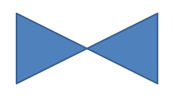

## **Обзор**

В этой статье объясняется, как настраивать фигуры презентаций в Aspose.Slides, редактируя их геометрию с помощью точек редактирования и путей геометрии. Показано, как работать с [GeometryPath](https://reference.aspose.com/slides/ru/python-java/aspose.slides/geometrypath/) для изменения существующих фигур, выполнять базовые операции редактирования пути, добавлять или удалять точки и применять обновлённую геометрию к фигуре.

Также демонстрируется, как создавать пользовательские и составные фигуры, строить фигуры со скруглёнными углами, определять, замкнута ли геометрия фигуры, и преобразовывать между [GeometryPath](https://reference.aspose.com/slides/ru/python-java/aspose.slides/geometrypath/) и [java.awt.Shape](https://docs.oracle.com/javase/7/docs/api/java/awt/Shape.html) для дополнительных сценариев настройки геометрии.

## **Изменение фигуры с помощью точек редактирования**

Рассмотрим квадрат. В PowerPoint, используя **точки редактирования**, вы можете  

* перемещать угол квадрата внутрь или наружу  
* задавать кривизну угла или точки  
* добавлять новые точки к квадрату  
* манипулировать точками квадрата и т.д.

По‑сути, перечисленные задачи можно выполнить с любой фигурой. С помощью точек редактирования вы можете изменить фигуру или создать новую на основе существующей.

## **Советы по редактированию фигур**


Прежде чем начинать редактирование фигур PowerPoint через точки редактирования, учитывайте следующее:

* Фигура (или её путь) может быть закрытой или открытой.  
* Когда фигура закрыта, у неё нет начальной или конечной точки. Когда фигура открыта, у неё есть начало и конец.  
* Все фигуры состоят как минимум из 2‑х якорных точек, соединённых линиями.  
* Линия может быть прямой или кривой. Якорные точки определяют характер линии.  
* Якорные точки бывают угловыми, прямыми или плавными:  
  * Угловая точка – это точка, где соединяются 2 прямые линии под углом.  
  * Плавная точка – это точка, где 2 ручки находятся на одной прямой, а сегменты линии соединяются плавной кривой. В этом случае все ручки находятся на одинаковом расстоянии от якорной точки.  
  * Прямая точка – это точка, где 2 ручки находятся на одной прямой, но сегменты линии соединяются плавной кривой без требования одинакового расстояния ручек от якорной точки.  
* Перемещая или редактируя якорные точки (что меняет угол линий), вы меняете внешний вид фигуры.

Для редактирования фигур PowerPoint через точки редактирования **Aspose.Slides** предоставляет класс [GeometryPath](https://reference.aspose.com/slides/ru/python-java/aspose.slides/geometrypath/).

* Экземпляр [GeometryPath](https://reference.aspose.com/slides/ru/python-java/aspose.slides/geometrypath/) представляет путь геометрии объекта [GeometryShape](https://reference.aspose.com/slides/ru/python-java/aspose.slides/geometryshape/).  
* Чтобы получить [GeometryPath](https://reference.aspose.com/slides/ru/python-java/aspose.slides/geometrypath/) из экземпляра [GeometryShape](https://reference.aspose.com/slides/ru/python-java/aspose.slides/geometryshape/), используйте метод [GeometryShape.getGeometryPaths](https://reference.aspose.com/slides/ru/python-java/aspose.slides/geometryshape/#getGeometryPaths).  
* Чтобы задать [GeometryPath](https://reference.aspose.com/slides/ru/python-java/aspose.slides/geometrypath/) для фигуры, используйте методы: [GeometryShape.setGeometryPath](https://reference.aspose.com/slides/ru/python-java/aspose.slides/geometryshape/#setGeometryPath) для *сплошных фигур* и [GeometryShape.setGeometryPaths](https://reference.aspose.com/slides/ru/python-java/aspose.slides/geometryshape/#setGeometryPaths) для *составных фигур*.  
* Чтобы добавить сегменты, используйте методы класса [GeometryPath](https://reference.aspose.com/slides/ru/python-java/aspose.slides/geometrypath/).  
* С помощью методов [GeometryPath.setStroke](https://reference.aspose.com/slides/ru/python-java/aspose.slides/geometrypath/#setStroke) и [GeometryPath.setFillMode](https://reference.aspose.com/slides/ru/python-java/aspose.slides/geometrypath/#setFillMode) можно задать внешний вид пути геометрии.  
* Метод [GeometryPath.getPathData](https://reference.aspose.com/slides/ru/python-java/aspose.slides/geometrypath/#getPathData) позволяет получить путь геометрии [GeometryShape](https://reference.aspose.com/slides/ru/python-java/aspose.slides/geometryshape/) в виде массива сегментов пути.  
* Для доступа к дополнительным параметрам настройки геометрии фигур можно преобразовать [GeometryPath](https://reference.aspose.com/slides/ru/python-java/aspose.slides/geometrypath/) в [java.awt.Shape](https://docs.oracle.com/javase/7/docs/api/java/awt/Shape.html).  
* Используйте методы [geometryPathToGraphicsPath](https://reference.aspose.com/slides/ru/python-java/aspose.slides/shapeutil/) и [graphicsPathToGeometryPath](https://reference.aspose.com/slides/ru/python-java/aspose.slides/shapeutil/) (из класса [ShapeUtil](https://reference.aspose.com/slides/ru/python-java/aspose.slides/shapeutil/)) для преобразования [GeometryPath](https://reference.aspose.com/slides/ru/python-java/aspose.slides/geometrypath/) в [java.awt.Shape](https://docs.oracle.com/javase/7/docs/api/java/awt/Shape.html) и обратно.

## **Простые операции редактирования**

Ниже представлены сигнатуры базовых операций редактирования:

**Добавить линию** в конец пути:

- `geometry_path.lineTo(point)`
- `geometry_path.lineTo(x, y)`

**Добавить линию** в указанную позицию пути:

- `geometry_path.lineTo(point, index)`
- `geometry_path.lineTo(x, y, index)`

**Добавить кубическую кривую Безье** в конец пути:

- `geometry_path.cubicBezierTo(point1, point2, point3)`
- `geometry_path.cubicBezierTo(x1, y1, x2, y2, x3, y3)`

**Добавить кубическую кривую Безье** в указанную позицию пути:

- `geometry_path.cubicBezierTo(point1, point2, point3, index)`
- `geometry_path.cubicBezierTo(x1, y1, x2, y2, x3, y3, index)`

**Добавить квадратичную кривую Безье** в конец пути:

- `geometry_path.quadraticBezierTo(point1, point2)`
- `geometry_path.quadraticBezierTo(x1, y1, x2, y2)`

**Добавить квадратичную кривую Безье** в указанную позицию пути:

- `geometry_path.quadraticBezierTo(point1, point2, index)`
- `geometry_path.quadraticBezierTo(x1, y1, x2, y2, index)`

**Добавить заданную дугу** к пути:

- `geometry_path.arcTo(width, height, start_angle, sweep_angle)`

**Замкнуть текущую фигуру** пути:

- `geometry_path.closeFigure()`

**Установить позицию для следующей точки**:

- `geometry_path.moveTo(point)`
- `geometry_path.moveTo(x, y)`

**Удалить сегмент пути** по указанному индексу:

- `geometry_path.removeAt(index)`

## **Добавление пользовательских точек к фигуре**
1. Создайте экземпляр класса [GeometryShape](https://reference.aspose.com/slides/ru/python-java/aspose.slides/geometryshape/) и задайте тип [ShapeType.Rectangle](https://reference.aspose.com/slides/ru/python-java/aspose.slides/shapetype/#Rectangle).  
2. Получите экземпляр класса [GeometryPath](https://reference.aspose.com/slides/ru/python-java/aspose.slides/geometrypath/) из фигуры.  
3. Добавьте новую точку между двумя верхними точками пути.  
4. Добавьте новую точку между двумя нижними точками пути.  
5. Примените путь к фигуре.

Этот код на Python показывает, как добавить пользовательские точки к фигуре:

```python
import jpype
import asposeslides

if not jpype.isJVMStarted():
    jpype.startJVM()

from asposeslides.api import Presentation, ShapeType

presentation = Presentation()
try:
    shape = presentation.getSlides().get_Item(0).getShapes().addAutoShape(ShapeType.Rectangle, 100, 100, 200, 100)
    geometry_path = shape.getGeometryPaths()[0]
    geometry_path.lineTo(100, 50, 1)
    geometry_path.lineTo(100, 50, 4)
    shape.setGeometryPath(geometry_path)
finally:
    presentation.dispose()
```


## **Удаление точек из фигуры**

1. Создайте экземпляр класса [GeometryShape](https://reference.aspose.com/slides/ru/python-java/aspose.slides/geometryshape/) и задайте тип [ShapeType.Heart](https://reference.aspose.com/slides/ru/python-java/aspose.slides/shapetype/#Heart).  
2. Получите экземпляр класса [GeometryPath](https://reference.aspose.com/slides/ru/python-java/aspose.slides/geometrypath/) из фигуры.  
3. Удалите сегмент пути.  
4. Примените путь к фигуре.

Этот код на Python показывает, как удалить точки из фигуры:

```python
import jpype
import asposeslides

if not jpype.isJVMStarted():
    jpype.startJVM()

from asposeslides.api import Presentation, ShapeType

presentation = Presentation()
try:
    shape = presentation.getSlides().get_Item(0).getShapes().addAutoShape(ShapeType.Heart, 100, 100, 300, 300)
    geometry_path = shape.getGeometryPaths()[0]
    geometry_path.removeAt(2)
    shape.setGeometryPath(geometry_path)
finally:
    presentation.dispose()
```


## **Создание пользовательской фигуры**

1. Вычислите точки для фигуры.  
2. Создайте экземпляр класса [GeometryPath](https://reference.aspose.com/slides/ru/python-java/aspose.slides/geometrypath/).  
3. Заполните путь точками.  
4. Создайте экземпляр класса [GeometryShape](https://reference.aspose.com/slides/ru/python-java/aspose.slides/geometryshape/).  
5. Примените путь к фигуре.

Этот код на Python показывает, как создать пользовательскую фигуру:

```python
import jpype
import asposeslides

if not jpype.isJVMStarted():
    jpype.startJVM()

from asposeslides.api import Presentation, ShapeType, GeometryPath

import math

points = []
outer_radius = 100
inner_radius = 50
step = 72

for angle in range(-90, 270, step):
    radians = math.radians(angle)
    x = outer_radius * math.cos(radians)
    y = outer_radius * math.sin(radians)
    points.append((x + outer_radius, y + outer_radius))

    radians = math.radians(angle + step / 2)
    x = inner_radius * math.cos(radians)
    y = inner_radius * math.sin(radians)
    points.append((x + outer_radius, y + outer_radius))

star_path = GeometryPath()
star_path.moveTo(*points[0])
for point in points[1:]:
    star_path.lineTo(*point)
star_path.closeFigure()

presentation = Presentation()
try:
    shape = presentation.getSlides().get_Item(0).getShapes().addAutoShape(ShapeType.Rectangle, 100, 100, outer_radius * 2, outer_radius * 2)
    shape.setGeometryPath(star_path)
finally:
    presentation.dispose()
```


## **Создание составной пользовательской фигуры**

1. Создайте экземпляр класса [GeometryShape](https://reference.aspose.com/slides/ru/python-java/aspose.slides/geometryshape/).  
2. Создайте первый экземпляр класса [GeometryPath](https://reference.aspose.com/slides/ru/python-java/aspose.slides/geometrypath/).  
3. Создайте второй экземпляр класса [GeometryPath](https://reference.aspose.com/slides/ru/python-java/aspose.slides/geometrypath/).  
4. Примените пути к фигуре.

Этот код на Python показывает, как создать составную пользовательскую фигуру:

```python
import jpype
import asposeslides

if not jpype.isJVMStarted():
    jpype.startJVM()

from asposeslides.api import Presentation, ShapeType, GeometryPath

presentation = Presentation()
try:
    shape = presentation.getSlides().get_Item(0).getShapes().addAutoShape(ShapeType.Rectangle, 100, 100, 200, 100)

    top_path = GeometryPath()
    top_path.moveTo(0, 0)
    top_path.lineTo(shape.getWidth(), 0)
    top_path.lineTo(shape.getWidth(), shape.getHeight() / 3)
    top_path.lineTo(0, shape.getHeight() / 3)
    top_path.closeFigure()

    bottom_path = GeometryPath()
    bottom_path.moveTo(0, shape.getHeight() / 3 * 2)
    bottom_path.lineTo(shape.getWidth(), shape.getHeight() / 3 * 2)
    bottom_path.lineTo(shape.getWidth(), shape.getHeight())
    bottom_path.lineTo(0, shape.getHeight())
    bottom_path.closeFigure()

    shape.setGeometryPaths([top_path, bottom_path])
finally:
    presentation.dispose()
```


## **Создание пользовательской фигуры со скруглёнными углами**

Этот код на Python показывает, как создать пользовательскую фигуру со скруглёнными углами (внутренняя кривизна):

```python
import jpype
import asposeslides

if not jpype.isJVMStarted():
    jpype.startJVM()

from asposeslides.api import Presentation, ShapeType, GeometryPath, SaveFormat

shape_x = 20
shape_y = 20
shape_width = 300
shape_height = 200

left_top_size = 50
right_top_size = 20
right_bottom_size = 40
left_bottom_size = 10

presentation = Presentation()
try:
    shape = presentation.getSlides().get_Item(0).getShapes().addAutoShape(ShapeType.Custom, shape_x, shape_y, shape_width, shape_height)
    geometry_path = GeometryPath()
    geometry_path.moveTo(left_top_size, 0)
    geometry_path.lineTo(shape_width - right_top_size, 0)
    geometry_path.arcTo(right_top_size, right_top_size, 180, -90)
    geometry_path.lineTo(shape_width, shape_height - right_bottom_size)
    geometry_path.arcTo(right_bottom_size, right_bottom_size, -90, -90)
    geometry_path.lineTo(left_bottom_size, shape_height)
    geometry_path.arcTo(left_bottom_size, left_bottom_size, 0, -90)
    geometry_path.lineTo(0, left_top_size)
    geometry_path.arcTo(left_top_size, left_top_size, 90, -90)
    geometry_path.closeFigure()
    shape.setGeometryPath(geometry_path)
    presentation.save("output.pptx", SaveFormat.Pptx)
finally:
    presentation.dispose()
```

## **Определение, является ли геометрия фигуры замкнутой**

Замкнутая фигура определяется как такая, у которой все стороны соединены, образуя единую границу без разрывов. Такая фигура может быть простой геометрической формой или сложным пользовательским контуром. Следующий пример кода демонстрирует, как проверить, замкнута ли геометрия фигуры:

```python
import jpype
import asposeslides

if not jpype.isJVMStarted():
    jpype.startJVM()

from asposeslides.api import PathCommandType

def is_geometry_closed(geometry_shape):
    is_closed = False
    for geometry_path in geometry_shape.getGeometryPaths():
        path_data = geometry_path.getPathData()
        if len(path_data) == 0:
            continue
        last_segment = path_data[-1]
        is_closed = last_segment.getPathCommand() == PathCommandType.Close
        if not is_closed:
            return False
    return is_closed
```

## **Преобразование GeometryPath в java.awt.Shape**

1. Создайте экземпляр класса [GeometryShape](https://reference.aspose.com/slides/ru/python-java/aspose.slides/geometryshape/).  
2. Создайте экземпляр класса [java.awt.Shape](https://docs.oracle.com/javase/7/docs/api/java/awt/Shape.html).  
3. Преобразуйте экземпляр [java.awt.Shape](https://docs.oracle.com/javase/7/docs/api/java/awt/Shape.html) в экземпляр [GeometryPath](https://reference.aspose.com/slides/ru/python-java/aspose.slides/geometrypath/) путём обхода его [PathIterator](https://docs.oracle.com/javase/8/docs/api/java/awt/geom/PathIterator.html) и воспроизведения каждого сегмента на пути.  
4. Примените пути к фигуре.

Этот код на Python реализует описанные шаги для преобразования графического пути в путь геометрии:

```python
import jpype
import asposeslides

if not jpype.isJVMStarted():
    jpype.startJVM()

from asposeslides.api import Presentation, ShapeType, GeometryPath, PathFillModeType

from java.awt import Font
from java.awt.geom import PathIterator
from java.awt.image import BufferedImage

presentation = Presentation()
try:
    # Создать новую фигуру.
    shape = presentation.getSlides().get_Item(0).getShapes().addAutoShape(ShapeType.Rectangle, 100, 100, 300, 100)

    # Получить путь геометрии фигуры.
    original_path = shape.getGeometryPaths()[0]
    original_path.setFillMode(PathFillModeType.None_)

    # Создать новый графический путь с текстом.
    font = Font("Arial", Font.PLAIN, 40)
    text = "Text in shape"
    image = BufferedImage(100, 100, BufferedImage.TYPE_INT_ARGB)
    graphics = image.createGraphics()
    try:
        glyph_vector = font.createGlyphVector(graphics.getFontRenderContext(), text)
        graphics_path = glyph_vector.getOutline(20.0, -glyph_vector.getVisualBounds().getY() + 10)
    finally:
        graphics.dispose()

    # Преобразовать графический путь в путь геометрии.
    text_path = GeometryPath()
    path_iterator = graphics_path.getPathIterator(None)
    points = jpype.JArray(jpype.JFloat)(6)
    while not path_iterator.isDone():
        segment_type = path_iterator.currentSegment(points)
        if segment_type == PathIterator.SEG_MOVETO:
            text_path.moveTo(points[0], points[1])
        elif segment_type == PathIterator.SEG_LINETO:
            text_path.lineTo(points[0], points[1])
        elif segment_type == PathIterator.SEG_QUADTO:
            text_path.quadraticBezierTo(points[0], points[1], points[2], points[3])
        elif segment_type == PathIterator.SEG_CUBICTO:
            text_path.cubicBezierTo(points[0], points[1], points[2], points[3], points[4], points[5])
        elif segment_type == PathIterator.SEG_CLOSE:
            text_path.closeFigure()
        path_iterator.next()
    text_path.setFillMode(PathFillModeType.Normal)

    # Применить путь текста вместе с оригинальным путём геометрии.
    shape.setGeometryPaths([original_path, text_path])
finally:
    presentation.dispose()
```


## **FAQ**

**Что происходит с заливкой и контурами после замены геометрии?**  
Стиль остаётся привязан к фигуре; меняется только контур. Заливка и контур автоматически применяются к новой геометрии.

**Как правильно повернуть пользовательскую фигуру вместе с её геометрией?**  
Используйте метод [setRotation](https://reference.aspose.com/slides/ru/python-java/aspose.slides/shape/#setRotation) фигуры; геометрия вращается вместе с фигурой, поскольку привязана к её собственной системе координат.

**Можно ли преобразовать пользовательскую фигуру в изображение, чтобы «зафиксировать» результат?**  
Да. Экспортируйте нужный [slide](/slides/ru/python-java/convert-powerpoint-to-png/) или саму [shape](/slides/ru/python-java/create-shape-thumbnails/) в растровый формат; это упрощает дальнейшую работу с тяжёлой геометрией.