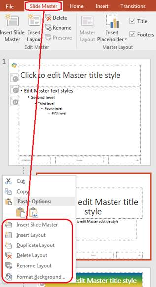

## **Обзор**

**Слайд‑мастер** определяет общие параметры дизайна для группы слайдов. Он может содержать общие фигуры, логотипы, фоны, стили текста, настройки темы и параметры нижнего колонтитула. В PowerPoint редактирование слайд‑мастера — обычный способ поддерживать согласованность презентации без повторения одинакового форматирования на каждом слайде.

Aspose.Slides for Python via Java поддерживает ту же модель. Презентация может содержать один или несколько мастеров, каждый мастер может содержать несколько макетных слайдов. Обычные слайды обычно не ссылаются напрямую на мастер. Вместо этого обычный слайд использует макетный слайд, а этот макетный слайд принадлежит мастеру.

Иерархия выглядит так:

1. **Слайд‑мастер** — определяет общий дизайн и тему.  
1. **Макетный слайд** — определяет конкретное расположение заполнителей и форматирование уровня макета.  
1. **Обычный слайд** — содержит фактическое содержание презентации и использует один макетный слайд.


В Aspose.Slides слайд‑мастер представлен классом [MasterSlide](https://reference.aspose.com/slides/ru/python-java/aspose.slides/masterslide/). Все мастеры в презентации доступны через коллекцию [Presentation.getMasters](https://reference.aspose.com/slides/ru/python-java/aspose.slides/presentation/#getMasters), которая представлена классом [MasterSlideCollection](https://reference.aspose.com/slides/ru/python-java/aspose.slides/masterslidecollection/).

{}
Когда одно и то же свойство определено на нескольких уровнях, приоритет имеет более конкретный уровень. Например, если мастер‑слайд и макетный слайд оба задают фон, слайды, основанные на этом макете, используют фон макета. Подробнее о макетных слайдах см. в статье [Apply or Change Slide Layouts](/slides/ru/python-java/slide-layout/).
{}

## **Доступ к слайд‑мастерам**

В PowerPoint можно открыть представление Слайд‑мастер через **Вид** > **Слайд‑мастер**.


В Aspose.Slides используйте коллекцию [Presentation.getMasters](https://reference.aspose.com/slides/ru/python-java/aspose.slides/presentation/#getMasters) для доступа к мастерам:

```python
import jpype
import asposeslides

if not jpype.isJVMStarted():
    jpype.startJVM()

from asposeslides.api import Presentation

presentation = Presentation("presentation.pptx")
try:
    first_master_slide = presentation.getMasters().get_Item(0)
    master_slide_count = presentation.getMasters().size()
    first_master_layout_slide_count = first_master_slide.getLayoutSlides().size()

    print(f"Master slides: {master_slide_count}")
    print(f"Layouts in the first master: {first_master_layout_slide_count}")
finally:
    presentation.dispose()
```

Также можно получить мастер‑слайд, используемый обычным слайдом, через его макет:

```python
import jpype
import asposeslides

if not jpype.isJVMStarted():
    jpype.startJVM()

from asposeslides.api import Presentation

presentation = Presentation("presentation.pptx")
try:
    slide = presentation.getSlides().get_Item(0)
    layout_slide = slide.getLayoutSlide()
    master_slide = layout_slide.getMasterSlide()
    master_slide_name = master_slide.getName()

    print(master_slide_name)
finally:
    presentation.dispose()
```

## **Что содержится в слайд‑мастере**

Мастер‑слайд — объект, похожий на слайд. Он наследуется от [BaseSlide](https://reference.aspose.com/slides/ru/python-java/aspose.slides/baseslide/), поэтому предоставляет многие из тех же свойств, что и обычные и макетные слайды. Члены, специфичные для мастера, перечислены на странице API [MasterSlide](https://reference.aspose.com/slides/ru/python-java/aspose.slides/masterslide/).

Часто используемые члены мастера включают:

| Элемент | Назначение |
| --- | --- |
| [getBackground](https://reference.aspose.com/slides/ru/python-java/aspose.slides/baseslide/#getBackground) | Устанавливает фон уровня мастера. |
| [getShapes](https://reference.aspose.com/slides/ru/python-java/aspose.slides/baseslide/#getShapes) | Хранит фигуры, размещённые в мастере, такие как логотипы, рамки изображений и общий текст. |
| [getLayoutSlides](https://reference.aspose.com/slides/ru/python-java/aspose.slides/masterslide/#getLayoutSlides) | Содержит макетные слайды, принадлежащие мастеру. |
| [getThemeManager](https://reference.aspose.com/slides/ru/python-java/aspose.slides/masterslide/#getThemeManager) | Предоставляет доступ к API темы мастера. |
| [getHeaderFooterManager](https://reference.aspose.com/slides/ru/python-java/aspose.slides/masterslide/#getHeaderFooterManager) | Управляет верхними и нижними колонтитулами, датами и номерами слайдов для мастера и его дочерних макетов. |
| [getDependingSlides](https://reference.aspose.com/slides/ru/python-java/aspose.slides/masterslide/#getDependingSlides) | Возвращает обычные слайды, зависящие от мастера через их макеты. |

## **Добавление изображения в слайд‑мастер**

Когда вы добавляете изображение в мастер‑слайд, оно появляется на слайдах, использующих макеты этого мастера. Это полезно для логотипов, водяных знаков, декоративных полос и других повторяющихся визуальных элементов.

Следующий пример добавляет логотип на первый слайд‑мастер:

```python
import jpype
import asposeslides

if not jpype.isJVMStarted():
    jpype.startJVM()

from asposeslides.api import Images, Presentation, SaveFormat, ShapeType

presentation = Presentation("presentation.pptx")
try:
    master_slide = presentation.getMasters().get_Item(0)
    logo = Images.fromFile("logo.png")
    try:
        logo_image = presentation.getImages().addImage(logo)
        master_slide.getShapes().addPictureFrame(ShapeType.Rectangle, 20, 20, 80, 80, logo_image)
    finally:
        logo.dispose()

    presentation.save("presentation-with-logo.pptx", SaveFormat.Pptx)
finally:
    presentation.dispose()
```

Подробнее о рамках изображений см. в статье [Picture Frame](/slides/ru/python-java/picture-frame/).

## **Работа с заполнителями**

Заполнители обычно определяются на макетных слайдах. Слайд‑мастер обеспечивает общий стиль и тему, которые наследуют макеты, а каждый макет решает, какие заполнители доступны и где они расположены.

В PowerPoint команды заполнителей доступны в представлении Слайд‑мастер.


Чтобы добавить новые заполнители с помощью Aspose.Slides, работайте с макетным слайдом, принадлежащим мастеру:

```python
import jpype
import asposeslides

if not jpype.isJVMStarted():
    jpype.startJVM()

from asposeslides.api import Presentation, SaveFormat, SlideLayoutType

presentation = Presentation("presentation.pptx")
try:
    master_slide = presentation.getMasters().get_Item(0)
    blank_layout_slide = master_slide.getLayoutSlides().getByType(SlideLayoutType.Blank)

    if blank_layout_slide is None:
        blank_layout_slide = master_slide.getLayoutSlides().add(SlideLayoutType.Blank, "Blank")

    blank_layout_slide.getPlaceholderManager().addTextPlaceholder(60, 120, 600, 80)

    presentation.getSlides().addEmptySlide(blank_layout_slide)
    presentation.save("presentation-with-placeholder.pptx", SaveFormat.Pptx)
finally:
    presentation.dispose()
```

Вы также можете форматировать уже существующие фигуры‑заполнители на мастере. Следующий пример находит заполнитель заголовка и применяет линейную градиентную заливку:

```python
import jpype
import asposeslides

if not jpype.isJVMStarted():
    jpype.startJVM()

from asposeslides.api import AutoShape, FillType, GradientShape, PlaceholderType, Presentation, SaveFormat

Color = jpype.JClass("java.awt.Color")

presentation = Presentation("presentation.pptx")
try:
    master_slide = presentation.getMasters().get_Item(0)
    title_placeholder = None

    for shape in master_slide.getShapes():
        if isinstance(shape, AutoShape):
            if shape.getPlaceholder() is not None and shape.getPlaceholder().getType() == PlaceholderType.Title:
                title_placeholder = shape
                break

    if title_placeholder is not None:
        red_gradient_color = Color(255, 0, 0)
        purple_gradient_color = Color(128, 0, 128)

        title_placeholder.getFillFormat().setFillType(FillType.Gradient)
        title_placeholder.getFillFormat().getGradientFormat().setGradientShape(GradientShape.Linear)
        title_placeholder.getFillFormat().getGradientFormat().getGradientStops().add(jpype.JFloat(0.0), red_gradient_color)
        title_placeholder.getFillFormat().getGradientFormat().getGradientStops().add(jpype.JFloat(1.0), purple_gradient_color)

    presentation.save("presentation-title-style.pptx", SaveFormat.Pptx)
finally:
    presentation.dispose()
```


Для дополнительных вариантов форматирования заполнителей и текста см. статьи [Set Prompt Text in Placeholder](/slides/ru/python-java/manage-placeholder/) и [Text Formatting](/slides/ru/python-java/text-formatting/).

## **Изменение фона слайд‑мастера**

Фон мастера наследуется макетами и слайдами, которые его не переопределяют. Следующий пример задаёт сплошной цвет фона для первого мастера:

```python
import jpype
import asposeslides

if not jpype.isJVMStarted():
    jpype.startJVM()

from asposeslides.api import BackgroundType, FillType, Presentation, SaveFormat

Color = jpype.JClass("java.awt.Color")

presentation = Presentation("presentation.pptx")
try:
    master_slide = presentation.getMasters().get_Item(0)
    master_background_color = Color.GREEN

    master_slide.getBackground().setType(BackgroundType.OwnBackground)
    master_slide.getBackground().getFillFormat().setFillType(FillType.Solid)
    master_slide.getBackground().getFillFormat().getSolidFillColor().setColor(master_background_color)

    presentation.save("presentation-master-background.pptx", SaveFormat.Pptx)
finally:
    presentation.dispose()
```

См. также темы [Presentation Background](/slides/ru/python-java/presentation-background/) и [Presentation Theme](/slides/ru/python-java/presentation-theme/).

## **Клонирование слайд‑мастера в другую презентацию**

Используйте [MasterSlideCollection.addClone](https://reference.aspose.com/slides/ru/python-java/aspose.slides/masterslidecollection/#addClone) для копирования слайд‑мастера в другую презентацию. Скопированный мастер затем можно использовать в макетах и слайдах целевой презентации.

```python
import jpype
import asposeslides

if not jpype.isJVMStarted():
    jpype.startJVM()

from asposeslides.api import Presentation, SaveFormat

source_presentation = Presentation("source.pptx")
destination_presentation = Presentation("destination.pptx")
try:
    source_master_slide = source_presentation.getMasters().get_Item(0)
    cloned_master_slide = destination_presentation.getMasters().addClone(source_master_slide)

    destination_presentation.save("destination-with-master.pptx", SaveFormat.Pptx)
finally:
    source_presentation.dispose()
    destination_presentation.dispose()
```

Если требуется клонировать обычные слайды вместе с их мастером, см. статью [Clone Slides](/slides/ru/python-java/clone-slides/).

## **Добавление нескольких слайд‑мастеров**

Презентация может содержать несколько мастеров. Это удобно, когда разные разделы требуют различного брендинга, структуры страниц или настроек темы.



Следующий пример клонирует мастер‑по‑умолчанию, задаёт клону иной фон, создает макет под этим клоном и добавляет новый слайд на основе этого макета:

```python
import jpype
import asposeslides

if not jpype.isJVMStarted():
    jpype.startJVM()

from asposeslides.api import BackgroundType, FillType, Presentation, SaveFormat, SlideLayoutType

Color = jpype.JClass("java.awt.Color")

presentation = Presentation("presentation.pptx")
try:
    default_master_slide = presentation.getMasters().get_Item(0)
    section_master_slide = presentation.getMasters().addClone(default_master_slide)
    section_master_background_color = Color.LIGHT_GRAY

    section_master_slide.getBackground().setType(BackgroundType.OwnBackground)
    section_master_slide.getBackground().getFillFormat().setFillType(FillType.Solid)
    section_master_slide.getBackground().getFillFormat().getSolidFillColor().setColor(section_master_background_color)

    source_blank_layout = default_master_slide.getLayoutSlides().getByType(SlideLayoutType.Blank)
    if source_blank_layout is None:
        source_blank_layout = default_master_slide.getLayoutSlides().get_Item(0)

    section_blank_layout = section_master_slide.getLayoutSlides().addClone(source_blank_layout)

    presentation.getSlides().addEmptySlide(section_blank_layout)
    presentation.save("presentation-with-multiple-masters.pptx", SaveFormat.Pptx)
finally:
    presentation.dispose()
```

## **Сравнение слайд‑мастеров**

Мастера слайдов можно сравнивать с помощью метода [equals](https://reference.aspose.com/slides/ru/python-java/aspose.slides/baseslide/#equals), унаследованного от [BaseSlide](https://reference.aspose.com/slides/ru/python-java/aspose.slides/baseslide/). Сравнение проверяет структуру и статическое содержание, такие как фигуры, текст, форматирование, анимацию и другие параметры слайда. Он не сравнивает уникальные идентификаторы, например ID слайдов, или динамические значения заполнителей, такие как текущая дата.

```python
import jpype
import asposeslides

if not jpype.isJVMStarted():
    jpype.startJVM()

from asposeslides.api import Presentation

first_presentation = Presentation("first.pptx")
second_presentation = Presentation("second.pptx")
try:
    first_presentation_master_count = first_presentation.getMasters().size()
    second_presentation_master_count = second_presentation.getMasters().size()

    for first_master_index in range(first_presentation_master_count):
        for second_master_index in range(second_presentation_master_count):
            first_master_slide = first_presentation.getMasters().get_Item(first_master_index)
            second_master_slide = second_presentation.getMasters().get_Item(second_master_index)
            are_master_slides_equal = first_master_slide.equals(second_master_slide)

            if are_master_slides_equal:
                print(f"first.pptx master #{first_master_index} equals second.pptx master #{second_master_index}")
finally:
    first_presentation.dispose()
    second_presentation.dispose()
```

Подробнее см. в статье [Compare Presentation Slides](/slides/ru/python-java/compare-slides/).

## **Установка представления Слайд‑мастер по умолчанию**

Используйте метод [setLastView](https://reference.aspose.com/slides/ru/python-java/aspose.slides/viewproperties/#setLastView) класса [ViewProperties](https://reference.aspose.com/slides/ru/python-java/aspose.slides/viewproperties/) для управления тем представлением, которое PowerPoint открывает первым. Следующий пример открывает презентацию в представлении Слайд‑мастер:

```python
import jpype
import asposeslides

if not jpype.isJVMStarted():
    jpype.startJVM()

from asposeslides.api import Presentation, SaveFormat, ViewType

presentation = Presentation("presentation.pptx")
try:
    presentation.getViewProperties().setLastView(ViewType.SlideMasterView)
    presentation.save("presentation-master-view.pptx", SaveFormat.Pptx)
finally:
    presentation.dispose()
```

Больше настроек представления см. в статье [Save Presentation](/slides/ru/python-java/save-presentation/).

## **Удаление неиспользуемых слайд‑мастеров**

Иногда в презентациях остаются мастера, которые больше не используются обычными слайдами. Удаление неиспользуемых мастеров может уменьшить размер файла и упростить обслуживание шаблона.

Используйте [removeUnused](https://reference.aspose.com/slides/ru/python-java/aspose.slides/masterslidecollection/#removeUnused) для удаления неиспользуемых мастеров из коллекции [Presentation.getMasters](https://reference.aspose.com/slides/ru/python-java/aspose.slides/presentation/#getMasters):

```python
import jpype
import asposeslides

if not jpype.isJVMStarted():
    jpype.startJVM()

from asposeslides.api import Presentation, SaveFormat

presentation = Presentation("presentation.pptx")
try:
    presentation.getMasters().removeUnused(True)
    presentation.save("presentation-clean.pptx", SaveFormat.Pptx)
finally:
    presentation.dispose()
```

Можно также воспользоваться методом низкого кода [Compress.removeUnusedMasterSlides](https://reference.aspose.com/slides/ru/python-java/aspose.slides/compress/#removeUnusedMasterSlides):

```python
import jpype
import asposeslides

if not jpype.isJVMStarted():
    jpype.startJVM()

from asposeslides.api import Compress, Presentation, SaveFormat

presentation = Presentation("presentation.pptx")
try:
    Compress.removeUnusedMasterSlides(presentation)
    presentation.save("presentation-clean.pptx", SaveFormat.Pptx)
finally:
    presentation.dispose()
```

## **FAQ**

**В чём разница между слайд‑мастером и макетным слайдом?**

Слайд‑мастер определяет общие параметры дизайна, такие как тема, фон, общие фигуры и стили текста. Макетный слайд принадлежит мастеру и задаёт конкретное расположение заполнителей. Обычный слайд использует макетный слайд, поэтому наследует свойства как макета, так и мастера.

**Можно ли в одной презентации иметь несколько слайд‑мастеров?**

Да. Презентация может содержать несколько мастеров. Используйте несколько мастеров, когда разные разделы требуют разных визуальных систем или брендинга.

**Куда лучше добавлять заполнители: в мастер‑слайд или в макетный слайд?**

В большинстве случаев заполнители добавляют в макетные слайды. Общие визуальные элементы и общие параметры форматирования размещаются в мастере, а заполнители контента — в макетах, которые будут использовать обычные слайды.

**Можно ли удалить мастер‑слайд, который всё ещё используется?**

Нет. Мастер‑слайд, имеющий зависимые слайды, нельзя безопасно удалить напрямую. Сначала перенесите эти слайды в макеты под другим мастером или используйте метод очистки, удаляющий только неиспользуемые мастеры.