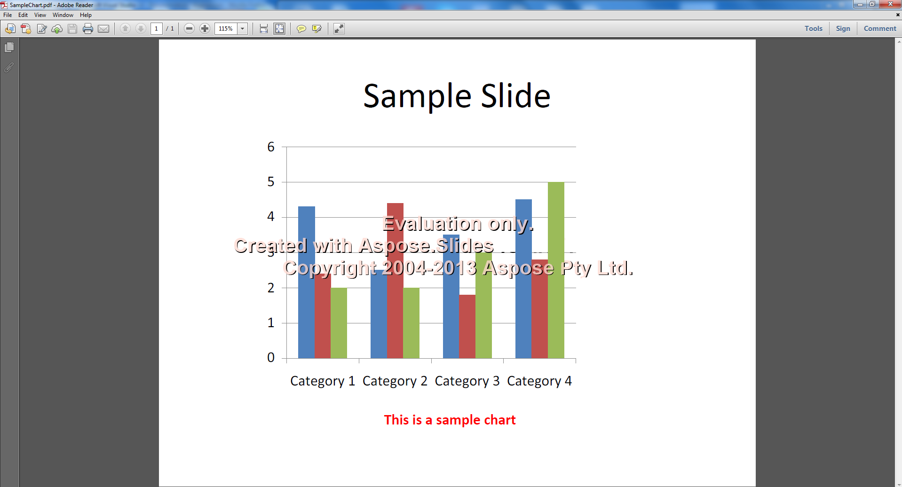

{} 

You can easily download Aspose.Slides for evaluation. The evaluation download is the same as the purchased download. The evaluation version simply becomes licensed when you add a few lines of code to apply the license.

The evaluation version of Aspose.Slides (without a license specified) provides full product functionality, but it inserts an evaluation watermark on every slide of generated PDF, TIFF and XPS files.

{} {} 

If you want to test Aspose.Slides without the evaluation version limitations, you can also request a 30-day Temporary License. Please refer to [How to get a Temporary License?](http://www.aspose.com/corporate/purchase/faqs/temporary-license.aspx)

{}
