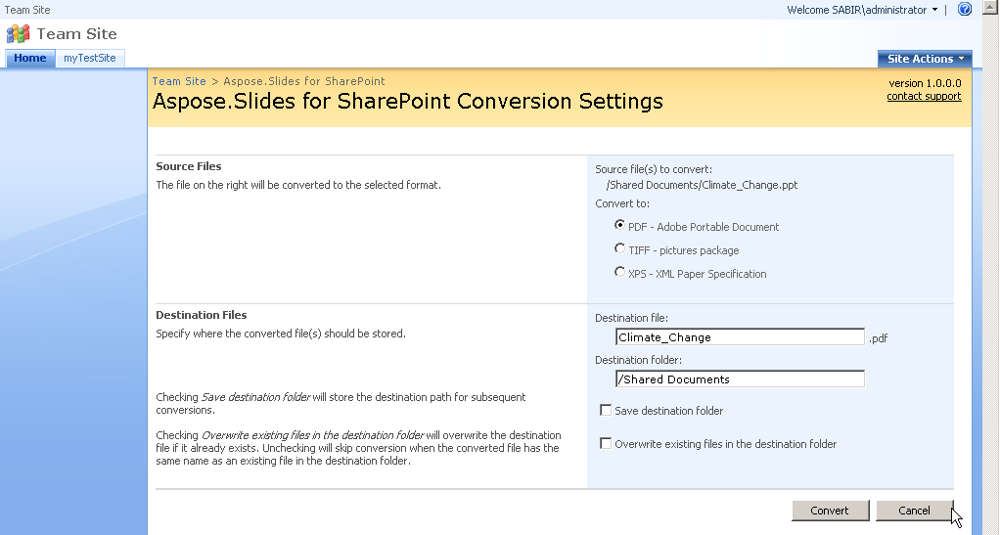

{} 

With Aspose.Slides for SharePoint, you can convert documents between many popular office document formats from within a SharePoint document library. Conversions are done with high fidelity and precision. 

{} 
## **Supported Input Formats**
Aspose.Slides for SharePoint supports the following input formats: 

- PPT – Microsoft PowerPoint Presentation 97 - 2003
- PPS – Microsoft PowerPoint SlideShow 97 - 2003
- POT – Microsoft PowerPoint Template 97 - 2003
- PPTX – Office Open XML Presentation
- PPSX – Office Open XML SlideShow
- POTX – Office Open XML Template

{} 

To generate documents, Aspose.Slides for SharePoint relies on a built-in version of [Aspose.Slides for .NET](http://www.aspose.com/categories/.net-components/aspose.slides-for-.net/default.aspx), the Aspose's only PowerPoint documents processing component.

{}
## **Supported Output Formats**
The following output formats are supported by Aspose.Slides for SharePoint: 

- PDF – Portable Document Format
- TIFF – Pictures Package
- XPS – XML Paper Specification

**Selecting the output format from the Conversion Settings screen** 

