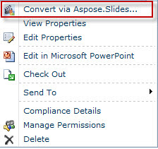
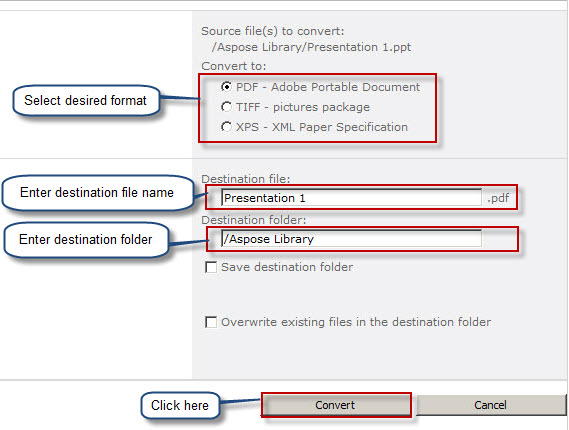
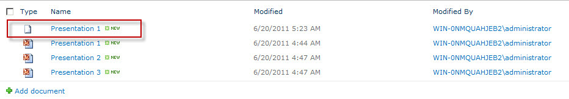

{} 

When Aspose.Slides for SharePoint is installed on the SharePoint server, it adds the **Convert via Aspose.Slides.SharePoint** option to a presentation's menu as shown below: 

**Installing Aspose.Slides for SharePoint adds the Convert via Aspose.Slides option to document menus** 

{} 
### **Converting a Presentation**
To convert a Microsoft PowerPoint document from a SharePoint document library: 

1. Select a Microsoft PowerPoint document in a document library.
2. Click the down arrow to reveal a menu and click **Convert via Aspose.Slides.SharePoint**. 

   **The Presentation 2 file's menu showing the Convert via Aspose.Slides option** 

3. Select the desired output format from the form. If you wish, change the output file name and the destination folder.
4. Click **Convert** to convert the file. 

   **The conversion form lets you select output file format, name and destination** 

5. When the conversion is complete, a success message is displayed. 

   **The conversion was successful** 

6. Click **Source Library** (to go to the source directory) or **Destination Library** (to go to the directory the file was saved to). 

   The converted document appears in the document library. 

   **The converted document shown in the library it was saved to** 

