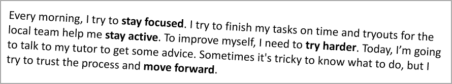

## **Översikt**

Denna artikel visar hur du formaterar text i PowerPoint‑ och OpenDocument‑presentationer med Aspose.Slides för Android via Java. Den täcker markering, bakgrundsfärger, transparens, teckenavstånd, teckensnittsegenskaper, rotation, styckeavstånd, autofit‑beteende, textankring, tabbstopp och språkinställningar.

I exemplen nedan kommer vi att använda en fil med namnet "sample.pptx", som innehåller en enda textruta på den första bilden med följande text:


## **Markera text**

Använd [ITextFrame.highlightText](https://reference.aspose.com/slides/sv/androidjava/com.aspose.slides/ITextFrame#highlightText-java.lang.String-java.lang.Integer-) metoden när du behöver markera text som matchar ett specifikt exempel inom en textruta. Metoden applicerar en markeringsfärg på matchande textfragment och kan användas med [ITextSearchOptions](https://reference.aspose.com/slides/sv/androidjava/com.aspose.slides/ITextSearchOptions) för att styra hur sökningen utförs, till exempel för att matcha endast hela ord.

Kodexemplet nedan markerar alla förekomster av tecknen **"try"** och markerar sedan endast hela ordet **"to"**.

```java
Presentation presentation = new Presentation("sample.pptx");
try {
    // Hämta den första formen från den första bilden.
    IAutoShape shape = (IAutoShape) presentation.getSlides().get_Item(0).getShapes().get_Item(0);

    // Markera ordet "try" i formen.
    shape.getTextFrame().highlightText("try", Color.rgb(173, 216, 230));

    TextSearchOptions searchOptions = new TextSearchOptions();
    searchOptions.setWholeWordsOnly(true);

    // Markera ordet "to" i formen.
    int violetColor = Color.rgb(238, 130, 238);
    shape.getTextFrame().highlightText("to", violetColor, searchOptions, null);

    presentation.save("highlighted_text.pptx", SaveFormat.Pptx);
} finally {
    presentation.dispose();
}
```

Resultatet:


## **Markera text med reguljära uttryck**

[ITextFrame.highlightRegex](https://reference.aspose.com/slides/sv/androidjava/com.aspose.slides/ITextFrame#highlightRegex-java.util.regex.Pattern-java.lang.Integer-com.aspose.slides.IFindResultCallback-) metoden markerar textmatchningar som hittas med ett reguljärt uttryck.

Kodexemplet nedan markerar alla ord som innehåller **sju eller fler tecken**:

```java
Presentation presentation = new Presentation("sample.pptx");
try {
    IAutoShape shape = (IAutoShape) presentation.getSlides().get_Item(0).getShapes().get_Item(0);

    java.util.regex.Pattern regex = java.util.regex.Pattern.compile("\\b[^\\s]{7,}\\b");

    // Markera alla ord med sju eller fler tecken.
    shape.getTextFrame().highlightRegex(regex, Color.YELLOW, null);

    presentation.save("highlighted_text_using_regex.pptx", SaveFormat.Pptx);
} finally {
    presentation.dispose();
}
```

Resultatet:


## **Ange bakgrundsfärg för text**

Använd [IParagraphFormat.getDefaultPortionFormat](https://reference.aspose.com/slides/sv/androidjava/com.aspose.slides/IParagraphFormat#getDefaultPortionFormat--) för att ange standardmarkeringsfärgen för ett stycke, eller använd [IBasePortionFormat.getHighlightColor](https://reference.aspose.com/slides/sv/androidjava/com.aspose.slides/IBasePortionFormat#getHighlightColor--) för enskilda textdelar.

Följande kodexempel visar hur du anger bakgrundsfärgen för **hela stycket**:

```java
Presentation presentation = new Presentation("sample.pptx");
try {
    IAutoShape autoShape = (IAutoShape) presentation.getSlides().get_Item(0).getShapes().get_Item(0);
    IParagraph paragraph = autoShape.getTextFrame().getParagraphs().get_Item(0);

    // Ställ in markeringsfärgen för hela stycket.
    paragraph.getParagraphFormat().getDefaultPortionFormat().getHighlightColor().setColor(Color.LTGRAY);

    presentation.save("gray_paragraph.pptx", SaveFormat.Pptx);
} finally {
    presentation.dispose();
}
```

Resultatet:


Kodexemplet nedan demonstrerar hur du anger bakgrundsfärgen för **textdelar med fet stil**:

```java
Presentation presentation = new Presentation("sample.pptx");
try {
    IAutoShape autoShape = (IAutoShape) presentation.getSlides().get_Item(0).getShapes().get_Item(0);
    IParagraph paragraph = autoShape.getTextFrame().getParagraphs().get_Item(0);

    for (int portionIndex = 0; portionIndex < paragraph.getPortions().getCount(); portionIndex++) {
        IPortion portion = paragraph.getPortions().get_Item(portionIndex);

        if (portion.getPortionFormat().getEffective().getFontBold()) {
            // Ställ in markeringsfärgen för textdelen.
            portion.getPortionFormat().getHighlightColor().setColor(Color.LTGRAY);
        }
    }

    presentation.save("gray_text_portions.pptx", SaveFormat.Pptx);
} finally {
    presentation.dispose();
}
```

Resultatet:


## **Justera textstycken**

Använd [IParagraphFormat.setAlignment](https://reference.aspose.com/slides/sv/androidjava/com.aspose.slides/IParagraphFormat#setAlignment-byte-) för att ange styckejustering inom en textruta. Värdet kan vara centrerat, vänsterjusterat, högerjusterat, justerat osv.

Följande kodexempel visar hur du justerar stycket till **centrum**:

```java
Presentation presentation = new Presentation("sample.pptx");
try {
    IAutoShape autoShape = (IAutoShape) presentation.getSlides().get_Item(0).getShapes().get_Item(0);
    IParagraph paragraph = autoShape.getTextFrame().getParagraphs().get_Item(0);

    // Ställ in styckejusteringen till centrum.
    paragraph.getParagraphFormat().setAlignment(TextAlignment.Center);

    presentation.save("aligned_paragraph.pptx", SaveFormat.Pptx);
} finally {
    presentation.dispose();
}
```

Resultatet:


## **Ange transparens för text**

Texttransparens styrs via alfakomponenten i färgen som tilldelas [IBasePortionFormat.getFillFormat](https://reference.aspose.com/slides/sv/androidjava/com.aspose.slides/IBasePortionFormat#getFillFormat--). I exemplen nedan är `alpha = 50` ett ARGB‑alfavärde på skalan 0‑255, inte en procentuell transparens.

Kodexemplet nedan visar hur du applicerar transparens på **hela stycket**:

```java
int alpha = 50;

Presentation presentation = new Presentation("sample.pptx");
try {
    IAutoShape autoShape = (IAutoShape) presentation.getSlides().get_Item(0).getShapes().get_Item(0);
    IParagraph paragraph = autoShape.getTextFrame().getParagraphs().get_Item(0);

    // Ställ in fyllningsfärgen för texten till transparent färg.
    paragraph.getParagraphFormat().getDefaultPortionFormat().getFillFormat().setFillType(FillType.Solid);
    paragraph.getParagraphFormat().getDefaultPortionFormat().getFillFormat().getSolidFillColor().setColor(Color.argb(alpha, 0, 0, 0));

    presentation.save("transparent_paragraph.pptx", SaveFormat.Pptx);
} finally {
    presentation.dispose();
}
```

Resultatet:


Följande kodexempel visar hur du applicerar transparens på **textdelar med fet stil**:

```java
int alpha = 50;

Presentation presentation = new Presentation("sample.pptx");
try {
    IAutoShape autoShape = (IAutoShape) presentation.getSlides().get_Item(0).getShapes().get_Item(0);
    IParagraph paragraph = autoShape.getTextFrame().getParagraphs().get_Item(0);

    for (int portionIndex = 0; portionIndex < paragraph.getPortions().getCount(); portionIndex++) {
        IPortion portion = paragraph.getPortions().get_Item(portionIndex);

        if (portion.getPortionFormat().getEffective().getFontBold()) {
            // Ställ in transparensen för textdelen.
            portion.getPortionFormat().getFillFormat().setFillType(FillType.Solid);
            portion.getPortionFormat().getFillFormat().getSolidFillColor().setColor(Color.argb(alpha, 0, 0, 0));
        }
    }

    presentation.save("transparent_text_portions.pptx", SaveFormat.Pptx);
} finally {
    presentation.dispose();
}
```

Resultatet:


## **Ange teckenavstånd för text**

Använd [IBasePortionFormat.setSpacing](https://reference.aspose.com/slides/sv/androidjava/com.aspose.slides/IBasePortionFormat#setSpacing-float-) för att öka eller minska avståndet mellan tecken i en textruta.

Följande Java‑kod visar hur du ökar teckenavståndet i **hela stycket**:

```java
Presentation presentation = new Presentation("sample.pptx");
try {
    IAutoShape autoShape = (IAutoShape) presentation.getSlides().get_Item(0).getShapes().get_Item(0);
    IParagraph paragraph = autoShape.getTextFrame().getParagraphs().get_Item(0);

    // Obs: Använd negativa värden för att komprimera teckenavståndet.
    paragraph.getParagraphFormat().getDefaultPortionFormat().setSpacing(3); // Utöka teckenavståndet.

    presentation.save("character_spacing_in_paragraph.pptx", SaveFormat.Pptx);
} finally {
    presentation.dispose();
}
```

Resultatet:


Kodexemplet nedan visar hur du ökar teckenavståndet i **textdelar med fet stil**:

```java
Presentation presentation = new Presentation("sample.pptx");
try {
    IAutoShape autoShape = (IAutoShape) presentation.getSlides().get_Item(0).getShapes().get_Item(0);
    IParagraph paragraph = autoShape.getTextFrame().getParagraphs().get_Item(0);

    for (int portionIndex = 0; portionIndex < paragraph.getPortions().getCount(); portionIndex++) {
        IPortion portion = paragraph.getPortions().get_Item(portionIndex);

        if (portion.getPortionFormat().getEffective().getFontBold()) {
            // Obs: Använd negativa värden för att komprimera teckenavståndet.
            portion.getPortionFormat().setSpacing(3); // Utöka teckenavståndet.
        }
    }

    presentation.save("character_spacing_in_text_portions.pptx", SaveFormat.Pptx);
} finally {
    presentation.dispose();
}
```

Resultatet:


### **Inaktivera kerning för specifika typsnitt**

I vissa fall kan text som renderas av Aspose.Slides se något tätare ut än samma text i PowerPoint. Detta kan inträffa eftersom PowerPoint kan ignorera kerning‑data för vissa typsnitt, även när typsnittet innehåller korrekt kerninginformation och kerning är aktiverat i PowerPoint‑inställningarna.

För att få den renderade utskriften närmare PowerPoint i sådana fall kan du inaktivera kerning för textdelar som använder det drabbade typsnittet. Ange [IBasePortionFormat.setKerningMinimalSize](https://reference.aspose.com/slides/sv/androidjava/com.aspose.slides/IBasePortionFormat#setKerningMinimalSize-float-) till ett värde som är betydligt större än den faktiska teckenstorleken:

```java
Presentation presentation = new Presentation("presentation.pptx");
try {
    IAutoShape autoShape = (IAutoShape) presentation.getSlides().get_Item(0).getShapes().get_Item(0);
    String targetFont = "Roboto";

    for (int paragraphIndex = 0; paragraphIndex < autoShape.getTextFrame().getParagraphs().getCount(); paragraphIndex++) {
        IParagraph paragraph = autoShape.getTextFrame().getParagraphs().get_Item(paragraphIndex);

        for (int portionIndex = 0; portionIndex < paragraph.getPortions().getCount(); portionIndex++) {
            IPortion portion = paragraph.getPortions().get_Item(portionIndex);
            IFontData latinFont = portion.getPortionFormat().getLatinFont();
            IFontData eastAsianFont = portion.getPortionFormat().getEastAsianFont();
            IFontData complexScriptFont = portion.getPortionFormat().getComplexScriptFont();

            boolean usesTargetFont =
                    latinFont != null && targetFont.equals(latinFont.getFontName()) ||
                    eastAsianFont != null && targetFont.equals(eastAsianFont.getFontName()) ||
                    complexScriptFont != null && targetFont.equals(complexScriptFont.getFontName());

            if (usesTargetFont) {
                portion.getPortionFormat().setKerningMinimalSize(100);
            }
        }
    }

    presentation.save("output.pptx", SaveFormat.Pptx);
} finally {
    presentation.dispose();
}
```

Denna inställning förhindrar att kerning appliceras på matchande textdelar och kan hjälpa till att alignera Aspose.Slides‑renderingen med PowerPoints visuella resultat för de berörda typsnitten.

## **Hantera teckensnittsegenskaper för text**

Teckensnittsegenskaper kan ställas in på styckennivå via [IParagraphFormat.getDefaultPortionFormat](https://reference.aspose.com/slides/sv/androidjava/com.aspose.slides/IParagraphFormat#getDefaultPortionFormat--) eller på enskilda delar via [IPortionFormat](https://reference.aspose.com/slides/sv/androidjava/com.aspose.slides/IPortionFormat).

Följande kod anger teckensnitt och textstil för **hela stycket**: den applicerar teckenstorlek, fet, kursiv, prickad understrykning och teckensnittet Times New Roman på alla delar i stycket.

```java
Presentation presentation = new Presentation("sample.pptx");
try {
    IAutoShape autoShape = (IAutoShape) presentation.getSlides().get_Item(0).getShapes().get_Item(0);
    IParagraph paragraph = autoShape.getTextFrame().getParagraphs().get_Item(0);

    // Ställ in teckensnittsegenskaper för stycket.
    paragraph.getParagraphFormat().getDefaultPortionFormat().setFontHeight(12);
    paragraph.getParagraphFormat().getDefaultPortionFormat().setFontBold(NullableBool.True);
    paragraph.getParagraphFormat().getDefaultPortionFormat().setFontItalic(NullableBool.True);
    paragraph.getParagraphFormat().getDefaultPortionFormat().setFontUnderline(TextUnderlineType.Dotted);
    paragraph.getParagraphFormat().getDefaultPortionFormat().setLatinFont(new FontData("Times New Roman"));

    presentation.save("font_properties_for_paragraph.pptx", SaveFormat.Pptx);
} finally {
    presentation.dispose();
}
```

Resultatet:


Kodexemplet nedan applicerar liknande egenskaper på **textdelar med fet stil**:

```java
Presentation presentation = new Presentation("sample.pptx");
try {
    IAutoShape autoShape = (IAutoShape) presentation.getSlides().get_Item(0).getShapes().get_Item(0);
    IParagraph paragraph = autoShape.getTextFrame().getParagraphs().get_Item(0);

    for (int portionIndex = 0; portionIndex < paragraph.getPortions().getCount(); portionIndex++) {
        IPortion portion = paragraph.getPortions().get_Item(portionIndex);

        if (portion.getPortionFormat().getEffective().getFontBold()) {
            // Ställ in teckensnittsegenskaper för textdelen.
            portion.getPortionFormat().setFontHeight(13);
            portion.getPortionFormat().setFontItalic(NullableBool.True);
            portion.getPortionFormat().setFontUnderline(TextUnderlineType.Dotted);
            portion.getPortionFormat().setLatinFont(new FontData("Times New Roman"));
        }
    }

    presentation.save("font_properties_for_text_portions.pptx", SaveFormat.Pptx);
} finally {
    presentation.dispose();
}
```

Resultatet:


## **Ange textrotation**

Använd [ITextFrameFormat.setTextVerticalType](https://reference.aspose.com/slides/sv/androidjava/com.aspose.slides/ITextFrameFormat#setTextVerticalType-byte-) för att ange en fördefinierad textorientering inom en form.

Följande kodexempel sätter textorienteringen i formen till `Vertical270`, vilket roterar texten **90 grader moturs**:

```java
Presentation presentation = new Presentation("sample.pptx");
try {
    IAutoShape autoShape = (IAutoShape) presentation.getSlides().get_Item(0).getShapes().get_Item(0);

    autoShape.getTextFrame().getTextFrameFormat().setTextVerticalType(TextVerticalType.Vertical270);

    presentation.save("text_rotation.pptx", SaveFormat.Pptx);
} finally {
    presentation.dispose();
}
```

Resultatet:


## **Ange anpassad rotation för textramar**

Använd [ITextFrameFormat.setRotationAngle](https://reference.aspose.com/slides/sv/androidjava/com.aspose.slides/ITextFrameFormat#setRotationAngle-float-) för att ange en anpassad rotationsvinkel för en [ITextFrame](https://reference.aspose.com/slides/sv/androidjava/com.aspose.slides/ITextFrame).

Kodexemplet nedan roterar textramen med 3 grader medurs inom formen:

```java
Presentation presentation = new Presentation("sample.pptx");
try {
    IAutoShape autoShape = (IAutoShape) presentation.getSlides().get_Item(0).getShapes().get_Item(0);

    autoShape.getTextFrame().getTextFrameFormat().setRotationAngle(3);

    presentation.save("custom_text_rotation.pptx", SaveFormat.Pptx);
} finally {
    presentation.dispose();
}
```

Resultatet:



## **Ange radavstånd för stycken**

Aspose.Slides tillhandahåller [IParagraphFormat.setSpaceAfter](https://reference.aspose.com/slides/sv/androidjava/com.aspose.slides/IParagraphFormat#setSpaceAfter-float-), [IParagraphFormat.setSpaceBefore](https://reference.aspose.com/slides/sv/androidjava/com.aspose.slides/IParagraphFormat#setSpaceBefore-float-) och [IParagraphFormat.setSpaceWithin](https://reference.aspose.com/slides/sv/androidjava/com.aspose.slides/IParagraphFormat#setSpaceWithin-float-) för att styra styckeavstånd. Dessa egenskaper används enligt följande:

* Använd ett positivt värde för att ange radavstånd som procent av radens höjd.
* Använd ett negativt värde för att ange radavstånd i punkter.

Följande kodexempel visar hur du specificerar radavståndet inom stycket:

```java
Presentation presentation = new Presentation("sample.pptx");
try {
    IAutoShape autoShape = (IAutoShape) presentation.getSlides().get_Item(0).getShapes().get_Item(0);
    IParagraph paragraph = autoShape.getTextFrame().getParagraphs().get_Item(0);

    paragraph.getParagraphFormat().setSpaceWithin(200);

    presentation.save("line_spacing.pptx", SaveFormat.Pptx);
} finally {
    presentation.dispose();
}
```

Resultatet:


## **Ange autofit‑typ för textramar**

[ITextFrameFormat.setAutofitType](https://reference.aspose.com/slides/sv/androidjava/com.aspose.slides/ITextFrameFormat#setAutofitType-byte-) bestämmer hur text beter sig när den överskrider ramens gränser. Använd den för att styra om texten ska krympas, rinna över eller automatiskt anpassa formen.

```java
Presentation presentation = new Presentation("sample.pptx");
try {
    IAutoShape autoShape = (IAutoShape) presentation.getSlides().get_Item(0).getShapes().get_Item(0);

    autoShape.getTextFrame().getTextFrameFormat().setAutofitType(TextAutofitType.Shape);

    presentation.save("autofit_type.pptx", SaveFormat.Pptx);
} finally {
    presentation.dispose();
}
```

## **Ange ankare för textramar**

[ITextFrameFormat.setAnchoringType](https://reference.aspose.com/slides/sv/androidjava/com.aspose.slides/ITextFrameFormat#setAnchoringType-byte-) definierar hur text placeras vertikalt inne i en form, exempelvis högst upp, i mitten eller längst ner.

```java
Presentation presentation = new Presentation("sample.pptx");
try {
    IAutoShape autoShape = (IAutoShape) presentation.getSlides().get_Item(0).getShapes().get_Item(0);

    autoShape.getTextFrame().getTextFrameFormat().setAnchoringType(TextAnchorType.Bottom);

    presentation.save("text_anchor.pptx", SaveFormat.Pptx);
} finally {
    presentation.dispose();
}
```

## **Ange texttabulering**

Använd [IParagraphFormat.setDefaultTabSize](https://reference.aspose.com/slides/sv/androidjava/com.aspose.slides/IParagraphFormat#setDefaultTabSize-float-) och [IParagraphFormat.getTabs](https://reference.aspose.com/slides/sv/androidjava/com.aspose.slides/IParagraphFormat#getTabs--) för att konfigurera tabbstopp i ett stycke.

```java
Presentation presentation = new Presentation("sample.pptx");
try {
    IAutoShape autoShape = (IAutoShape) presentation.getSlides().get_Item(0).getShapes().get_Item(0);
    IParagraph paragraph = autoShape.getTextFrame().getParagraphs().get_Item(0);

    paragraph.getParagraphFormat().setDefaultTabSize(100);
    paragraph.getParagraphFormat().getTabs().add(30, TabAlignment.Left);

    presentation.save("paragraph_tabs.pptx", SaveFormat.Pptx);
} finally {
    presentation.dispose();
}
```

Resultatet:


## **Ange språk för rättstavning**

Aspose.Slides erbjuder [IBasePortionFormat.setLanguageId](https://reference.aspose.com/slides/sv/androidjava/com.aspose.slides/IBasePortionFormat#setLanguageId-java.lang.String-) som låter dig ange språk för rättstavning för en textdel. Språket bestämmer vilket språk som används för stavnings‑ och grammatikgranskning i PowerPoint.

Följande kodexempel visar hur du anger språk för rättstavning för en textdel:

```java
Presentation presentation = new Presentation("presentation.pptx");
try {
    IAutoShape autoShape = (IAutoShape) presentation.getSlides().get_Item(0).getShapes().get_Item(0);

    IParagraph paragraph = autoShape.getTextFrame().getParagraphs().get_Item(0);
    paragraph.getPortions().clear();

    FontData font = new FontData("SimSun");

    Portion textPortion = new Portion();
    textPortion.getPortionFormat().setComplexScriptFont(font);
    textPortion.getPortionFormat().setEastAsianFont(font);
    textPortion.getPortionFormat().setLatinFont(font);

    // An

    // Ange ID för ett korrekturläsningsspråk.
    textPortion.getPortionFormat().setLanguageId("zh-CN");

    textPortion.setText("1。");
    paragraph.getPortions().add(textPortion);

    presentation.save("proofing_language.pptx", SaveFormat.Pptx);
} finally {
    presentation.dispose();
}
```

## **Ange standardspråk**

Använd [LoadOptions.setDefaultTextLanguage](https://reference.aspose.com/slides/sv/androidjava/com.aspose.slides/LoadOptions#setDefaultTextLanguage-java.lang.String-) för att definiera standardspråket för text som skapas vid inläsning eller skapande av en presentation.

```java
LoadOptions loadOptions = new LoadOptions();
loadOptions.setDefaultTextLanguage("en-US");

Presentation presentation = new Presentation(loadOptions);
try {
    ISlide slide = presentation.getSlides().get_Item(0);

    // Lägg till en ny rektangulär form med text.
    IAutoShape shape = slide.getShapes().addAutoShape(ShapeType.Rectangle, 20, 20, 150, 50);
    shape.getTextFrame().setText("Sample text");

    // Kontrollera språk för den första textdelen.
    IPortion portion = shape.getTextFrame().getParagraphs().get_Item(0).getPortions().get_Item(0);
    System.out.println(portion.getPortionFormat().getLanguageId());
} finally {
    presentation.dispose();
}
```

## **Ange standardtextstil**

För att applicera standardformatering på textnivå i en presentation, använd [IPresentation.getDefaultTextStyle](https://reference.aspose.com/slides/sv/androidjava/com.aspose.slides/IPresentation#getDefaultTextStyle--).

Följande kodexempel visar hur du anger en standardfet stil med storlek 14 pt för all text i alla bilder i en ny presentation.

```java
Presentation presentation = new Presentation();
try {
    // Hämta paragrafformatet på översta nivån.
    IParagraphFormat paragraphFormat = presentation.getDefaultTextStyle().getLevel(0);

    if (paragraphFormat != null) {
        paragraphFormat.getDefaultPortionFormat().setFontHeight(14);
        paragraphFormat.getDefaultPortionFormat().setFontBold(NullableBool.True);
    }

    presentation.save("default_text_style.pptx", SaveFormat.Pptx);
} finally {
    presentation.dispose();
}
```

## **Extrahera text med versaler‑effekt**

I PowerPoint gör **All Caps**‑effekten att text visas med versaler på bilden även om den ursprungligen skrevs med gemener. När du hämtar en sådan textdel med Aspose.Slides returnerar biblioteket texten exakt som den angavs. För att matcha den visade texten, kontrollera [TextCapType](https://reference.aspose.com/slides/sv/androidjava/com.aspose.slides/TextCapType) och konvertera den returnerade strängen till versaler när värdet är `All`.

Anta att vi har följande textruta på den första bilden i filen sample2.pptx.


Kodexemplet nedan visar hur du extraherar texten med **All Caps**‑effekt applicerad:

```java
Presentation presentation = new Presentation("sample2.pptx");
try {
    IAutoShape autoShape = (IAutoShape) presentation.getSlides().get_Item(0).getShapes().get_Item(0);
    IPortion textPortion = autoShape.getTextFrame().getParagraphs().get_Item(0).getPortions().get_Item(0);

    System.out.println("Original text: " + textPortion.getText());

    IPortionFormatEffectiveData textFormat = textPortion.getPortionFormat().getEffective();
    if (textFormat.getTextCapType() == TextCapType.All) {
        String text = textPortion.getText().toUpperCase();
        System.out.println("All-Caps effect: " + text);
    }
} finally {
    presentation.dispose();
}
```

Utdata:

```text
Originaltext: Hello, Aspose!
All-Caps-effekt: HELLO, ASPOSE!
```

## **Vanliga frågor**

**Hur ändrar man text i en tabell på en bild?**

För att ändra text i en tabell på en bild, använd [ITable](https://reference.aspose.com/slides/sv/androidjava/com.aspose.slides/ITable). Iterera genom cellerna och uppdatera varje cell via [ICell.getTextFrame](https://reference.aspose.com/slides/sv/androidjava/com.aspose.slides/ICell#getTextFrame--) samt styckeformatering via [IParagraph.getParagraphFormat](https://reference.aspose.com/slides/sv/androidjava/com.aspose.slides/IParagraph#getParagraphFormat--).

**Hur applicerar man gradientfärg på text i en PowerPoint‑bild?**

För att applicera en gradientfärg på text, använd [IBasePortionFormat.getFillFormat](https://reference.aspose.com/slides/sv/androidjava/com.aspose.slides/IBasePortionFormat#getFillFormat--). Ange [IFillFormat.setFillType](https://reference.aspose.com/slides/sv/androidjava/com.aspose.slides/IFillFormat#setFillType-int-) till [FillType.Gradient](https://reference.aspose.com/slides/sv/androidjava/com.aspose.slides/FillType) och konfigurera gradientstopp, riktning och transparens.