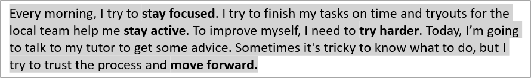

## **Översikt**

Denna artikel visar hur du formaterar text i PowerPoint‑ och OpenDocument‑presentationer med Aspose.Slides för Android via Java. Den täcker bakgrundsfärger, transparens, teckenavstånd, teckensnittsegenskaper, rotation, styckeavstånd, autofit‑beteende, textankring, tabbstopp och språkinställningar.

I exemplen nedan använder vi filen **"sample.pptx"**, som innehåller en enda textruta på den första bilden med följande text:


För att hitta och markera exakt text eller matchningar med reguljära uttryck, se [Search and Replace Text](/slides/sv/androidjava/search-and-replace-text/).

## **Ange bakgrundsfärg för text**

Använd [IParagraphFormat.getDefaultPortionFormat](https://reference.aspose.com/slides/sv/androidjava/com.aspose.slides/iparagraphformat/#getDefaultPortionFormat--) för att ange standardmarkeringsfärgen för ett stycke, eller använd [IBasePortionFormat.getHighlightColor](https://reference.aspose.com/slides/sv/androidjava/com.aspose.slides/ibaseportionformat/#getHighlightColor--) för enskilda textdelar.

Följande kodexempel visar hur du anger bakgrundsfärgen för **hela stycket**:

```java
import com.aspose.slides.*;
import android.graphics.Color;

Presentation presentation = new Presentation("sample.pptx");
try {
    ISlide slide = presentation.getSlides().get_Item(0);
    IAutoShape autoShape = (IAutoShape)slide.getShapes().get_Item(0);
    IParagraph paragraph = autoShape.getTextFrame().getParagraphs().get_Item(0);

    // Ange markeringsfärgen för hela stycket.
    paragraph.getParagraphFormat().getDefaultPortionFormat().getHighlightColor().setColor(Color.LTGRAY);

    presentation.save("gray_paragraph.pptx", SaveFormat.Pptx);
} finally {
    presentation.dispose();
}
```

Resultatet:



Kodexemplet nedan demonstrerar hur du anger bakgrundsfärgen för **textdelar med fet stil**:

```java
import com.aspose.slides.*;
import android.graphics.Color;

Presentation presentation = new Presentation("sample.pptx");
try {
    ISlide slide = presentation.getSlides().get_Item(0);
    IAutoShape autoShape = (IAutoShape)slide.getShapes().get_Item(0);
    IParagraph paragraph = autoShape.getTextFrame().getParagraphs().get_Item(0);

    for (IPortion portion : paragraph.getPortions()) {
        if (portion.getPortionFormat().getEffective().getFontBold()) {
            // Ange markeringsfärgen för textdelen.
            portion.getPortionFormat().getHighlightColor().setColor(Color.LTGRAY);
        }
    }

    presentation.save("gray_text_portions.pptx", SaveFormat.Pptx);
} finally {
    presentation.dispose();
}
```

Resultatet:


## **Justera textstycken**

Använd [IParagraphFormat.setAlignment](https://reference.aspose.com/slides/sv/androidjava/com.aspose.slides/iparagraphformat/#setAlignment-int-) för att ange styckejustering inom en textram. Värdet kan vara centrerat, vänsterjusterat, högerjusterat, fullt justerat med mera.

Följande kodexempel visar hur du justerar stycket till **center**:

```java
import com.aspose.slides.*;

Presentation presentation = new Presentation("sample.pptx");
try {
    ISlide slide = presentation.getSlides().get_Item(0);
    IAutoShape autoShape = (IAutoShape)slide.getShapes().get_Item(0);
    IParagraph paragraph = autoShape.getTextFrame().getParagraphs().get_Item(0);

    // Ange justeringen av stycket till centrerad.
    paragraph.getParagraphFormat().setAlignment(TextAlignment.Center);

    presentation.save("aligned_paragraph.pptx", SaveFormat.Pptx);
} finally {
    presentation.dispose();
}
```

Resultatet:


## **Ange transparens för text**

Transparens för text styrs via alfakomponenten i färgen som tilldelas [IBasePortionFormat.getFillFormat](https://reference.aspose.com/slides/sv/androidjava/com.aspose.slides/ibaseportionformat/#getFillFormat--). I exemplen nedan är `alpha = 50` ett ARGB‑alfavärde på skalan 0–255, inte en transparensprocent.

Kodexemplet nedan visar hur du applicerar transparens på **hela stycket**:

```java
import com.aspose.slides.*;
import android.graphics.Color;

int alpha = 50;

Presentation presentation = new Presentation("sample.pptx");
try {
    ISlide slide = presentation.getSlides().get_Item(0);
    IAutoShape autoShape = (IAutoShape)slide.getShapes().get_Item(0);
    IParagraph paragraph = autoShape.getTextFrame().getParagraphs().get_Item(0);

    // Ange fyllningsfärgen för texten till transparent färg.
    paragraph.getParagraphFormat().getDefaultPortionFormat().getFillFormat().setFillType(FillType.Solid);
    paragraph.getParagraphFormat().getDefaultPortionFormat().getFillFormat().getSolidFillColor().setColor(Color.argb(alpha, 0, 0, 0));

    presentation.save("transparent_paragraph.pptx", SaveFormat.Pptx);
} finally {
    presentation.dispose();
}
```

Resultatet:


Följande kodexempel visar hur du applicerar transparens på **textdelar med fet stil**:

```java
import com.aspose.slides.*;
import android.graphics.Color;

int alpha = 50;

Presentation presentation = new Presentation("sample.pptx");
try {
    ISlide slide = presentation.getSlides().get_Item(0);
    IAutoShape autoShape = (IAutoShape)slide.getShapes().get_Item(0);
    IParagraph paragraph = autoShape.getTextFrame().getParagraphs().get_Item(0);

    for (IPortion portion : paragraph.getPortions()) {
        if (portion.getPortionFormat().getEffective().getFontBold()) {
            // Ange transparensen för textdelen.
            portion.getPortionFormat().getFillFormat().setFillType(FillType.Solid);
            portion.getPortionFormat().getFillFormat().getSolidFillColor().setColor(Color.argb(alpha, 0, 0, 0));
        }
    }

    presentation.save("transparent_text_portions.pptx", SaveFormat.Pptx);
} finally {
    presentation.dispose();
}
```

Resultatet:


## **Ange teckenavstånd för text**

Använd [IBasePortionFormat.setSpacing](https://reference.aspose.com/slides/sv/androidjava/com.aspose.slides/ibaseportionformat/#setSpacing-float-) för att utöka eller minska avståndet mellan tecken i en textruta.

Följande Java‑kod visar hur du utökar teckenavståndet i **hela stycket**:

```java
import com.aspose.slides.*;

Presentation presentation = new Presentation("sample.pptx");
try {
    ISlide slide = presentation.getSlides().get_Item(0);
    IAutoShape autoShape = (IAutoShape)slide.getShapes().get_Item(0);
    IParagraph paragraph = autoShape.getTextFrame().getParagraphs().get_Item(0);

    // Observera: Använd negativa värden för att komprimera teckenavståndet.
    paragraph.getParagraphFormat().getDefaultPortionFormat().setSpacing(3); // Utöka teckenavståndet.

    presentation.save("character_spacing_in_paragraph.pptx", SaveFormat.Pptx);
} finally {
    presentation.dispose();
}
```

Resultatet:


Kodexemplet nedan visar hur du utökar teckenavståndet i **textdelar med fet stil**:

```java
import com.aspose.slides.*;

Presentation presentation = new Presentation("sample.pptx");
try {
    ISlide slide = presentation.getSlides().get_Item(0);
    IAutoShape autoShape = (IAutoShape)slide.getShapes().get_Item(0);
    IParagraph paragraph = autoShape.getTextFrame().getParagraphs().get_Item(0);

    for (IPortion portion : paragraph.getPortions()) {
        if (portion.getPortionFormat().getEffective().getFontBold()) {
            // Observera: Använd negativa värden för att komprimera teckenavståndet.
            portion.getPortionFormat().setSpacing(3); // Utöka teckenavståndet.
        }
    }

    presentation.save("character_spacing_in_text_portions.pptx", SaveFormat.Pptx);
} finally {
    presentation.dispose();
}
```

Resultatet:


### **Inaktivera kerning för specifika typsnitt**

I vissa fall kan text som renderas av Aspose.Slides se något tätare ut än samma text i PowerPoint. Detta kan ske eftersom PowerPoint ibland ignorerar kerningdata för vissa typsnitt, även när typsnittet innehåller giltig kerninginformation och kerning är aktiverad i PowerPoint‑inställningarna.

För att få renderingen att bättre motsvara PowerPoint i sådana fall kan du inaktivera kerning för textdelar som använder det berörda typsnittet. Sätt [IBasePortionFormat.setKerningMinimalSize](https://reference.aspose.com/slides/sv/androidjava/com.aspose.slides/ibaseportionformat/#setKerningMinimalSize-float-) till ett värde som är avsevärt större än den faktiska typsnittsstorleken:

```java
import com.aspose.slides.*;

Presentation presentation = new Presentation("presentation.pptx");
try {
    ISlide slide = presentation.getSlides().get_Item(0);
    IAutoShape autoShape = (IAutoShape)slide.getShapes().get_Item(0);
    String targetFont = "Roboto";

    for (IParagraph paragraph : autoShape.getTextFrame().getParagraphs()) {
        for (IPortion portion : paragraph.getPortions()) {
            IPortionFormat portionFormat = portion.getPortionFormat();

            if ((portionFormat.getLatinFont() != null &&
                 portionFormat.getLatinFont().getFontName().equals(targetFont)) ||
                (portionFormat.getEastAsianFont() != null &&
                 portionFormat.getEastAsianFont().getFontName().equals(targetFont)) ||
                (portionFormat.getComplexScriptFont() != null &&
                 portionFormat.getComplexScriptFont().getFontName().equals(targetFont))) {
                portionFormat.setKerningMinimalSize(100);
            }
        }
    }

    presentation.save("output.pptx", SaveFormat.Pptx);
} finally {
    presentation.dispose();
}
```

Denna inställning förhindrar att kerning appliceras på matchande textdelar och kan hjälpa till att anpassa Aspose.Slides‑rendering till PowerPoints visuella resultat för berörda typsnitt.

## **Hantera teckensnittsegenskaper för text**

Teckensnittsegenskaper kan anges på styckennivå via [IParagraphFormat.getDefaultPortionFormat](https://reference.aspose.com/slides/sv/androidjava/com.aspose.slides/iparagraphformat/#getDefaultPortionFormat--) eller på enskilda delar via [IPortionFormat](https://reference.aspose.com/slides/sv/androidjava/com.aspose.slides/iportionformat/).

Följande kod anger teckensnitt och textstil för hela stycket: den tillämpar teckenstorlek, fet, kursiv, prickad understrykning samt Times New Roman‑typsnittet på alla delar i stycket.

```java
import com.aspose.slides.*;

Presentation presentation = new Presentation("sample.pptx");
try {
    ISlide slide = presentation.getSlides().get_Item(0);
    IAutoShape autoShape = (IAutoShape)slide.getShapes().get_Item(0);
    IParagraph paragraph = autoShape.getTextFrame().getParagraphs().get_Item(0);

    // Ställ in teckensnittsegenskaper för stycket.
    paragraph.getParagraphFormat().getDefaultPortionFormat().setFontHeight(12);
    paragraph.getParagraphFormat().getDefaultPortionFormat().setFontBold(NullableBool.True);
    paragraph.getParagraphFormat().getDefaultPortionFormat().setFontItalic(NullableBool.True);
    paragraph.getParagraphFormat().getDefaultPortionFormat().setFontUnderline(TextUnderlineType.Dotted);
    paragraph.getParagraphFormat().getDefaultPortionFormat().setLatinFont(new FontData("Times New Roman"));

    presentation.save("font_properties_for_paragraph.pptx", SaveFormat.Pptx);
} finally {
    presentation.dispose();
}
```

Resultatet:


Kodexemplet nedan tillämpar liknande egenskaper på **textdelar med fet stil**:

```java
import com.aspose.slides.*;

Presentation presentation = new Presentation("sample.pptx");
try {
    ISlide slide = presentation.getSlides().get_Item(0);
    IAutoShape autoShape = (IAutoShape)slide.getShapes().get_Item(0);
    IParagraph paragraph = autoShape.getTextFrame().getParagraphs().get_Item(0);

    for (IPortion portion : paragraph.getPortions()) {
        if (portion.getPortionFormat().getEffective().getFontBold()) {
            // Ställ in teckensnittsegenskaper för textdelen.
            portion.getPortionFormat().setFontHeight(13);
            portion.getPortionFormat().setFontItalic(NullableBool.True);
            portion.getPortionFormat().setFontUnderline(TextUnderlineType.Dotted);
            portion.getPortionFormat().setLatinFont(new FontData("Times New Roman"));
        }
    }

    presentation.save("font_properties_for_text_portions.pptx", SaveFormat.Pptx);
} finally {
    presentation.dispose();
}
```

Resultatet:


## **Ange textrotation**

Använd [ITextFrameFormat.setTextVerticalType](https://reference.aspose.com/slides/sv/androidjava/com.aspose.slides/itextframeformat/#setTextVerticalType-byte-) för att ange en fördefinierad textriktning inom en form.

Följande kodexempel sätter textriktningen i formen till [TextVerticalType.Vertical270](https://reference.aspose.com/slides/sv/androidjava/com.aspose.slides/textverticaltype/), vilket roterar texten **90 grader moturs**:

```java
import com.aspose.slides.*;

Presentation presentation = new Presentation("sample.pptx");
try {
    ISlide slide = presentation.getSlides().get_Item(0);
    IAutoShape autoShape = (IAutoShape)slide.getShapes().get_Item(0);

    autoShape.getTextFrame().getTextFrameFormat().setTextVerticalType(TextVerticalType.Vertical270);

    presentation.save("text_rotation.pptx", SaveFormat.Pptx);
} finally {
    presentation.dispose();
}
```

Resultatet:


## **Ange anpassad rotation för textramar**

Använd [ITextFrameFormat.setRotationAngle](https://reference.aspose.com/slides/sv/androidjava/com.aspose.slides/itextframeformat/#setRotationAngle-float-) för att ange en egen rotationsvinkel för en [ITextFrame](https://reference.aspose.com/slides/sv/androidjava/com.aspose.slides/itextframe/).

Kodexemplet nedan roterar textramen 3 grader medurs inom formen:

```java
import com.aspose.slides.*;

Presentation presentation = new Presentation("sample.pptx");
try {
    ISlide slide = presentation.getSlides().get_Item(0);
    IAutoShape autoShape = (IAutoShape)slide.getShapes().get_Item(0);

    autoShape.getTextFrame().getTextFrameFormat().setRotationAngle(3);

    presentation.save("custom_text_rotation.pptx", SaveFormat.Pptx);
} finally {
    presentation.dispose();
}
```

Resultatet:


## **Ange radavstånd för stycken**

Aspose.Slides erbjuder [IParagraphFormat.setSpaceAfter](https://reference.aspose.com/slides/sv/androidjava/com.aspose.slides/iparagraphformat/#setSpaceAfter-float-), [IParagraphFormat.setSpaceBefore](https://reference.aspose.com/slides/sv/androidjava/com.aspose.slides/iparagraphformat/#setSpaceBefore-float-) och [IParagraphFormat.setSpaceWithin](https://reference.aspose.com/slides/sv/androidjava/com.aspose.slides/iparagraphformat/#setSpaceWithin-float-) för att kontrollera styckeavstånd. Dessa egenskaper används så här:

* Använd ett positivt värde för att ange radavstånd som en procentandel av radens höjd.
* Använd ett negativt värde för att ange radavstånd i punkter.

Följande kodexempel visar hur du specificerar radavståndet i stycket:

```java
import com.aspose.slides.*;

Presentation presentation = new Presentation("sample.pptx");
try {
    ISlide slide = presentation.getSlides().get_Item(0);
    IAutoShape autoShape = (IAutoShape)slide.getShapes().get_Item(0);
    IParagraph paragraph = autoShape.getTextFrame().getParagraphs().get_Item(0);

    paragraph.getParagraphFormat().setSpaceWithin(200);

    presentation.save("line_spacing.pptx", SaveFormat.Pptx);
} finally {
    presentation.dispose();
}
```

Resultatet:


## **Ange Autofit‑typ för textramar**

[ITextFrameFormat.setAutofitType](https://reference.aspose.com/slides/sv/androidjava/com.aspose.slides/itextframeformat/#setAutofitType-byte-) bestämmer hur texten beter sig när den överskrider ramens gränser. Använd den för att styra om texten ska krympas, flöda över eller automatiskt ändra storlek på formen.

```java
import com.aspose.slides.*;

Presentation presentation = new Presentation("sample.pptx");
try {
    ISlide slide = presentation.getSlides().get_Item(0);
    IAutoShape autoShape = (IAutoShape)slide.getShapes().get_Item(0);

    autoShape.getTextFrame().getTextFrameFormat().setAutofitType(TextAutofitType.Shape);

    presentation.save("autofit_type.pptx", SaveFormat.Pptx);
} finally {
    presentation.dispose();
}
```

## **Ange ankare för textramar**

[ITextFrameFormat.setAnchoringType](https://reference.aspose.com/slides/sv/androidjava/com.aspose.slides/itextframeformat/#setAnchoringType-byte-) definierar hur text placeras vertikalt inne i en form, t.ex. högst upp, i mitten eller längst ner.

```java
import com.aspose.slides.*;

Presentation presentation = new Presentation("sample.pptx");
try {
    ISlide slide = presentation.getSlides().get_Item(0);
    IAutoShape autoShape = (IAutoShape)slide.getShapes().get_Item(0);

    autoShape.getTextFrame().getTextFrameFormat().setAnchoringType(TextAnchorType.Bottom);

    presentation.save("text_anchor.pptx", SaveFormat.Pptx);
} finally {
    presentation.dispose();
}
```

## **Ange tabulering för text**

Använd [IParagraphFormat.setDefaultTabSize](https://reference.aspose.com/slides/sv/androidjava/com.aspose.slides/iparagraphformat/#setDefaultTabSize-float-) och [IParagraphFormat.getTabs](https://reference.aspose.com/slides/sv/androidjava/com.aspose.slides/iparagraphformat/#getTabs--) för att konfigurera tabbstopp i ett stycke.

```java
import com.aspose.slides.*;

Presentation presentation = new Presentation("sample.pptx");
try {
    ISlide slide = presentation.getSlides().get_Item(0);
    IAutoShape autoShape = (IAutoShape)slide.getShapes().get_Item(0);
    IParagraph paragraph = autoShape.getTextFrame().getParagraphs().get_Item(0);

    paragraph.getParagraphFormat().setDefaultTabSize(100);
    paragraph.getParagraphFormat().getTabs().add(30, TabAlignment.Left);

    presentation.save("paragraph_tabs.pptx", SaveFormat.Pptx);
} finally {
    presentation.dispose();
}
```

Resultatet:


## **Ange språk för korrekturläsning**

Aspose.Slides erbjuder [IBasePortionFormat.setLanguageId](https://reference.aspose.com/slides/sv/androidjava/com.aspose.slides/ibaseportionformat/#setLanguageId-java.lang.String-), vilket låter dig ange korrekturläsningsspråk för en textdel. Språket bestämmer vilket språk som används för stavnings‑ och grammatikkontroller i PowerPoint.

Följande kodexempel visar hur du anger korrekturläsningsspråk för en textdel:

```java
import com.aspose.slides.*;

Presentation presentation = new Presentation("presentation.pptx");
try {
    ISlide slide = presentation.getSlides().get_Item(0);
    IAutoShape autoShape = (IAutoShape)slide.getShapes().get_Item(0);

    IParagraph paragraph = autoShape.getTextFrame().getParagraphs().get_Item(0);
    paragraph.getPortions().clear();

    FontData font = new FontData("SimSun");

    Portion textPortion = new Portion();
    textPortion.getPortionFormat().setComplexScriptFont(font);
    textPortion.getPortionFormat().setEastAsianFont(font);
    textPortion.getPortionFormat().setLatinFont(font);

    // Ange ID för ett korrekturläsningsspråk.
    textPortion.getPortionFormat().setLanguageId("zh-CN");

    textPortion.setText("1。");
    paragraph.getPortions().add(textPortion);

    presentation.save("proofing_language.pptx", SaveFormat.Pptx);
} finally {
    presentation.dispose();
}
```

## **Ange standardspråk**

Använd [LoadOptions.setDefaultTextLanguage](https://reference.aspose.com/slides/sv/androidjava/com.aspose.slides/loadoptions/#setDefaultTextLanguage-java.lang.String-) för att definiera standardspråk för text som skapas vid inläsning eller skapande av en presentation.

```java
import com.aspose.slides.*;

LoadOptions loadOptions = new LoadOptions();
loadOptions.setDefaultTextLanguage("en-US");

Presentation presentation = new Presentation(loadOptions);
try {
    ISlide slide = presentation.getSlides().get_Item(0);

    // Lägg till en ny rektangelform med text.
    IAutoShape shape = slide.getShapes().addAutoShape(ShapeType.Rectangle, 20, 20, 150, 50);
    shape.getTextFrame().setText("Sample text");

    // Kontrollera språk för den första delen.
    IPortion portion = shape.getTextFrame().getParagraphs().get_Item(0).getPortions().get_Item(0);
    System.out.println(portion.getPortionFormat().getLanguageId());
} finally {
    presentation.dispose();
}
```

## **Ange standardtextstil**

För att tillämpa standardformatering för text på presentationsnivå, använd [IPresentation.getDefaultTextStyle](https://reference.aspose.com/slides/sv/androidjava/com.aspose.slides/ipresentation/#getDefaultTextStyle--).

Följande kodexempel visar hur du anger ett standardtypsnitt i fet stil med storleken 14 pt för all text i hela presentationen.

```java
import com.aspose.slides.*;

Presentation presentation = new Presentation();
try {
    // Hämta styckeformatet på högsta nivå.
    IParagraphFormat paragraphFormat = presentation.getDefaultTextStyle().getLevel(0);

    if (paragraphFormat != null) {
        paragraphFormat.getDefaultPortionFormat().setFontHeight(14);
        paragraphFormat.getDefaultPortionFormat().setFontBold(NullableBool.True);
    }

    presentation.save("default_text_style.pptx", SaveFormat.Pptx);
} finally {
    presentation.dispose();
}
```

## **Extrahera text med versaler‑effekt**

I PowerPoint gör **All Caps**‑effekten att text visas med versaler på bilden även om den ursprungligen skrevs med gemener. När du hämtar en sådan textdel med Aspose.Slides returnerar biblioteket texten exakt som den angavs. För att få samma utseende konverterar du den returnerade strängen till versaler när värdet är [TextCapType.All](https://reference.aspose.com/slides/sv/androidjava/com.aspose.slides/textcaptype/).

Anta att vi har följande textruta på den första bilden i filen **sample2.pptx**.


Kodexemplet nedan visar hur du extraherar texten med **All Caps**‑effekten applicerad:

```java
import com.aspose.slides.*;

Presentation presentation = new Presentation("sample2.pptx");
try {
    ISlide slide = presentation.getSlides().get_Item(0);
    IAutoShape autoShape = (IAutoShape)slide.getShapes().get_Item(0);
    IPortion textPortion = autoShape.getTextFrame().getParagraphs().get_Item(0).getPortions().get_Item(0);

    System.out.println("Original text: " + textPortion.getText());

    IPortionFormatEffectiveData textFormat = textPortion.getPortionFormat().getEffective();
    if (textFormat.getTextCapType() == TextCapType.All) {
        String text = textPortion.getText().toUpperCase();
        System.out.println("All-Caps effect: " + text);
    }
} finally {
    presentation.dispose();
}
```

Utdata:

```text
Original text: Hello, Aspose!
All-Caps effect: HELLO, ASPOSE!
```

## **FAQ**

**Hur ändrar man text i en tabell på en bild?**

För att ändra text i en tabell på en bild, använd [ITable](https://reference.aspose.com/slides/sv/androidjava/com.aspose.slides/itable/). Iterera genom cellerna och uppdatera varje cell via [ICell.getTextFrame](https://reference.aspose.com/slides/sv/androidjava/com.aspose.slides/icell/#getTextFrame--) samt styckeformatering via [IParagraph.getParagraphFormat](https://reference.aspose.com/slides/sv/androidjava/com.aspose.slides/iparagraph/#getParagraphFormat--).

**Hur applicerar man gradientfärg på text i en PowerPoint‑bild?**

För att applicera gradientfärg på text, använd [IBasePortionFormat.getFillFormat](https://reference.aspose.com/slides/sv/androidjava/com.aspose.slides/ibaseportionformat/#getFillFormat--). Sätt [IFillFormat.setFillType](https://reference.aspose.com/slides/sv/androidjava/com.aspose.slides/ifillformat/#setFillType-byte-) till [FillType.Gradient](https://reference.aspose.com/slides/sv/androidjava/com.aspose.slides/filltype/) och konfigurera gradientstopp, riktning och transparens.