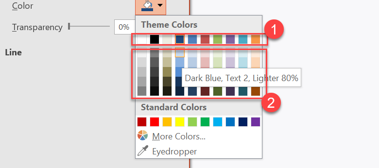

## **Introduktion**

Ett presentations tema definierar egenskaperna för designelement. När du väljer ett presentations tema väljer du i princip en specifik uppsättning visuella element och deras egenskaper.

I PowerPoint består ett tema av färger, [typsnitt](/slides/sv/androidjava/powerpoint-fonts/), [bakgrundsstilar](/slides/sv/androidjava/presentation-background/) och effekter.


## **Ändra temafärg**

Ett PowerPoint‑tema använder en specifik uppsättning färger för olika element på en bild. Om du inte gillar färgerna byter du dem genom att tillämpa nya färger för temat. För att låta dig välja en ny temafärg erbjuder Aspose.Slides värden under uppräkningen [SchemeColor](https://reference.aspose.com/slides/sv/androidjava/com.aspose.slides/SchemeColor).

Denna Java‑kod visar hur du ändrar accentfärgen för ett tema:

```java
Presentation pres = new Presentation();
try {
    IAutoShape shape = pres.getSlides().get_Item(0).getShapes().addAutoShape(ShapeType.Rectangle, 10, 10, 100, 100);

    shape.getFillFormat().setFillType(FillType.Solid);

    shape.getFillFormat().getSolidFillColor().setSchemeColor(SchemeColor.Accent4);
} finally {
    if (pres != null) pres.dispose();
}
```

Du kan bestämma den resulterande färgens effektiva värde på detta sätt:

```java
IFillFormatEffectiveData fillEffective = shape.getFillFormat().getEffective();

Color effectiveColor = fillEffective.getSolidFillColor();

System.out.println(String.format("Color [A=%d, R=%d, G=%d, B=%d]", 
        effectiveColor.getAlpha(), effectiveColor.getRed(), effectiveColor.getGreen(), effectiveColor.getBlue()));
```

För att ytterligare demonstrera färgändringsoperationen skapar vi ett annat element och tilldelar accentfärgen (från den första operationen) till det. Sedan ändrar vi färgen i temat:

```java
IAutoShape otherShape = pres.getSlides().get_Item(0).getShapes().addAutoShape(ShapeType.Rectangle, 10, 120, 100, 100);

otherShape.getFillFormat().setFillType(FillType.Solid);

otherShape.getFillFormat().getSolidFillColor().setSchemeColor(SchemeColor.Accent4);

pres.getMasterTheme().getColorScheme().getAccent4().setColor(Color.RED);
```

Den nya färgen tillämpas automatiskt på båda elementen.

### **Ange temafärg från ett extra färgpalett**

När du tillämpar luminans‑transformationer på huvudtemafärgen(1) bildas färger från den extra paletten(2). Du kan sedan sätta och hämta dessa temafärger.



**1** – Huvudtemafärger  

**2** – Färger från den extra paletten.

Denna Java‑kod demonstrerar en operation där extra palett‑färger erhålls från huvudtemafärgen och sedan används i former:

```java
Presentation presentation = new Presentation();
try {
    ISlide slide = presentation.getSlides().get_Item(0);

    // Accent 4
    IShape shape1 = slide.getShapes().addAutoShape(ShapeType.Rectangle, 10, 10, 50, 50);

    shape1.getFillFormat().setFillType(FillType.Solid);
    shape1.getFillFormat().getSolidFillColor().setSchemeColor(SchemeColor.Accent4);

    // Accent 4, ljusare 80%
    IShape shape2 = slide.getShapes().addAutoShape(ShapeType.Rectangle, 10, 70, 50, 50);

    shape2.getFillFormat().setFillType(FillType.Solid);
    shape2.getFillFormat().getSolidFillColor().setSchemeColor(SchemeColor.Accent4);
    shape2.getFillFormat().getSolidFillColor().getColorTransform().add(ColorTransformOperation.MultiplyLuminance, 0.2f);
    shape2.getFillFormat().getSolidFillColor().getColorTransform().add(ColorTransformOperation.AddLuminance, 0.8f);

    // Accent 4, ljusare 60%
    IShape shape3 = slide.getShapes().addAutoShape(ShapeType.Rectangle, 10, 130, 50, 50);

    shape3.getFillFormat().setFillType(FillType.Solid);
    shape3.getFillFormat().getSolidFillColor().setSchemeColor(SchemeColor.Accent4);
    shape3.getFillFormat().getSolidFillColor().getColorTransform().add(ColorTransformOperation.MultiplyLuminance, 0.4f);
    shape3.getFillFormat().getSolidFillColor().getColorTransform().add(ColorTransformOperation.AddLuminance, 0.6f);

    // Accent 4, ljusare 40%
    IShape shape4 = slide.getShapes().addAutoShape(ShapeType.Rectangle, 10, 190, 50, 50);

    shape4.getFillFormat().setFillType(FillType.Solid);
    shape4.getFillFormat().getSolidFillColor().setSchemeColor(SchemeColor.Accent4);
    shape4.getFillFormat().getSolidFillColor().getColorTransform().add(ColorTransformOperation.MultiplyLuminance, 0.6f);
    shape4.getFillFormat().getSolidFillColor().getColorTransform().add(ColorTransformOperation.AddLuminance, 0.4f);

    // Accent 4, mörkare 25%
    IShape shape5 = slide.getShapes().addAutoShape(ShapeType.Rectangle, 10, 250, 50, 50);

    shape5.getFillFormat().setFillType(FillType.Solid);
    shape5.getFillFormat().getSolidFillColor().setSchemeColor(SchemeColor.Accent4);
    shape5.getFillFormat().getSolidFillColor().getColorTransform().add(ColorTransformOperation.MultiplyLuminance, 0.75f);

    // Accent 4, mörkare 50%
    IShape shape6 = slide.getShapes().addAutoShape(ShapeType.Rectangle, 10, 310, 50, 50);

    shape6.getFillFormat().setFillType(FillType.Solid);
    shape6.getFillFormat().getSolidFillColor().setSchemeColor(SchemeColor.Accent4);
    shape6.getFillFormat().getSolidFillColor().getColorTransform().add(ColorTransformOperation.MultiplyLuminance, 0.5f);

    presentation.save(path + "example_accent4.pptx", SaveFormat.Pptx);
} finally {
    if (presentation != null) presentation.dispose();
}
```

### **Mappa `SchemeColor` till `IColorScheme`‑färger**

När du arbetar med [SchemeColor](https://reference.aspose.com/slides/sv/androidjava/com.aspose.slides/schemecolor/), kanske du märker att den innehåller följande temafärgsvärden:

`Background1`, `Background2`, `Text1` och `Text2`.

Dock returnerar `Presentation.getMasterTheme().getColorScheme()` [IColorScheme](https://reference.aspose.com/slides/sv/androidjava/com.aspose.slides/icolorscheme/), som exponerar motsvarande färger som:

`Dark1`, `Dark2`, `Light1` och `Light2`.

Denna skillnad är bara i namn. Dessa värden refererar till samma temafärgsplatser och mappningen är fast:

* `Text1` = `Dark1`
* `Background1` = `Light1`
* `Text2` = `Dark2`
* `Background2` = `Light2`

Det finns ingen dynamisk konvertering mellan `Text`/`Background` och `Dark`/`Light`. De är helt enkelt alternativa namn för samma temafärger.

Namnskillnaden kommer från Microsoft Office‑terminologi. Äldre Office‑versioner använde `Dark 1`, `Light 1`, `Dark 2` och `Light 2`, medan nyare UI‑versioner visar samma platser som `Text 1`, `Background 1`, `Text 2` och `Background 2`.

## **Ändra tematypsnitt**

För att låta dig välja typsnitt för teman och andra ändamål använder Aspose.Slides dessa speciella identifierare (liknande de som används i PowerPoint):

* **+mn-lt** – Brödtexttypsnitt Latin (Minor Latin Font)  
* **+mj-lt** – Rubriktypsnitt Latin (Major Latin Font)  
* **+mn-ea** – Brödtexttypsnitt Östasien (Minor East Asian Font)  
* **+mj-ea** – Brödtexttypsnitt Östasien (Major East Asian Font)

Denna Java‑kod visar hur du tilldelar Latin‑typsnittet till ett temaelement:

```java
IAutoShape shape = pres.getSlides().get_Item(0).getShapes().addAutoShape(ShapeType.Rectangle, 10, 10, 100, 100);

Paragraph paragraph = new Paragraph();

Portion portion = new Portion("Theme text format");

paragraph.getPortions().add(portion);

shape.getTextFrame().getParagraphs().add(paragraph);

portion.getPortionFormat().setLatinFont(new FontData("+mn-lt"));
```

Denna Java‑kod visar hur du ändrar presentations‑tematypsnittet:

```java
pres.getMasterTheme().getFontScheme().getMinor().setLatinFont(new FontData("Arial"));
```

Typsnittet i alla textrutor kommer att uppdateras.

{} 

Du kanske vill se [PowerPoint‑typsnitt](/slides/sv/androidjava/powerpoint-fonts/).

{}

## **Ändra temats bakgrundsstil**

Som standard erbjuder PowerPoint‑appen 12 fördefinierade bakgrunder, men endast 3 av dessa 12 bakgrunder sparas i en typisk presentation.


Till exempel, efter att du sparat en presentation i PowerPoint‑appen, kan du köra denna Java‑kod för att ta reda på antalet fördefinierade bakgrunder i presentationen:

```java
Presentation pres = new Presentation("pres.pptx");
try {
    int numberOfBackgroundFills = pres.getMasterTheme().getFormatScheme().getBackgroundFillStyles().size();

    System.out.println("Number of background fill styles for theme is " + numberOfBackgroundFills);
} finally {
    if (pres != null) pres.dispose();
}
```

{} 

Genom att använda egenskapen [BackgroundFillStyles](https://reference.aspose.com/slides/sv/androidjava/com.aspose.slides/FormatScheme#getBackgroundFillStyles--) från klassen [FormatScheme](https://reference.aspose.com/slides/sv/androidjava/com.aspose.slides/FormatScheme) kan du lägga till eller komma åt bakgrundsstilen i ett PowerPoint‑tema.

{} 

Denna Java‑kod visar hur du anger bakgrunden för en presentation:

```java
pres.getMasters().get_Item(0).getBackground().setStyleIndex(2);
```

**Indexguide**: 0 används för ingen fyllning. Indexet startar från 1.

{} 

Du kanske vill se [PowerPoint‑bakgrund](/slides/sv/androidjava/presentation-background/).

{}

## **Ändra temaeffekt**

Ett PowerPoint‑tema innehåller vanligtvis 3 värden för varje stilarray. Dessa arrayer kombineras till de 3 effekterna: subtil, måttlig och intensiv. Till exempel är detta resultatet när effekterna tillämpas på en specifik form:


Med hjälp av 3 egenskaper ([FillStyles](https://reference.aspose.com/slides/sv/androidjava/com.aspose.slides/FormatScheme#getFillStyles--), [LineStyles](https://reference.aspose.com/slides/sv/androidjava/com.aspose.slides/FormatScheme#getLineStyles--), [EffectStyles](https://reference.aspose.com/slides/sv/androidjava/com.aspose.slides/FormatScheme#getEffectStyles--)) från klassen [FormatScheme](https://reference.aspose.com/slides/sv/androidjava/com.aspose.slides/FormatScheme) kan du ändra element i ett tema (ännu mer flexibelt än alternativen i PowerPoint).

Denna Java‑kod visar hur du ändrar en temaeffekt genom att ändra delar av element:

```java
Presentation pres = new Presentation("Subtle_Moderate_Intense.pptx");
try {
    pres.getMasterTheme().getFormatScheme().getLineStyles().get_Item(0).getFillFormat().getSolidFillColor().setColor(Color.RED);

    pres.getMasterTheme().getFormatScheme().getFillStyles().get_Item(2).setFillType(FillType.Solid);

    pres.getMasterTheme().getFormatScheme().getFillStyles().get_Item(2).getSolidFillColor().setColor(Color.GREEN);

    pres.getMasterTheme().getFormatScheme().getEffectStyles().get_Item(2).getEffectFormat().getOuterShadowEffect().setDistance(10f);

    pres.save("Design_04_Subtle_Moderate_Intense-out.pptx", SaveFormat.Pptx);
} finally {
    if (pres != null) pres.dispose();
}
```

De resulterande förändringarna i fyllnadsfärg, fyllnadstyp, skuggeffekt osv.:


## **FAQ**

**Kan jag tillämpa ett tema på en enskild bild utan att förändra mallen?**

Ja. Aspose.Slides stödjer temaunderskrivningar på bildnivå, så du kan applicera ett lokalt tema bara på den bilden samtidigt som huvudtemat förblir intakt (via [SlideThemeManager](https://reference.aspose.com/slides/sv/androidjava/com.aspose.slides/slidethememanager/)).

**Vad är det säkraste sättet att föra ett tema från en presentation till en annan?**

[Klona bilder](/slides/sv/androidjava/clone-slides/) tillsammans med deras huvudmall till mål‑presentationen. Detta bevarar den ursprungliga huvudmallen, layouterna och det associerade temat så att utseendet förblir konsekvent.

**Hur kan jag se de "effektiva" värdena efter all arv och överskrivning?**

Använd API:ets ["effektiva"](/slides/sv/androidjava/shape-effective-properties/) vyer för tema/färg/typsnitt/effekt. Dessa returnerar de lösta, slutgiltiga egenskaperna efter att både huvudmallen och eventuella lokala överskrivningar tillämpats.