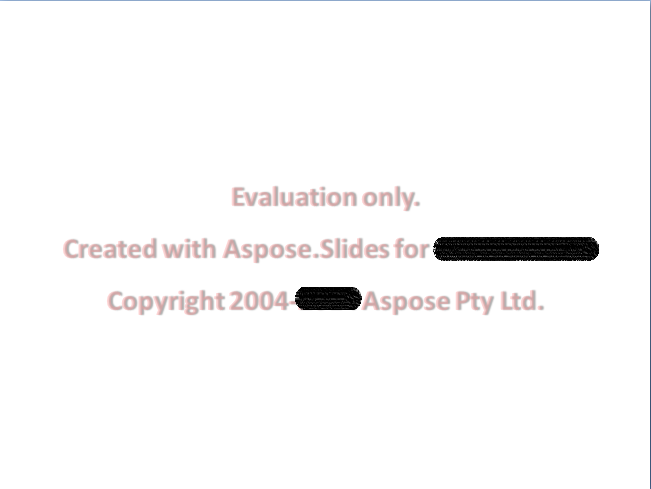

## **Aspose.Slides-utvärdering**

Du kan enkelt ladda ner Aspose.Slides för utvärdering. Utvärderingspaketet är detsamma som det köpta paketet. Utvärderingsversionen blir helt licensierad efter att du har lagt till några rader kod för att tillämpa licensen.

Utvärderingsversionen av Aspose.Slides (utan en specificerad licens) ger full funktionalitet i produkten, men den lägger in ett utvärderingsvattenmärke högst upp i dokumentet vid öppning och sparning. Du är också begränsad till en bild när du extraherar text från presentationsbilder.

{}
Om du vill testa Aspose.Slides utan begränsningarna i utvärderingsversionen kan du begära en 30‑dagars tillfällig licens. Se [Hur får du en tillfällig licens?](https://purchase.aspose.com/temporary-license)
{}

## **Vanliga frågor**

### Kan jag testa flera presentationer parallellt i olika trådar i utvärderingsläge?

Ja. Du kan bearbeta olika dokument parallellt; du bör inte dela samma presentationsobjekt [över trådar](/slides/sv/androidjava/multithreading/). Utvärderingsläget påverkar inte detta.

### Måste jag installera Microsoft PowerPoint för att utvärdera biblioteket på en server eller i CI?

Nej. Aspose.Slides är en fristående motor och kräver inte att PowerPoint är installerat, vare sig för utvärdering eller produktion.

### Kan jag testa konvertering av PPT/PPTX till PDF och bilder fullt ut i utvärderingsläge?

Ja. [Konverterarna](/slides/sv/androidjava/convert-presentation/) fungerar; utskriften kommer att innehålla ett vattenmärke.

### Kan jag använda en tillfällig licens för belastningstestning utan vattenmärke?

Ja. En 30‑dagars tillfällig licens tar bort begränsningarna i utvärderingsläget och möjliggör testning utan vattenmärke.