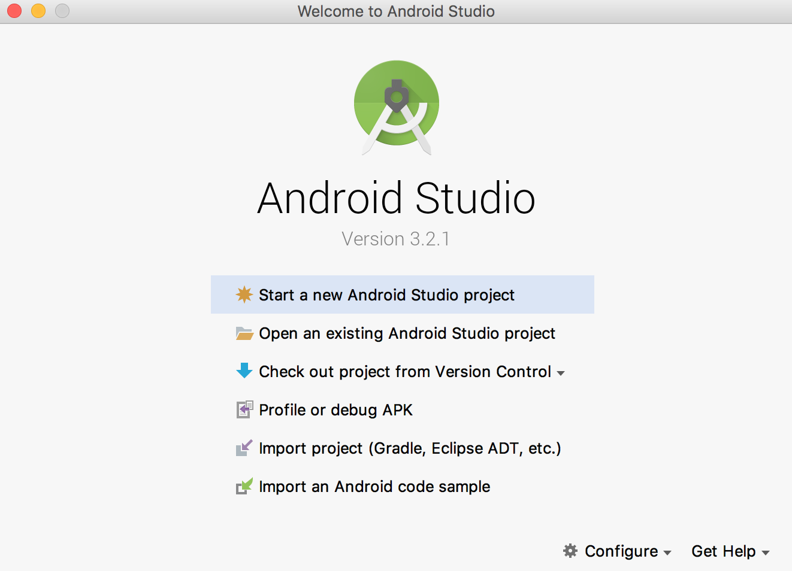
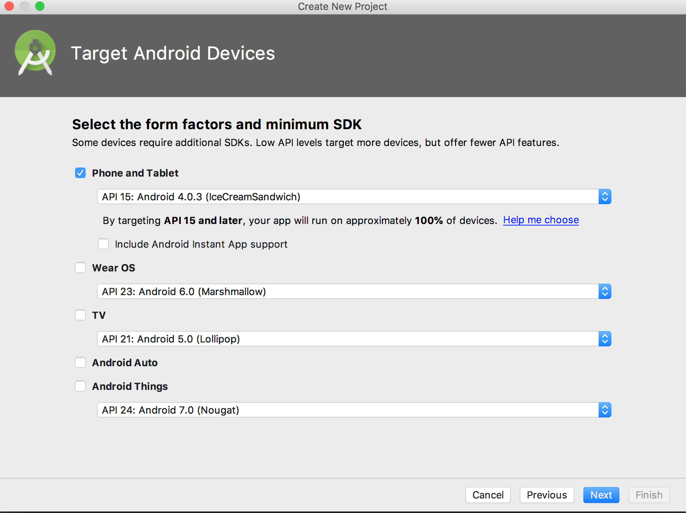
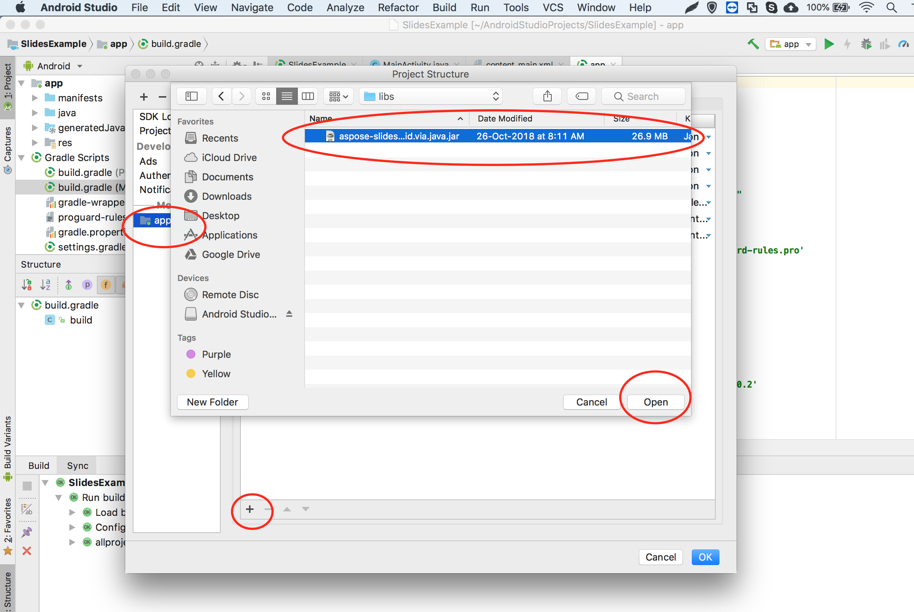
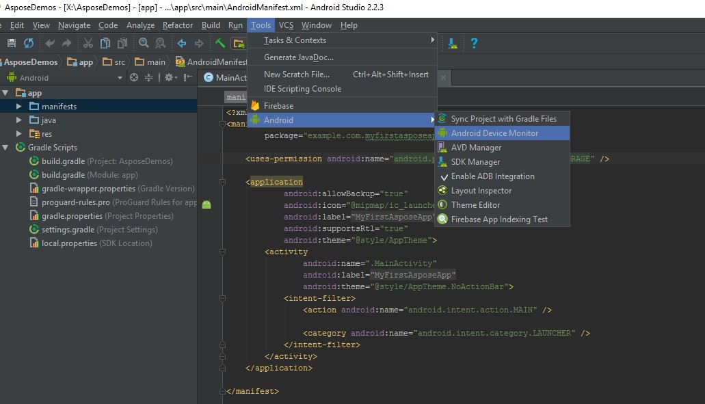

## **Översikt**

Denna artikel förklarar hur du installerar Aspose.Slides för Android via Java och lägger till den i ett Android‑projekt. Den beskriver två installationsalternativ: att manuellt lägga till Aspose.Slides‑JAR‑filen i projektet och att installera biblioteket från Maven‑arkivet.

Artikeln innehåller också ett steg‑för‑steg‑exempel som visar hur du skapar en ny Android‑applikation i Android Studio, refererar till Aspose.Slides‑biblioteket, skapar en PowerPoint‑presentation programatiskt och sparar den i PPTX‑format. Den innehåller även anteckningar om versionering och svar på vanliga frågor om hur du verifierar integrationen, hanterar minnesanvändning och minskar den slutliga JAR‑filens storlek.

## **Installation**
Tidigare distribuerades Aspose.Slides för Android via Java som en enda ZIP‑fil som innehöll JAR‑filen, demo‑exempel och produktdokumentationen. 

1. Om du vill använda en version äldre än Aspose.Words for Android via Java 18.9, måste du packa upp den versionen av Aspose.Slides.Android.zip till önskad katalog. 
1. Lägg till den extraherade JAR‑filen i din applikation genom att använda konfigurationen för Build Path. 
### **Lägg till en referens till Aspose.Slides för Android via Java‑jar**
1. Ladda ner den senaste versionen av [Aspose.Slides for Android via Java](https://downloads.aspose.com/slides/sv/androidjava)
1. Kopiera aspose-slides-18.9-android.via.java.jar till ditt projekts *libs/*‑mapp


### **Installera Aspose.Slides för Android via Java från Maven‑arkivet**
1. Lägg till Maven‑arkivet i din build.gradle. 
1. Lägg till [Aspose.Slides for Android via Java](https://releases.aspose.com/java/repo/com/aspose/aspose-slides/) JAR som en beroende.

``` java

 // 1. Lägg till Maven‑arkivet i din build.gradle 

repositories {

    mavenCentral()

    maven { url "https://releases.aspose.com/java/repo/" }

}

// 2. Lägg till 'Aspose.Slides for Android via Java' JAR som ett beroende

dependencies {

    ...

    ...

    compile (group: 'com.aspose', name: 'aspose-slides', version: 'XX.XX', classifier: 'android.via.java')

}

```
## **Din första applikation som använder Aspose.Slides för Android via Java**
I det här avsnittet lär du dig hur du kommer igång med Aspose.Slides för Android via Java. Vi visar hur du ställer in ett nytt Android‑projekt från grunden, lägger till en referens till Aspose.Slides‑JAR‑filen och skapar en ny PowerPoint‑presentation som sparas på enheten i PPTX‑format. Exemplet använder [Android Studio](https://developer.android.com/studio/index.html) för utveckling och applikationen körs på Android‑emulatorn. För att komma igång med Aspose.Slides för Android via Java, följ detta steg‑för‑steg‑handledning för att skapa en app som använder Aspose.Slides för Android via Java:

1. Ladda ner [Android Studio](https://developer.android.com/studio/index.html) och installera det på valfri plats.
1. Starta Android Studio.
1. Skapa ett nytt Android‑applikationsprojekt.







1. Kopiera aspose-slides-XX.XX-android.via.java.jar till ditt projekts libs‑mapp


1. Välj Projekt‑sektionen (från Arkiv‑menyn) och klicka på fliken Beroenden.
   1. Klicka på ”+”-knappen. Välj fil‑beroendealternativet.
   1. Välj Aspose.Slides‑biblioteket från libs‑mappen och klicka på OK.




1. Synkronisera projektet med Gradle‑filerna om det behövs. 


1. För att komma åt SD‑kortet måste speciella behörigheter läggas till. Klicka på AndroidManifest.xml‑filen och välj XML‑vyn. Lägg till följande rad i filen <uses-permission android:name="android.permission.WRITE_EXTERNAL_STORAGE" />


1. Navigera tillbaka till kodsektionen i appen och lägg till dessa import‑satser: 

``` java

 import java.io.File;

import com.aspose.slides.IAutoShape;

import com.aspose.slides.IParagraph;

import com.aspose.slides.IPortion;

import com.aspose.slides.ISlide;

import com.aspose.slides.ITextFrame;

import com.aspose.slides.Presentation;

import com.aspose.slides.SaveFormat;

import com.aspose.slides.ShapeType;

import android.os.Environment; 

```

Infoga nu den här koden i kroppen av onCreate‑metoden för att skapa en ny Presentation från grunden med Aspose.Slides och spara den på SD‑kortet i PPTX‑format.

``` java

 try

{

    // Instansiera Presentation-klassen som representerar PPTX

    Presentation pres = new Presentation();


    // Kom åt den första bilden

    ISlide sld = pres.getSlides().get_Item(0);


    // Lägg till en AutoShape av rektangulär typ

    IAutoShape ashp = sld.getShapes().addAutoShape(ShapeType.Rectangle, 150, 75, 150, 50);


    // Lägg till TextFrame till rektangeln

    ashp.addTextFrame(" ");


    // Åtkomst till textramen

    ITextFrame txtFrame = ashp.getTextFrame();


    // Skapa Paragraph-objektet för textramen

    IParagraph para = txtFrame.getParagraphs().get_Item(0);


    // Skapa Portion-objektet för paragrafen

    IPortion portion = para.getPortions().get_Item(0);


    // Ange text

    portion.setText("Aspose TextBox");


    // Spara PPTX-filen på kortet

    String sdCardPath = Environment.getExternalStorageDirectory().getPath() + File.separator;

    pres.save(sdCardPath + "Textbox.pptx",SaveFormat.Pptx);

}

catch (Exception e)

{

   e.printStackTrace();

}

```

Den fullständiga koden bör se ut så här:


1. Kör nu applikationen igen. Den här gången körs Aspose.Slides‑koden i bakgrunden och genererar ett dokument som sparas på SD‑kortet.


1. För att visa det skapade dokumentet, gå till Verktyg‑menyn. Välj Android och sedan Android Device Monitor




## **Versionering**
Sedan 2018 följer versioneringen av Aspose.Slides för Android via Java versioneringen av Aspose.Slides för Java. 

## **Vanliga frågor**

**Hur kan jag verifiera att Aspose.Slides är korrekt integrerat?**

Bygg ditt projekt, skapa en tom [Presentation](https://reference.aspose.com/slides/sv/androidjava/com.aspose.slides/presentation/) och spara den under ett nytt namn. Om filen skapas utan att kasta undantag har biblioteket integrerats framgångsrikt.

**Hur kan jag begränsa minnesförbrukningen vid bearbetning av stora presentationer?**

Höj JVM‑minnesgränserna bara så högt som behövs, och stäng varje [Presentation](https://reference.aspose.com/slides/sv/androidjava/com.aspose.slides/presentation/)‑instans i ett `finally`‑block för att frigöra cacheminnet omedelbart. Detta förhindrar out‑of‑memory‑fel och håller den totala minnesanvändningen förutsägbar under batch‑operationer.

**Kan jag exkludera oönskade exportformat för att minska den slutliga JAR‑filens storlek?**

Aktuella versioner av Aspose.Slides levereras som ett enda monolitiskt bibliotek, så du kan inte inaktivera specifika exportörer som PDF eller SVG vid byggtiden.