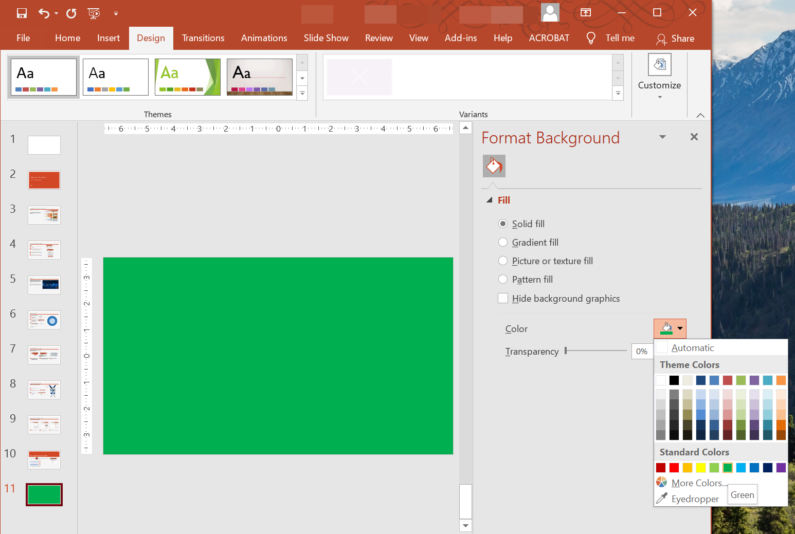

## **Introduktion**

Solida färger, gradienter och bilder används ofta för bildbakgrunder. Du kan ställa in bakgrunden för en **normal bild** (en enskild bild) eller en **master‑bild** (gäller flera bilder samtidigt).



## **Ställ in en solid färg som bakgrund för en normal bild**

Aspose.Slides låter dig ange en solid färg som bakgrund för en specifik bild i en presentation—även om presentationen använder en master‑bild. Ändringen gäller endast den valda bilden.

1. Skapa en instans av klassen [Presentation](https://reference.aspose.com/slides/sv/cpp/aspose.slides/presentation/).
2. Ställ in bildens [BackgroundType](https://reference.aspose.com/slides/sv/cpp/aspose.slides/backgroundtype/) till `OwnBackground`.
3. Ställ in bildbakgrundens [FillType](https://reference.aspose.com/slides/sv/cpp/aspose.slides/filltype/) till `Solid`.
4. Använd metoden [get_SolidFillColor](https://reference.aspose.com/slides/sv/cpp/aspose.slides/fillformat/get_solidfillcolor/) på [FillFormat](https://reference.aspose.com/slides/sv/cpp/aspose.slides/fillformat/) för att ange den solida bakgrundsfärgen.
5. Spara den ändrade presentationen.

Följande C++‑exempel visar hur du ställer in en blå solid färg som bakgrund för en normal bild:

```cpp
// Skapa en instans av Presentation-klassen.
auto presentation = MakeObject<Presentation>();

auto slide = presentation->get_Slide(0);

// Ställ in bakgrundsfärgen för bilden till blå.
slide->get_Background()->set_Type(BackgroundType::OwnBackground);
slide->get_Background()->get_FillFormat()->set_FillType(FillType::Solid);
slide->get_Background()->get_FillFormat()->get_SolidFillColor()->set_Color(Color::get_Blue());

// Spara presentationen till disk.
presentation->Save(u"SolidColorBackground.pptx", SaveFormat::Pptx);
presentation->Dispose();
```

## **Ställ in en solid färg som bakgrund för en master‑bild**

Aspose.Slides låter dig ange en solid färg som bakgrund för master‑bilden i en presentation. Master‑bilden fungerar som en mall som styr formatering för alla bilder, så när du väljer en solid färg för master‑bildens bakgrund gäller den för varje bild.

1. Skapa en instans av klassen [Presentation](https://reference.aspose.com/slides/sv/cpp/aspose.slides/presentation/).
2. Ställ in master‑bildens [BackgroundType](https://reference.aspose.com/slides/sv/cpp/aspose.slides/backgroundtype/) (via `get_Masters`) till `OwnBackground`.
3. Ställ in master‑bildens bakgrund [FillType](https://reference.aspose.com/slides/sv/cpp/aspose.slides/filltype/) till `Solid`.
4. Använd metoden [get_SolidFillColor](https://reference.aspose.com/slides/sv/cpp/aspose.slides/fillformat/get_solidfillcolor/) för att ange den solida bakgrundsfärgen.
5. Spara den ändrade presentationen.

Följande C++‑exempel visar hur du ställer in en solid färg (skoggrön) som bakgrund för en master‑bild:

```cpp
// Skapa en instans av Presentation-klassen.
auto presentation = MakeObject<Presentation>();

auto masterSlide = presentation->get_Master(0);

// Ställ in bakgrundsfärgen för master‑bilden till skogsgrön.
masterSlide->get_Background()->set_Type(BackgroundType::OwnBackground);
masterSlide->get_Background()->get_FillFormat()->set_FillType(FillType::Solid);
masterSlide->get_Background()->get_FillFormat()->get_SolidFillColor()->set_Color(Color::get_ForestGreen());

// Spara presentationen till disk.
presentation->Save(u"MasterSlideBackground.pptx", SaveFormat::Pptx);
presentation->Dispose();
```

## **Ställ in en gradientbakgrund för en bild**

En gradient är en grafisk effekt som skapas genom en gradvis färgförändring. När den används som bildbakgrund kan gradienter göra presentationer mer konstnärliga och professionella. Aspose.Slides låter dig ange en gradientfärg som bakgrund för bilder.

1. Skapa en instans av klassen [Presentation](https://reference.aspose.com/slides/sv/cpp/aspose.slides/presentation/).
2. Ställ in bildens [BackgroundType](https://reference.aspose.com/slides/sv/cpp/aspose.slides/backgroundtype/) till `OwnBackground`.
3. Ställ in bildbakgrundens [FillType](https://reference.aspose.com/slides/sv/cpp/aspose.slides/filltype/) till `Gradient`.
4. Använd metoden [get_GradientFormat](https://reference.aspose.com/slides/sv/cpp/aspose.slides/fillformat/get_gradientformat/) på [FillFormat](https://reference.aspose.com/slides/sv/cpp/aspose.slides/fillformat/) för att konfigurera dina önskade gradientinställningar.
5. Spara den ändrade presentationen.

Följande C++‑exempel visar hur du ställer in en gradientfärg som bakgrund för en bild:

```cpp
// Skapa en instans av Presentation-klassen.
auto presentation = MakeObject<Presentation>();

auto slide = presentation->get_Slide(0);

// Applicera en gradienteffekt på bakgrunden.
slide->get_Background()->set_Type(BackgroundType::OwnBackground);
slide->get_Background()->get_FillFormat()->set_FillType(FillType::Gradient);
slide->get_Background()->get_FillFormat()->get_GradientFormat()->set_TileFlip(TileFlip::FlipBoth);

// Spara presentationen till disk.
presentation->Save(u"GradientBackground.pptx", SaveFormat::Pptx);
presentation->Dispose();
```

## **Använd en bild som bakgrund för en bild**

Förutom solida och gradientfyllningar låter Aspose.Slides dig använda bilder som bildbakgrunder.

1. Skapa en instans av klassen [Presentation](https://reference.aspose.com/slides/sv/cpp/aspose.slides/presentation/).
2. Ställ in bildens [BackgroundType](https://reference.aspose.com/slides/sv/cpp/aspose.slides/backgroundtype/) till `OwnBackground`.
3. Ställ in bildbakgrundens [FillType](https://reference.aspose.com/slides/sv/cpp/aspose.slides/filltype/) till `Picture`.
4. Ladda bilden du vill använda som bildbakgrund.
5. Lägg till bilden i presentationens bildsamling.
6. Använd metoden [get_PictureFillFormat](https://reference.aspose.com/slides/sv/cpp/aspose.slides/fillformat/get_picturefillformat/) på [FillFormat](https://reference.aspose.com/slides/sv/cpp/aspose.slides/fillformat/) för att tilldela bilden som bakgrund.
7. Spara den ändrade presentationen.

Följande C++‑exempel visar hur du ställer in en bild som bakgrund för en bild:

```cpp
// Skapa en instans av Presentation-klassen.
auto presentation = MakeObject<Presentation>();

auto slide = presentation->get_Slide(0);

// Ställ in egenskaper för bakgrundsbild.
slide->get_Background()->set_Type(BackgroundType::OwnBackground);
slide->get_Background()->get_FillFormat()->set_FillType(FillType::Picture);
slide->get_Background()->get_FillFormat()->get_PictureFillFormat()->set_PictureFillMode(PictureFillMode::Stretch);

// Läs in bilden.
auto image = Images::FromFile(u"Tulips.jpg");
// Lägg till bilden i presentationens bildsamling.
auto ppImage = presentation->get_Images()->AddImage(image);
image->Dispose();

slide->get_Background()->get_FillFormat()->get_PictureFillFormat()->get_Picture()->set_Image(ppImage);

// Spara presentationen till disk.
presentation->Save(u"ImageAsBackground.pptx", SaveFormat::Pptx);
presentation->Dispose();
```

Följande kodexempel visar hur du ställer in bakgrundens fyllningstyp till en mosaikbild och ändrar mosaikegenskaperna:

```cpp
auto presentation = MakeObject<Presentation>();

auto firstSlide = presentation->get_Slide(0);

auto background = firstSlide->get_Background();

background->set_Type(BackgroundType::OwnBackground);
background->get_FillFormat()->set_FillType(FillType::Picture);

auto newImage = Images::FromFile(u"image.png");
auto ppImage = presentation->get_Images()->AddImage(newImage);
newImage->Dispose();

// Set the image used for the background fill.
auto backPictureFillFormat = background->get_FillFormat()->get_PictureFillFormat();
backPictureFillFormat->get_Picture()->set_Image(ppImage);

// Set the picture fill mode to Tile and adjust the tile properties.
backPictureFillFormat->set_PictureFillMode(PictureFillMode::Tile);
backPictureFillFormat->set_TileOffsetX(15.0);
backPictureFillFormat->set_TileOffsetY(15.0);
backPictureFillFormat->set_TileScaleX(46.0);
backPictureFillFormat->set_TileScaleY(87.0);
backPictureFillFormat->set_TileAlignment(RectangleAlignment::Center);
backPictureFillFormat->set_TileFlip(TileFlip::FlipY);

presentation->Save(u"TileBackground.pptx", SaveFormat::Pptx);
presentation->Dispose();
```

{}
Läs mer: [**Tile Picture As Texture**](/slides/sv/cpp/shape-formatting/#tile-picture-as-texture).
{}

### **Ändra bakgrundsbildens transparens**

Du kanske vill justera transparensen för en bilds bakgrundsbild för att få innehållet i bilden att framträda tydligare. Följande C++‑kod visar hur du ändrar transparensen för en bilds bakgrundsbild:

```cpp
auto transparencyValue = 30; // Till exempel.

// Get the collection of picture transform operations.
auto imageTransform = slide->get_Background()->get_FillFormat()->get_PictureFillFormat()->get_Picture()->get_ImageTransform();

// Find an existing fixed-percentage transparency effect.
SharedPtr<IAlphaModulateFixed> transparencyOperation;
for (auto&& operation : imageTransform)
{
    if (ObjectExt::Is<IAlphaModulateFixed>(operation))
    {
        transparencyOperation = ExplicitCast<IAlphaModulateFixed>(operation);
        break;
    }
}

// Set the new transparency value.
if (transparencyOperation == nullptr)
{
    imageTransform->AddAlphaModulateFixedEffect(100.0f - transparencyValue);
}
else
{
    transparencyOperation->set_Amount(100.0f - transparencyValue);
}
```

## **Hämta bildens bakgrundsvärde**

Aspose.Slides tillhandahåller gränssnittet [IBackgroundEffectiveData](https://reference.aspose.com/slides/sv/cpp/aspose.slides/ibackgroundeffectivedata/) för att hämta en bilds faktiska bakgrundsvärden. Detta gränssnitt exponerar den faktiska [FillFormat](https://reference.aspose.com/slides/sv/cpp/aspose.slides/ibackgroundeffectivedata/get_fillformat/) och [EffectFormat](https://reference.aspose.com/slides/sv/cpp/aspose.slides/ibackgroundeffectivedata/get_effectformat/).

Genom att använda metoden `get_Background` i klassen [BaseSlide](https://reference.aspose.com/slides/sv/cpp/aspose.slides/baseslide/) kan du få den faktiska bakgrunden för en bild.

Följande C++‑exempel visar hur du hämtar en bilds faktiska bakgrundsvärde:

```cpp
// Skapa en instans av Presentation-klassen.
auto presentation = MakeObject<Presentation>(u"Sample.pptx");

auto slide = presentation->get_Slide(0);

// Hämta den effektiva bakgrunden, med hänsyn till master, layout och tema.
auto effBackground = slide->get_Background()->GetEffective();

if (effBackground->get_FillFormat()->get_FillType() == FillType::Solid)
{
    Console::WriteLine(u"Fill color: {0}", effBackground->get_FillFormat()->get_SolidFillColor());
}
else
{
    Console::WriteLine(u"Fill type: {0}", ObjectExt::ToString(effBackground->get_FillFormat()->get_FillType()));
}
```

## **Vanliga frågor**

**Kan jag återställa en anpassad bakgrund och återfå temats/layoute‑bakgrund?**

Ja. Ta bort bildens anpassade fyllning så ärver bakgrunden återigen från motsvarande [layout](/slides/sv/cpp/slide-layout/)/[master](/slides/sv/cpp/slide-master/) bild (dvs. [tema bakgrund](/slides/sv/cpp/presentation-theme/)).

**Vad händer med bakgrunden om jag ändrar presentationens tema senare?**

Om en bild har sin egen fyllning förblir den oförändrad. Om bakgrunden ärvs från [layout](/slides/sv/cpp/slide-layout/)/[master](/slides/sv/cpp/slide-master/) uppdateras den för att matcha det [nya temat](/slides/sv/cpp/presentation-theme/).