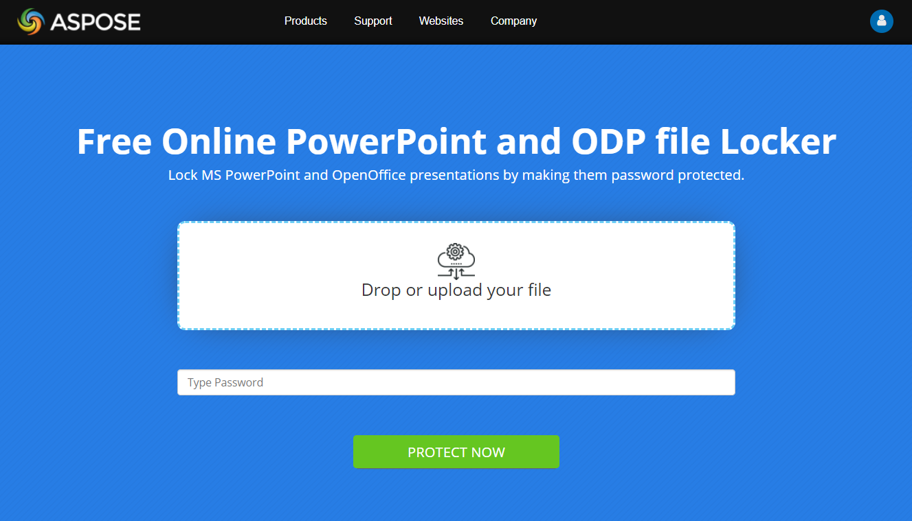

## **Introduktion**

När du lösenordsskyddar en presentation betyder det att du ställer in ett lösenord som upprätthåller vissa begränsningar för presentationen. För att ta bort begränsningarna måste lösenordet anges. En lösenordsskyddad presentation betraktas som en låst presentation.

Vanligtvis kan du ställa in ett lösenord för att upprätthålla dessa begränsningar på en presentation:

- **Modifiering**

  Om du vill att endast vissa användare ska kunna modifiera din presentation kan du sätta en ändringsbegränsning. Begränsningen hindrar här personer från att modifiera, ändra eller kopiera saker i din presentation (såvida de inte anger lösenordet). 

  Dock kommer en användare i detta fall, även utan lösenord, kunna komma åt ditt dokument och öppna det. I detta skrivskyddade läge kan användaren se innehållet eller saker—hyperlänkar, animationer, effekter och andra—i din presentation, men de kan inte kopiera objekt eller spara presentationen. 

- **Öppning**

  Om du vill att endast vissa användare ska kunna öppna din presentation kan du sätta en öppningsbegränsning. Begränsningen hindrar här personer från ens att se innehållet i din presentation (såvida de inte anger lösenordet).

  Tekniskt hindrar öppningsbegränsningen även användare från att modifiera dina presentationer: När personer inte kan öppna en presentation kan de inte göra ändringar i den. 

  **Observera** att när du lösenordsskyddar en presentation för att hindra öppning blir presentationsfilen krypterad.

## **Hur du lösenordsskyddar en presentation online**

1. Gå till vår [**Aspose.Slides Lock**](https://products.aspose.app/slides/sv/lock) sida. 

   

2. Klicka på **Släpp eller ladda upp dina filer**.

3. Välj den fil du vill lösenordsskydda på din dator. 

4. Ange ditt önskade lösenord för redigeringsskydd; ange ditt önskade lösenord för visningsskydd. 

5. Om du vill att användare ska se din presentation som den slutgiltiga kopian, markera kryssrutan **Markera som slutgiltig**.

6. Klicka på **SKYDDA NU.** 

7. Klicka på **LADDA NER NU.**

## **Lösenordsskydd för presentationer i Aspose.Slides**
**Stödda format**

Aspose.Slides stödjer lösenordsskydd, kryptering och liknande operationer för presentationer i dessa format: 

- PPTX and PPT - Microsoft PowerPoint-presentation 
- ODP - OpenDocument-presentation 
- OTP - OpenDocument-presentationmall 

**Stödda operationer**

Aspose.Slides låter dig använda lösenordsskydd på presentationer för att förhindra ändringar på följande sätt:

- Kryptera en presentation
- Ställa in ett skrivskydd för en presentation

**Övriga operationer**

Aspose.Slides låter dig utföra andra uppgifter som involverar lösenordsskydd och kryptering på följande sätt:

- Dekryptera en presentation; öppna en krypterad presentation
- Ta bort kryptering; inaktivera lösenordsskydd
- Ta bort skrivskydd från en presentation
- Hämta egenskaperna för en krypterad presentation
- Kontrollera om en presentation är krypterad
- Kontrollera om en presentation är lösenordsskyddad.

## **Kryptera en presentation**

Du kan kryptera en presentation genom att ange ett lösenord. För att sedan ändra den låsta presentationen måste en användare ange lösenordet. 

För att kryptera eller lösenordsskydda en presentation måste du använda encrypt‑metoden (från [ProtectionManager](https://reference.aspose.com/slides/sv/cpp/class/aspose.slides.protection_manager)) för att ange ett lösenord för presentationen. Du skickar lösenordet till encrypt‑metoden och använder save‑metoden för att spara den nu krypterade presentationen. 

Detta exempel på kod visar hur du krypterar en presentation:

``` cpp
auto presentation = System::MakeObject<Presentation>(u"pres.pptx");

presentation->get_ProtectionManager()->Encrypt(u"123123");
presentation->Save(u"encrypted-pres.pptx", SaveFormat::Pptx);
```

## **Ställ in skrivskydd för en presentation** 

Du kan lägga till en markering med texten “Do not modify” i en presentation. På så sätt kan du tala om för användare att du inte vill att de ska göra ändringar i presentationen.  

**Observera** att skrivskyddsprocessen inte krypterar presentationen. Därför kan användare—om de verkligen vill—modifiera presentationen, men för att spara ändringarna måste de skapa en presentation med ett annat namn. 

För att sätta ett skrivskydd måste du använda setWriteProtection‑metoden. Detta exempel på kod visar hur du sätter ett skrivskydd för en presentation:

``` cpp
auto presentation = System::MakeObject<Presentation>(u"pres.pptx");

presentation->get_ProtectionManager()->SetWriteProtection(u"123123");
presentation->Save(u"write-protected-pres.pptx", SaveFormat::Pptx);
```

## **Läs in en krypterad presentation**

Aspose.Slides låter dig läsa in en krypterad fil genom att ange dess lösenord. För att dekryptera en presentation måste du anropa [RemoveEncryption](https://reference.aspose.com/slides/sv/cpp/class/aspose.slides.protection_manager#a422059278b430a0493680252aa975d4d)-metoden utan parametrar. Du kommer sedan att behöva ange rätt lösenord för att läsa in presentationen. 

``` cpp
auto loadOptions = System::MakeObject<LoadOptions>();
loadOptions->set_Password(u"123123");
    
System::SharedPtr<Presentation> presentation = System::MakeObject<Presentation>(u"pres.pptx", loadOptions);

// arbeta med dekrypterad presentation
```

## **Ta bort kryptering från en presentation**

Du kan ta bort krypteringen eller lösenordsskyddet på en presentation. På så sätt kan användare komma åt eller ändra presentationen utan begränsningar.

För att ta bort kryptering eller lösenordsskydd måste du anropa [RemoveEncryption](https://reference.aspose.com/slides/sv/cpp/class/aspose.slides.protection_manager#a422059278b430a0493680252aa975d4d)-metoden. Detta kodexempel visar hur du tar bort kryptering från en presentation:

``` cpp
auto loadOptions = System::MakeObject<LoadOptions>();
loadOptions->set_Password(u"123123");
    
auto presentation = System::MakeObject<Presentation>(u"pres.pptx", loadOptions);

presentation->get_ProtectionManager()->RemoveEncryption();
presentation->Save(u"encryption-removed.pptx", SaveFormat::Pptx);
```

## **Ta bort skrivskydd från en presentation**

Du kan använda Aspose.Slides för att ta bort skrivskyddet som används på en presentationsfil. På så sätt kan användare modifiera hur de vill—och de får inga varningar när de utför sådana åtgärder.

Du kan ta bort skrivskyddet från en presentation genom att använda [RemoveWriteProtection](https://reference.aspose.com/slides/sv/cpp/class/aspose.slides.protection_manager#a9f9e6de5983965157dac0f270a0a9e50)-metoden. Detta kodexempel visar hur du tar bort skrivskyddet från en presentation:

``` cpp
auto presentation = System::MakeObject<Presentation>(u"pres.pptx");

presentation->get_ProtectionManager()->RemoveWriteProtection();
presentation->Save(u"write-protection-removed.pptx", SaveFormat::Pptx);
```

## **Hämta egenskaper för en krypterad presentation**

Vanligtvis har användare svårt att hämta dokumentegenskaperna för en krypterad eller lösenordsskyddad presentation. Aspose.Slides erbjuder dock en mekanism som låter dig lösenordsskydda en presentation samtidigt som åtkomst till dess dokumentegenskaper fortfarande är möjlig.

**Observera:** Som standard, när Aspose.Slides krypterar en presentation, är presentationens dokumentegenskaper också lösenordsskyddade. Om du behöver göra dokumentegenskaperna åtkomliga även efter kryptering, låter Aspose.Slides dig göra just det.

Om du vill att användare ska behålla möjligheten att komma åt egenskaperna för en krypterad presentation, skicka `false` till `set_EncryptDocumentProperties`‑metoden i [IProtectionManager](https://reference.aspose.com/slides/sv/cpp/aspose.slides/iprotectionmanager/). Detta kodexempel visar hur du krypterar en presentation samtidigt som du fortfarande ger användare åtkomst till dess dokumentegenskaper:

``` cpp
auto presentation = System::MakeObject<Presentation>(u"pres.pptx");

presentation->get_ProtectionManager()->set_EncryptDocumentProperties(false);
presentation->get_ProtectionManager()->Encrypt(u"123123");
presentation->Save(u"encrypted-pres.pptx", SaveFormat::Pptx);
presentation->Dispose();
```

## **Läs endast dokumentegenskaper från en krypterad presentation**

För att inspektera metadata för en krypterad presentation utan att läsa in dess bilder eller annat innehåll, skapa ett [LoadOptions](https://reference.aspose.com/slides/sv/cpp/aspose.slides/loadoptions/)‑objekt och sätt [set_OnlyLoadDocumentProperties](https://reference.aspose.com/slides/sv/cpp/aspose.slides/loadoptions/set_onlyloaddocumentproperties/) till `true`. I detta läge ignorerar Aspose.Slides lösenordet och läser endast de dokumentegenskaper som är offentligt tillgängliga.

Följande kodexempel läser inbyggda och anpassade dokumentegenskaper via [IPresentation::get_DocumentProperties](https://reference.aspose.com/slides/sv/cpp/aspose.slides/ipresentation/get_documentproperties/):

``` cpp
auto loadOptions = MakeObject<LoadOptions>();
loadOptions->set_OnlyLoadDocumentProperties(true);

auto presentation = MakeObject<Presentation>(u"encrypted-pres.pptx", loadOptions);
auto documentProperties = presentation->get_DocumentProperties();

// Read built-in document properties.
auto title = documentProperties->get_Title();
auto author = documentProperties->get_Author();
Console::WriteLine(String(u"Title: ") + title);
Console::WriteLine(String(u"Author: ") + author);

// Read custom document properties.
int customPropertyCount = documentProperties->get_CountOfCustomProperties();

for (int propertyIndex = 0; propertyIndex < customPropertyCount; propertyIndex++)
{
    auto propertyName = documentProperties->GetCustomPropertyName(propertyIndex);
    auto propertyValue = documentProperties->idx_get(propertyName);
    auto propertyValueText = ObjectExt::ToString(propertyValue);

    Console::WriteLine(propertyName + u": " + propertyValueText);
}

presentation->Dispose();
```

Detta arbetsflöde fungerar endast om dokumentegenskaperna lämnades oskyddade (publika) när presentationen krypterades. Om dokumentegenskaperna är krypterade, kommer inställning av `LoadOptions::set_OnlyLoadDocumentProperties` till `true` att orsaka ett undantag eftersom lösenordet ignoreras i detta läge. För att komma åt krypterade dokumentegenskaper eller läsa in hela presentationen, inklusive dess bilder och annat innehåll, ange rätt lösenord med `LoadOptions::set_Password` i [LoadOptions](https://reference.aspose.com/slides/sv/cpp/aspose.slides/loadoptions/).

## **Kontrollera om en presentation är lösenordsskyddad**

Innan du läser in en presentation kan du vilja kontrollera och bekräfta att presentationen inte är skyddad med ett lösenord. På så sätt kan du undvika fel och liknande problem som uppstår när en lösenordsskyddad presentation läses in utan lösenord.

Denna C++‑kod visar hur du undersöker en presentation för att se om den är lösenordsskyddad (utan att läsa in presentationen själv):

```c++
auto presentationInfo = PresentationFactory::get_Instance()->GetPresentationInfo(u"example.pptx");
System::Console::WriteLine(System::String(u"The presentation is password protected: ") +
                           presentationInfo->get_IsPasswordProtected());
```

## **Kontrollera om en presentation är krypterad**

Aspose.Slides låter dig kontrollera om en presentation är krypterad. För att utföra detta kan du använda [get_IsEncrypted()](https://reference.aspose.com/slides/sv/cpp/class/aspose.slides.protection_manager#ad88b984e44b378f335317ded49b34e68)‑metoden, som returnerar `true` om presentationen är krypterad eller `false` om den inte är krypterad. 

Detta kodexempel visar hur du kontrollerar om en presentation är krypterad:

``` cpp
auto presentation = System::MakeObject<Presentation>(u"pres.pptx");

bool isEncrypted = presentation->get_ProtectionManager()->get_IsEncrypted();
```

## **Kontrollera om en presentation är skrivskyddad**

Aspose.Slides låter dig kontrollera om en presentation är skrivskyddad. För att utföra detta kan du använda [get_IsWriteProtected()](https://reference.aspose.com/slides/sv/cpp/class/aspose.slides.protection_manager#a0b4a82c0f7b3a32ca5762c5fcc8844a2)‑metoden, som returnerar `true` om presentationen är krypterad eller `false` om den inte är krypterad. 

Detta kodexempel visar hur du kontrollerar om en presentation är skrivskyddad:

``` cpp
auto presentation = System::MakeObject<Presentation>(u"pres.pptx");

bool isEncrypted = presentation->get_ProtectionManager()->get_IsWriteProtected();
```

## **Verifiera användning av presentationslösenord**

Du kanske vill kontrollera och bekräfta att ett specifikt lösenord har använts för att skydda ett presentationsdokument. Aspose.Slides tillhandahåller möjligheten att validera ett lösenord. 

Detta kodexempel visar hur du validerar ett lösenord:

``` cpp
auto pres = System::MakeObject<Presentation>(u"pres.pptx");

// kontrollera om "pass" matchas med
bool isWriteProtected = pres->get_ProtectionManager()->CheckWriteProtection(u"my_password");
```

Det returnerar `true` om presentationen har krypterats med det angivna lösenordet. Annars returnerar det `false`.

{} 
- [Digital signatur i PowerPoint](/slides/sv/cpp/digital-signature-in-powerpoint/)
{}

## **Vanliga frågor**

**Vilka krypteringsmetoder stöds av Aspose.Slides?**

Aspose.Slides stödjer moderna krypteringsmetoder, inklusive AES‑baserade algoritmer, vilket säkerställer en hög datasäkerhetsnivå för dina presentationer.

**Vad händer om ett felaktigt lösenord anges när man försöker öppna en presentation?**

Ett undantag kastas om ett felaktigt lösenord används, vilket varnar dig om att åtkomst till presentationen nekas. Detta hjälper till att förhindra obehörig åtkomst och skyddar presentationsinnehållet.

**Finns det några prestandapåverkan när man arbetar med lösenordsskyddade presentationer?**

Krypterings‑ och dekrypteringsprocessen kan medföra en liten extra belastning under öppnings‑ och sparningsoperationer. I de flesta fall är denna prestandapåverkan minimal och påverkar inte avsevärt den totala bearbetningstiden för dina presentationsuppgifter.