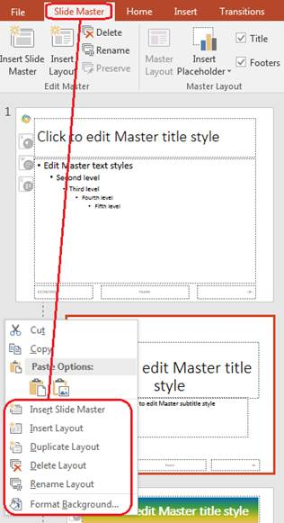

## **Översikt**

En **slide master** definierar delade designinställningar för en grupp bilder. Den kan innehålla gemensamma former, logotyper, bakgrunder, textstilar, temainställningar och sidfotinställningar. I PowerPoint är redigering av en slide master det vanliga sättet att hålla en presentation konsekvent utan att upprepa samma formatering på varje bild.

Aspose.Slides för C++ stödjer samma modell. En presentation kan innehålla en eller flera master‑bilder, och varje master‑bild kan innehålla flera layout‑bilder. Normala bilder refererar normalt inte direkt till en master‑bild. Istället använder en normal bild en layout‑bild, och den layout‑bilden tillhör en master‑bild.

Hierarkin är:

1. **Slide master** – definierar den delade designen och temat.  
1. **Layout slide** – definierar ett specifikt arrangemang av platshållare och layout‑nivåformatering.  
1. **Normal slide** – innehåller det faktiska presentationsinnehållet och använder en layout‑bild.


I Aspose.Slides representeras en slide master av gränssnittet [IMasterSlide](https://reference.aspose.com/slides/sv/cpp/aspose.slides/imasterslide/). Alla master‑bilder i en presentation är tillgängliga via samlingen [Presentation::get_Masters](https://reference.aspose.com/slides/sv/cpp/aspose.slides/presentation/get_masters/) som implementerar [IMasterSlideCollection](https://reference.aspose.com/slides/sv/cpp/aspose.slides/imasterslidecollection/).

{}
När samma egenskap definieras på mer än en nivå vinner den mer specifika nivån. Till exempel, om en master‑bild och en layout‑bild båda definierar en bakgrund, använder bilder baserade på den layouten layout‑bakgrunden. För mer information om layout‑bilder, se [Apply or Change Slide Layouts](/slides/sv/cpp/slide-layout/).
{}

## **Åtkomst till Slide Masters**

I PowerPoint kan du öppna Slide Master‑vyn via **View** > **Slide Master**.


I Aspose.Slides använder du samlingen `get_Masters()` för att komma åt master‑bilder:

```cpp
#include <DOM/IMasterLayoutSlideCollection.h>
#include <DOM/IMasterSlide.h>
#include <DOM/IMasterSlideCollection.h>
#include <DOM/Presentation.h>
#include <system/console.h>
using namespace Aspose::Slides;
using namespace System;

auto presentation = System::MakeObject<Presentation>(u"presentation.pptx");

auto firstMasterSlide = presentation->get_Master(0);
auto masterSlideCount = presentation->get_Masters()->get_Count();
auto firstMasterLayoutSlideCount = firstMasterSlide->get_LayoutSlides()->get_Count();

System::Console::WriteLine(System::String(u"Master slides: ") + masterSlideCount);
System::Console::WriteLine(System::String(u"Layouts in the first master: ") + firstMasterLayoutSlideCount);

presentation->Dispose();
```

Du kan också hämta master‑bilden som används av en normal bild via dess layout:

```cpp
#include <DOM/ILayoutSlide.h>
#include <DOM/IMasterSlide.h>
#include <DOM/ISlide.h>
#include <DOM/Presentation.h>
#include <system/console.h>
using namespace Aspose::Slides;
using namespace System;

auto presentation = System::MakeObject<Presentation>(u"presentation.pptx");

auto slide = presentation->get_Slide(0);
auto layoutSlide = slide->get_LayoutSlide();
auto masterSlide = layoutSlide->get_MasterSlide();
auto masterSlideName = masterSlide->get_Name();

System::Console::WriteLine(masterSlideName);

presentation->Dispose();
```

## **Vad en Slide Master innehåller**

En master‑bild är ett bild‑likt objekt. Den implementerar [IBaseSlide](https://reference.aspose.com/slides/sv/cpp/aspose.slides/ibaseslide/), så den exponeras för många av samma bildegenskaper som används av normala och layout‑bilder. Master‑specifika medlemmar listas på API‑sidan för [IMasterSlide](https://reference.aspose.com/slides/sv/cpp/aspose.slides/imasterslide/).

Vanligt använda master‑bildmedlemmar inkluderar:

| Medlem | Syfte |
| --- | --- |
| `get_Background()` | Ställer in master‑nivåns bildbakgrund. |
| `get_Shapes()` | Lagrar former placerade på mastern, såsom logotyper, bildramar och delad text. |
| `get_LayoutSlides()` | Lagrar layout‑bilderna som tillhör mastern. |
| `get_ThemeManager()` | Ger åtkomst till master‑temats API:er. |
| `get_HeaderFooterManager()` | Styr rubriker, sidfötter, datum och bildnummer för mastern och dess underordnade layouter. |
| `GetDependingSlides()` | Returnerar normala bilder som är beroende av mastern via sina layouter. |

## **Lägg till en bild i en Slide Master**

När du lägger till en bild i en master‑bild visas den på bilder som använder layouter från den mastern. Detta är användbart för logotyper, vattenmärken, dekorativa band och andra återkommande visuella element.

Följande exempel lägger till en logotyp på den första master‑bilden:

```cpp
#include <DOM/IImageCollection.h>
#include <DOM/IMasterSlide.h>
#include <DOM/IShapeCollection.h>
#include <DOM/Presentation.h>
#include <DOM/ShapeType.h>
#include <Export/SaveFormat.h>
#include <system/io/file.h>
using namespace Aspose::Slides;
using namespace Aspose::Slides::Export;
using namespace System::IO;

auto presentation = System::MakeObject<Presentation>(u"presentation.pptx");

auto masterSlide = presentation->get_Master(0);
auto logoBytes = System::IO::File::ReadAllBytes(u"logo.png");
auto logoImage = presentation->get_Images()->AddImage(logoBytes);

masterSlide->get_Shapes()->AddPictureFrame(
    ShapeType::Rectangle,
    20.0f,
    20.0f,
    80.0f,
    80.0f,
    logoImage);

presentation->Save(u"presentation-with-logo.pptx", SaveFormat::Pptx);
presentation->Dispose();
```

För mer information om bildramar, se [Picture Frame](/slides/sv/cpp/picture-frame/).

## **Styr synligheten för master‑grafik**

Använd [IBaseSlide::set_ShowMasterShapes](https://reference.aspose.com/slides/sv/cpp/aspose.slides/ibaseslide/set_showmastershapes/) för att dölja ärvd master‑grafik, såsom logotyper eller dekorativa former, utan att radera dem från mastern. Skicka `false` till [Slide::set_ShowMasterShapes](https://reference.aspose.com/slides/sv/cpp/aspose.slides/slide/set_showmastershapes/) på den bild som ska utesluta grafiken och `true` på bilder som ska visa den.

Följande självständiga exempel skapar ett blått dekorativt band på en master och två bilder som använder samma tomma layout. Bandet är synligt på den första bilden och dolt på den andra. Ingen ingångspresentation eller bild krävs.

```cpp
#include <DOM/FillType.h>
#include <DOM/IAutoShape.h>
#include <DOM/IColorFormat.h>
#include <DOM/IFillFormat.h>
#include <DOM/ILayoutSlide.h>
#include <DOM/ILineFormat.h>
#include <DOM/IMasterLayoutSlideCollection.h>
#include <DOM/IMasterSlide.h>
#include <DOM/IShapeCollection.h>
#include <DOM/ISlide.h>
#include <DOM/ISlideCollection.h>
#include <DOM/ISlideSize.h>
#include <DOM/Presentation.h>
#include <DOM/ShapeType.h>
#include <DOM/SlideLayoutType.h>
#include <Export/SaveFormat.h>
#include <drawing/color.h>

using namespace Aspose::Slides;
using namespace Aspose::Slides::Export;
using namespace System;
using namespace System::Drawing;

auto presentation = MakeObject<Presentation>();
auto masterSlide = presentation->get_Master(0);
auto layoutSlide = masterSlide->get_LayoutSlides()->GetByType(SlideLayoutType::Blank);
layoutSlide->set_ShowMasterShapes(true);

auto slideHeight = presentation->get_SlideSize()->get_Size().get_Height();
auto band = masterSlide->get_Shapes()->AddAutoShape(ShapeType::Rectangle, 0.0f, 0.0f, 60.0f, slideHeight);
band->get_FillFormat()->set_FillType(FillType::Solid);
band->get_FillFormat()->get_SolidFillColor()->set_Color(Color::get_SteelBlue());
band->get_LineFormat()->get_FillFormat()->set_FillType(FillType::NoFill);

auto visibleSlide = presentation->get_Slide(0);
visibleSlide->set_LayoutSlide(layoutSlide);
visibleSlide->get_Shapes()->Clear();

auto hiddenSlide = presentation->get_Slides()->AddEmptySlide(layoutSlide);

visibleSlide->set_ShowMasterShapes(true);
hiddenSlide->set_ShowMasterShapes(false);

presentation->Save(u"master-graphics.pptx", SaveFormat::Pptx);
presentation->Dispose();
```

Exemplet använder layouten **Blank** som levereras med en ny presentation och tar bort den ursprungliga bildens egna platshållare.

### **Välj omfattning av inställningen**

En normal bild använder sin master via [ISlide::get_LayoutSlide](https://reference.aspose.com/slides/sv/cpp/aspose.slides/islide/get_layoutslide/) och [ILayoutSlide::get_MasterSlide](https://reference.aspose.com/slides/sv/cpp/aspose.slides/ilayoutslide/get_masterslide/). Att sätta egenskapen på en enskild bild påverkar endast den bilden. Att skicka `false` till [LayoutSlide::set_ShowMasterShapes](https://reference.aspose.com/slides/sv/cpp/aspose.slides/layoutslide/set_showmastershapes/) döljer master‑grafik för bilder som använder den delade layouten, även om deras egna inställning är `true`. För att dölja grafik på bara en bild, ändra bildens egenskap och lämna den delade layouten oförändrad.

Inställningen stöds inte som en synlighetskontroll på själva master‑bilden. På en master returneras alltid `false`, och att tilldela `true` kastar `System::NotSupportedException`. Använd den på en normal bild eller en layout istället.

### **Skilj grafik från bakgrunden**

| Åtgärd | Effekt |
| --- | --- |
| Dölj master‑grafik | Styr synligheten för ärvda master‑former utan att radera dem eller ändra bildens egna former. |
| Ändra bildbakgrundens fyllning | Ändrar bakgrundens färg, gradient eller bild. Master‑grafik är separata former och kan förbli synliga ovanpå den bakgrunden. Se [Presentation Background](/slides/sv/cpp/presentation-background/). |
| Radera en form från mastern | Tar bort den delade källformen, så den inte längre är tillgänglig för någon bild som använder den mastern. |

## **Arbeta med platshållare**

Platshållare definieras normalt på layout‑bilder. Master‑bilden tillhandahåller den delade stilen och temat som dessa layouter ärver, medan varje layout bestämmer vilka platshållare som är tillgängliga och var de placeras.

I PowerPoint är platshållarkommandon tillgängliga i Slide Master‑vyn.


För att lägga till nya platshållare med Aspose.Slides, arbeta med layout‑bilden som tillhör mastern:

```cpp
#include <DOM/ILayoutPlaceholderManager.h>
#include <DOM/ILayoutSlide.h>
#include <DOM/IMasterLayoutSlideCollection.h>
#include <DOM/IMasterSlide.h>
#include <DOM/ISlideCollection.h>
#include <DOM/Presentation.h>
#include <DOM/SlideLayoutType.h>
#include <Export/SaveFormat.h>
using namespace Aspose::Slides;
using namespace Aspose::Slides::Export;

auto presentation = System::MakeObject<Presentation>(u"presentation.pptx");

auto masterSlide = presentation->get_Master(0);
auto blankLayoutSlide = masterSlide->get_LayoutSlides()->GetByType(SlideLayoutType::Blank);

if (blankLayoutSlide == nullptr)
{
    blankLayoutSlide = masterSlide->get_LayoutSlides()->Add(SlideLayoutType::Blank, u"Blank");
}

blankLayoutSlide->get_PlaceholderManager()->AddTextPlaceholder(
    60.0f,
    120.0f,
    600.0f,
    80.0f);

presentation->get_Slides()->AddEmptySlide(blankLayoutSlide);
presentation->Save(u"presentation-with-placeholder.pptx", SaveFormat::Pptx);
presentation->Dispose();
```

Du kan också formatera platshållarformer som redan finns på en master‑bild. Följande exempel hittar titel‑platshållaren och applicerar en linjär gradientfyllning:

```cpp
#include <DOM/FillType.h>
#include <DOM/GradientShape.h>
#include <DOM/IAutoShape.h>
#include <DOM/IFillFormat.h>
#include <DOM/IGradientFormat.h>
#include <DOM/IGradientStopCollection.h>
#include <DOM/IMasterSlide.h>
#include <DOM/IPlaceholder.h>
#include <DOM/IShapeCollection.h>
#include <DOM/PlaceholderType.h>
#include <DOM/Presentation.h>
#include <Export/SaveFormat.h>
#include <drawing/color.h>
using namespace Aspose::Slides;
using namespace Aspose::Slides::Export;
using namespace System::Drawing;

auto presentation = System::MakeObject<Presentation>(u"presentation.pptx");

auto masterSlide = presentation->get_Master(0);
System::SharedPtr<IAutoShape> titlePlaceholder;

for (auto&& shape : masterSlide->get_Shapes())
{
    auto autoShape = System::AsCast<IAutoShape>(shape);

    if (autoShape != nullptr &&
        autoShape->get_Placeholder() != nullptr &&
        autoShape->get_Placeholder()->get_Type() == PlaceholderType::Title)
    {
        titlePlaceholder = autoShape;
        break;
    }
}

if (titlePlaceholder != nullptr)
{
    auto fillFormat = titlePlaceholder->get_FillFormat();
    fillFormat->set_FillType(FillType::Gradient);

    auto gradientFormat = fillFormat->get_GradientFormat();
    gradientFormat->set_GradientShape(GradientShape::Linear);

    auto gradientStops = gradientFormat->get_GradientStops();
    auto redGradientColor = System::Drawing::Color::FromArgb(255, 0, 0);
    auto purpleGradientColor = System::Drawing::Color::FromArgb(128, 0, 128);

    gradientStops->Add(0.0f, redGradientColor);
    gradientStops->Add(255.0f, purpleGradientColor);
}

presentation->Save(u"presentation-title-style.pptx", SaveFormat::Pptx);
presentation->Dispose();
```


För fler alternativ för platshållare och textformatering, se [Set Prompt Text in Placeholder](/slides/sv/cpp/manage-placeholder/) och [Text Formatting](/slides/sv/cpp/text-formatting/).

## **Ändra en Slide Master‑bakgrund**

En master‑bakgrund ärvs av layouter och bilder som inte åsidosätter den. Följande exempel sätter en solid bakgrundsfärg för den första master‑bilden:

```cpp
#include <DOM/BackgroundType.h>
#include <DOM/FillType.h>
#include <DOM/IBackground.h>
#include <DOM/IColorFormat.h>
#include <DOM/IFillFormat.h>
#include <DOM/IMasterSlide.h>
#include <DOM/Presentation.h>
#include <Export/SaveFormat.h>
#include <drawing/color.h>
using namespace Aspose::Slides;
using namespace Aspose::Slides::Export;
using namespace System::Drawing;

auto presentation = System::MakeObject<Presentation>(u"presentation.pptx");

auto masterSlide = presentation->get_Master(0);
auto masterBackgroundColor = System::Drawing::Color::get_ForestGreen();

masterSlide->get_Background()->set_Type(BackgroundType::OwnBackground);
masterSlide->get_Background()->get_FillFormat()->set_FillType(FillType::Solid);
masterSlide->get_Background()->get_FillFormat()->get_SolidFillColor()->set_Color(masterBackgroundColor);

presentation->Save(u"presentation-master-background.pptx", SaveFormat::Pptx);
presentation->Dispose();
```

För relaterade ämnen, se [Presentation Background](/slides/sv/cpp/presentation-background/) och [Presentation Theme](/slides/sv/cpp/presentation-theme/).

## **Klona en Slide Master till en annan presentation**

Använd [IMasterSlideCollection::AddClone](https://reference.aspose.com/slides/sv/cpp/aspose.slides/imasterslidecollection/addclone/) för att kopiera en master‑bild till en annan presentation. Den kopierade master‑bilden kan sedan användas av layouter och bilder i destinationspresentationen.

```cpp
#include <DOM/IMasterSlideCollection.h>
#include <DOM/Presentation.h>
#include <Export/SaveFormat.h>
using namespace Aspose::Slides;
using namespace Aspose::Slides::Export;

auto sourcePresentation = System::MakeObject<Presentation>(u"source.pptx");
auto destinationPresentation = System::MakeObject<Presentation>(u"destination.pptx");

auto sourceMasterSlide = sourcePresentation->get_Master(0);
auto clonedMasterSlide = destinationPresentation->get_Masters()->AddClone(sourceMasterSlide);

destinationPresentation->Save(u"destination-with-master.pptx", SaveFormat::Pptx);
destinationPresentation->Dispose();
sourcePresentation->Dispose();
```

Om du behöver klona normala bilder tillsammans med deras master, se [Clone Slides](/slides/sv/cpp/clone-slides/).

## **Lägg till flera Slide Masters**

En presentation kan innehålla flera master‑bilder. Detta är användbart när olika avsnitt kräver annan varumärkesprofil, sidstruktur eller temainställningar.



Följande exempel klonar standard‑mastern, ger klonen en annan bakgrund, skapar en layout under den klonade mastern och lägger till en ny bild baserad på den layouten:

```cpp
#include <DOM/BackgroundType.h>
#include <DOM/FillType.h>
#include <DOM/IBackground.h>
#include <DOM/IColorFormat.h>
#include <DOM/IFillFormat.h>
#include <DOM/IMasterLayoutSlideCollection.h>
#include <DOM/IMasterSlide.h>
#include <DOM/IMasterSlideCollection.h>
#include <DOM/ISlideCollection.h>
#include <DOM/Presentation.h>
#include <DOM/SlideLayoutType.h>
#include <Export/SaveFormat.h>
#include <drawing/color.h>
using namespace Aspose::Slides;
using namespace Aspose::Slides::Export;
using namespace System::Drawing;

auto presentation = System::MakeObject<Presentation>(u"presentation.pptx");

auto defaultMasterSlide = presentation->get_Master(0);
auto sectionMasterSlide = presentation->get_Masters()->AddClone(defaultMasterSlide);
auto sectionMasterBackgroundColor = System::Drawing::Color::get_LightSteelBlue();

sectionMasterSlide->get_Background()->set_Type(BackgroundType::OwnBackground);
sectionMasterSlide->get_Background()->get_FillFormat()->set_FillType(FillType::Solid);
sectionMasterSlide->get_Background()->get_FillFormat()->get_SolidFillColor()->set_Color(sectionMasterBackgroundColor);

auto sourceBlankLayout = defaultMasterSlide->get_LayoutSlides()->GetByType(SlideLayoutType::Blank);

if (sourceBlankLayout == nullptr)
{
    sourceBlankLayout = defaultMasterSlide->get_LayoutSlide(0);
}

auto sectionBlankLayout = sectionMasterSlide->get_LayoutSlides()->AddClone(sourceBlankLayout);

presentation->get_Slides()->AddEmptySlide(sectionBlankLayout);
presentation->Save(u"presentation-with-multiple-masters.pptx", SaveFormat::Pptx);
presentation->Dispose();
```

## **Jämför Slide Masters**

Master‑bilder kan jämföras med metoden `Equals` som ärvts från [IBaseSlide](https://reference.aspose.com/slides/sv/cpp/aspose.slides/ibaseslide/). Jämförelsen kontrollerar struktur och statiskt innehåll, såsom former, text, formatering, animationer och andra bildinställningar. Den jämför inte unika identifierare, såsom bild‑ID:n, eller dynamiska platshållarvärden, såsom aktuellt datum.

```cpp
#include <DOM/IMasterSlide.h>
#include <DOM/IMasterSlideCollection.h>
#include <DOM/Presentation.h>
#include <system/console.h>
using namespace Aspose::Slides;
using namespace System;

auto firstPresentation = System::MakeObject<Presentation>(u"first.pptx");
auto secondPresentation = System::MakeObject<Presentation>(u"second.pptx");
auto firstPresentationMasterCount = firstPresentation->get_Masters()->get_Count();
auto secondPresentationMasterCount = secondPresentation->get_Masters()->get_Count();

for (int32_t firstMasterIndex = 0;
     firstMasterIndex < firstPresentationMasterCount;
     firstMasterIndex++)
{
    for (int32_t secondMasterIndex = 0;
         secondMasterIndex < secondPresentationMasterCount;
         secondMasterIndex++)
    {
        auto firstMasterSlide = firstPresentation->get_Master(firstMasterIndex);
        auto secondMasterSlide = secondPresentation->get_Master(secondMasterIndex);
        auto areMasterSlidesEqual = firstMasterSlide->Equals(secondMasterSlide);

        if (areMasterSlidesEqual)
        {
            System::Console::WriteLine(
                System::String::Format(
                    u"first.pptx master #{0} equals second.pptx master #{1}",
                    firstMasterIndex,
                    secondMasterIndex));
        }
    }
}

secondPresentation->Dispose();
firstPresentation->Dispose();
```

För mer information, se [Compare Presentation Slides](/slides/sv/cpp/compare-slides/).

## **Ange Slide Master‑vy som standardvy**

Använd metoden `set_LastView` på [ViewProperties](https://reference.aspose.com/slides/sv/cpp/aspose.slides/viewproperties/) för att styra vilken vy PowerPoint öppnar först. Följande exempel öppnar presentationen i Slide Master‑vy:

```cpp
#include <DOM/IViewProperties.h>
#include <DOM/Presentation.h>
#include <Export/SaveFormat.h>
#include <ViewType.h>
using namespace Aspose::Slides;
using namespace Aspose::Slides::Export;

auto presentation = System::MakeObject<Presentation>(u"presentation.pptx");

presentation->get_ViewProperties()->set_LastView(ViewType::SlideMasterView);
presentation->Save(u"presentation-master-view.pptx", SaveFormat::Pptx);
presentation->Dispose();
```

För fler vyinställningar, se [Save Presentation](/slides/sv/cpp/save-presentation/).

## **Ta bort oanvända master‑bilder**

Presentationer kan ibland innehålla master‑bilder som inte längre används av några normala bilder. Att ta bort oanvända master‑bilder kan minska filstorleken och förenkla underhållet av mallar.

Använd [MasterSlideCollection::RemoveUnused](https://reference.aspose.com/slides/sv/cpp/aspose.slides/masterslidecollection/removeunused/) för att ta bort oanvända master‑bilder från samlingen `get_Masters()`:

```cpp
#include <DOM/IMasterSlideCollection.h>
#include <DOM/Presentation.h>
#include <Export/SaveFormat.h>
using namespace Aspose::Slides;
using namespace Aspose::Slides::Export;

auto presentation = System::MakeObject<Presentation>(u"presentation.pptx");

presentation->get_Masters()->RemoveUnused(true);
presentation->Save(u"presentation-clean.pptx", SaveFormat::Pptx);
presentation->Dispose();
```

Du kan också använda låg‑kod‑metoden [Compress::RemoveUnusedMasterSlides](https://reference.aspose.com/slides/sv/cpp/aspose.slides.lowcode/compress/removeunusedmasterslides/):

```cpp
#include <DOM/Presentation.h>
#include <Export/SaveFormat.h>
#include <LowCode/Compress.h>
using namespace Aspose::Slides;
using namespace Aspose::Slides::Export;
using namespace Aspose::Slides::LowCode;

auto presentation = System::MakeObject<Presentation>(u"presentation.pptx");

LowCode::Compress::RemoveUnusedMasterSlides(presentation);
presentation->Save(u"presentation-clean.pptx", SaveFormat::Pptx);
presentation->Dispose();
```

## **FAQ**

**Vad är skillnaden mellan en slide master och en layout‑bild?**

En slide master definierar delade designinställningar såsom tema, bakgrund, gemensamma former och textstilar. En layout‑bild tillhör en master‑bild och definierar ett specifikt arrangemang av platshållare. En normal bild använder en layout‑bild, så den ärver både från layouten och mastern.

**Kan en presentation innehålla flera slide masters?**

Ja. En presentation kan innehålla flera slide masters. Använd flera master‑bilder när olika avsnitt behöver olika visuella system eller varumärkesprofiler.

**Ska jag lägga till platshållare på en master‑bild eller en layout‑bild?**

I de flesta fall lägger du till platshållare på layout‑bilder. Placera delade visuella element och delad formatering på master‑bilden och innehålls‑platshållare på de layouter som normala bilder kommer att använda.

**Kan jag radera en master‑bild som fortfarande används?**

Nej. En master‑bild som har beroende bilder kan inte tas bort säkert direkt. Flytta först de beroende bilderna till layouter under en annan master, eller använd en rengöringsmetod som bara tar bort master‑bilder som inte är i bruk.