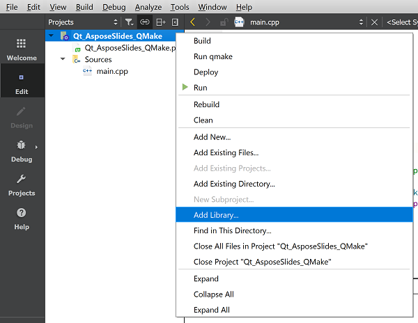

## **Introduktion**

Qt är ett C++‑baserat tvärplattformigt ramverk för applikationsutveckling som ofta används för att utveckla en mängd olika skrivbords‑, mobil‑ och inbäddade systemapplikationer. Aspose.Slides for C++ kan integreras i Qt för att skapa och manipulera PowerPoint‑dokument i dina Qt‑applikationer.

## **Använda Aspose.Slides för C++ i Qt Creator**

För att använda Aspose.Slides för C++ i din Qt‑applikation, ladda ner den senaste versionen av API:t från [downloads](https://downloads.aspose.com/slides/sv/cpp)-avsnittet. När API:t har laddats ner kan du integrera C++‑biblioteket i Qt Creator eller Visual Studio.

För att integrera och använda Aspose.Slides för C++‑biblioteket i en Qt Console‑applikation som utvecklats i Qt Creator, följ stegen nedan:

- Öppna Qt Creator och skapa en ny *Qt Console Application*.

- Välj QMake‑alternativet från *Build System*-rullgardinslistan.

- Välj lämplig kit och slutför guiden.
- Kopiera aspose-slides-cpp-21.02‑mappen från det extraherade paketet av Aspose.Slides för C++ till projektets rot.

- För att lägga till sökvägar till lib‑ och include‑mappar, högerklicka på projektet i vänstra panelen och välj *Add Library*.

- Välj alternativet External Library och bläddra igenom sökvägar till lib‑mapparna en efter en.

- När du är klar kommer din .pro‑projektfil att innehålla följande poster:

- Bygg applikationen så är integrationen klar.  

{}

Obs: Se det [fullständiga demoprojektet](https://github.com/aspose-slides/Aspose.Slides-for-C/tree/master/QtDemos/QtCreator/Qt_AsposeSlides_QMake) för mer information.

{}

## **Använda Aspose.Slides för C++ i Qt‑applikationer i Visual Studio**

För att utveckla en Qt‑applikation med Visual Studio måste du installera [Qt Visual Studio Tools](https://marketplace.visualstudio.com/items?itemName=TheQtCompany.QtVisualStudioTools-19123). När du har installationen, ladda ner den senaste versionen av API:t från [downloads](https://downloads.aspose.com/slides/sv/cpp)-avsnittet och följ stegen nedan:

- Öppna Microsoft Visual Studio och skapa en ny *Qt Console Application*.

- Välj lämplig kit och slutför guiden.
- För att integrera och använda Aspose.Slides för C++‑biblioteket, högerklicka på projektet och välj *Manage NuGet Packages...*.

- Hitta och installera det erforderliga *Aspose.Slides.Cpp*-paketet.

- Bygg projektet så är integrationen klar.  

{}

Obs: Se det [fullständiga demoprojektet](https://github.com/aspose-slides/Aspose.Slides-for-C/tree/master/QtDemos/Visual%20Studio/Qt_AsposeSlides_VS) för mer information.

{}