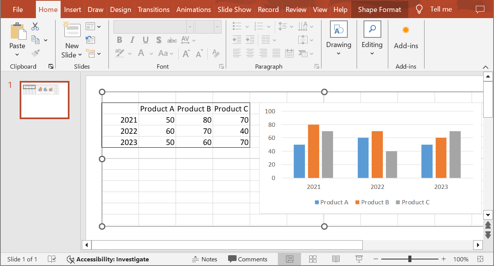

## **Introduktion**

När du använder Aspose.Slides för Java och lägger till [OleObjectFrame](https://reference.aspose.com/slides/sv/java/com.aspose.slides/oleobjectframe/) på en bild visas meddelandet "EMBEDDED OLE OBJECT" på den genererade bilden. Detta meddelande är avsiktligt och INTE en bugg.

För mer information om hur du arbetar med OLE-objekt, se [Manage OLE](/slides/sv/java/manage-ole/).

## **Förklaring och lösning**

Aspose.Slides visar meddelandet "EMBEDDED OLE OBJECT" för att informera dig om att OLE-objektet har ändrats och förhandsgranskningsbilden måste uppdateras.

Till exempel, om du lägger till ett Microsoft Excel-diagram som ett [OleObjectFrame](https://reference.aspose.com/slides/sv/java/com.aspose.slides/oleobjectframe/) på en bild (för mer detaljer, se artikeln "Manage OLE") och sedan öppnar presentationen i Microsoft PowerPoint, kommer du att se den här bilden på bilden:


Om du vill kontrollera och bekräfta att ditt OLE‑objekt har lagts till på bilden måste du dubbelklicka på meddelandet "EMBEDDED OLE OBJECT", eller så kan du högerklicka på det och gå via alternativet **Object > Edit**.


PowerPoint öppnar då det inbäddade OLE‑objektet.


Bilden kan behålla meddelandet "EMBEDDED OLE OBJECT". När du klickar på OLE‑objektet uppdateras bildförhandsgranskningen och meddelandet "EMBEDDED OLE OBJECT" ersätts av den faktiska bilden för OLE‑objektet.



Nu kan du vilja spara presentationen för att säkerställa att bilden för OLE‑objektet uppdateras korrekt. På så sätt, efter att du har sparat presentationen, kommer du INTE att se meddelandet "EMBEDDED OLE OBJECT" när du öppnar presentationen igen.

## **Annan lösning**

Om du inte vill ta bort meddelandet "EMBEDDED OLE OBJECT" genom att öppna presentationen i PowerPoint och sedan spara den, kan du ersätta meddelandet med din föredragna förhandsgranskningsbild. Dessa kodrader demonstrerar processen. De förutsätter att den första formen på den första bilden i *embeddedOLE.pptx* är OLE‑objekt‑ramen och att *myImage.png* innehåller bilden som ska visas, och de sparar resultatet som *embeddedOLE-newImage.pptx*:

```java
import com.aspose.slides.*;

Presentation presentation = new Presentation("embeddedOLE.pptx");
try {
    ISlide slide = presentation.getSlides().get_Item(0);
    IOleObjectFrame oleFrame = (IOleObjectFrame) slide.getShapes().get_Item(0);

    // Lägg till en bild i presentationens resurser.
    IImage image = Images.fromFile("myImage.png");
    IPPImage oleImage = presentation.getImages().addImage(image);
    image.dispose();

    // Ange bilden för OLE-objektets förhandsgranskning.
    oleFrame.getSubstitutePictureFormat().getPicture().setImage(oleImage);
    oleFrame.setObjectIcon(false);

    presentation.save("embeddedOLE-newImage.pptx", SaveFormat.Pptx);
} finally {
    presentation.dispose();
}
```

Bilden som innehåller `OleObjectFrame` ändras sedan till detta:

