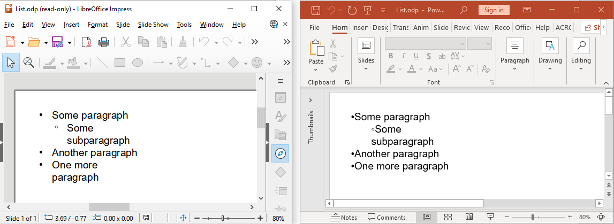

## **Introduktion**

[**Aspose.Slides API**](https://products.aspose.com/slides/sv/java/) låter dig konvertera OpenDocument‑presentationer (ODP) till många format (HTML, PDF, TIFF, SWF, XPS osv.). API‑et som används för att konvertera ODP‑filer till andra dokumentformat är detsamma som används för PowerPoint‑konverteringar (PPT och PPTX).

Om du till exempel behöver konvertera en ODP‑presentation till PDF kan du göra det så här:

```java
Presentation presentation = null;
try {
    presentation = new Presentation("pres.odp");
    presentation.save("pres.pdf", SaveFormat.Pdf);
    
} finally {
    if (presentation != null) {
        presentation.dispose();
    }
}
```

## **OpenDocument‑presentation i olika program**

När en OpenDocument‑presentation (ODP) öppnas i PowerPoint behåller den kanske inte den ursprungliga formateringen från det program där den skapades. Detta beror på att OpenDocument‑appen och PowerPoint‑appen erbjuder olika funktioner och renderingsbeteenden.

Här är några av skillnaderna:

- I PowerPoint renderas tabeller vanligtvis sist och kan överlappa andra former, oavsett deras ordning på ODP‑bilden.
- Bildfyllning för ODP‑tabeller stöds inte i PowerPoint.
- Vertikal textrotation (270°, staplad) och fördeladjustering stöds inte i LibreOffice/OpenOffice Impress.
- Bildfyllning, gradientfyllning och mönsterfyllning för text stöds inte i LibreOffice/OpenOffice Impress.

MS PowerPoint och LibreOffice/OpenOffice Impress hanterar även listor på olika sätt. En ODP‑fil skapad i PowerPoint kanske inte visas korrekt i LibreOffice/OpenOffice Impress, och vice versa.

Bilden nedan visar hur en lista ser ut när den skapas i LibreOffice Impress:



Aspose.Slides sparar ODP‑listor på ett sätt som säkerställer att de visas korrekt i LibreOffice/OpenOffice Impress.

[Läs mer om OpenDocument‑formatet och PowerPoint](https://support.microsoft.com/en-us/office/use-powerpoint-to-save-or-open-a-presentation-in-the-opendocument-presentation-odp-format-94805e84-1b09-4c98-a8b5-0da2a52242a0).

## **Vanliga frågor**

**Vad händer om formateringen av min ODP‑fil ändras efter konvertering?**

ODP och PowerPoint använder olika presentationsmodeller, och vissa element – som tabeller, anpassade teckensnitt eller fyllningsstilar – kanske inte renderas exakt lika. Det rekommenderas att granska resultatet och justera layout eller formatering i kod om det behövs.

**Behöver jag OpenOffice eller LibreOffice installerat för att använda ODP‑konvertering?**

Nej, Aspose.Slides är ett fristående bibliotek och kräver inte att OpenOffice eller LibreOffice är installerade på ditt system.

**Kan jag anpassa utdataformatet under ODP‑konvertering (t.ex. ställa in PDF‑alternativ)?**

Ja, Aspose.Slides erbjuder rikliga alternativ för att anpassa utdata. Till exempel, när du sparar till PDF kan du styra komprimering, bildkvalitet, textrendering och mer via klassen [PdfOptions](https://reference.aspose.com/slides/sv/java/com.aspose.slides/pdfoptions/).

**Är Aspose.Slides lämplig för server‑side eller molnbaserad ODP‑behandling?**

Absolut. Aspose.Slides är designat för att fungera både i skrivbords‑ och servermiljöer, inklusive molnbaserade plattformar som Azure, AWS och Docker‑behållare, utan några UI‑beroenden.