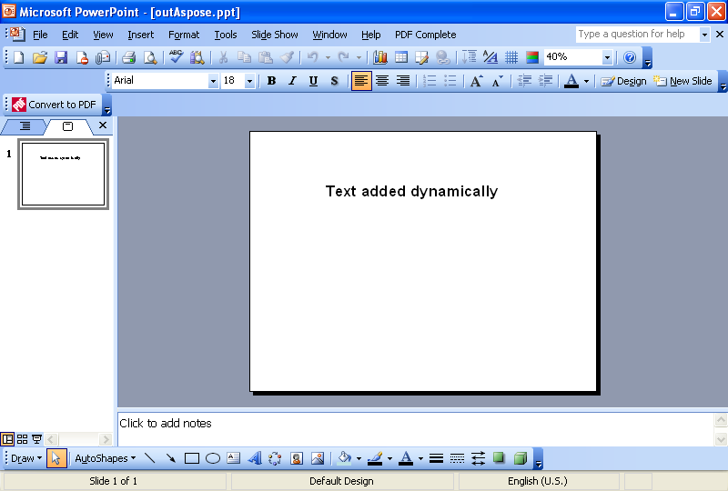

{} 

En vanlig uppgift som utvecklare behöver utföra är att lägga till text på bilder dynamiskt. Denna artikel visar kodexempel för att lägga till text dynamiskt med hjälp av [VSTO](/slides/sv/java/adding-text-dynamically-using-vsto-and-aspose-slides-for-java/) och [Aspose.Slides for Java](/slides/sv/java/adding-text-dynamically-using-vsto-and-aspose-slides-for-java/).

{} 
## **Adding Text Dynamically**
Båda metoderna följer dessa steg:

1. Skapa en presentation.
1. Lägg till en tom bild.
1. Lägg till en textruta.
1. Ange lite text.
1. Skriv presentationen.
## **VSTO Code Example**
Kodsnuttarna nedan resulterar i en presentation med en enkel bild och en textrad på den.

**The presentation as created in VSTO** 


## **Aspose.Slides for Java Example**
Kodsnuttarna nedan använder Aspose.Slides för att skapa en presentation med en enkel bild och en textrad på den.

**The presentation as created using Aspose.Slides for Java** 

