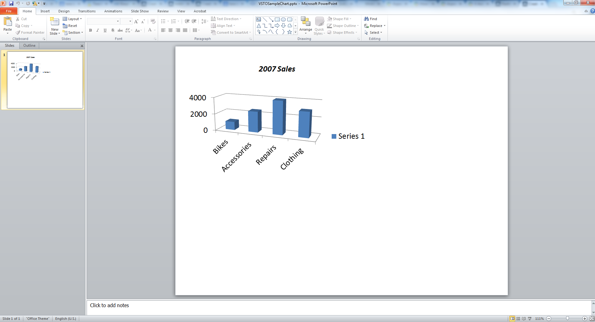

{} 
Diagram är visuella representationer av data som ofta används i presentationer. Denna artikel visar koden för att skapa ett diagram i Microsoft PowerPoint programmässigt med hjälp av [VSTO](/slides/sv/java/create-a-chart-in-a-microsoft-powerpoint-presentation/) och [Aspose.Slides for Java](/slides/sv/java/create-a-chart-in-a-microsoft-powerpoint-presentation/).
{} 
## **Skapa ett diagram**
Kodexemplen nedan beskriver processen för att lägga till ett enkelt 3D klustrat stapeldiagram med VSTO. Du skapar ett presentationstillfälle, lägger till ett standardschema i det. Sedan använder du en Microsoft Excel-arbetsbok för att komma åt och modifiera diagramdata samt ställa in diagramegenskaper. Slutligen sparar du presentationen.
### **VSTO‑exempel**
Med VSTO utförs följande steg:

1. Skapa en instans av en Microsoft PowerPoint-presentation.  
2. Lägg till en tom bild i presentationen.  
3. Lägg till ett **3D klustrat stapeldiagram** och få åtkomst till det.  
4. Skapa en ny Microsoft Excel Workbook-instans och läs in diagramdata.  
5. Få åtkomst till diagramdatabladet med hjälp av Microsoft Excel Workbook-instansen.  
6. Ange diagramområdet i arbetsbladet och ta bort serie 2 och 3 från diagrammet.  
7. Ändra diagramkategoridata i diagramdatabladet.  
8. Ändra data för diagramserie 1 i diagramdatabladet.  
9. Nu får du åtkomst till diagramrubriken och ställer in fontrelaterade egenskaper.  
10. Få åtkomst till diagrammets värdeaxel och ange huvudenhet, delenheter, maxvärde och minvärde.  
11. Få åtkomst till diagrammets djup‑ eller serieaxel och ta bort den, eftersom i detta exempel endast en serie används.  
12. Nu anger du diagrammets rotationsvinklar i X‑ och Y‑riktning.  
13. Spara presentationen.  
14. Stäng instanserna av Microsoft Excel och PowerPoint.  

**Det resulterande presentationsfilen, skapad med VSTO** 




### **Aspose.Slides for Java‑exempel**
Med Aspose.Slides for Java utförs följande steg:

1. Skapa en instans av en Microsoft PowerPoint-presentation.  
2. Lägg till en tom bild i presentationen.  
3. Lägg till ett **3D klustrat stapeldiagram** och få åtkomst till det.  
4. Få åtkomst till diagramdatabladet med hjälp av en Microsoft Excel Workbook-instans.  
5. Ta bort oanvända serier 2 och 3.  
6. Få åtkomst till diagramkategorierna och modifiera etiketter.  
7. Få åtkomst till serie 1 och ändra serievärdena.  
8. Nu får du åtkomst till diagramrubriken och ställer in teckensnittsegenskaperna.  
9. Få åtkomst till diagrammets värdeaxel och ange huvudenhet, delenheter, maxvärde och minvärde.  
10. Nu anger du diagrammets rotationsvinklar i X‑ och Y‑riktning.  
11. Spara presentationen i PPTX‑format.  

**Det resulterande presentationsfilen, skapad med Aspose.Slides** 



## **FAQ**

### Kan jag skapa andra typer av diagram, som paj-, linje- eller stapeldiagram, med Aspose.Slides?
Ja. Aspose.Slides stöder ett brett utbud av [diagramtyper](/slides/sv/java/create-chart/), inklusive pajdiagram, linjediagram, stapeldiagram, spridningsdiagram, bubbeldiagram och fler. Du kan ange önskad diagramtyp med hjälp av klassen [ChartType](https://reference.aspose.com/slides/sv/java/com.aspose.slides/charttype/) när du lägger till ett diagram.

### Kan jag applicera anpassade stilar eller teman på diagrammet?
Ja. Du kan anpassa diagrammets utseende helt, inklusive färger, teckensnitt, fyllningar, konturer, rutnät och layout. Att applicera Office‑teman exakt som i PowerPoint kräver dock att du manuellt ställer in varje enskild stil.

### Kan jag exportera diagrammet som en bild separat från bilden?
Ja, Aspose.Slides låter dig exportera vilken form som helst – inklusive diagram – som en separat bild (t.ex. PNG, JPEG) genom att använda `getImage`‑metoden på diagrammets [shape](https://reference.aspose.com/slides/sv/java/com.aspose.slides/shape/).