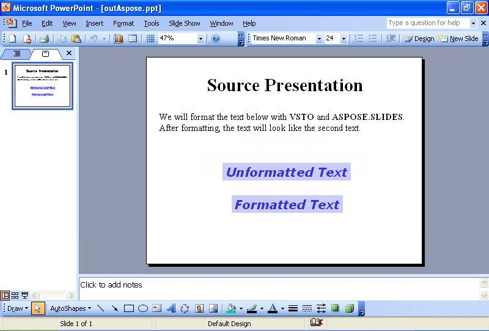

{} 

Ibland behöver du formatera text på bilder programmatiskt. Denna artikel visar hur du läser en exempelpresentation med lite text på den första bilden med antingen [VSTO](/slides/sv/java/format-text-using-vsto-and-aspose-slides-for-java/) och [Aspose.Slides for Java](/slides/sv/java/format-text-using-vsto-and-aspose-slides-for-java/). Koden formaterar texten i den tredje textrutan på bilden så att den ser ut som texten i den sista textrutan.

{} 
## **Formatera text**
Både VSTO- och Aspose.Slides-metoderna utför följande steg:

1. Öppna källpresentationen.
1. Få åtkomst till den första bilden.
1. Få åtkomst till den tredje textrutan.
1. Ändra formateringen av texten i den tredje textrutan.
1. Spara presentationen till disk.

Skärmbilderna nedan visar exempelbilden före och efter körning av VSTO- och Aspose.Slides for Java-koden.

**Inmatningspresentationen** 

### **VSTO-kodexempel**
Koden nedan visar hur man omformaterar text på en bild med VSTO.

**Texten omformaterad med VSTO** 



### **Aspose.Slides for Java-exempel**
För att formatera text med Aspose.Slides, lägg till teckensnittet innan du formaterar texten.

**Utdata-presentationen skapad med Aspose.Slides** 

