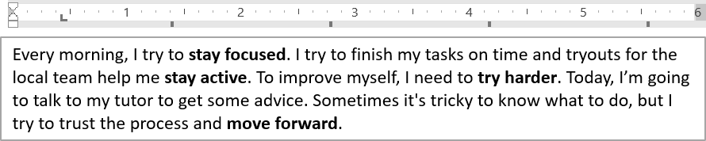

## **Översikt**

Den här artikeln visar hur man formaterar text i PowerPoint- och OpenDocument-presentationer med Aspose.Slides för Java. Den täcker markering, bakgrundsfärger, transparens, teckenavstånd, teckenegenskaper, rotation, styckeavstånd, autofit‑beteende, textankring, tabbstopp och språkinställningar.

I exemplen nedan använder vi en fil med namnet "sample.pptx", som innehåller en enda textruta på den första bilden med följande text:


## **Markera text**

Använd metoden [ITextFrame.highlightText](https://reference.aspose.com/slides/sv/java/com.aspose.slides/itextframe/#highlightText-java.lang.String-java.awt.Color-) när du behöver markera text som matchar ett specifikt exempel inom en textram. Metoden applicerar en markeringsfärg på matchande textfragment och kan användas tillsammans med [TextSearchOptions](https://reference.aspose.com/slides/sv/java/com.aspose.slides/textsearchoptions/) för att kontrollera hur sökningen utförs, till exempel för att bara matcha hela ord.

Kodexemplet nedan markerar alla förekomster av tecknen **"try"** och markerar sedan endast hela ordet **"to"**.

```java
Presentation presentation = new Presentation("sample.pptx");
try {
    // Hämta den första formen från den första bilden.
    IAutoShape shape = (IAutoShape)presentation.getSlides().get_Item(0).getShapes().get_Item(0);

    // Markera ordet "try" i formen.
    shape.getTextFrame().highlightText("try", Color.LIGHT_GRAY);

    TextSearchOptions searchOptions = new TextSearchOptions();
    searchOptions.setWholeWordsOnly(true);

    // Markera ordet "to" i formen.
    shape.getTextFrame().highlightText("to", Color.MAGENTA, searchOptions, null);

    presentation.save("highlighted_text.pptx", SaveFormat.Pptx);
} finally {
    presentation.dispose();
}
```

Resultatet:


## **Markera text med reguljära uttryck**

Metoden [ITextFrame.highlightRegex](https://reference.aspose.com/slides/sv/java/com.aspose.slides/itextframe/#highlightRegex-java.util.regex.Pattern-java.awt.Color-com.aspose.slides.IFindResultCallback-) markerar textmatchningar som hittas med ett reguljärt uttryck. I Java exponeras detta API på [ITextFrame](https://reference.aspose.com/slides/sv/java/com.aspose.slides/itextframe/).

Kodexemplet nedan markerar alla ord som innehåller **sju eller fler tecken**:

```java
Presentation presentation = new Presentation("sample.pptx");
try {
    IAutoShape shape = (IAutoShape)presentation.getSlides().get_Item(0).getShapes().get_Item(0);

    java.util.regex.Pattern regex = java.util.regex.Pattern.compile("\\b[^\\s]{7,}\\b");

    // Markera alla ord med sju eller fler tecken.
    shape.getTextFrame().highlightRegex(regex, Color.YELLOW, null);

    presentation.save("highlighted_text_using_regex.pptx", SaveFormat.Pptx);
} finally {
    presentation.dispose();
}
```

Resultatet:


## **Ange bakgrundsfärg för text**

Använd [IParagraphFormat.getDefaultPortionFormat](https://reference.aspose.com/slides/sv/java/com.aspose.slides/iparagraphformat/#getDefaultPortionFormat--) för att ange standardmarkeringsfärg för ett stycke, eller använd [IBasePortionFormat.getHighlightColor](https://reference.aspose.com/slides/sv/java/com.aspose.slides/ibaseportionformat/#getHighlightColor--) för enskilda textdelar.

Följande kodexempel visar hur man anger bakgrundsfärgen för **hela stycket**:

```java
Presentation presentation = new Presentation("sample.pptx");
try {
    IAutoShape autoShape = (IAutoShape)presentation.getSlides().get_Item(0).getShapes().get_Item(0);
    IParagraph paragraph = autoShape.getTextFrame().getParagraphs().get_Item(0);

    // Ange markeringsfärgen för hela stycket.
    paragraph.getParagraphFormat().getDefaultPortionFormat().getHighlightColor().setColor(Color.LIGHT_GRAY);

    presentation.save("gray_paragraph.pptx", SaveFormat.Pptx);
} finally {
    presentation.dispose();
}
```

Resultatet:


Kodexemplet nedan demonstrerar hur man anger bakgrundsfärgen för **textdelar med fet stil**:

```java
Presentation presentation = new Presentation("sample.pptx");
try {
    IAutoShape autoShape = (IAutoShape)presentation.getSlides().get_Item(0).getShapes().get_Item(0);
    IParagraph paragraph = autoShape.getTextFrame().getParagraphs().get_Item(0);

    for (IPortion portion : paragraph.getPortions()) {
        if (portion.getPortionFormat().getEffective().getFontBold()) {
            // Ange markeringsfärgen för textdelen.
            portion.getPortionFormat().getHighlightColor().setColor(Color.LIGHT_GRAY);
        }
    }

    presentation.save("gray_text_portions.pptx", SaveFormat.Pptx);
} finally {
    presentation.dispose();
}
```

Resultatet:


## **Justera textstycken**

Använd [IParagraphFormat.setAlignment](https://reference.aspose.com/slides/sv/java/com.aspose.slides/iparagraphformat/#setAlignment-int-) för att ange styckejustering inom en textram. Värdet kan vara centrerat, vänsterjusterat, högerjusterat, Blockjusterat osv.

Följande kodexempel visar hur man justerar stycket till **centrum**:

```java
Presentation presentation = new Presentation("sample.pptx");
try {
    IAutoShape autoShape = (IAutoShape)presentation.getSlides().get_Item(0).getShapes().get_Item(0);
    IParagraph paragraph = autoShape.getTextFrame().getParagraphs().get_Item(0);

    // Ange justeringen av stycket till centrerat.
    paragraph.getParagraphFormat().setAlignment(TextAlignment.Center);

    presentation.save("aligned_paragraph.pptx", SaveFormat.Pptx);
} finally {
    presentation.dispose();
}
```

Resultatet:


## **Ange transparens för text**

Texttransparens styrs via alfakomponenten i färgen som tilldelas [IBasePortionFormat.getFillFormat](https://reference.aspose.com/slides/sv/java/com.aspose.slides/ibaseportionformat/#getFillFormat--). I exemplen nedan är `alpha = 50` ett ARGB‑alfakanalvärde på skalan 0‑255, inte en transparensprocent.

Kodexemplet nedan visar hur man applicerar transparens på **hela stycket**:

```java
int alpha = 50;

Presentation presentation = new Presentation("sample.pptx");
try {
    IAutoShape autoShape = (IAutoShape)presentation.getSlides().get_Item(0).getShapes().get_Item(0);
    IParagraph paragraph = autoShape.getTextFrame().getParagraphs().get_Item(0);

    // Ange fyllningsfärgen för texten till en transparent färg.
    paragraph.getParagraphFormat().getDefaultPortionFormat().getFillFormat().setFillType(FillType.Solid);
    paragraph.getParagraphFormat().getDefaultPortionFormat().getFillFormat().getSolidFillColor().setColor(new Color(0, 0, 0, alpha));

    presentation.save("transparent_paragraph.pptx", SaveFormat.Pptx);
} finally {
    presentation.dispose();
}
```

Resultatet:


Följande kodexempel visar hur man applicerar transparens på **textdelar med fet stil**:

```java
int alpha = 50;

Presentation presentation = new Presentation("sample.pptx");
try {
    IAutoShape autoShape = (IAutoShape)presentation.getSlides().get_Item(0).getShapes().get_Item(0);
    IParagraph paragraph = autoShape.getTextFrame().getParagraphs().get_Item(0);

    for (IPortion portion : paragraph.getPortions()) {
        if (portion.getPortionFormat().getEffective().getFontBold()) {
            // Ange transparensen för textdelen.
            portion.getPortionFormat().getFillFormat().setFillType(FillType.Solid);
            portion.getPortionFormat().getFillFormat().getSolidFillColor().setColor(new Color(0, 0, 0, alpha));
        }
    }

    presentation.save("transparent_text_portions.pptx", SaveFormat.Pptx);
} finally {
    presentation.dispose();
}
```

Resultatet:


## **Ange teckenavstånd för text**

Använd [IBasePortionFormat.setSpacing](https://reference.aspose.com/slides/sv/java/com.aspose.slides/ibaseportionformat/#setSpacing-float-) för att öka eller minska avståndet mellan tecken i en textruta.

Följande Java‑kod visar hur man ökar teckenavståndet i **hela stycket**:

```java
Presentation presentation = new Presentation("sample.pptx");
try {
    IAutoShape autoShape = (IAutoShape)presentation.getSlides().get_Item(0).getShapes().get_Item(0);
    IParagraph paragraph = autoShape.getTextFrame().getParagraphs().get_Item(0);

    // Obs: Använd negativa värden för att komprimera teckenavståndet.
    paragraph.getParagraphFormat().getDefaultPortionFormat().setSpacing(3); // Utöka teckenavståndet.

    presentation.save("character_spacing_in_paragraph.pptx", SaveFormat.Pptx);
} finally {
    presentation.dispose();
}
```

Resultatet:


Kodexemplet nedan visar hur man ökar teckenavståndet i **textdelar med fet stil**:

```java
Presentation presentation = new Presentation("sample.pptx");
try {
    IAutoShape autoShape = (IAutoShape)presentation.getSlides().get_Item(0).getShapes().get_Item(0);
    IParagraph paragraph = autoShape.getTextFrame().getParagraphs().get_Item(0);

    for (IPortion portion : paragraph.getPortions()) {
        if (portion.getPortionFormat().getEffective().getFontBold()) {
            // Obs: Använd negativa värden för att komprimera teckenavståndet.
            portion.getPortionFormat().setSpacing(3); // Utöka teckenavståndet.
        }
    }

    presentation.save("character_spacing_in_text_portions.pptx", SaveFormat.Pptx);
} finally {
    presentation.dispose();
}
```

Resultatet:


### **Inaktivera kerning för specifika teckensnitt**

I vissa fall kan text som renderas av Aspose.Slides se något tätare ut än samma text i PowerPoint. Detta kan ske eftersom PowerPoint kan ignorera kerningdata för vissa teckensnitt, även när teckensnittet innehåller giltig kerninginformation och kerning är aktiverat i PowerPoint‑inställningarna.

För att få den renderade utskriften att likna PowerPoint i sådana fall kan du inaktivera kerning för textdelar som använder det påverkade teckensnittet. Ställ in [IBasePortionFormat.setKerningMinimalSize](https://reference.aspose.com/slides/sv/java/com.aspose.slides/ibaseportionformat/#setKerningMinimalSize-float-) på ett värde som är betydligt större än den faktiska teckensnittsstorleken:

```java
Presentation presentation = new Presentation("presentation.pptx");
try {
    IAutoShape autoShape = (IAutoShape)presentation.getSlides().get_Item(0).getShapes().get_Item(0);
    String targetFont = "Roboto";

    for (IParagraph paragraph : autoShape.getTextFrame().getParagraphs()) {
        for (IPortion portion : paragraph.getPortions()) {
            IPortionFormat portionFormat = portion.getPortionFormat();

            if ((portionFormat.getLatinFont() != null &&
                 portionFormat.getLatinFont().getFontName().equals(targetFont)) ||
                (portionFormat.getEastAsianFont() != null &&
                 portionFormat.getEastAsianFont().getFontName().equals(targetFont)) ||
                (portionFormat.getComplexScriptFont() != null &&
                 portionFormat.getComplexScriptFont().getFontName().equals(targetFont))) {
                portionFormat.setKerningMinimalSize(100);
            }
        }
    }

    presentation.save("output.pptx", SaveFormat.Pptx);
} finally {
    presentation.dispose();
}
```

Denna inställning förhindrar att kerning appliceras på matchande textdelar och kan hjälpa till att justera Aspose.Slides‑renderingen med PowerPoints visuella resultat för teckensnitt som påverkas av detta PowerPoint‑specifika beteende.

## **Hantera textteckenegenskaper**

Teckengenskaper kan sättas på styckennivå via [IParagraphFormat.getDefaultPortionFormat](https://reference.aspose.com/slides/sv/java/com.aspose.slides/iparagraphformat/#getDefaultPortionFormat--) eller på enskilda delar via [IPortionFormat](https://reference.aspose.com/slides/sv/java/com.aspose.slides/iportionformat/).

Följande kod sätter teckensnittet och textstilen för hela stycket: den tillämpar teckenstorlek, fetstil, kursiv, prickad understrykning och Times New Roman på alla delar i stycket.

```java
Presentation presentation = new Presentation("sample.pptx");
try {
    IAutoShape autoShape = (IAutoShape)presentation.getSlides().get_Item(0).getShapes().get_Item(0);
    IParagraph paragraph = autoShape.getTextFrame().getParagraphs().get_Item(0);

    // Ange teckensnittsegenskaper för stycket.
    paragraph.getParagraphFormat().getDefaultPortionFormat().setFontHeight(12);
    paragraph.getParagraphFormat().getDefaultPortionFormat().setFontBold(NullableBool.True);
    paragraph.getParagraphFormat().getDefaultPortionFormat().setFontItalic(NullableBool.True);
    paragraph.getParagraphFormat().getDefaultPortionFormat().setFontUnderline(TextUnderlineType.Dotted);
    paragraph.getParagraphFormat().getDefaultPortionFormat().setLatinFont(new FontData("Times New Roman"));

    presentation.save("font_properties_for_paragraph.pptx", SaveFormat.Pptx);
} finally {
    presentation.dispose();
}
```

Resultatet:


Kodexemplet nedan tillämpar liknande egenskaper på **textdelar med fet stil**:

```java
Presentation presentation = new Presentation("sample.pptx");
try {
    IAutoShape autoShape = (IAutoShape)presentation.getSlides().get_Item(0).getShapes().get_Item(0);
    IParagraph paragraph = autoShape.getTextFrame().getParagraphs().get_Item(0);

    for (IPortion portion : paragraph.getPortions()) {
        if (portion.getPortionFormat().getEffective().getFontBold()) {
            // Ange teckensnittsegenskaper för textdelen.
            portion.getPortionFormat().setFontHeight(13);
            portion.getPortionFormat().setFontItalic(NullableBool.True);
            portion.getPortionFormat().setFontUnderline(TextUnderlineType.Dotted);
            portion.getPortionFormat().setLatinFont(new FontData("Times New Roman"));
        }
    }

    presentation.save("font_properties_for_text_portions.pptx", SaveFormat.Pptx);
} finally {
    presentation.dispose();
}
```

Resultatet:


## **Ange textrotation**

Använd [ITextFrameFormat.setTextVerticalType](https://reference.aspose.com/slides/sv/java/com.aspose.slides/itextframeformat/#setTextVerticalType-byte-) för att ange en fördefinierad textorientering inom en form.

Följande kodexempel anger textorienteringen i formen till `Vertical270`, vilket roterar texten **90 grader moturs**:

```java
Presentation presentation = new Presentation("sample.pptx");
try {
    IAutoShape autoShape = (IAutoShape)presentation.getSlides().get_Item(0).getShapes().get_Item(0);

    autoShape.getTextFrame().getTextFrameFormat().setTextVerticalType(TextVerticalType.Vertical270);

    presentation.save("text_rotation.pptx", SaveFormat.Pptx);
} finally {
    presentation.dispose();
}
```

Resultatet:


## **Ange anpassad rotation för textramgar**

Använd [ITextFrameFormat.setRotationAngle](https://reference.aspose.com/slides/sv/java/com.aspose.slides/itextframeformat/#setRotationAngle-float-) för att ange en anpassad rotationsvinkel för en [ITextFrame](https://reference.aspose.com/slides/sv/java/com.aspose.slides/itextframe/).

Kodexemplet nedan roterar textramen med 3 grader medurs inom formen:

```java
Presentation presentation = new Presentation("sample.pptx");
try {
    IAutoShape autoShape = (IAutoShape)presentation.getSlides().get_Item(0).getShapes().get_Item(0);

    autoShape.getTextFrame().getTextFrameFormat().setRotationAngle(3);

    presentation.save("custom_text_rotation.pptx", SaveFormat.Pptx);
} finally {
    presentation.dispose();
}
```

Resultatet:


## **Ange radavstånd för stycken**

Aspose.Slides tillhandahåller [IParagraphFormat.setSpaceAfter](https://reference.aspose.com/slides/sv/java/com.aspose.slides/iparagraphformat/#setSpaceAfter-float-), [IParagraphFormat.setSpaceBefore](https://reference.aspose.com/slides/sv/java/com.aspose.slides/iparagraphformat/#setSpaceBefore-float-), och [IParagraphFormat.setSpaceWithin](https://reference.aspose.com/slides/sv/java/com.aspose.slides/iparagraphformat/#setSpaceWithin-float-) för att kontrollera styckeavstånd. Dessa egenskaper används enligt följande:

* Använd ett positivt värde för att ange radavstånd som en procentandel av radens höjd.
* Använd ett negativt värde för att ange radavstånd i punkter.

Följande kodexempel visar hur man anger radavståndet inom stycket:

```java
Presentation presentation = new Presentation("sample.pptx");
try {
    IAutoShape autoShape = (IAutoShape)presentation.getSlides().get_Item(0).getShapes().get_Item(0);
    IParagraph paragraph = autoShape.getTextFrame().getParagraphs().get_Item(0);

    paragraph.getParagraphFormat().setSpaceWithin(200);

    presentation.save("line_spacing.pptx", SaveFormat.Pptx);
} finally {
    presentation.dispose();
}
```

Resultatet:


## **Ange autofit‑typ för textramgar**

[ITextFrameFormat.setAutofitType](https://reference.aspose.com/slides/sv/java/com.aspose.slides/itextframeformat/#setAutofitType-byte-) bestämmer hur text beter sig när den överstiger behållarens gränser. Använd den för att styra om texten krymper, rinner över eller automatiskt ändrar formens storlek.

```java
Presentation presentation = new Presentation("sample.pptx");
try {
    IAutoShape autoShape = (IAutoShape)presentation.getSlides().get_Item(0).getShapes().get_Item(0);

    autoShape.getTextFrame().getTextFrameFormat().setAutofitType(TextAutofitType.Shape);

    presentation.save("autofit_type.pptx", SaveFormat.Pptx);
} finally {
    presentation.dispose();
}
```

## **Ange ankare för textramgar**

[ITextFrameFormat.setAnchoringType](https://reference.aspose.com/slides/sv/java/com.aspose.slides/itextframeformat/#setAnchoringType-byte-) definierar hur text placeras vertikalt inuti en form, exempelvis högst upp, i mitten eller längst ner.

```java
Presentation presentation = new Presentation("sample.pptx");
try {
    IAutoShape autoShape = (IAutoShape)presentation.getSlides().get_Item(0).getShapes().get_Item(0);

    autoShape.getTextFrame().getTextFrameFormat().setAnchoringType(TextAnchorType.Bottom);

    presentation.save("text_anchor.pptx", SaveFormat.Pptx);
} finally {
    presentation.dispose();
}
```

## **Ange tabulering för text**

Använd [IParagraphFormat.setDefaultTabSize](https://reference.aspose.com/slides/sv/java/com.aspose.slides/iparagraphformat/#setDefaultTabSize-float-) och [IParagraphFormat.getTabs](https://reference.aspose.com/slides/sv/java/com.aspose.slides/iparagraphformat/#getTabs--) för att konfigurera tabbstopp i ett stycke.

```java
Presentation presentation = new Presentation("sample.pptx");
try {
    IAutoShape autoShape = (IAutoShape)presentation.getSlides().get_Item(0).getShapes().get_Item(0);
    IParagraph paragraph = autoShape.getTextFrame().getParagraphs().get_Item(0);

    paragraph.getParagraphFormat().setDefaultTabSize(100);
    paragraph.getParagraphFormat().getTabs().add(30, TabAlignment.Left);

    presentation.save("paragraph_tabs.pptx", SaveFormat.Pptx);
} finally {
    presentation.dispose();
}
```

Resultatet:



## **Ange språk för stavningskontroll**

Aspose.Slides tillhandahåller [IBasePortionFormat.setLanguageId](https://reference.aspose.com/slides/sv/java/com.aspose.slides/ibaseportionformat/#setLanguageId-java.lang.String-), som låter dig ange språk för stavningskontroll för en textdel. Språket för stavningskontroll bestämmer vilket språk som används för stavnings- och grammatikkontroller i PowerPoint.

Följande kodexempel visar hur man anger språk för stavningskontroll för en textdel:

```java
Presentation presentation = new Presentation("presentation.pptx");
try {
    IAutoShape autoShape = (IAutoShape)presentation.getSlides().get_Item(0).getShapes().get_Item(0);

    IParagraph paragraph = autoShape.getTextFrame().getParagraphs().get_Item(0);
    paragraph.getPortions().clear();

    FontData font = new FontData("SimSun");

    Portion textPortion = new Portion();
    textPortion.getPortionFormat().setComplexScriptFont(font);
    textPortion.getPortionFormat().setEastAsianFont(font);
    textPortion.getPortionFormat().setLatinFont(font);

    // Ställ in Id för ett korrekturläsningsspråk.
    textPortion.getPortionFormat().setLanguageId("zh-CN");

    textPortion.setText("1.");
    paragraph.getPortions().add(textPortion);

    presentation.save("proofing_language.pptx", SaveFormat.Pptx);
} finally {
    presentation.dispose();
}
```

## **Ange standardspråk**

Använd [LoadOptions.setDefaultTextLanguage](https://reference.aspose.com/slides/sv/java/com.aspose.slides/loadoptions/#setDefaultTextLanguage-java.lang.String-) för att definiera standardspråket för text som skapas vid inläsning eller skapande av en presentation.

```java
LoadOptions loadOptions = new LoadOptions();
loadOptions.setDefaultTextLanguage("en-US");

Presentation presentation = new Presentation(loadOptions);
try {
    ISlide slide = presentation.getSlides().get_Item(0);

    // Lägg till en ny rektangulär form med text.
    IAutoShape shape = slide.getShapes().addAutoShape(ShapeType.Rectangle, 20, 20, 150, 50);
    shape.getTextFrame().setText("Sample text");

    // Kontrollera språket för den första textdelen.
    IPortion portion = shape.getTextFrame().getParagraphs().get_Item(0).getPortions().get_Item(0);
    System.out.println(portion.getPortionFormat().getLanguageId());
} finally {
    presentation.dispose();
}
```

## **Ange standardtextstil**

För att tillämpa standardtextformatering på presentationsnivå, använd [IPresentation.getDefaultTextStyle](https://reference.aspose.com/slides/sv/java/com.aspose.slides/ipresentation/#getDefaultTextStyle--).

Följande kodexempel visar hur man anger ett standardfett teckensnitt med storlek 14 pt för all text på alla bilder i en ny presentation.

```java
Presentation presentation = new Presentation();
try {
    // Hämta paragrafformatet på översta nivån.
    IParagraphFormat paragraphFormat = presentation.getDefaultTextStyle().getLevel(0);

    if (paragraphFormat != null) {
        paragraphFormat.getDefaultPortionFormat().setFontHeight(14);
        paragraphFormat.getDefaultPortionFormat().setFontBold(NullableBool.True);
    }

    presentation.save("default_text_style.pptx", SaveFormat.Pptx);
} finally {
    presentation.dispose();
}
```

## **Extrahera text med versaler‑effekt**

I PowerPoint får du genom att använda teckenseffekten **All Caps** text att visas med versaler på bilden även om den ursprungligen skrevs med gemener. När du hämtar en sådan textdel med Aspose.Slides returnerar biblioteket texten exakt som den angavs. För att matcha den visade texten, kontrollera [TextCapType](https://reference.aspose.com/slides/sv/java/com.aspose.slides/textcaptype/) och konvertera den returnerade strängen till versaler när värdet är `All`.

Anta att vi har följande textruta på den första bilden i filen sample2.pptx.


Kodexemplet nedan visar hur man extraherar texten med den tillämpade **All Caps**‑effekten:

```java
Presentation presentation = new Presentation("sample2.pptx");
try {
    IAutoShape autoShape = (IAutoShape)presentation.getSlides().get_Item(0).getShapes().get_Item(0);
    IPortion textPortion = autoShape.getTextFrame().getParagraphs().get_Item(0).getPortions().get_Item(0);

    System.out.println("Original text: " + textPortion.getText());

    IPortionFormatEffectiveData textFormat = textPortion.getPortionFormat().getEffective();
    if (textFormat.getTextCapType() == TextCapType.All) {
        String text = textPortion.getText().toUpperCase();
        System.out.println("All-Caps effect: " + text);
    }
} finally {
    presentation.dispose();
}
```

Utdata:

```text
Original text: Hello, Aspose!
All-Caps effect: HELLO, ASPOSE!
```

## **Vanliga frågor**

**Hur ändrar man text i en tabell på en bild?**

För att modifiera text i en tabell på en bild, använd [ITable](https://reference.aspose.com/slides/sv/java/com.aspose.slides/itable/). Iterera genom cellerna och uppdatera varje cell via [ICell.getTextFrame](https://reference.aspose.com/slides/sv/java/com.aspose.slides/icell/#getTextFrame--) och styckeformatering via [IParagraph.getParagraphFormat](https://reference.aspose.com/slides/sv/java/com.aspose.slides/iparagraph/#getParagraphFormat--).

**Hur applicerar man en gradientfärg på text i en PowerPoint‑bild?**

För att applicera en gradientfärg på text, använd [IBasePortionFormat.getFillFormat](https://reference.aspose.com/slides/sv/java/com.aspose.slides/ibaseportionformat/#getFillFormat--). Ställ in [IFillFormat.setFillType](https://reference.aspose.com/slides/sv/java/com.aspose.slides/ifillformat/#setFillType-byte-) till [FillType.Gradient](https://reference.aspose.com/slides/sv/java/com.aspose.slides/filltype/) och konfigurera gradientstopp, riktning och transparens.