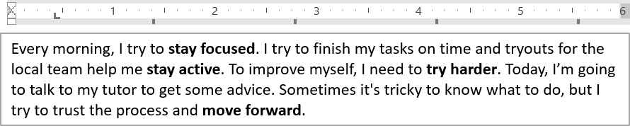

## **Översikt**

Den här artikeln visar hur du formaterar text i PowerPoint‑ och OpenDocument‑presentationer med Aspose.Slides för Java. Den täcker bakgrundsfärger, transparens, teckenavstånd, teckensnittsegenskaper, rotation, styckeavstånd, autofit‑beteende, textankring, tabbstopp och språkinställningar.

I exemplen nedan kommer vi att använda en fil med namnet "sample.pptx", som innehåller en enda textruta på den första bilden med följande text:


För att hitta och markera exakt text eller reguljära uttryck‑träffar, se [Sök och ersätt text](/slides/sv/java/search-and-replace-text/).

## **Ställ in bakgrundsfärg för text**

Använd [IParagraphFormat.getDefaultPortionFormat](https://reference.aspose.com/slides/sv/java/com.aspose.slides/iparagraphformat/#getDefaultPortionFormat--) för att ange standardmarkeringsfärgen för ett stycke, eller använd [IBasePortionFormat.getHighlightColor](https://reference.aspose.com/slides/sv/java/com.aspose.slides/ibaseportionformat/#getHighlightColor--) för enskilda textdelar.

Följande kodexempel visar hur du anger bakgrundsfärgen för **hela stycket**:

```java
import com.aspose.slides.*;
import java.awt.Color;

Presentation presentation = new Presentation("sample.pptx");
try {
    ISlide slide = presentation.getSlides().get_Item(0);
    IAutoShape autoShape = (IAutoShape)slide.getShapes().get_Item(0);
    IParagraph paragraph = autoShape.getTextFrame().getParagraphs().get_Item(0);

    // Ställ in markeringsfärgen för hela stycket.
    paragraph.getParagraphFormat().getDefaultPortionFormat().getHighlightColor().setColor(Color.LIGHT_GRAY);

    presentation.save("gray_paragraph.pptx", SaveFormat.Pptx);
} finally {
    presentation.dispose();
}
```

Resultatet:


Kodexemplet nedan demonstrerar hur du anger bakgrundsfärgen för **textdelar med fet stil**:

```java
import com.aspose.slides.*;
import java.awt.Color;

Presentation presentation = new Presentation("sample.pptx");
try {
    ISlide slide = presentation.getSlides().get_Item(0);
    IAutoShape autoShape = (IAutoShape)slide.getShapes().get_Item(0);
    IParagraph paragraph = autoShape.getTextFrame().getParagraphs().get_Item(0);

    for (IPortion portion : paragraph.getPortions()) {
        if (portion.getPortionFormat().getEffective().getFontBold()) {
            // Ställ in markeringsfärgen för textdelen.
            portion.getPortionFormat().getHighlightColor().setColor(Color.LIGHT_GRAY);
        }
    }

    presentation.save("gray_text_portions.pptx", SaveFormat.Pptx);
} finally {
    presentation.dispose();
}
```

Resultatet:


## **Justera textstycken**

Använd [IParagraphFormat.setAlignment](https://reference.aspose.com/slides/sv/java/com.aspose.slides/iparagraphformat/#setAlignment-int-) för att ange styckejustering inom en textram. Värdet kan vara centrerat, vänsterjusterat, högerjusterat, marginaljusterat osv.

Följande kodexempel visar hur du justerar stycket till **centrerat**:

```java
import com.aspose.slides.*;

Presentation presentation = new Presentation("sample.pptx");
try {
    ISlide slide = presentation.getSlides().get_Item(0);
    IAutoShape autoShape = (IAutoShape)slide.getShapes().get_Item(0);
    IParagraph paragraph = autoShape.getTextFrame().getParagraphs().get_Item(0);

    // Ställ in justeringen av stycket till centrerat.
    paragraph.getParagraphFormat().setAlignment(TextAlignment.Center);

    presentation.save("aligned_paragraph.pptx", SaveFormat.Pptx);
} finally {
    presentation.dispose();
}
```

Resultatet:


## **Ställ in transparens för text**

Texttransparens kontrolleras via alfa‑komponenten i färgen som tilldelas [IBasePortionFormat.getFillFormat](https://reference.aspose.com/slides/sv/java/com.aspose.slides/ibaseportionformat/#getFillFormat--). I exemplen nedan är `alpha = 50` ett ARGB‑alfa‑värde på skalan 0–255, inte en transparensprocent.

Kodexemplet nedan visar hur du tillämpar transparens på **hela stycket**:

```java
import com.aspose.slides.*;
import java.awt.Color;

int alpha = 50;

Presentation presentation = new Presentation("sample.pptx");
try {
    ISlide slide = presentation.getSlides().get_Item(0);
    IAutoShape autoShape = (IAutoShape)slide.getShapes().get_Item(0);
    IParagraph paragraph = autoShape.getTextFrame().getParagraphs().get_Item(0);

    // Ställ in fyllningsfärgen för texten till en transparent färg.
    paragraph.getParagraphFormat().getDefaultPortionFormat().getFillFormat().setFillType(FillType.Solid);
    paragraph.getParagraphFormat().getDefaultPortionFormat().getFillFormat().getSolidFillColor().setColor(new Color(0, 0, 0, alpha));

    presentation.save("transparent_paragraph.pptx", SaveFormat.Pptx);
} finally {
    presentation.dispose();
}
```

Resultatet:


Följande kodexempel visar hur du tillämpar transparens på **textdelar med fet stil**:

```java
import com.aspose.slides.*;
import java.awt.Color;

int alpha = 50;

Presentation presentation = new Presentation("sample.pptx");
try {
    ISlide slide = presentation.getSlides().get_Item(0);
    IAutoShape autoShape = (IAutoShape)slide.getShapes().get_Item(0);
    IParagraph paragraph = autoShape.getTextFrame().getParagraphs().get_Item(0);

    for (IPortion portion : paragraph.getPortions()) {
        if (portion.getPortionFormat().getEffective().getFontBold()) {
            // Ställ in transparensen för textdelen.
            portion.getPortionFormat().getFillFormat().setFillType(FillType.Solid);
            portion.getPortionFormat().getFillFormat().getSolidFillColor().setColor(new Color(0, 0, 0, alpha));
        }
    }

    presentation.save("transparent_text_portions.pptx", SaveFormat.Pptx);
} finally {
    presentation.dispose();
}
```

Resultatet:


## **Ställ in teckenavstånd för text**

Använd [IBasePortionFormat.setSpacing](https://reference.aspose.com/slides/sv/java/com.aspose.slides/ibaseportionformat/#setSpacing-float-) för att öka eller minska avståndet mellan tecken i en textram.

Följande Java‑kod visar hur du ökar teckenavståndet i **hela stycket**:

```java
import com.aspose.slides.*;

Presentation presentation = new Presentation("sample.pptx");
try {
    ISlide slide = presentation.getSlides().get_Item(0);
    IAutoShape autoShape = (IAutoShape)slide.getShapes().get_Item(0);
    IParagraph paragraph = autoShape.getTextFrame().getParagraphs().get_Item(0);

    // Obs: Använd negativa värden för att komprimera teckenavståndet.
    paragraph.getParagraphFormat().getDefaultPortionFormat().setSpacing(3); // Utöka teckenavståndet.

    presentation.save("character_spacing_in_paragraph.pptx", SaveFormat.Pptx);
} finally {
    presentation.dispose();
}
```

Resultatet:


Kodexemplet nedan visar hur du ökar teckenavståndet i **textdelar med fet stil**:

```java
import com.aspose.slides.*;

Presentation presentation = new Presentation("sample.pptx");
try {
    ISlide slide = presentation.getSlides().get_Item(0);
    IAutoShape autoShape = (IAutoShape)slide.getShapes().get_Item(0);
    IParagraph paragraph = autoShape.getTextFrame().getParagraphs().get_Item(0);

    for (IPortion portion : paragraph.getPortions()) {
        if (portion.getPortionFormat().getEffective().getFontBold()) {
            // Obs: Använd negativa värden för att komprimera teckenavståndet.
            portion.getPortionFormat().setSpacing(3); // Utöka teckenavståndet.
        }
    }

    presentation.save("character_spacing_in_text_portions.pptx", SaveFormat.Pptx);
} finally {
    presentation.dispose();
}
```

Resultatet:


### **Inaktivera kerning för specifika typsnitt**

I vissa fall kan text som renderas av Aspose.Slides se något tajtare ut än samma text som visas i PowerPoint. Detta kan ske eftersom PowerPoint kan ignorera kerning‑data för vissa typsnitt, även när typsnittet innehåller giltig kerning‑information och kerning är aktiverat i PowerPoints inställningar.

För att få den renderade utskriften att ligga närmare PowerPoint i sådana fall kan du inaktivera kerning för textdelar som använder det berörda typsnittet. Ställ in [IBasePortionFormat.setKerningMinimalSize](https://reference.aspose.com/slides/sv/java/com.aspose.slides/ibaseportionformat/#setKerningMinimalSize-float-) på ett värde som är betydligt större än den faktiska typsnittsstorleken:

```java
import com.aspose.slides.*;

Presentation presentation = new Presentation("presentation.pptx");
try {
    ISlide slide = presentation.getSlides().get_Item(0);
    IAutoShape autoShape = (IAutoShape)slide.getShapes().get_Item(0);
    String targetFont = "Roboto";

    for (IParagraph paragraph : autoShape.getTextFrame().getParagraphs()) {
        for (IPortion portion : paragraph.getPortions()) {
            IPortionFormat portionFormat = portion.getPortionFormat();

            if ((portionFormat.getLatinFont() != null &&
                 portionFormat.getLatinFont().getFontName().equals(targetFont)) ||
                (portionFormat.getEastAsianFont() != null &&
                 portionFormat.getEastAsianFont().getFontName().equals(targetFont)) ||
                (portionFormat.getComplexScriptFont() != null &&
                 portionFormat.getComplexScriptFont().getFontName().equals(targetFont))) {
                portionFormat.setKerningMinimalSize(100);
            }
        }
    }

    presentation.save("output.pptx", SaveFormat.Pptx);
} finally {
    presentation.dispose();
}
```

Denna inställning förhindrar att kerning tillämpas på matchande textdelar och kan hjälpa till att anpassa Aspose.Slides‑rendering till PowerPoints visuella utskrift för typsnitt som påverkas av detta PowerPoint‑specifika beteende.

## **Hantera teckensnittsegenskaper för text**

Teckensnittsegenskaper kan ställas in på styckennivå via [IParagraphFormat.getDefaultPortionFormat](https://reference.aspose.com/slides/sv/java/com.aspose.slides/iparagraphformat/#getDefaultPortionFormat--) eller på enskilda delar via [IPortionFormat](https://reference.aspose.com/slides/sv/java/com.aspose.slides/iportionformat/).

Följande kod anger teckensnitt och textstil för hela stycket: den applicerar teckenstorlek, fet stil, kursiv, prickad understrykning och teckensnittet Times New Roman på alla delar i stycket.

```java
import com.aspose.slides.*;

Presentation presentation = new Presentation("sample.pptx");
try {
    ISlide slide = presentation.getSlides().get_Item(0);
    IAutoShape autoShape = (IAutoShape)slide.getShapes().get_Item(0);
    IParagraph paragraph = autoShape.getTextFrame().getParagraphs().get_Item(0);

    // Ställ in teckensnittsegenskaperna för stycket.
    paragraph.getParagraphFormat().getDefaultPortionFormat().setFontHeight(12);
    paragraph.getParagraphFormat().getDefaultPortionFormat().setFontBold(NullableBool.True);
    paragraph.getParagraphFormat().getDefaultPortionFormat().setFontItalic(NullableBool.True);
    paragraph.getParagraphFormat().getDefaultPortionFormat().setFontUnderline(TextUnderlineType.Dotted);
    paragraph.getParagraphFormat().getDefaultPortionFormat().setLatinFont(new FontData("Times New Roman"));

    presentation.save("font_properties_for_paragraph.pptx", SaveFormat.Pptx);
} finally {
    presentation.dispose();
}
```

Resultatet:


Kodexemplet nedan tillämpar liknande egenskaper på **textdelar med fet stil**:

```java
import com.aspose.slides.*;

Presentation presentation = new Presentation("sample.pptx");
try {
    ISlide slide = presentation.getSlides().get_Item(0);
    IAutoShape autoShape = (IAutoShape)slide.getShapes().get_Item(0);
    IParagraph paragraph = autoShape.getTextFrame().getParagraphs().get_Item(0);

    for (IPortion portion : paragraph.getPortions()) {
        if (portion.getPortionFormat().getEffective().getFontBold()) {
            // Ställ in teckensnittsegenskaperna för textdelen.
            portion.getPortionFormat().setFontHeight(13);
            portion.getPortionFormat().setFontItalic(NullableBool.True);
            portion.getPortionFormat().setFontUnderline(TextUnderlineType.Dotted);
            portion.getPortionFormat().setLatinFont(new FontData("Times New Roman"));
        }
    }

    presentation.save("font_properties_for_text_portions.pptx", SaveFormat.Pptx);
} finally {
    presentation.dispose();
}
```

Resultatet:


## **Ställ in textrotation**

Använd [ITextFrameFormat.setTextVerticalType](https://reference.aspose.com/slides/sv/java/com.aspose.slides/itextframeformat/#setTextVerticalType-byte-) för att ange en fördefinierad textorientering inom en form.

Följande kodexempel sätter textorienteringen i formen till `Vertical270`, vilket roterar texten **90 grader moturs**:

```java
import com.aspose.slides.*;

Presentation presentation = new Presentation("sample.pptx");
try {
    ISlide slide = presentation.getSlides().get_Item(0);
    IAutoShape autoShape = (IAutoShape)slide.getShapes().get_Item(0);

    autoShape.getTextFrame().getTextFrameFormat().setTextVerticalType(TextVerticalType.Vertical270);

    presentation.save("text_rotation.pptx", SaveFormat.Pptx);
} finally {
    presentation.dispose();
}
```

Resultatet:


## **Ställ in anpassad rotation för textramar**

Använd [ITextFrameFormat.setRotationAngle](https://reference.aspose.com/slides/sv/java/com.aspose.slides/itextframeformat/#setRotationAngle-float-) för att ange en anpassad rotationsvinkel för en [ITextFrame](https://reference.aspose.com/slides/sv/java/com.aspose.slides/itextframe/).

Kodexemplet nedan roterar textramen med 3 grader medurs inom formen:

```java
import com.aspose.slides.*;

Presentation presentation = new Presentation("sample.pptx");
try {
    ISlide slide = presentation.getSlides().get_Item(0);
    IAutoShape autoShape = (IAutoShape)slide.getShapes().get_Item(0);

    autoShape.getTextFrame().getTextFrameFormat().setRotationAngle(3);

    presentation.save("custom_text_rotation.pptx", SaveFormat.Pptx);
} finally {
    presentation.dispose();
}
```

Resultatet:


## **Ställ in radavstånd för stycken**

Aspose.Slides tillhandahåller [IParagraphFormat.setSpaceAfter](https://reference.aspose.com/slides/sv/java/com.aspose.slides/iparagraphformat/#setSpaceAfter-float-), [IParagraphFormat.setSpaceBefore](https://reference.aspose.com/slides/sv/java/com.aspose.slides/iparagraphformat/#setSpaceBefore-float-), och [IParagraphFormat.setSpaceWithin](https://reference.aspose.com/slides/sv/java/com.aspose.slides/iparagraphformat/#setSpaceWithin-float-) för att kontrollera styckeavstånd. Dessa egenskaper används enligt följande:

* Använd ett positivt värde för att ange radavstånd som en procentandel av radhöjden.
* Använd ett negativt värde för att ange radavstånd i punkter.

Följande kodexempel visar hur du anger radavståndet inom stycket:

```java
import com.aspose.slides.*;

Presentation presentation = new Presentation("sample.pptx");
try {
    ISlide slide = presentation.getSlides().get_Item(0);
    IAutoShape autoShape = (IAutoShape)slide.getShapes().get_Item(0);
    IParagraph paragraph = autoShape.getTextFrame().getParagraphs().get_Item(0);

    paragraph.getParagraphFormat().setSpaceWithin(200);

    presentation.save("line_spacing.pptx", SaveFormat.Pptx);
} finally {
    presentation.dispose();
}
```

Resultatet:


## **Ställ in autofit‑typ för textramar**

[ITextFrameFormat.setAutofitType](https://reference.aspose.com/slides/sv/java/com.aspose.slides/itextframeformat/#setAutofitType-byte-) bestämmer hur text beter sig när den överskrider kontainerns gränser. Använd den för att kontrollera om texten krymper, flödar över eller automatiskt ändrar formens storlek.

```java
import com.aspose.slides.*;

Presentation presentation = new Presentation("sample.pptx");
try {
    ISlide slide = presentation.getSlides().get_Item(0);
    IAutoShape autoShape = (IAutoShape)slide.getShapes().get_Item(0);

    autoShape.getTextFrame().getTextFrameFormat().setAutofitType(TextAutofitType.Shape);

    presentation.save("autofit_type.pptx", SaveFormat.Pptx);
} finally {
    presentation.dispose();
}
```

För att räkna rader efter automatisk radbrytning och se hur text‑ eller formbredd förändrar resultatet, se [Räkna renderade rader](/slides/sv/java/manage-paragraph/). Antal rader i sig visar inte om texten flödar över sin behållare.

## **Ställ in ankare för textramar**

[ITextFrameFormat.setAnchoringType](https://reference.aspose.com/slides/sv/java/com.aspose.slides/itextframeformat/#setAnchoringType-byte-) definierar hur text positioneras vertikalt inne i en form, exempelvis högst upp, i mitten eller längst ner.

```java
import com.aspose.slides.*;

Presentation presentation = new Presentation("sample.pptx");
try {
    ISlide slide = presentation.getSlides().get_Item(0);
    IAutoShape autoShape = (IAutoShape)slide.getShapes().get_Item(0);

    autoShape.getTextFrame().getTextFrameFormat().setAnchoringType(TextAnchorType.Bottom);

    presentation.save("text_anchor.pptx", SaveFormat.Pptx);
} finally {
    presentation.dispose();
}
```

## **Ställ in texttabulering**

Använd [IParagraphFormat.setDefaultTabSize](https://reference.aspose.com/slides/sv/java/com.aspose.slides/iparagraphformat/#setDefaultTabSize-float-) och [IParagraphFormat.getTabs](https://reference.aspose.com/slides/sv/java/com.aspose.slides/iparagraphformat/#getTabs--) för att konfigurera tabbstopp i ett stycke.

```java
import com.aspose.slides.*;

Presentation presentation = new Presentation("sample.pptx");
try {
    ISlide slide = presentation.getSlides().get_Item(0);
    IAutoShape autoShape = (IAutoShape)slide.getShapes().get_Item(0);
    IParagraph paragraph = autoShape.getTextFrame().getParagraphs().get_Item(0);

    paragraph.getParagraphFormat().setDefaultTabSize(100);
    paragraph.getParagraphFormat().getTabs().add(30, TabAlignment.Left);

    presentation.save("paragraph_tabs.pptx", SaveFormat.Pptx);
} finally {
    presentation.dispose();
}
```

Resultatet:



## **Ställ in språk för korrekturläsning**

Aspose.Slides tillhandahåller [IBasePortionFormat.setLanguageId](https://reference.aspose.com/slides/sv/java/com.aspose.slides/ibaseportionformat/#setLanguageId-java.lang.String-), vilket låter dig ange språk för korrekturläsning för en textdel. Språket för korrekturläsning bestämmer vilket språk som används för stavnings- och grammatikgranskning i PowerPoint.

Följande kodexempel visar hur du anger språk för korrekturläsning för en textdel:

```java
import com.aspose.slides.*;

Presentation presentation = new Presentation("presentation.pptx");
try {
    ISlide slide = presentation.getSlides().get_Item(0);
    IAutoShape autoShape = (IAutoShape)slide.getShapes().get_Item(0);

    IParagraph paragraph = autoShape.getTextFrame().getParagraphs().get_Item(0);
    paragraph.getPortions().clear();

    FontData font = new FontData("SimSun");

    Portion textPortion = new Portion();
    textPortion.getPortionFormat().setComplexScriptFont(font);
    textPortion.getPortionFormat().setEastAsianFont(font);
    textPortion.getPortionFormat().setLatinFont(font);

    // Ange Id för ett korrekturläsningsspråk.
    textPortion.getPortionFormat().setLanguageId("zh-CN");

    textPortion.setText("1。");
    paragraph.getPortions().add(textPortion);

    presentation.save("proofing_language.pptx", SaveFormat.Pptx);
} finally {
    presentation.dispose();
}
```

## **Ställ in standardspråk**

Använd [LoadOptions.setDefaultTextLanguage](https://reference.aspose.com/slides/sv/java/com.aspose.slides/loadoptions/#setDefaultTextLanguage-java.lang.String-) för att definiera standardspråket för text som skapas vid inläsning eller skapande av en presentation.

```java
import com.aspose.slides.*;

LoadOptions loadOptions = new LoadOptions();
loadOptions.setDefaultTextLanguage("en-US");

Presentation presentation = new Presentation(loadOptions);
try {
    ISlide slide = presentation.getSlides().get_Item(0);

    // Lägg till en ny rektangelform med text.
    IAutoShape shape = slide.getShapes().addAutoShape(ShapeType.Rectangle, 20, 20, 150, 50);
    shape.getTextFrame().setText("Sample text");

    // Kontrollera språk för den första delen.
    IPortion portion = shape.getTextFrame().getParagraphs().get_Item(0).getPortions().get_Item(0);
    System.out.println(portion.getPortionFormat().getLanguageId());
} finally {
    presentation.dispose();
}
```

## **Ställ in standardtextstil**

För att tillämpa standardtextformatering på presentationsnivå, använd [IPresentation.getDefaultTextStyle](https://reference.aspose.com/slides/sv/java/com.aspose.slides/ipresentation/#getDefaultTextStyle--).

Följande kodexempel visar hur du anger ett standardfett teckensnitt med storlek 14 pt för all text på alla bilder i en ny presentation.

```java
import com.aspose.slides.*;

Presentation presentation = new Presentation();
try {
    // Hämta styckeformatet på översta nivån.
    IParagraphFormat paragraphFormat = presentation.getDefaultTextStyle().getLevel(0);

    if (paragraphFormat != null) {
        paragraphFormat.getDefaultPortionFormat().setFontHeight(14);
        paragraphFormat.getDefaultPortionFormat().setFontBold(NullableBool.True);
    }

    presentation.save("default_text_style.pptx", SaveFormat.Pptx);
} finally {
    presentation.dispose();
}
```

## **Extrahera text med versaler‑effekt**

I PowerPoint gör att tillämpa **All Caps**‑teckeneffekt att texten visas med versaler på bilden även om den ursprungligen skrevs med gemener. När du hämtar en sådan textdel med Aspose.Slides returnerar biblioteket texten exakt som den angavs. För att matcha den visade texten, kontrollera [TextCapType](https://reference.aspose.com/slides/sv/java/com.aspose.slides/textcaptype/) och konvertera den returnerade strängen till versaler när värdet är `All`.

Låt oss säga att vi har följande textruta på den första bilden i filen sample2.pptx.


Kodexemplet nedan visar hur du extraherar texten med **All Caps**‑effekten tillämpad:

```java
import com.aspose.slides.*;

Presentation presentation = new Presentation("sample2.pptx");
try {
    ISlide slide = presentation.getSlides().get_Item(0);
    IAutoShape autoShape = (IAutoShape)slide.getShapes().get_Item(0);
    IPortion textPortion = autoShape.getTextFrame().getParagraphs().get_Item(0).getPortions().get_Item(0);

    System.out.println("Original text: " + textPortion.getText());

    IPortionFormatEffectiveData textFormat = textPortion.getPortionFormat().getEffective();
    if (textFormat.getTextCapType() == TextCapType.All) {
        String text = textPortion.getText().toUpperCase();
        System.out.println("All-Caps effect: " + text);
    }
} finally {
    presentation.dispose();
}
```

Utdata:

```text
Original text: Hello, Aspose!
All-Caps effect: HELLO, ASPOSE!
```

## **FAQ**

**Hur ändrar man text i en tabell på en bild?**

För att ändra text i en tabell på en bild, använd [ITable](https://reference.aspose.com/slides/sv/java/com.aspose.slides/itable/). Iterera genom cellerna och uppdatera varje cell via [ICell.getTextFrame](https://reference.aspose.com/slides/sv/java/com.aspose.slides/icell/#getTextFrame--) och styckeformatering via [IParagraph.getParagraphFormat](https://reference.aspose.com/slides/sv/java/com.aspose.slides/iparagraph/#getParagraphFormat--).

**Hur applicerar man gradientfärg på text i en PowerPoint‑bild?**

För att applicera en gradientfärg på text, använd [IBasePortionFormat.getFillFormat](https://reference.aspose.com/slides/sv/java/com.aspose.slides/ibaseportionformat/#getFillFormat--). Ställ in [IFillFormat.setFillType](https://reference.aspose.com/slides/sv/java/com.aspose.slides/ifillformat/#setFillType-byte-) till [FillType.Gradient](https://reference.aspose.com/slides/sv/java/com.aspose.slides/filltype/) och konfigurera gradientstopp, riktning och transparens.