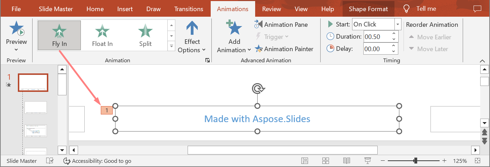

## **Introduktion**

Animationer är visuella effekter som kan tillampas på texter, bilder, former eller [diagram](https://docs.aspose.com/slides/sv/java/animated-charts/). De ger liv at presentationer eller deras bestandsdelar. 

## **Varfor anvanda animationer i presentationer?**

Genom att anvanda animationer kan du

* kontrollera informationsflodet
* betona viktiga punkter
* oka intresse eller deltagande bland din publik
* gora innehållet lättare att läsa, assimilera eller bearbeta
* rikta läsarens eller tittarens uppmärksamhet mot viktiga delar i en presentation

PowerPoint erbjuder många alternativ och verktyg för animationer och animationseffekter inom kategorierna **ingång**, **utgång**, **betoning** och **rörelsebanor**. 

## **Animationer i Aspose.Slides**

* Aspose.Slides tillhandahåller de klasser och typer du behöver för att arbeta med animationer under namnutrymmet `Aspose.Slides.Animation`,
* Aspose.Slides erbjuder över **150 animationseffekter** under [EffectType](https://reference.aspose.com/slides/sv/java/com.aspose.slides/effecttype)-enumerationen. Dessa effekter är i princip samma (eller motsvarande) effekter som används i PowerPoint. 

## **Applicera animation pa en textruta**

Aspose.Slides för Java lattar dig applicera animation på texten i en form. 

1. Skapa en instans av klassen [Presentation](https://reference.aspose.com/slides/sv/java/com.aspose.slides/Presentation).
2. Hamta en slide-referens via dess index.
3. Lagg till en `rectangle`-[IAutoShape](https://reference.aspose.com/slides/sv/java/com.aspose.slides/iautoshape).
4. Lagg till text till [IAutoShape.TextFrame](https://reference.aspose.com/slides/sv/java/com.aspose.slides/IAutoShape#addTextFrame-java.lang.String-).
5. Hamta en huvudsekvens av effekter.
6. Lagg till en animationseffekt på [IAutoShape](https://reference.aspose.com/slides/sv/java/com.aspose.slides/iautoshape).
7. Stall in egenskapen `TextAnimation.BuildType` till värdet från `BuildType`-enumerationen.
8. Skriv presentationen till disk som en PPTX-fil.

Denna Java-kod visar hur du applicerar `Fade`-effekten på AutoShape och stall in textanimationen till värdet *By 1st Level Paragraphs*:
```java
import com.aspose.slides.*;

// Skapar en presentation-klass som representerar en presentationsfil.
Presentation pres = new Presentation();
try {
    ISlide sld = pres.getSlides().get_Item(0);

    // Lägger till en ny AutoShape med text
    IAutoShape autoShape = sld.getShapes().addAutoShape(ShapeType.Rectangle, 20, 20, 150, 100);

    ITextFrame textFrame = autoShape.getTextFrame();
    textFrame.setText("First paragraph \nSecond paragraph \n Third paragraph");

    // Hämtar huvudsekvensen för bilden.
    ISequence sequence = sld.getTimeline().getMainSequence();

    // Lägger till Fade-animeringseffekt på formen
    IEffect effect = sequence.addEffect(autoShape, EffectType.Fade, EffectSubtype.None, EffectTriggerType.OnClick);

    // Animera formens text efter första nivåens stycken
    effect.getTextAnimation().setBuildType(BuildType.ByLevelParagraphs1);

    // Spara PPTX-filen till disk
    pres.save("AnimText_out.pptx", SaveFormat.Pptx);
} finally {
    if (pres != null) pres.dispose();
}
```

{} 

Forutom att applicera animationer pa text kan du ocksa applicera animationer pa ett enskilt [Paragraph](https://reference.aspose.com/slides/sv/java/com.aspose.slides/iparagraph). Se [**Animera text**](/slides/sv/java/animated-text/).

{} 

## **Applicera animation pa en PictureFrame**

1. Skapa en instans av klassen [Presentation](https://reference.aspose.com/slides/sv/java/com.aspose.slides/Presentation).
2. Hamta en slides referens via dess index.
3. Lagg till eller hamta en [PictureFrame](https://reference.aspose.com/slides/sv/java/com.aspose.slides/pictureframe) på sliden.
4. Hamta huvudsekvensen av effekter.
5. Lagg till en animationseffekt pa [PictureFrame](https://reference.aspose.com/slides/sv/java/com.aspose.slides/pictureframe).
6. Skriv presentationen till disk som en PPTX-fil.

Denna Java-kod visar hur du applicerar `Fly`-effekten på en bildram:
```java
import com.aspose.slides.*;

// Skapar en presentationsklass som representerar en presentationsfil.
Presentation pres = new Presentation();
try {
    // Läs in bild som ska läggas till i presentationens bildsamling
    IPPImage picture;
    IImage image = Images.fromFile("aspose-logo.jpg");
    try {
        picture = pres.getImages().addImage(image);
    } finally {
        if (image != null) image.dispose();
    }

    // Lägger till bildram på bilden
    IPictureFrame picFrame = pres.getSlides().get_Item(0).getShapes().addPictureFrame(ShapeType.Rectangle, 50, 50, 100, 100, picture);

    // Hämtar huvudsekvensen för bilden.
    ISequence sequence = pres.getSlides().get_Item(0).getTimeline().getMainSequence();

    // Lägger till Fly från vänster-animeringseffekt på bildramen
    IEffect effect = sequence.addEffect(picFrame, EffectType.Fly, EffectSubtype.Left, EffectTriggerType.OnClick);

    // Sparar PPTX-filen till disk
    pres.save("AnimImage_out.pptx", SaveFormat.Pptx);
} finally {
    if (pres != null) pres.dispose();
}
```

## **Applicera animation pa en form**

1. Skapa en instans av klassen [Presentation](https://reference.aspose.com/slides/sv/java/com.aspose.slides/Presentation).
2. Hamta en slides referens via dess index.
3. Lagg till en `rectangle`-[IAutoShape](https://reference.aspose.com/slides/sv/java/com.aspose.slides/iautoshape).
4. Lagg till en `Bevel`-[IAutoShape](https://reference.aspose.com/slides/sv/java/com.aspose.slides/iautoshape) (nar detta objekt klickas spelas animationen upp).
5. Skapa en sekvens av effekter på bevel-formen.
6. Skapa en anpassad `UserPath`.
7. Lagg till kommandon for att flytta till `UserPath`.
8. Skriv presentationen till disk som en PPTX-fil.

Denna Java-kod visar hur du applicerar `PathFootball`-effekten (path football) på en form:
```java
import com.aspose.slides.*;
import java.awt.geom.Point2D;

// Skapar en Presentation-klass som representerar en PPTX-fil.
Presentation pres = new Presentation();
try {
    ISlide sld = pres.getSlides().get_Item(0);

    // Skapar PathFootball-effekt för befintlig form från grunden.
    IAutoShape ashp = sld.getShapes().addAutoShape(ShapeType.Rectangle, 150, 150, 250, 25);
    ashp.addTextFrame("Animated TextBox");

    // Lägger till PathFootBall-animeringseffekten
    pres.getSlides().get_Item(0).getTimeline().getMainSequence().addEffect(ashp, EffectType.PathFootball,
            EffectSubtype.None, EffectTriggerType.AfterPrevious);

    // Skapar någon form av "knapp".
    IShape shapeTrigger = pres.getSlides().get_Item(0).getShapes().addAutoShape(ShapeType.Bevel, 10, 10, 20, 20);

    // Skapar en sekvens av effekter för den här knappen.
    ISequence seqInter = pres.getSlides().get_Item(0).getTimeline().getInteractiveSequences().add(shapeTrigger);

     // Skapar en anpassad användarväg. Vårt objekt kommer bara att flyttas efter att knappen har klickats.
    IEffect fxUserPath = seqInter.addEffect(ashp, EffectType.PathUser, EffectSubtype.None, EffectTriggerType.OnClick);

     // Lägger till kommandon för förflyttning eftersom den skapade vägen är tom.
    IMotionEffect motionBhv = ((IMotionEffect)fxUserPath.getBehaviors().get_Item(0));

    Point2D.Float[] pts = new Point2D.Float[1];
    pts[0] = new Point2D.Float(0.076f, 0.59f);
    motionBhv.getPath().add(MotionCommandPathType.LineTo, pts, MotionPathPointsType.Auto, true);
    pts[0] = new Point2D.Float(-0.076f, -0.59f);
    motionBhv.getPath().add(MotionCommandPathType.LineTo, pts, MotionPathPointsType.Auto, false);
    motionBhv.getPath().add(MotionCommandPathType.End, null, MotionPathPointsType.Auto, false);

    // Skriver PPTX-filen till disk
    pres.save("AnimExample_out.pptx", SaveFormat.Pptx);
} finally {
    if (pres != null) pres.dispose();
}
```

## **Hamta animationseffekterna som tillampats pa en form**

Foljande exempel visar hur du anvander metoden `getEffectsByShape` fran gratssnittet [ISequence](https://reference.aspose.com/slides/sv/java/com.aspose.slides/isequence/) for att hamta alla animationseffekter som tillampats pa en form. 

**Exempel 1: Hamta animationseffekter som tillampats pa en form pa en normal slide**

Tidigare lärde du dig hur du lagger till animationseffekter på former i PowerPoint-presentationer. Foljande exempel-kod visar hur du hamtar effekterna som tillampats pa den första formen pa den första normala sliden i presentationen `AnimExample_out.pptx`.

```java
import com.aspose.slides.*;

Presentation presentation = new Presentation("AnimExample_out.pptx");
try {
    ISlide firstSlide = presentation.getSlides().get_Item(0);

    // Hämtar huvudanimationssekvensen för bilden.
    ISequence sequence = firstSlide.getTimeline().getMainSequence();

    // Hämtar den första formen på den första bilden.
    IShape shape = firstSlide.getShapes().get_Item(0);

    // Hämtar animationseffekter som tillämpats på formen.
    IEffect[] shapeEffects = sequence.getEffectsByShape(shape);

    if (shapeEffects.length > 0)
        System.out.println("The shape " + shape.getName() + " has " + shapeEffects.length + " animation effects.");
} finally {
    if (presentation != null) presentation.dispose();
}
```

**Exempel 2: Hamta alla animationseffekter, inklusive de som arvts fran platshallare**

Om en form pa en normal slide har platshallare som finns pa layout-sliden och/eller mastern, och animationseffekter har laggs till dessa platshallare, sa kommer alla effekter for formen att spelas upp under bildspelet, inklusive de som arvts fran platshallarna.

Lat oss säga att vi har en PowerPoint-presentation `sample.pptx` med en slide som bara innehaller en fotform med texten "Made with Aspose.Slides" och **Random Bars**-effekten är tillampad pa formen.


Lat oss ocksa anta att **Split**-effekten är tillampad pa fot-platshallaren pa **layout**-sliden.


Och slutligen är **Fly In**-effekten tillampad pa fot-platshallaren pa **master**-sliden.



Foljande exempel-kod visar hur du anvander metoden `getBasePlaceholder` fran gratssnittet [IShape](https://reference.aspose.com/slides/sv/java/com.aspose.slides/ishape/) for att komma at forma's platshallare och hamta animationseffekterna som tillampats pa fot-formen, inklusive de som arvts fran platshallare placerade pa layout- och master-slidar.

```java
import com.aspose.slides.*;

Presentation presentation = new Presentation("sample.pptx");

ISlide slide = presentation.getSlides().get_Item(0);

// Hämta animationseffekterna för formen på den normala bilden.
IShape shape = slide.getShapes().get_Item(0);
IEffect[] shapeEffects = slide.getTimeline().getMainSequence().getEffectsByShape(shape);

// Hämta animationseffekterna för platshållaren på layout-bilden.
IShape layoutShape = shape.getBasePlaceholder();
IEffect[] layoutShapeEffects = slide.getLayoutSlide().getTimeline().getMainSequence().getEffectsByShape(layoutShape);

// Hämta animationseffekterna för platshållaren på master-bilden.
IShape masterShape = layoutShape.getBasePlaceholder();
IEffect[] masterShapeEffects = slide.getLayoutSlide().getMasterSlide().getTimeline().getMainSequence().getEffectsByShape(masterShape);

System.out.println("Main sequence of shape effects:");
for (IEffect[] effects : new IEffect[][] { masterShapeEffects, layoutShapeEffects, shapeEffects }) {
    for (IEffect effect : effects) {
        String typeName = EffectType.getName(EffectType.class, effect.getType());
        String subtypeName = EffectSubtype.getName(EffectSubtype.class, effect.getSubtype());

        System.out.println(typeName + " " + subtypeName);
    }
}

presentation.dispose();
```
```java
import com.aspose.slides.*;

static void printEffects(IEffect[] effects)
{
    for (IEffect effect : effects)
    {
        String typeName = EffectType.getName(EffectType.class, effect.getType());
        String subtypeName = EffectSubtype.getName(EffectSubtype.class, effect.getSubtype());

        System.out.println(typeName + " " + subtypeName);
    }
}
```

Output:
```text
Main sequence of shape effects:
Fly Bottom
Split VerticalIn
RandomBars Horizontal
```

## **Andra tidsinstallningar for animationseffekt**

Aspose.Slides for Java lar dig andra tidsinstallningarna for en animationseffekt.

Detta är panelen Animation Timing i Microsoft PowerPoint:


Detta är motsvarigheterna mellan PowerPoint-timing och egenskaperna for [Effect.Timing](https://reference.aspose.com/slides/sv/java/com.aspose.slides/IEffect#getTiming--):
- PowerPoint Timing **Start**-rullgardinslistan motsvarar egenskapen [Effect.Timing.TriggerType](https://reference.aspose.com/slides/sv/java/com.aspose.slides/ITiming#getTriggerType--).
- PowerPoint Timing **Duration** motsvarar egenskapen [Effect.Timing.Duration](https://reference.aspose.com/slides/sv/java/com.aspose.slides/ITiming#getDuration--). Varaktigheten for en animation (i sekunder) ar den totala tid som animationen tar for att slutfora en cykel.
- PowerPoint Timing **Delay** motsvarar egenskapen [Effect.Timing.TriggerDelayTime](https://reference.aspose.com/slides/sv/java/com.aspose.slides/ITiming#getTriggerDelayTime--).

Sa har du andrat egenskaperna for Effect Timing:
1. [Applicera](#apply-animation-to-shape) eller hamta animationseffekten.
2. Stall in nya varden for de [Effect.Timing](https://reference.aspose.com/slides/sv/java/com.aspose.slides/IEffect#getTiming--) egenskaper du behor.
3. Spara den modifierade PPTX-filen.

Denna Java-kod demonstrerar operationen:
```java
import com.aspose.slides.*;

// Skapar en presentationsklass som representerar en presentationsfil.
Presentation pres = new Presentation("AnimExample_out.pptx");
try {
    // Hämtar huvudsekvensen för bilden.
    ISequence sequence = pres.getSlides().get_Item(0).getTimeline().getMainSequence();

    // Hämtar den första effekten i huvudsekvensen.
    IEffect effect = sequence.get_Item(0);

    // Ändrar effektens TriggerType så att den startar vid klick
    effect.getTiming().setTriggerType(EffectTriggerType.OnClick);

    // Ändrar effektens varaktighet
    effect.getTiming().setDuration(3f);

    // Ändrar effektens TriggerDelayTime
    effect.getTiming().setTriggerDelayTime(0.5f);

    // Sparar PPTX-filen till disk
    pres.save("AnimExample_changed.pptx", SaveFormat.Pptx);
} finally {
    if (pres != null) pres.dispose();
}
```

## **Ljud for animationseffekt**

Aspose.Slides tillhandahaller dessa egenskaper for att låta dig arbeta med ljud i animationseffekter:
- [setSound(IAudio value)](https://reference.aspose.com/slides/sv/java/com.aspose.slides/effect/#setSound-com.aspose.slides.IAudio-)
- [setStopPreviousSound(boolean value)](https://reference.aspose.com/slides/sv/java/com.aspose.slides/effect/#setStopPreviousSound-boolean-)

### **Lagg till ljud for en animationseffekt**

Denna Java-kod visar hur du laggar till ett ljud for en animationseffekt och stoppar det nar nästa effekt startar:
```java
import com.aspose.slides.*;
import java.nio.file.Files;
import java.nio.file.Paths;

Presentation pres = new Presentation("AnimExample_out.pptx");
try {
    // Lägger till ljud i presentationens ljudsamling
    IAudio effectSound = pres.getAudios().addAudio(Files.readAllBytes(Paths.get("sampleaudio.wav")));

    ISlide firstSlide = pres.getSlides().get_Item(0);

    // Hämtar huvudsekvensen för bilden.
    ISequence sequence = firstSlide.getTimeline().getMainSequence();

    // Hämtar den första effekten i huvudsekvensen
    IEffect firstEffect = sequence.get_Item(0);

    // Kontrollerar om effekten har "Inget ljud"
    if (!firstEffect.getStopPreviousSound() && firstEffect.getSound() == null)
    {
        // Lägger till ljud för den första effekten
        firstEffect.setSound(effectSound);
    }

    // Hämtar den första interaktiva sekvensen för bilden.
    ISequence interactiveSequence = firstSlide.getTimeline().getInteractiveSequences().get_Item(0);

    // Ställer in flaggan "Stoppa föregående ljud" för effekten
    interactiveSequence.get_Item(0).setStopPreviousSound(true);

    // Skriver PPTX-filen till disk
    pres.save("AnimExample_Sound_out.pptx", SaveFormat.Pptx);
} finally {
    if (pres != null) pres.dispose();
}
```

### **Extrahera ljud for en animationseffekt**

1. Skapa en instans av klassen [Presentation](https://reference.aspose.com/slides/sv/java/com.aspose.slides/presentation/).
2. Hamta en slides referens via dess index.
3. Hamta huvudsekvensen av effekter.
4. Extrahera den inbaddade [setSound(IAudio value)](https://reference.aspose.com/slides/sv/java/com.aspose.slides/effect/#setSound-com.aspose.slides.IAudio-) for varje animationseffekt.

Denna Java-kod visar hur du extraherar ljudet som ar inbaddat i en animationseffekt:
```java
import com.aspose.slides.*;

// Skapar en presentationsklass som representerar en presentationsfil.
Presentation presentation = new Presentation("EffectSound.pptx");
try {
    ISlide slide = presentation.getSlides().get_Item(0);

    // Hämtar huvudsekvensen för bilden.
    ISequence sequence = slide.getTimeline().getMainSequence();

    for (IEffect effect : sequence)
    {
        if (effect.getSound() == null)
            continue;

        // Extraherar effektens ljud i en byte-array
        byte[] audio = effect.getSound().getBinaryData();
    }
} finally {
    if (presentation != null) presentation.dispose();
}
```

## **Efter animation**

Aspose.Slides for Java lar dig andra egenskapen After animation for en animationseffekt.

Detta är panelen Animation Effect och den utokade menyn i Microsoft PowerPoint:


PowerPoint Effekt **After animation**-rullgardinslistan motsvarar dessa egenskaper:
- Egenskapen [setAfterAnimationType(int value)](https://reference.aspose.com/slides/sv/java/com.aspose.slides/ieffect/#setAfterAnimationType-int-) som beskriver typen After animation:
  * PowerPoint **More Colors** motsvarar typen [AfterAnimationType.Color](https://reference.aspose.com/slides/sv/java/com.aspose.slides/afteranimationtype/#Color);
  * PowerPoint **Don't Dim**-listobjektet motsvarar typen [AfterAnimationType.DoNotDim](https://reference.aspose.com/slides/sv/java/com.aspose.slides/afteranimationtype/#DoNotDim) (standardtypen for After animation);
  * PowerPoint **Hide After Animation**-objektet motsvarar typen [AfterAnimationType.HideAfterAnimation](https://reference.aspose.com/slides/sv/java/com.aspose.slides/afteranimationtype/#HideAfterAnimation);
  * PowerPoint **Hide on Next Mouse Click**-objektet motsvarar typen [AfterAnimationType.HideOnNextMouseClick](https://reference.aspose.com/slides/sv/java/com.aspose.slides/afteranimationtype/#HideOnNextMouseClick);
- Egenskapen [setAfterAnimationColor(IColorFormat value)](https://reference.aspose.com/slides/sv/java/com.aspose.slides/ieffect/#setAfterAnimationColor-com.aspose.slides.IColorFormat-) som definierar ett färgformat for After animation. Denna egenskap fungerar tillsammans med typen [AfterAnimationType.Color](https://reference.aspose.com/slides/sv/java/com.aspose.slides/afteranimationtype/#Color). Om du andrar typen till en annan, kommer färgen for After animation att rensas.

Denna Java-kod visar hur du andrar en After animation-effekt:
```java
import com.aspose.slides.*;
import java.awt.Color;

// Skapar en presentationsklass som representerar en presentationsfil
Presentation pres = new Presentation("AnimImage_out.pptx");
try {
    ISlide firstSlide = pres.getSlides().get_Item(0);

    // Hämtar den första effekten i huvudsekvensen
    IEffect firstEffect = firstSlide.getTimeline().getMainSequence().get_Item(0);

    // Ändrar efteranimeringstypen till Color
    firstEffect.setAfterAnimationType(AfterAnimationType.Color);

    // Ställer in efteranimeringens dämpningsfärg
    firstEffect.getAfterAnimationColor().setColor(Color.BLUE);

    // Skriver PPTX-filen till disk
    pres.save("AnimImage_AfterAnimation.pptx", SaveFormat.Pptx);
} finally {
    if (pres != null) pres.dispose();
}
```

## **Animera text**

Aspose.Slides tillhandahaller dessa egenskaper for att låta dig arbeta med *Animate text*-blocket for en animationseffekt:
- Egenskapen [setAnimateTextType(int value)](https://reference.aspose.com/slides/sv/java/com.aspose.slides/ieffect/#setAnimateTextType-int-) som beskriver typen av animate text for effekten. Formens text kan animera:
  - Samtidigt ([AnimateTextType.AllAtOnce](https://reference.aspose.com/slides/sv/java/com.aspose.slides/animatetexttype/#AllAtOnce) typ)
  - Per ord ([AnimateTextType.ByWord](https://reference.aspose.com/slides/sv/java/com.aspose.slides/animatetexttype/#ByWord) typ)
  - Per bokstav ([AnimateTextType.ByLetter](https://reference.aspose.com/slides/sv/java/com.aspose.slides/animatetexttype/#ByLetter) typ)
- Egenskapen [setDelayBetweenTextParts(float value)](https://reference.aspose.com/slides/sv/java/com.aspose.slides/ieffect/#setDelayBetweenTextParts-float-) satter en fordröjning mellan de animerade textdelarna (ord eller bokstaver). Ett positivt varde anger procentsatsen av effektens varaktighet. Ett negativt varde anger fordröjningen i sekunder.

Sa har du andrat egenskaperna for Effect Animate text:
1. [Applicera](#apply-animation-to-shape) eller hamta animationseffekten.
2. Stall in egenskapen [setBuildType(int value)](https://reference.aspose.com/slides/sv/java/com.aspose.slides/itextanimation/#setBuildType-int-) till varde [BuildType.AsOneObject](https://reference.aspose.com/slides/sv/java/com.aspose.slides/buildtype/#AsOneObject) for att stanga av *By Paragraphs*-animationslamet.
3. Stall in nya varden for egenskaperna [setAnimateTextType(int value)](https://reference.aspose.com/slides/sv/java/com.aspose.slides/ieffect/#setAnimateTextType-int-) och [setDelayBetweenTextParts(float value)](https://reference.aspose.com/slides/sv/java/com.aspose.slides/ieffect/#setDelayBetweenTextParts-float-).
4. Spara den modifierade PPTX-filen.

Denna Java-kod demonstrerar operationen:
```java
import com.aspose.slides.*;

// Skapar en presentationsklass som representerar en presentationsfil.
Presentation pres = new Presentation("AnimText_out.pptx");
try {
    ISlide firstSlide = pres.getSlides().get_Item(0);

    // Hämtar den första effekten i huvudsekvensen
    IEffect firstEffect = firstSlide.getTimeline().getMainSequence().get_Item(0);

    // Ändrar textanimations‑typen för effekten till "As One Object"
    firstEffect.getTextAnimation().setBuildType(BuildType.AsOneObject);

    // Ändrar textanimeringstypen för effekten till "By word"
    firstEffect.setAnimateTextType(AnimateTextType.ByWord);

    // Ställer in fördröjning mellan ord till 20% av effektens varaktighet
    firstEffect.setDelayBetweenTextParts(20f);

    // Skriver PPTX-filen till disk
    pres.save("AnimTextBox_AnimateText.pptx", SaveFormat.Pptx);
} finally {
    if (pres != null) pres.dispose();
}
```

## **FAQ**

### Hur kan jag säkerställa att animationer bevaras när presentationen publiceras på webben?

[Export to HTML5](/slides/sv/java/export-to-html5/) och aktivera de [alternativ](https://reference.aspose.com/slides/sv/java/com.aspose.slides/html5options/) som ansvarar för animationer av [shape](https://reference.aspose.com/slides/sv/java/com.aspose.slides/html5options/#setAnimateShapes-boolean-) och [transition](https://reference.aspose.com/slides/sv/java/com.aspose.slides/html5options/#setAnimateTransitions-boolean-). Vanlig HTML spelar inte upp slide-animationer, medan HTML5 gör det.

### Hur påverkar ändring av z-order (lagerordning) för former animationen?

Animation- och ritningsordning är oberoende: en effekt styr timing och typ av framtraende/forsvinnande, medan [z-order](https://reference.aspose.com/slides/sv/java/com.aspose.slides/shape/#getZOrderPosition--) avgor vad som tacker vad. Det synliga resultatet definieras av deras kombination. (Detta är den generella PowerPoint-beteendet; Aspose.Slides-modellen for effekter och former följer samma logik.)

### Finns det begränsningar när animationer konverteras till video för vissa effekter?

I allmänhet [stödjs animationer](/slides/sv/java/convert-powerpoint-to-video/), men sällsynta fall eller specifika effekter kan renderas annorlunda. Det rekommenderas att testa med de effekter du använder och med den aktuella biblioteksversionen.